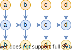
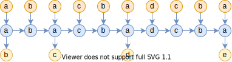
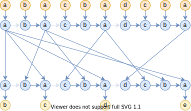

# 时空之章：将Attention视为平方复杂度的RNN

> **作者**：苏剑林 | **日期**：2024-03-18 | **来源**：[科学空间](https://www.kexue.fm/archives/10017)

近年来，RNN由于其线性的训练和推理效率，重新吸引了不少研究人员和用户的兴趣，隐约有"文艺复兴"之势，其代表作有[RWKV](https://papers.cool/arxiv/2305.13048)、[RetNet](https://papers.cool/arxiv/2307.08621)、[Mamba](https://papers.cool/arxiv/2312.00752)等。当将RNN用于语言模型时，其典型特点就是每步生成都是常数的空间复杂度和时间复杂度，从整个序列看来就是常数的空间复杂度和线性的时间复杂度。当然，任何事情都有两面性，相比于Attention动态增长的KV Cache，RNN的常数空间复杂度通常也让人怀疑记忆容量有限，在Long Context上的效果很难比得上Attention。

在这篇文章中，我们表明Causal Attention可以重写成RNN的形式，并且它的每一步生成理论上也能够以O(1)的空间复杂度进行（代价是时间复杂度非常高，远超平方级）。这表明Attention的优势（如果有的话）是靠计算堆出来的，而不是直觉上的堆内存，它跟RNN一样本质上都是常数量级的记忆容量（记忆瓶颈）。

## 超越线性的RNN

RNN的支持者通常会给出一个看上去让人难以反驳的观点：想想你的大脑是RNN还是Attention？

直觉来想，RNN推理的空间复杂度是常数，而Attention的KV cache是动态增长的，再考虑到人的脑容量是有限的，从这一点来看不得不说确实RNN更接近人脑。然而，即便可以合理地认为脑容量限制了人每步推理的空间复杂度是常数，但它并没有限制每步的时间复杂度是常数，又或者换个说法，即便人的每步时间复杂度是常数，但人处理长度为$L$的序列时未必只扫描一遍序列（比如"翻书"），所以总的推理步数可能明显超出$L$，从而导致了非线性的时间复杂度。

考虑到这一点，笔者"突发奇想"：是否可以一般化地考虑常数空间复杂度、非线性时间复杂度的RNN模型，来补足主流RNN的所没有的能力（比如上面说的翻书）？对于语言模型任务，假设样本是a b c d e，那么训练任务就是输入a b c d，预测b c d e，常见的RNN如下图：



这种RNN的问题就是没有翻书能力，每个输入读完就丢了。而Attention的特点就是每读一个token，就完整地翻一遍历史，虽然这个做法可能存在效率问题，但它无疑是引入翻书能力的最简单粗暴的方式。而为了给RNN补上翻书能力，我们完全可以模仿Attention的做法来使用RNN：



跟Attention一样，每读一个新的token，就翻一遍完整的历史。当然，也可以说这其实没有设计一种新的RNN，只是RNN的一种新用法，单纯修改了输入，不管是RWKV还是Mamba都可以套上去。在这种用法之下，解码依旧可以在常数空间复杂度内完成，但每一步推理的时间复杂度在线性增长，从而总的时间成本是$O(L^2)$。

## 注意力也是RNN

事实上，图二所代表的模型非常广泛，甚至于Attention也只不过是它的一个特例，如下图所示：


跟图二相比，图三有几个箭头虚化了，代表这几处位置实际上是断开的，所以说Attention只不过是图二的一个特例。具体来说，Attention的计算公式为：

$$o_i = \sum_{j=1}^i a_{i,j} v_j = \frac{\sum_{j=1}^i e^{q_i \cdot k_j} v_j}{\sum_{j=1}^i e^{q_i \cdot k_j}}$$

很明显，分子分母的求和都可以写成递归的形式：

$$\begin{pmatrix}y_i^{(t)} \\ z_i^{(t)}\end{pmatrix} = \begin{pmatrix}y_i^{(t-1)} \\ z_i^{(t-1)}\end{pmatrix} + e^{q_i \cdot k_{i-t+1}} \begin{pmatrix}v_{i-t+1} \\ 1\end{pmatrix}, \quad o_i = \frac{y_i^{(i)}}{z_i^{(i)}}$$

根据笔者所阅读的文献，最早提出上式并用它来优化Attention计算的文献是[《Self-attention Does Not Need O(n^2) Memory》](https://papers.cool/arxiv/2112.05682)，上式的分块矩阵版本正是当前主流的加速技术Flash Attention的理论基础。由于在Self Attention中，Q、K、V都是由同一个输入通过token-wise的运算得到，所以上述递归形式正好就可以表示为图三。

当然，图三只画出了一层Attention，多层自然也可以画出来，但连接看起来会有点复杂，比如两层的情况如下图：



## 常数空间复杂度

本文开头已经说了，RNN的常见优点是可以常数空间复杂度、线性时间复杂度进行推理，既然Attention也可以写成RNN，那么自然的问题是在这种写法下它也有这两个优点吗？

很明显，由于Attention对应的RNN是一个序列长度增加到了$O(L^2)$的RNN，所以线性时间复杂度那是不用想了，唯一值得思考的是能不能做到常数空间复杂度？大家的第一反应也许是不能，因为众所周知Attention解码有一个动态线性增长的KV cache。但这只是通常情况下比较高效率的实现，如果我们不计成本地用时间换空间，那么空间复杂度可以进一步降低到多少呢？

答案可能让人意外：**如果真的将时间换空间做到极致，那么确实可以将空间复杂度降低到O(1)！**

其实这个结论并不难想象。首先，图三所示的单层Attention，形式跟普通的单层RNN没什么两样，因此显然是可以用固定大小的储存空间就可以完成推理；接着，我们来看图四所示的多层Attention，它的层与层之间的连接比较复杂，所以通常需要将历史K、V缓存起来才能比较高效地计算，但如果我们坚决不存KV cache，那么每一层、每一步推理所输入的K、V，完全从最原始输入进行重新计算得到（重计算），这会导致非常多的重复计算，所以总的时间复杂度会远超平方复杂度，非常不环保，但空间复杂度确实可以保持在O(1)。

以两层Attention为例，第二层Attention用到了第一层Attention的输出作为输入，而第一层Attention的每个输出都可以在O(1)空间内计算得到，所以只要我们愿意牺牲效率去重计算，第二层Attention也只需要在O(1)空间就可以完成。依此类推，第三层Attention用到了第二层Attention的输出作为输入，第N层Attention用到了第$N-1$层Attention的输出作为输入，由于上一层都可以通过重计算在O(1)空间就可以完成，所以每一层乃至整个模型都可以在O(1)空间完成计算。

这就再次回到了文章开头的观点：如果Attention相比RNN真的存在什么优势，那也只是靠更多的计算达到的，直觉上的扩大了"内存"，只是用空间换时间的表象，它跟RNN一样本质上都具有常数容量的记忆瓶颈。

当然，也许有读者觉得：用时间换空间不是很常见的做法吗？这看上去并不是什么有价值的结论？的确，时间换空间确实很常见，但并非总是能做到的。换句话说，并不是所有问题都可以通过时间换空间来将空间复杂度降低到O(1)的，这是一个常见但非平凡的特性。

## 模型能力的思考

之所以指出Attention的这一特性，并不是真的要用这个特性去推理，而是通过它来帮助我们进一步思考Attention的能力瓶颈。

首先，真的要抠细节的话，O(1)其实是不对的，更严格来说应该是O(L)，因为平方复杂度的RNN需要反复扫描历史序列，这至少需要把原始输入和生成过程的输出都存下来，即至少需要存$L$个整数token id，这个所需要的空间是O(L)的，如果$L$足够大，那么O(L)将会比O(1)更大。然而，这里的O(1)主要说的是LLM中间的计算层所需要的最少空间，相当于作为RNN时的hidden_state，至少有(hidden_size × num_layers × 2)个分量，而O(L)的空间则体现在输入和输出。一个直观的类比是将Attention当作一台具有无限硬盘、固定内存的计算机，它不断从硬盘中读取数据，然后在内存中进行计算，同时把结果写进硬盘中。

我们知道，如果内存本身很大而处理的数据不大时，那么我们自己在编程时通常都会更加"任性"一点，甚至可能将所有数据加载到内存，中间计算过程完全不依赖于硬盘的读写。同样，在"大模型、短序列"背景之下训练出来的LLM，会更倾向于使用模型scale带来O(1)级别的固定"内存"，而不是由序列长度带来的动态"硬盘"，因为在当前LLM的scale之下前者会足够大，SGD会"偷懒"将模型当成一个具有无限静态内存的机器来训练（因为对短序列来说内存总是足够），但实际上模型的静态内存是有限的，因此对于那些不可能在O(1)空间完成的任务，基于Attention的模型也不能够泛化到任意长度的输入。

举个例子，我们要计算2x的十进制表示y，用Attention进行条件建模$p(y|x)$，训练语料就是{x,[sep],y}拼接，只算y的loss。注意这里的y可以由输入x唯一确定，那么理论上应该可以学出100%的准确率。但如果没有思维链（CoT）来动态增加序列长度，模型只能将所有计算过程隐式地放到"内存"中，这对于短输入总是有效的。但事实上，内存是有限的，而计算2x所需要的空间则随着x的增加而增加，所以必然存在一个足够大的x，使得$p(y|x)$的准确率无法做到100%（哪怕是训练准确率）。这跟[《Transformer升级之路：16、"复盘"长度外推技术》](https://www.kexue.fm/archives/9948)所讨论的长度外推问题不一样，它不是由位置编码的OOD导致的，而是没有足够CoT引导时"大模型、短序列"的训练所带来的的能力缺陷。

那为什么当前主流的scale up方向依然是增大LLM的内存，即增加模型的hidden_size和num_layers，而不是去研究诸如CoT等增加seq_len的方案呢？后者当然也是主流研究之一，但核心问题是如果内存成为瓶颈，会降低模型的学习效率和普适性。就好比内存不大而数据量很大时，我们就需要及时保存结果到硬盘中并清空内存，这意味着算法上要更加精巧、难写，而且有可能还要根据具体的任务来定制算法细节。那什么情况下会出现内存瓶颈呢？以LLAMA2-70B为例，它的num_layers为80、hidden_size为8192，两者相乘是640K，再乘个2刚好是1M左右。换句话说，当输入长度达到1M tokens的这个级别，那么LLAMA2-70B的"内存"就可能成为瓶颈。尽管目前训练1M tokens级别的LLM依然不容易，但已经不再是遥不可及，比如Kimi就已经上线了1M级别的模型内测。

所以，不断增加模型的context length（硬盘），以容纳更多的输入和CoT，同时提高模型本身的scale，使得"内存"不至于是瓶颈，就成为了当前LLM的主旋律。

同时，这还否定了笔者之前的一个想法：是否可以通过缩小模型规模、增加seq_len来达到跟大模型一样的效果？答案大概是不行，因为小模型存在内存瓶颈，要靠seq_len带来的硬盘来补足的话，需要给每个样本都设置足够长的CoT才行，这难度比直接训练大模型更加大，如果只是通过repeat等简单方案来增加seq_len，由于没有带来额外信息，那么是没有有实质收益的。不过，如果增加seq_len是通过prefix tuning的方式来实现的，那么是有可能补足空间复杂度上的差距的，因为prefix的参数并非由输入序列计算出来，而是单独训练的，这就相当于额外插了一系列"内存条"，从而增大了模型的内存。

## 最后再来个小结

在这篇文章中，我们从平方复杂度RNN的角度审视了Attention，并发现了它具有常数空间复杂度的瓶颈，这表明Attention相比RNN本质上并没有增加"内存"，而只是增加了非常多的计算量。这个瓶颈的存在，表明Attention对某些任务的长度泛化可能存在理论上的困难（内存不足），如何引导模型更好地利用seq_len维度所带来的动态"硬盘"，也许是解决这个困难的关键之处。

---

**转载地址**：https://www.kexue.fm/archives/10017

**引用格式**：

苏剑林. (Mar. 18, 2024). 《时空之章：将Attention视为平方复杂度的RNN》[Blog post]. Retrieved from https://www.kexue.fm/archives/10017

```bibtex
@online{kexuefm-10017,
  title={时空之章：将Attention视为平方复杂度的RNN},
  author={苏剑林},
  year={2024},
  month={Mar},
  url={\url{https://www.kexue.fm/archives/10017}},
}
```
