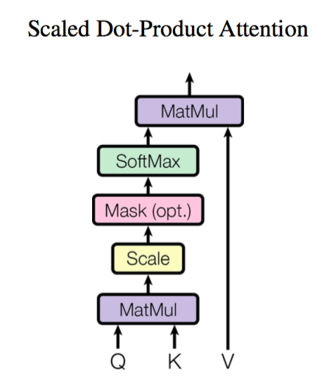
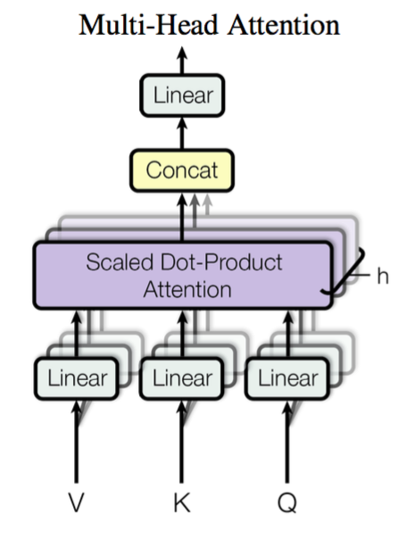

# 《Attention is All You Need》浅读（简介+代码）

> **作者**：苏剑林 | **日期**：2018-01-06 | **来源**：[科学空间](https://www.kexue.fm/archives/4765)

2017年中，有两篇类似同时也是笔者非常欣赏的论文，分别是FaceBook的《Convolutional Sequence to Sequence Learning》和Google的《Attention is All You Need》，它们都算是Seq2Seq上的创新，本质上来说，都是抛弃了RNN结构来做Seq2Seq任务。

这篇博文中，笔者对[《Attention is All You Need》](https://papers.cool/arxiv/1706.03762)做一点简单的分析。当然，这两篇论文本身就比较火，因此网上已经有很多解读了（不过很多解读都是直接翻译论文的，鲜有自己的理解），因此这里尽可能多自己的文字，尽量不重复网上各位大佬已经说过的内容。

## 序列编码

深度学习做NLP的方法，基本上都是先将句子分词，然后每个词转化为对应的词向量序列。这样一来，每个句子都对应的是一个矩阵 $X=(x_1,x_2,\dots,x_t)$，其中 $x_i$ 都代表着第 $i$ 个词的词向量（行向量），维度为 $d$ 维，故 $X \in \mathbb{R}^{n \times d}$。这样的话，问题就变成了编码这些序列了。

**第一个基本的思路**是RNN层，RNN的方案很简单，递归式进行：

$$y_t = f(y_{t-1}, x_t) \tag{1}$$

不管是已经被广泛使用的LSTM、GRU还是最近的SRU，都并未脱离这个递归框架。RNN结构本身比较简单，也很适合序列建模，但RNN的明显缺点之一就是无法并行，因此速度较慢，这是递归的天然缺陷。另外我个人觉得**RNN无法很好地学习到全局的结构信息，因为它本质是一个马尔科夫决策过程**。

**第二个思路是CNN层**，其实CNN的方案也是很自然的，窗口式遍历，比如尺寸为3的卷积，就是

$$y_t = f(x_{t-1}, x_t, x_{t+1}) \tag{2}$$

在FaceBook的论文中，纯粹使用卷积也完成了Seq2Seq的学习，是卷积的一个精致且极致的使用案例，热衷卷积的读者必须得好好读读这篇文论。CNN方便并行，而且容易捕捉到一些全局的结构信息，笔者本身是比较偏爱CNN的，在目前的工作或竞赛模型中，我都已经尽量用CNN来代替已有的RNN模型了，并形成了自己的一套使用经验，这部分我们以后再谈。

Google的大作提供了**第三个思路**：**纯Attention！单靠注意力就可以！**RNN要逐步递归才能获得全局信息，因此一般要双向RNN才比较好；CNN事实上只能获取局部信息，是通过层叠来增大感受野；Attention的思路最为粗暴，它一步到位获取了全局信息！它的解决方案是：

$$y_t = f(x_t, A, B) \tag{3}$$

其中 $A, B$ 是另外一个序列（矩阵）。如果都取 $A=B=X$，那么就称为Self Attention，**它的意思是直接将 $x_t$ 与原来的每个词进行比较，最后算出 $y_t$！**

## Attention层

### Attention定义



Google的一般化Attention思路也是一个编码序列的方案，因此我们也可以认为它跟RNN、CNN一样，都是一个序列编码的层。

前面给出的是一般化的框架形式的描述，事实上Google给出的方案是很具体的。首先，它先把Attention的定义给了出来：

$$Attention(Q,K,V) = softmax\left(\frac{QK^\top}{\sqrt{d_k}}\right)V \tag{4}$$

这里用的是跟Google的论文一致的符号，其中 $Q \in \mathbb{R}^{n \times d_k}, K \in \mathbb{R}^{m \times d_k}, V \in \mathbb{R}^{m \times d_v}$。如果忽略激活函数 $softmax$ 的话，那么事实上它就是三个 $n \times d_k, d_k \times m, m \times d_v$ 的矩阵相乘，最后的结果就是一个 $n \times d_v$ 的矩阵。于是我们可以认为：这是一个Attention层，**将 $n \times d_k$ 的序列 $Q$ 编码成了一个新的 $n \times d_v$ 的序列**。

那怎么理解这种结构呢？我们不妨逐个向量来看。

$$Attention(q_t,K,V) = \sum_{s=1}^m \frac{1}{Z}\exp\left(\frac{\langle q_t, k_s \rangle}{\sqrt{d_k}}\right)v_s \tag{5}$$

其中 $Z$ 是归一化因子。事实上 $q, k, v$ 分别是 $query, key, value$ 的简写，$K, V$ 是一一对应的，它们就像是key-value的关系，那么上式的意思就是通过 $q_t$ 这个query，通过与各个 $k_s$ 内积的并softmax的方式，来得到 $q_t$ 与各个 $v_s$ 的相似度，然后加权求和，得到一个 $d_v$ 维的向量。其中因子 $\sqrt{d_k}$ 起到调节作用，使得内积不至于太大（太大的话softmax后就非0即1了，不够"soft"了）。

事实上这种Attention的定义并不新鲜，但由于Google的影响力，我们可以认为现在是更加正式地提出了这个定义，并将其视为一个层地看待；此外这个定义只是注意力的一种形式，还有一些其他选择，比如query跟key的运算方式不一定是点乘（还可以是拼接后再内积一个参数向量），甚至权重都不一定要归一化，等等。

### Multi-Head Attention



这个是Google提出的新概念，是Attention机制的完善。不过从形式上看，它其实就再简单不过了，就是把 $Q, K, V$ 通过参数矩阵映射一下，然后再做Attention，把这个过程重复做 $h$ 次，结果拼接起来就行了，可谓"大道至简"了。具体来说

$$head_i = Attention(QW_i^Q, KW_i^K, VW_i^V) \tag{6}$$

这里 $W_i^Q \in \mathbb{R}^{d_k \times \tilde{d}_k}, W_i^K \in \mathbb{R}^{d_k \times \tilde{d}_k}, W_i^V \in \mathbb{R}^{d_v \times \tilde{d}_v}$，然后

$$MultiHead(Q,K,V) = Concat(head_1,...,head_h) \tag{7}$$

最后得到一个 $n \times (h\tilde{d}_v)$ 的序列。所谓"多头"（Multi-Head），就是只多做几次同样的事情（参数不共享），然后把结果拼接。

### Self Attention

到目前为止，对Attention层的描述都是一般化的，我们可以落实一些应用。比如，如果做阅读理解的话，$Q$ 可以是篇章的向量序列，取 $K=V$ 为问题的向量序列，那么输出就是所谓的Aligned Question Embedding。

而在Google的论文中，大部分的Attention都是Self Attention，即"自注意力"，或者叫内部注意力。

所谓Self Attention，其实就是 $Attention(X,X,X)$，$X$ 就是前面说的输入序列。也就是说，在序列内部做Attention，寻找序列内部的联系。Google论文的主要贡献之一是它表明了内部注意力在机器翻译（甚至是一般的Seq2Seq任务）的序列编码上是相当重要的，而之前关于Seq2Seq的研究基本都只是把注意力机制用在解码端。类似的事情是，目前SQUAD阅读理解的榜首模型R-Net也加入了自注意力机制，这也使得它的模型有所提升。

当然，更准确来说，Google所用的是Self Multi-Head Attention：

$$Y = MultiHead(X,X,X) \tag{8}$$

## Position Embedding

然而，只要稍微思考一下就会发现，这样的模型并不能捕捉序列的顺序！换句话说，如果将 $K, V$ 按行打乱顺序（相当于句子中的词序打乱），那么Attention的结果还是一样的。这就表明了，到目前为止，Attention模型顶多是一个非常精妙的"词袋模型"而已。

这问题就比较严重了，大家知道，对于时间序列来说，尤其是对于NLP中的任务来说，顺序是很重要的信息，它代表着局部甚至是全局的结构，学习不到顺序信息，那么效果将会大打折扣（比如机器翻译中，有可能只把每个词都翻译出来了，但是不能组织成合理的句子）。

于是Google再祭出一招——Position Embedding，也就是"位置向量"，将每个位置编号，然后每个编号对应一个向量，通过结合位置向量和词向量，就给每个词都引入了一定的位置信息，这样Attention就可以分辨出不同位置的词了。

Position Embedding并不算新鲜的玩意，在FaceBook的《Convolutional Sequence to Sequence Learning》也用到了这个东西。但在Google的这个作品中，它的Position Embedding有几点区别：

> 1、以前在RNN、CNN模型中其实都出现过Position Embedding，但在那些模型中，Position Embedding是锦上添花的辅助手段，也就是"有它会更好、没它也就差一点点"的情况，因为RNN、CNN本身就能捕捉到位置信息。但是在这个纯Attention模型中，Position Embedding是位置信息的唯一来源，因此它是模型的核心成分之一，并非仅仅是简单的辅助手段。
>
> 2、在以往的Position Embedding中，基本都是根据任务训练出来的向量。而Google直接给出了一个构造Position Embedding的公式：
>
> $$\begin{equation}\left\{\begin{aligned}&PE_{2i}(p)=\sin\Big(p/10000^{2i/{d_{pos}}}\Big)\\ &PE_{2i+1}(p)=\cos\Big(p/10000^{2i/{d_{pos}}}\Big) \end{aligned}\right.\end{equation}$$
>
> 这里的意思是将id为 $p$ 的位置映射为一个 $d_{pos}$ 维的位置向量，这个向量的第 $i$ 个元素的数值就是 $PE_i(p)$。Google在论文中说到他们比较过直接训练出来的位置向量和上述公式计算出来的位置向量，效果是接近的。因此显然我们更乐意使用公式构造的Position Embedding了，我们称之为Sinusoidal形式的Position Embedding。
>
> 3、Position Embedding本身是一个绝对位置的信息，但在语言中，相对位置也很重要，Google选择前述的位置向量公式的一个重要原因是：由于我们有 $\sin(\alpha+\beta)=\sin\alpha\cos\beta+\cos\alpha\sin\beta$ 以及 $\cos(\alpha+\beta)=\cos\alpha\cos\beta-\sin\alpha\sin\beta$，这表明位置 $p+k$ 的向量可以表示成位置 $p$ 的向量的线性变换，这提供了表达相对位置信息的可能性。

结合位置向量和词向量有几个可选方案，可以把它们拼接起来作为一个新向量，也可以把位置向量定义为跟词向量一样大小，然后两者加起来。FaceBook的论文和Google论文中用的都是后者。直觉上相加会导致信息损失，似乎不可取，但Google的成果说明相加也是很好的方案。看来我理解还不够深刻。

还有，尽管论文给出的Position Embedding是sin,cos交错的形式，但其实这个交错形式没有特别的意义，你可以按照任意的方式重排它（比如前sin后cos地拼接），原因如下：

> 1、假如你的Position_Embedding是拼接到原来的词向量中，那么将cos和sin前后连接还是交叉连接，都是没区别的，因为你下一步都是接一个变换矩阵而已；
>
> 2、如果你的Position_Embedding是加到原来的词向量中，那么两种方式貌似是有点区别的，但是要注意的是，词向量本身没有局部结构，也就是说，50维的词向量，将每一维打乱重新排个序（当然整体要按同样的顺序来重新排序），它还是等价于原来的词向量。既然相加的对象（词向量）都没有局部结构，我们也没必要强调被加的对象（Position_Embedding）的局部结构（也就是交叉连接）了。

## 一些不足之处

到这里，Attention机制已经基本介绍完了。Attention层的好处是能够一步到位捕捉到全局的联系，因为它直接把序列两两比较（代价是计算量变为 $\mathcal{O}(n^2)$，当然由于是纯矩阵运算，这个计算量相当也不是很严重）；相比之下，RNN需要一步步递推才能捕捉到，而CNN则需要通过层叠来扩大感受野，这是Attention层的明显优势。

Google论文剩下的工作，就是介绍它怎么用到机器翻译中，这是个应用和调参的问题，我们这里不特别关心它。当然，Google的结果表明将纯注意力机制用在机器翻译中，能取得目前最好的效果，这结果的确是辉煌的。

然而，我还是想谈谈这篇论文本身和Attention层自身的一些不足的地方。

> 1、论文标题为《Attention is All You Need》，因此论文中刻意避免出现了RNN、CNN的字眼，但我觉得这种做法过于刻意了。事实上，论文还专门命名了一种Position-wise Feed-Forward Networks，事实上它就是窗口大小为1的一维卷积，因此有种为了不提卷积还专门换了个名称的感觉，有点不厚道。（也有可能是我过于臆测了）
>
> 2、Attention虽然跟CNN没有直接联系，但事实上充分借鉴了CNN的思想，比如Multi-Head Attention就是Attention做多次然后拼接，这跟CNN中的多个卷积核的思想是一致的；还有论文用到了残差结构，这也源于CNN网络。
>
> 3、无法对位置信息进行很好地建模，这是硬伤。尽管可以引入Position Embedding，但我认为这只是一个缓解方案，并没有根本解决问题。举个例子，用这种纯Attention机制训练一个文本分类模型或者是机器翻译模型，效果应该都还不错，但是用来训练一个序列标注模型（分词、实体识别等），效果就不怎么好了。那为什么在机器翻译任务上好？我觉得原因是机器翻译这个任务并不特别强调语序，因此Position Embedding所带来的位置信息已经足够了，此外翻译任务的评测指标BLEU也并不特别强调语序。
>
> 4、并非所有问题都需要长程的、全局的依赖的，也有很多问题只依赖于局部结构，这时候用纯Attention也不大好。事实上，Google似乎也意识到了这个问题，因此论文中也提到了一个restricted版的Self-Attention（不过论文正文应该没有用到它），它假设当前词只与前后 $r$ 个词发生联系，因此注意力也只发生在这 $2r+1$ 个词之间，这样计算量就是 $\mathcal{O}(nr)$，这样也能捕捉到序列的局部结构了。但是很明显，这就是卷积

## 代码

最后，给出一个Multi-Head Attention的Keras实现：

```python
from keras.layers import *
from keras.models import *
from keras.backend import *

class MultiHeadAttention(Layer):
    def __init__(self, heads, head_size, **kwargs):
        super(MultiHeadAttention, self).__init__(**kwargs)
        self.heads = heads
        self.head_size = head_size
        self.out_dim = heads * head_size

    def build(self, input_shape):
        self.WQ = self.add_weight(name='WQ', 
                                  shape=(input_shape[0][-1], self.out_dim),
                                  initializer='glorot_uniform',
                                  trainable=True)
        self.WK = self.add_weight(name='WK', 
                                  shape=(input_shape[1][-1], self.out_dim),
                                  initializer='glorot_uniform',
                                  trainable=True)
        self.WV = self.add_weight(name='WV', 
                                  shape=(input_shape[2][-1], self.out_dim),
                                  initializer='glorot_uniform',
                                  trainable=True)
        super(MultiHeadAttention, self).build(input_shape)

    def call(self, inputs):
        Q, K, V = inputs
        Q = dot([Q, self.WQ], 2)
        K = dot([K, self.WK], 2)
        V = dot([V, self.WV], 2)
        
        Q = Reshape((-1, self.heads, self.head_size))(Q)
        K = Reshape((-1, self.heads, self.head_size))(K)
        V = Reshape((-1, self.heads, self.head_size))(V)
        
        Q = Permute((2, 0, 1, 3))(Q)
        K = Permute((2, 0, 1, 3))(K)
        V = Permute((2, 0, 1, 3))(V)
        
        A = dot([Q, K], -1) / sqrt(float(self.head_size))
        A = Lambda(lambda x: softmax(x, axis=-1))(A)
        
        O = dot([A, V], -1)
        O = Permute((1, 2, 0, 3))(O)
        O = Reshape((-1, self.out_dim))(O)
        
        return O
```

---

## 打赏


---

> 本文转载自[科学空间](https://www.kexue.fm/archives/4765)，作者苏剑林。
