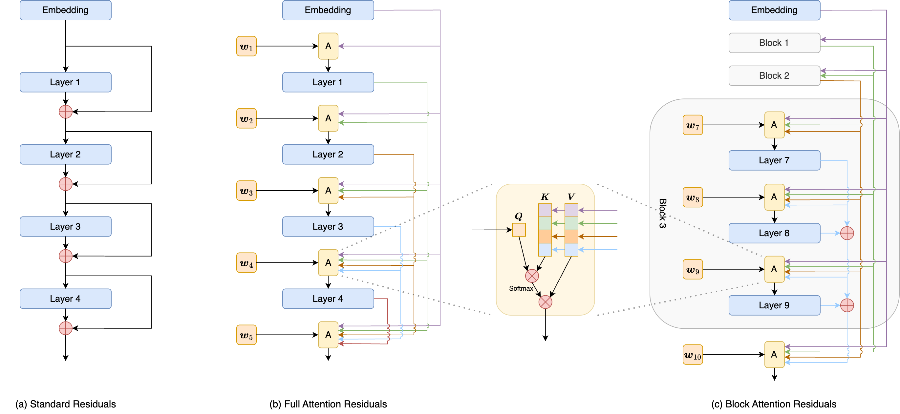

# Attention Residuals 回忆录

> **作者**：苏剑林 | **日期**：2026-03-19 | **来源**：[科学空间](https://www.kexue.fm/archives/11664)

这篇文章介绍我们的一个最新作品[Attention Residuals（AttnRes）](https://papers.cool/arxiv/2603.15031)，顾名思义，这是用Attention的思路去改进Residuals。

不少读者应该都听说过Pre Norm/Post Norm之争，但这说到底只是Residuals本身的"内斗"，包括后来很多Normalization的变化都是如此。比较有意思的变化是[HC](https://papers.cool/arxiv/2409.19606)，它开始走扩大残差流的路线，但也许是效果上的不稳定，并没有引起太多反响。后来的故事大家可能都知道了，去年底DeepSeek的[mHC](https://papers.cool/arxiv/2512.24880)改进了HC，并在更大规模实验上验证了它的有效性。

相比于进一步扩大残差流，我们选择了另一条激进的路线：直接在层间做Attention来替代Residuals。当然，全流程走通还是有很多细节和工作的，这里就简单回忆一下相关的心路历程。



AttnRes示意图

## 层间注意

按照惯例，我们还是从[Residuals](https://papers.cool/arxiv/1512.03385)说起，大家应该耳熟能详了，它的形式为

$$x_t = x_{t-1} + f_t(x_{t-1})$$

这里我们换另外一种写法，它能让我们看出更深刻的东西。先记 $y_t = f_t(x_{t-1})$，那么有 $x_t = x_{t-1} + y_t$，约定 $y_0 = x_0$，那么易得 $x_t = y_0 + y_1 + \cdots + y_t$，于是它可以等价地写成

$$y_{t+1} = f_{t+1}(y_0 + y_1 + \cdots + y_t)$$

即从y的视角看，Residuals是将 $y_0, y_1, \cdots, y_t$ 等权求和作为 $f_{t+1}$ 的输入来得到 $y_{t+1}$，那么一个自然的推广就是换成加权求和：

$$y_{t+1} = f_{t+1}\left(\sum_{s=0}^{t} a_{t+1,s} y_s\right) \quad \text{where} \quad a_{t,s} \geq 0, \quad \sum_{s=0}^{t} a_{t+1,s} = 1$$

这便是AttnRes的萌芽。上式还给 $a_{t,s}$ 多加了两个约束，我们先来讨论一下它们的必要性：

1. 约束 $a_{t,s} \geq 0$ 保证了同一个 $y_s$ 对不同层的贡献始终是同向的，避免出现一层想要增大 $y_s$ 而另一层却想要缩小 $y_s$ 的不一致性，直觉上对模型的学习更加友好；
2. 我们用的f是带In Norm的，会对输入先做RMSNorm，由于 $\text{RMSNorm}(x) = \text{RMSNorm}(cx)$ 对 $\forall c > 0$ 都恒成立，所以加权平均和加权求和完全等价，约束 $\sum_{s=0}^{t} a_{t,s} = 1$ 不会降低表达力。

## 超级连接

在开展AttnRes之前，我们先简单回顾一下HC（Hyper-Connections），并证明它也可以理解为层间Attention，从而表明层间Attention确实是一条更为本质的路线。HC将Residuals改为

$$X_t = H_t^{res} X_{t-1} + H_t^{post} f_t(H_t^{pre} X_{t-1})$$

其中 $X \in \mathbb{R}^{k \times d}, H^{res} \in \mathbb{R}^{k \times k}, H^{pre} \in \mathbb{R}^{1 \times k}, H^{post} \in \mathbb{R}^{k \times 1}$，经典选择是 $k=4$。简单来说，状态变量扩大到k倍，输入到 $f_t$ 前，用一个 $H_t^{pre}$ 矩阵将它变回1倍，输出后再用 $H_t^{post}$ 将它变回k倍，最后跟 $H_t^{res}$ 调节过的 $x_{t-1}$ 相加。如果不限定 $H^{res}, H^{pre}, H^{post}$ 的形式，那么像Post Norm、[Highway](https://papers.cool/arxiv/1505.00387)都是HC的特例。

类似地记 $y_t = f_t(H_t^{pre} X_{t-1})$，那么 $X_t = H_t^{res} X_{t-1} + H_t^{post} y_t$，约定 $X_0 = H_0^{post} y_0$，那么它也可以展开成 $X_t = H_{\leftarrow 1}^{res} H_0^{post} y_0 + H_{\leftarrow 2}^{res} H_1^{post} y_1 + \cdots + H_{\leftarrow t}^{res} H_{t-1}^{post} y_{t-1} + H_t^{post} y_t$，其中 $H_{\leftarrow s}^{res}$ 定义为 $H_t^{res} H_{t-1}^{res} \cdots H_{s+1}^{res} H_s^{res}$。进一步约定 $H_{\leftarrow t+1}^{res} = I$，我们就可以写出

$$y_{t+1} = f_{t+1}(H_{t+1}^{pre} x_t) = f_{t+1}\left(\sum_{s=0}^{t} \underbrace{H_{t+1}^{pre} H_{\leftarrow s+1}^{res} H_s^{post}}_{a_{t+1,s}} y_s\right)$$

注意每一个 $H_{t+1}^{pre} H_{\leftarrow s+1}^{res} H_s^{post}$ 都是1×1矩阵，相当于一个标量，所以它也是层间Attention形式。熟悉[线性注意力](https://www.kexue.fm/archives/11033)的读者应该很快能理解这个结果，HC其实相当于"旋转90度"的DeltaNet。实践中，三个H矩阵由tanh激活的简单线性层计算而来，这导致连乘起来的 $H_{\leftarrow s}^{res}$ 有爆炸或坍缩的风险，也无法保证 $a_{t+1,s}$ 的非负性。

后来mHC做了改进，它先将三个H都改为Sigmoid激活，保证了 $a_{t+1,s}$ 非负，然后交替归一化 $H^{res}$ 使其满足双随机性，由双随机矩阵对乘法的封闭性保证 $H_{\leftarrow s}^{res}$ 的稳定，最后实验也验证了这些改动的有效性。不过，也有一些新实验如[《你的deepseek mHC可能不需要"m"》](https://zhuanlan.zhihu.com/p/2010852389670908320)显示 $H^{res}$ 直接设为单位阵就足够好了。

## 众人拾柴

让我们回到AttnRes上。在意识到AttnRes的可行性后，接下来的问题便是，$a_{t+1,s}$ 该取什么形式呢？一个很自然的想法是照着标准的[Scaled Dot-Product Attention](https://www.kexue.fm/archives/4765)来，但当时笔者想着先快速尝试一下，所以选了个更简单的形式

$$a_{t+1,s} \propto \exp(w_{t+1} \cdot y_s)$$

其中 $w_t$ 是一个可训练的向量参数，即直接以一个数据无关的静态向量为Q、而K、V都是 $y_s$ 去做Softmax Attention，这便是第一版AttnRes。令人惊喜的是，就这么个简单的设计，它相比Residuals的提升已经非常显著！

当笔者在组内分享了AttnRes的初步实验结果后，@张宇和@广宇表现出极大的兴趣，然后一起参与进来，开始在更大规模的模型上做一些验证，发现结果都很让人欣喜。期间，我们还尝试了一些更复杂的设计，发现它们大多不如这个简单的版本，只有给K多加个RMSNorm的操作，能取得比较稳定的收益，这构成了终版的AttnRes形式

$$a_{t+1,s} \propto \exp(w_{t+1} \cdot \text{RMSNorm}(y_s))$$

然而，AttnRes毕竟是一个密集型的层间连接方案，在K2甚至更大规模上的训练和推理是否可行呢？令人振奋的是，@V哥经过精妙的分析，首先肯定了推理上的可行性，其中的"点睛之笔"正是开始图方便的静态Q设计！这使得我们计算完 $y_s$ 后就可以提前计算 $t > s$ 的注意力 $a_{t,s}$，给Infra带来了足够的挪腾空间。

但很不幸的是，训练的同学如@王哥经过仔细分析，判断出在我们当前的训练环境下，AttnRes还是不够可行（说白了还是穷），需要一个进一步降低通信和显存的方案，于是就有了下面的Block版，相应地，之前的版本我们称为Full版。

## 分块版本

从Full AttnRes到Block AttnRes，相当于以往的将平方Attention线性化的过程，各种已有的Efficient Attention的思路都可以套上去试试，比如我们第一个尝试的就是SWA（Sliding Window Attention），然而发现实际效果很糟糕，甚至还不如Residuals。

经过反思，笔者认为可以这样理解：Residuals本身已经是一个非常强的Baseline，它对应于所有状态向量的等权求和，任何新设计想要超越它，那么至少在形式上要能够覆盖它，Full AttnRes显然能满足这个条件，但是加上SWA后并不满足，它扔掉了一部分状态，无法覆盖"所有状态向量等权求和"这一特例。

由此我们意识到，对于AttnRes来说，"压缩"可能要比"稀疏"要更有效，而且压缩也不用太精细，简单的加权求和可能足矣。经过一番构思和打磨后，@张宇和@广宇提出了论文中的Block AttnRes设计，它结合了分Block处理和求和压缩的思想，取得了接近Full版的效果。

Block AttnRes的想法大致是这样的：首先Embedding层单独作为一个Block，这是因为通过观察Full版的Attention矩阵（这也是Attention概念的好处，可以随时可视化注意力模式）发现，模型偏向于给Embedding层可观的Attention，所以有必要将Embedding独立出来；剩下的每m层作为一个Block，Block内通过求和做压缩，以求和结果为单位算Block间Attention。

实验显示，只需固定分8个Block左右，就可以获得AttnRes大部分收益。经过评估，训练和推理的同学一致认为，Block AttnRes的额外开销很小，相比于其效果提升是完全值得的（大致是5%以内的开销，换取25%的收益），于是所有同学全力推动它进主线。

## 矩阵视角

值得一提的是，我们还可以通过Attention矩阵，将Residuals、HC/mHC、Full AttnRes、Block AttnRes统一起来，这也是一个比较有趣的理解视角。其中 $\phi(q,k) = \exp(q \cdot \text{RMSNorm}(k))$，Block AttnRes版对应 $m=3$，以及 $y_{s:t} = \sum_{i=s}^{t} y_i$。

### Residuals

$$A = \begin{pmatrix} 1 & & & & & & \\ 1 & 1 & & & & & \\ 1 & 1 & 1 & & & & \\ 1 & 1 & 1 & 1 & & & \\ 1 & 1 & 1 & 1 & 1 & & \\ 1 & 1 & 1 & 1 & 1 & 1 & \\ 1 & 1 & 1 & 1 & 1 & 1 & 1 \end{pmatrix}$$

### HC/mHC

$$A = \begin{pmatrix} H_1^{pre} H_0^{post} & & & & & & \\ H_2^{pre} H_{\leftarrow 1}^{res} H_0^{post} & H_2^{pre} H_1^{post} & & & & & \\ \vdots & & \ddots & & & & \\ H_7^{pre} H_{\leftarrow 1}^{res} H_0^{post} & H_7^{pre} H_{\leftarrow 2}^{res} H_1^{post} & \cdots & \cdots & \cdots & H_7^{pre} H_6^{post} \end{pmatrix}$$

### Full AttnRes

$$A = \begin{pmatrix} \phi(w_1, y_0) & & & & & & \\ \phi(w_2, y_0) & \phi(w_2, y_1) & & & & & \\ \phi(w_3, y_0) & \phi(w_3, y_1) & \phi(w_3, y_2) & & & & \\ \vdots & & & \ddots & & & \\ \phi(w_7, y_0) & \phi(w_7, y_1) & \cdots & \cdots & \cdots & \phi(w_7, y_6) \end{pmatrix}$$

### Block AttnRes

$$A = \begin{pmatrix} \phi(w_1, y_0) & & & & & & \\ \phi(w_2, y_0) & \phi(w_2, y_1) & & & & & \\ \phi(w_3, y_0) & \phi(w_3, y_{1:2}) & \phi(w_3, y_{1:2}) & & & & \\ \phi(w_4, y_0) & \phi(w_4, y_{1:3}) & \phi(w_4, y_{1:3}) & \phi(w_4, y_{1:3}) & & & \\ \phi(w_5, y_0) & \phi(w_5, y_{1:3}) & \phi(w_5, y_{1:3}) & \phi(w_5, y_{1:3}) & \phi(w_5, y_4) & & \\ \vdots & & & & & & \ddots \end{pmatrix}$$

## 相关工作

从计划做AttnRes后，笔者和众多小伙伴们就一直沉浸在打磨、验证、加速的过程中。部分读者可能知道，笔者的研究风格是，先尽自己最大努力去推导和求解，直到遇到困难或者完全解决后才寻找相关文献。恰好笔者遇到了一群相似的小伙伴，恰好这一次AttnRes的探索整体都比较顺畅，所以直到所有测试都基本通过，开始准备技术报告时，我们才开始去调研相关文献。

但也正因如此，"不查不知道，一查吓一跳"，原来Dense Connection、Depth Attention相关工作已经非常多。除了经典的[DenseNet](https://papers.cool/arxiv/1608.06993)外，我们调研到的还有[DenseFormer](https://papers.cool/arxiv/2402.02622)、[ANCRe](https://papers.cool/arxiv/2602.09009)、[MUDDFormer](https://papers.cool/arxiv/2502.12170)、[MRLA](https://papers.cool/arxiv/2302.03985)、[Dreamer](https://papers.cool/arxiv/2601.21582)等，甚至BERT之前的[ELMo](https://papers.cool/arxiv/1802.05365)都部分地应用了类似设计。

同时，我们也呼吁大家多关注AttnRes在"Depth Attention"概念以外的工作量。我们非常同意，在2026年的今天，"Depth Attention"或者说"Layer Attention"是一个毫无新意的想法，但如何将它用于足够大的模型，作为Residuals足够强的替代品，同时还满足训练和推理的效率需求，并不是一件容易的事情。据我们所知，AttnRes是首个实现这一点的工作。

## 文章小结

本文介绍了我们在模型架构上的最新结果Attention Residuals（AttnRes），它用层间Attention来替代朴素的Residuals，并通过精细的设计使其能满足训练和推理的效率要求，最终成功地将它拓展到足够大的模型上。

---

**转载地址**：https://www.kexue.fm/archives/11664

**引用格式**：

苏剑林. (Mar. 19, 2026). 《Attention Residuals 回忆录》[Blog post]. Retrieved from https://www.kexue.fm/archives/11664

```bibtex
@online{kexuefm-11664,
  title={Attention Residuals 回忆录},
  author={苏剑林},
  year={2026},
  month={Mar},
  url={\url{https://www.kexue.fm/archives/11664}},
}
```
