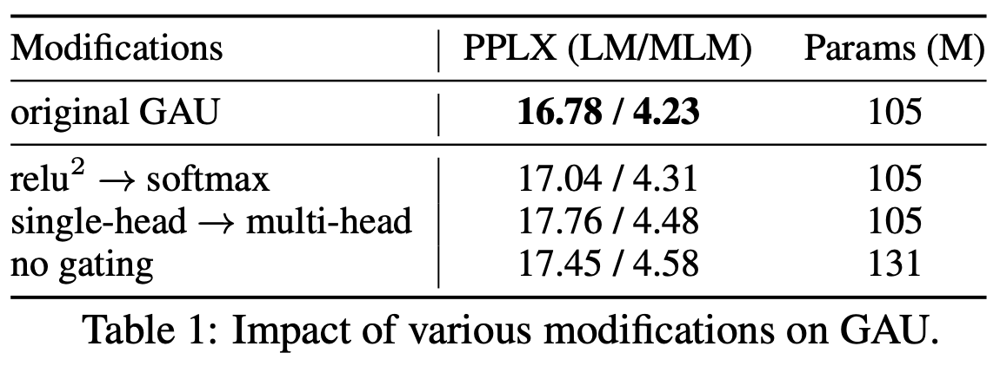

# 听说Attention与Softmax更配哦～

> **作者**：苏剑林 | **日期**：2022-04-07 | **来源**：[科学空间](https://www.kexue.fm/archives/9019)

不知道大家留意到一个细节没有，就是当前NLP主流的预训练模式都是在一个固定长度（比如512）上进行，然后直接将预训练好的模型用于不同长度的任务中。大家似乎也没有对这种模式有过怀疑。

笔者做Base版GAU实验后发现GAU的长度泛化能力并不如想象中好。经过进一步分析后，才明白原来这种长度泛化的能力并不是"理所当然"的。

## 问题定位

GAU的Attention：$A = \frac{1}{n}relu^2\left(\frac{\mathcal{Q}(Z)\mathcal{K}(Z)^\top}{\sqrt{s}}\right)$

直觉应该 $n$ 等于样本长度更加自适应一些，但答案很反直觉：$n$ 固定为512的微调效果比 $n$ 取样本长度的效果要明显好！

问题在归一化方式上。将GAU中的归一化方式换回Softmax后微调测试，效果比 $\frac{1}{n}relu^2(\cdot)$ 时明显要好。所以结论：**Attention还是与Softmax更配～**

## 原因分析

对于标准Attention：$a_{i,j} = \frac{1}{Z_i}\exp\left(\frac{q_i\cdot k_j}{\sqrt{d}}\right)$

$Z_i$ 跟 $n$ 的关系是怎样的呢？我们知道注意力的重点是"注意"，它应该有能力"聚焦"到它认为比较重要的几个token上。训练好的Attention矩阵其实是很稀疏的，存在某个常数 $k$，使得 $|j-i|\ge k$ 时 $\exp\left(\frac{q_i\cdot k_j}{\sqrt{d}}\right)$ 都相当接近0，这样 $Z_i$ 应该更接近 $O(k)$ 而不是 $O(n)$。

GAU的 $relu^2(\cdot)$ 激活函数有直接置零的作用，比 $\exp$ 更稀疏，再加上RoPE自带的远程衰减能力，GAU的归一化因子也应该是低于 $O(n)$ 的阶甚至是常数级别的。



*GAU的squared_relu换成softmax效果是相近的*

## 熵不变性

外推场景下，用Softmax可以推导出一个"熵不变性"版本：

$$\text{Attention}(Q,K,V) = \text{softmax}\left(\frac{\log_{512} n}{\sqrt{d}} QK^\top\right)V$$

$relu^2(\cdot)$ 能否推一个"熵不变性"版本呢？答案是不能，因为它具有正齐次性：幂函数有 $(\lambda q_i\cdot k_j)^n = \lambda^n(q_i\cdot k_j)^n$，归一化后 $\lambda^n$ 就抵消了不起作用。激活函数最好比幂函数高一阶才比较好实现这个调控，而比幂函数高阶的函数，最常见就是指数函数，指数归一化正好就是Softmax。

## 小结

GAU的归一化因子应该是接近常数量级的，所以用 $n$ 或者 $n^2$ 做归一化因子会表现不佳。总的来说，Attention还是跟Softmax更配，它是一个不错的基准，并且还可以通过"熵不变性"的拓展来进一步增强外推能力。

---

**转载地址**：https://www.kexue.fm/archives/9019

**引用格式**：

苏剑林. (Apr. 07, 2022). 《听说Attention与Softmax更配哦～》[Blog post]. Retrieved from https://www.kexue.fm/archives/9019

```bibtex
@online{kexuefm-9019,
  title={听说Attention与Softmax更配哦～},
  author={苏剑林},
  year={2022},
  month={Apr},
  url={\url{https://www.kexue.fm/archives/9019}},
}
```
