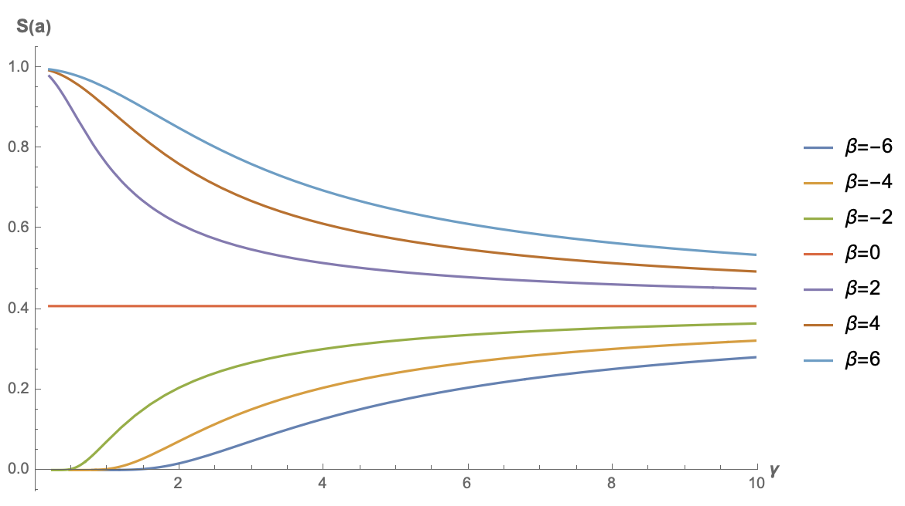
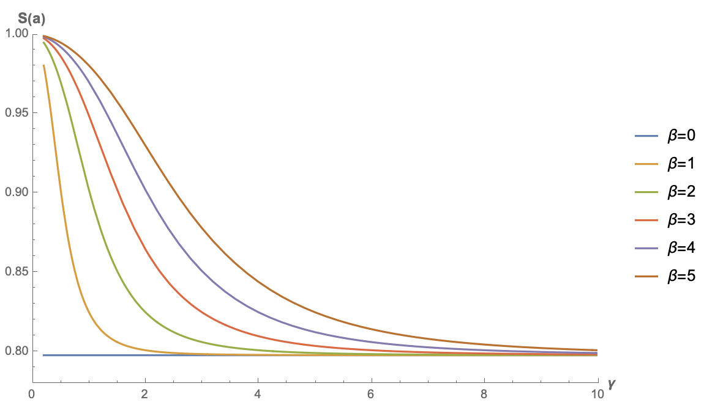

# 注意力机制真的可以"集中注意力"吗？

> **作者**：苏剑林 | **日期**：2023-12-12 | **来源**：[科学空间](https://www.kexue.fm/archives/9889)

之前在[《Transformer升级之路：3、从Performer到线性Attention》](https://www.kexue.fm/archives/8338)、[《为什么现在的LLM都是Decoder-only的架构？》](https://www.kexue.fm/archives/9529)等文章中，我们从Attention矩阵的"秩"的角度探讨了Attention机制，并曾经判断线性Attention不如标准Attention的关键原因正是"低秩瓶颈"。然而，这一解释对于双向的Encoder模型或许成立，但却难以适用于单向的Decoder模型，因为Decoder的Attention矩阵的上三角部分是被mask掉的，留下的下三角矩阵必然是满秩的，而既然都是满秩了，那么低秩瓶颈问题似乎就不复存在了。

所以，"低秩瓶颈"并不能完全解释线性Attention的能力缺陷。在这篇文章中，笔者试图寻求另一个角度的解释。简单来说，与标准Attention相比，线性Attention更难"集中注意力"，从而难以准确地定位到关键token，这大概是它效果稍逊一筹的主要原因。

## 稀疏程度

在文章[《从熵不变性看Attention的Scale操作》](https://www.kexue.fm/archives/8823)中，我们就从"集中注意力"的角度考察过Attention机制，当时我们以信息熵作为"集中程度"的度量，熵越低，表明Attention越有可能集中在某个token上。

但是，对于一般的Attention机制来说，Attention矩阵可能是非归一化的，比如[《FLASH：可能是近来最有意思的高效Transformer设计》](https://www.kexue.fm/archives/8934)介绍的GAU模块，以及[《相对位置编码Transformer的一个理论缺陷与对策》](https://www.kexue.fm/archives/9105)所引入的l2归一化Attention，甚至从更一般的Non-Local Neural Networks角度来看，Attention矩阵还未必是非负的。这些非归一化的乃至非负的Attention矩阵自然就不适用于信息熵了，因为信息熵是针对概率分布的。

为此，我们考虑在[《如何度量数据的稀疏程度？》](https://www.kexue.fm/archives/9595)介绍的$l_1/l_2$形式的稀疏程度指标：

$$S(x) = \frac{E[|x|]}{E[x^2]}$$

该指标跟信息熵相似，$S(x)$越小意味着对应的随机向量越稀疏，越稀疏意味着越有可能"一家独大"，这对应于概率中的one hot分布，跟信息熵不同的是，它适用于一般的随机变量或者向量。

## 简化形式

对于注意力机制，我们记$a = (a_1, a_2, \cdots, a_n)$，其中$a_j \propto f(q \cdot k_j)$，那么

$$S(a) = \frac{E_k[|f(q \cdot k)|]}{E_k[f^2(q \cdot k)]}$$

接下来都考虑$n\to\infty$的极限。假设$k \sim \mathcal{N}(\mu, \sigma^2 I)$，那么可以设$k = \mu + \sigma\varepsilon$，其中$\varepsilon \sim \mathcal{N}(0, I)$，于是

$$S(a) = \frac{E_\varepsilon[|f(q \cdot \mu + \sigma q \cdot \varepsilon)|]}{E_\varepsilon[f^2(q \cdot \mu + \sigma q \cdot \varepsilon)]}$$

注意$\varepsilon$所服从的分布$\mathcal{N}(0, I)$是一个各向同性的分布，与[《n维空间下两个随机向量的夹角分布》](https://www.kexue.fm/archives/7076)推导的化简思路一样，由于各向同性的原因，$q \cdot \varepsilon$相关的数学期望只与$q$的模长有关，跟它的方向无关，于是我们可以将$q$简化为$(\|q\|, 0, 0, \cdots, 0)$，那么对$\varepsilon$的数学期望就可以简化为

$$S(a) = \frac{E_\varepsilon[|f(q \cdot \mu + \sigma\|q\|\varepsilon)|]}{E_\varepsilon[f^2(q \cdot \mu + \sigma\|q\|\varepsilon)]}$$

其中$\varepsilon \sim \mathcal{N}(0, 1)$是一个随机标量。

## 两个例子

现在可以对常见的一些$f$进行计算对比了。目前最常用的Attention机制是$f=\exp$，此时求期望只是常规的一维高斯积分，容易算得

$$S(a) = \exp(-\frac{1}{2}\sigma^2\|q\|^2)$$

当$\sigma\to\infty$或$\|q\|\to\infty$时，都有$S(a)\to 0$，也就是理论上标准Attention确实可以任意稀疏地"集中注意力"，同时这也告诉了我们让注意力更集中的方法：增大$q$的模长，或者增大各个$k$之间的方差，换言之拉开$k$的差距。

另一个例子是笔者喜欢的GAU（Gated Attention Unit），它在开始提出的时候是$f=\text{relu}^2$，此时积分结果为

$$S(a) = \frac{e^{-\beta^2/(2\gamma^2)}(2\beta\gamma + \pi e^{\beta^2/(2\gamma^2)}(\beta^2 + \gamma^2)(\text{erf}(\beta/(\sqrt{2}\gamma)) + 1))}{\sqrt{\pi/4}\cdot 2\beta\gamma e^{-\beta^2/(2\gamma^2)}(\beta^2 + 5\gamma^2) + 2\pi(\beta^4 + 6\beta^2\gamma^2 + 3\gamma^4)(\text{erf}(\beta/(\sqrt{2}\gamma)) + 1)}$$

其中$\beta = q \cdot \mu, \gamma = \sigma\|q\|$。



可以看到，只有$\beta < 0$时，原版GAU的稀疏度才有机会趋于0。这也很直观，当偏置项小于0时，才有更多的机会让relu的结果为0，从而实现稀疏。这个结果也说明了跟$f=\exp$的标准注意力不同，$k$的bias项可能会对$f=\text{relu}^2$的GAU有正面帮助。

## 极简线性

下面我们再来看一个最简单的例子：不加$f$，或者等价地说$f=\text{identical}$。这种情况下对应的就是最简单的一种线性Attention，同样可以算得：

$$S(a) = \frac{\sqrt{2/\pi}\gamma e^{-\beta^2/(2\gamma^2)} + \beta\,\text{erf}(\beta/(\sqrt{2}\gamma))}{\beta^2 + \gamma^2}$$

下面是几个不同$\beta$的函数图像：



注意，此时的$S(a)$是关于$\beta$偶函数，所以$\beta < 0$时图像跟它相反数的图像是一样的，因此上图只画了$\beta \geq 0$的结果。从图中可以看出，不加任何激活函数的线性Attention的稀疏程度并不能接近0，而是存在一个较高的下限，这意味着当输入序列足够长时，这种线性Attention并没有办法"集中注意力"到关键位置上。

## 一般线性

从[《线性Attention的探索：Attention必须有个Softmax吗？》](https://www.kexue.fm/archives/7546)我们知道，线性Attention的一般形式为$a_j \propto g(q) \cdot h(k_j)$，其中$g,h$是值域非负的激活函数。我们记$\tilde{q} = g(q), \tilde{k} = h(k)$，那么$a_j \propto \tilde{q}^\top \tilde{k}$，并且可以写出

$$S(a) = \frac{E_\varepsilon[\tilde{q}^\top \tilde{k}]}{E_\varepsilon[\tilde{q}^\top \tilde{k}\tilde{k}^\top \tilde{q}]} = \frac{\tilde{q}^\top E_\varepsilon[\tilde{k}]}{\tilde{q}^\top E_\varepsilon[\tilde{k}\tilde{k}^\top]\tilde{q}} = \frac{\tilde{q}^\top \tilde{\mu}}{\tilde{q}^\top [\tilde{\mu}\tilde{\mu}^\top + \tilde{\Sigma}]\tilde{q}} = \frac{1}{1 + \frac{\tilde{q}^\top \tilde{\Sigma}\tilde{q}}{(\tilde{q}^\top \tilde{\mu})^2}}$$

这是关于非负型线性Attention的一般结果，现在还没做任何近似，其中$\tilde{\mu}, \tilde{\Sigma}$分别是$\tilde{k}$序列的均值向量和协方差矩阵。

从这个结果可以看出，非负型线性Attention也可能任意稀疏（即$S(a)\to 0$），只需要均值趋于0，或者协方差趋于$\infty$，也就是说$\tilde{k}$序列的信噪比尽可能小。然而$\tilde{k}$序列是一个非负向量序列，信噪比很小的非负序列意味着序列中大部分元素都是相近的，于是这样的序列能表达的信息有限，也意味着线性Attention通常只能表示绝对位置的重要性（比如Attention矩阵即某一列都是1），而无法很好地表达相对位置的重要性，这本质上也是线性Attention的低秩瓶颈的体现。

为了更形象地感知$S(a)$的变化规律，我们不妨假设一种最简单的情况：$\tilde{k}$的每一个分量是独立同分布的，这时候均值向量可以简化为$\tilde{\mu}\mathbf{1}$，协方差矩阵则可以简化为$\tilde{\sigma}^2 I$，那么$S(a)$的公式可以进一步简化为

$$S(a) = \frac{1}{1 + (\frac{\tilde{\sigma}}{\tilde{\mu}}\frac{\|\tilde{q}\|_2}{\|\tilde{q}\|_1})^2}$$

这个结果观察起来就更直观了，要想线性注意力变得稀疏，一个方向是增大$\tilde{\sigma}/\tilde{\mu}$，即降低$\tilde{k}$序列的信噪比，另一个方向则是增大$\|q\|_2/\|q\|_1$，该因子最大值是$\sqrt{d}$，其中$d$是$q,k$的维数，所以增大它意味着要增大$d$，而增大了$d$意味着提高了注意力矩阵的秩的上限，这跟低秩瓶颈视角的结论一样，只有增大$d$才能从根本上缓解线性Attention的不足。

特别地，我们在[《Transformer升级之路：5、作为无限维的线性Attention》](https://www.kexue.fm/archives/8601)也分析过，标准Attention也可以理解为一种无限维的线性Attention，也就是说理论上只有将$d$增加到无穷大，才能彻底弥合两者的差距。

## 线性衰减

最后，我们来看一下在[《Google新作试图"复活"RNN：RNN能否再次辉煌？》](https://www.kexue.fm/archives/9554)介绍过的线性RNN模型系列，它们的特点是带有一个显式的递归，这可以看成一个简单的Attention：

$$a = (a_1, a_2, \cdots, a_{n-1}, a_n) = (\lambda^{n-1}, \lambda^{n-2}, \cdots, \lambda, 1)$$

其中$\lambda \in (0, 1]$。可以算出

$$S(a) = \frac{1-\lambda^n}{n(1-\lambda)} \cdot \frac{1+\lambda}{1+\lambda^n} < \frac{1}{n} \cdot \frac{1+\lambda}{(1-\lambda)(1+\lambda^n)}$$

当$\lambda < 1$时，只要$n\to\infty$，总有$S(a)\to 0$，所以对于带有显式Decay的线性RNN模型来说，稀疏性是不成问题的，它的问题是只能表达随着相对位置增大而衰减的、固定不变的注意力，从而无法自适应地关注到距离足够长的Context。

## 文章小结

本文提出了通过Attention矩阵的稀疏程度来考察不同Attention机制潜力的思路，得出二次型Attention机制有可能实现任意稀疏的Attention矩阵，线性Attention则并不容易实现这种稀疏，或者只能实现绝对位置相关的稀疏，这可能是线性Attention能力有所限制的原因之一。

---

**转载地址**：https://www.kexue.fm/archives/9889

**引用格式**：

苏剑林. (Dec. 12, 2023). 《注意力机制真的可以"集中注意力"吗？》[Blog post]. Retrieved from https://www.kexue.fm/archives/9889

```bibtex
@online{kexuefm-9889,
  title={注意力机制真的可以"集中注意力"吗？},
  author={苏剑林},
  year={2023},
  month={Dec},
  url={\url{https://www.kexue.fm/archives/9889}},
}
```
