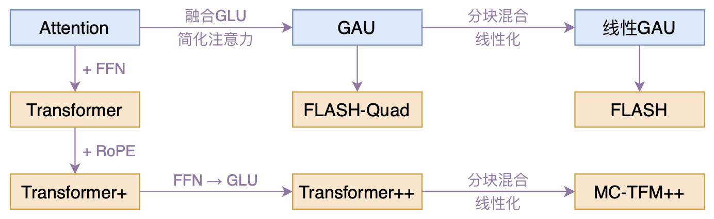
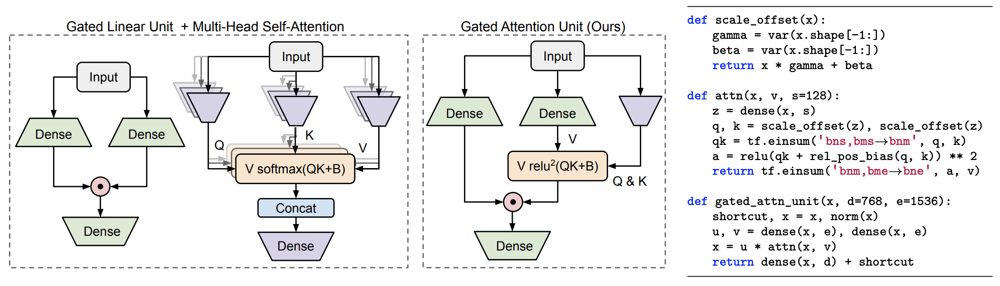
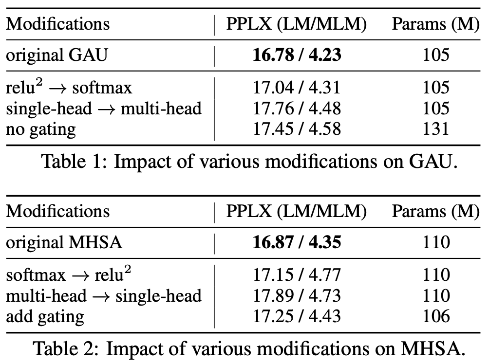
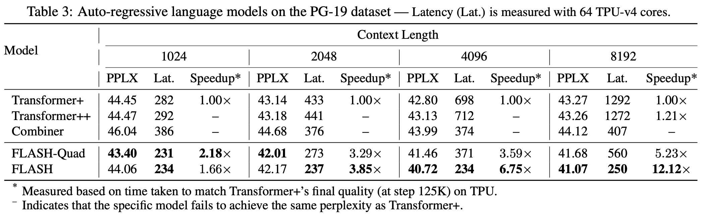
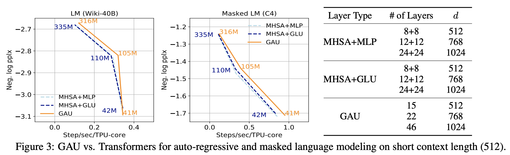

# FLASH：可能是近来最有意思的高效Transformer设计

> **作者**：苏剑林 | **日期**：2022-02-25 | **来源**：[科学空间](https://www.kexue.fm/archives/8934)

高效Transformer工作中终于出现了一个比较有意思的——来自Google的[《Transformer Quality in Linear Time》](https://papers.cool/arxiv/2202.10447)。

论文做到了两点：1、提出了一种新的Transformer变体（GAU），更快、更省显存、更好效果；2、提出一种新的线性化Transformer方案（FLASH），提升了线性Attention效果并保持了做Decoder的可能性。



*本文模型脉络图*

## 门控注意单元 (GAU)

核心是将Attention和FFN融合的新设计GAU（Gated Attention Unit）。标准FFN是两层MLP：$O = \phi(XW_u)W_o$；GLU变体：$O = (U\odot V)W_o, U=\phi_u(XW_u), V=\phi_v(XW_v)$。

GAU进一步融合Attention：

$$O = (U\odot AV)W_o$$

其中 $A$ 是Attention矩阵，负责融合token间信息。作者使用了简化版Attention矩阵：

$$A = \frac{1}{n}relu^2\left(\frac{\mathcal{Q}(Z)\mathcal{K}(Z)^\top}{\sqrt{s}}\right), \quad Z = \phi_z(XW_z)$$

$relu^2$ 是relu后再平方，来自NAS搜索的结果。$1/n$ 是归一化因子。

**最重磅的发现：只用一个头就够了！**

标准Transformer用多头注意力，产生 $bhn^2$ 大小的矩阵。而GAU只需单头就可达到相同甚至更好效果。



*GAU示意图及其伪代码*



*GAU与多头注意力的一些消融分析*

## FLASH：线性化方案

FLASH采取"局部-全局"分块混合方式，结合"稀疏化"和"线性化"优点。将序列分为长度为 $c$ 的块：

- **块内局部注意力**（$V_g^{quad}$）：复杂度 $O(nc)$
- **块间全局线性注意力**（$V_g^{lin}$）：复杂度 $O(n)$
- **合并输出**：$O_g = [U_g\odot(V_g^{quad}+V_g^{lin})]W_o$



*FLASH与标准Transformer的对比*

## 实验结论

1. FLASH-Quad（GAU，二次复杂度）比标准Transformer效果更好、速度更快
2. 在序列足够长时，线性复杂度的FLASH比FLASH-Quad更快
3. RoPE能明显提高Transformer和FLASH的效果



*GAU与多头注意力的对比*

---

**转载地址**：https://www.kexue.fm/archives/8934

**引用格式**：

苏剑林. (Feb. 25, 2022). 《FLASH：可能是近来最有意思的高效Transformer设计》[Blog post]. Retrieved from https://www.kexue.fm/archives/8934

```bibtex
@online{kexuefm-8934,
  title={FLASH：可能是近来最有意思的高效Transformer设计},
  author={苏剑林},
  year={2022},
  month={Feb},
  url={\url{https://www.kexue.fm/archives/8934}},
}
```
