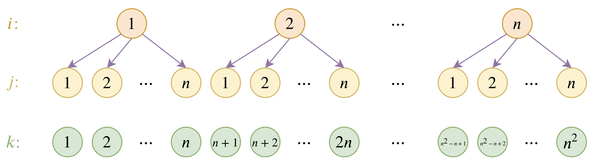
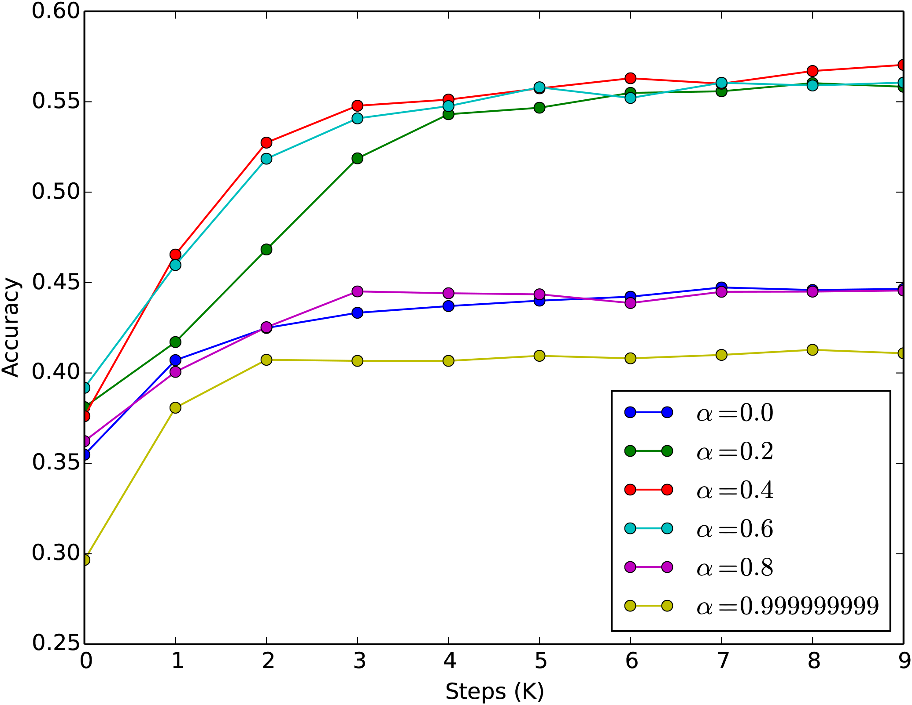

# 层次分解位置编码，让BERT可以处理超长文本

> **作者**：苏剑林 | **日期**：2020-12-04 | **来源**：[科学空间](https://www.kexue.fm/archives/7947)

大家都知道，目前的主流的BERT模型最多能处理512个token的文本。导致这一瓶颈的根本原因是BERT使用了从随机初始化训练出来的绝对位置编码，一般的最大位置设为了512，因此顶多只能处理512个token，多出来的部分就没有位置编码可用了。当然，还有一个重要的原因是Attention的O(n²)复杂度，导致长序列时显存用量大大增加，一般显卡也finetune不了。

本文主要面向前一个原因，即假设有足够多的显存前提下，如何简单修改当前最大长度为512的BERT模型，使得它可以直接处理更长的文本，主要思路是层次分解已经训练好的绝对位置编码，使得它可以延拓到更长的位置。

## 位置编码

BERT使用的是训练出来的绝对位置编码，这种编码方式简单直接，效果也很不错，但是由于每个位置向量都是模型自己训练出来的，我们无法推断其余位置的编码向量，因此有了长度限制。

解决这个问题的一个主流思路是换成相对位置编码，这是个可行的办法，华为的[NEZHA](https://github.com/huawei-noah/Pretrained-Language-Model/tree/master/NEZHA-TensorFlow)模型便是一个换成了相对位置编码的BERT模型。相对位置编码一般会对位置差做个截断，使得要处理的相对位置都在一个有限的范围内，因此相对位置编码可以不受限于序列长度。但相对位置编码也不是完美的解决方案，首先像NEZHA那样的相对位置编码会增加计算量（如果是T5那种倒是不会），其次是[线性Attention](/archives/7546)则没法用相对位置编码，也就是不够通用。

读者可能会想起[《Attention is All You Need》](/archives/4765)不是提出了一种用sin,cos表示的Sinusoidal绝对位置编码吗？直接用那种不就不限制长度了？理论上是这样，但问题是目前没有用Sinusoidal位置编码的模型开放呀，难道我们还要自己从零训练一个？这显然不大现实呀～

## 层次分解

所以，在有限资源的情况下，最理想的方案还是想办法延拓训练好的BERT的位置编码，而不用重新训练模型。下面给出笔者构思的一种层次分解方案。



位置编码的层次分解示意图

具体来说，假设已经训练好的绝对位置编码向量为p₁,p₂,⋯,pₙ，我们希望能在此基础上构造一套新的编码向量q₁,q₂,⋯,qₘ，其中m>n。为此，我们设  

$$q_{(i-1)\times n+j} = \alpha u_i + (1-\alpha) u_j$$

其中α∈(0,1)且α≠0.5是一个超参数，u₁,u₂,⋯,uₙ是该套位置编码的"基底"。这样的表示意义很清晰，就是将位置(i−1)×n+j层次地表示为(i,j)，然后i,j对应的位置编码分别为αuᵢ和(1−α)uⱼ，而最终(i−1)×n+j的编码向量则是两者的叠加。要求α≠0.5是为了区分(i,j)和(j,i)两种不同的情况。

我们希望在不超过n时，位置向量保持跟原来的一样，这样就能与已经训练好的模型兼容。换句话说，我们希望q₁=p₁,q₂=p₂,⋯,qₙ=pₙ，这样就能反推出各个uᵢ了：  

$$u_i = \frac{p_i - \alpha p_1}{1-\alpha}, \quad i=1,2,\cdots,n$$

这样一来，我们的参数还是p₁,p₂,⋯,pₙ，但我们可以表示出n²个位置的编码，并且前n个位置编码跟原来模型是相容的。

## 自我分析

事实上，读懂了之后，读者也许会觉得这个分解其实没什么技术含量，就是一个纯粹的拍脑袋的结果而已？其实确实是这样。

至于为什么会觉得这样做有效？一是由于层次分解的可解释性很强，因此可以预估我们的结果具有一定外推能力，至少对于大于n的位置是一个不错的初始化；二则是下一节的实验验证了，毕竟实验是证明trick有效的唯一标准。本质上来说，我们做的事情很简单，就是构建一种位置编码的延拓方案，它跟原来的前n个编码相容，然后还能外推到更多的位置，剩下的就交给模型来适应了。这类做法肯定有无穷无尽的，笔者只是选择了其中自认为解释性比较强的一种，提供一种可能性，并不是最优的方案，也不是保证有效的方案。

此外，讨论一下α的选取问题，笔者默认的选择是α=0.4。理论上来说，α∈(0,1)且α≠0.5都成立，但是从实际情况出发，还是建议选择0<α<0.5的数值。因为我们很少机会碰到上万长度的序列，对于个人显卡来说，能处理到2048已经很壕了，如果n=512，那么这就意味着i=1,2,3,4而j=1,2,⋯,512，如果α>0.5的话，那么从分解式(1)看αuᵢ就会占主导，因次位置编码之间差异变小（因为i的候选值只有4个），模型不容易把各个位置区分开来，会导致收敛变慢；如果α<0.5，那么占主导的是(1−α)uⱼ，位置编码的区分度更好（j的候选值有512个），模型收敛更快一些。

## 实践测试

综上所述，我们可以几乎无成本地延拓BERT的绝对位置编码，使得它最大长度可以达到n²=512²=262144≈26万！这绝对能满足我们的需求了吧？该改动已经内置在[bert4keras>=0.9.5](https://github.com/bojone/bert4keras)中，用户只需要在`build_transformer_model`中传入参数`hierarchical_position=True`即可启用，`True`也可以换为0～1之间的浮点数，代表上述α的值，为`True`时则默认α=0.4。

至于效果，笔者首先测了MLM任务，直接将最大长度设为1536，然后加载训练好的RoBERTa权重，发现MLM的准确率大概是38%左右（如果截断到512，那么大概是55%左右），经过finetune其准确率可以很快（3000步左右）恢复到55%以上。这个结果表明这样延拓出来的位置编码在MLM任务上是行之有效的。如果有空余算力的话，在做其他任务之前先在MLM下继续预训练一会应该是比较好的。同时，我们对不同的α也做了实验，表明α=0.4确实是一个不错的默认值，如下图所示。



不同alpha下MLM的训练准确率

然后测了两个长文本分类问题，分别将长度设为512和1024，其他参数不变进行finetune（直接finetune，没有先进行MLM继续预训练），其中一个数据集的结果没有什么明显变化；另一个数据集在验证集上1024的比512的要高0.5%左右。这再次表明本文所提的层次分解位置编码是能起作用的。所以，大家如果有足够显存的显卡，那就尽管一试吧，尤其是长文本的序列标注任务，感觉应该挺适合的。反正在bert4keras下就是多一行代码的事情，有提升就是赚到了，没提升也没浪费多少精力。欢迎大家报告自己的测试结果。

最后提供一个训练阶段最大长度与最大batch_size的参照表（RoBERTa Base版，24G的TITAN RTX）：  

| 序列长度 | batch_size |
|---------|-----------|
| 512     | 22        |
| 1024    | 9         |
| 1536    | 5         |

从这个表中可以看到，其实序列长度翻一倍，显存占用量大约也就是翻一倍（多一点）而已，似乎跟传说中的O(n²)复杂度不一样？事实上，O(n²)是针对于足够长的序列的，这个"足够长"是指几千上万的，对于不超过2048的序列来说，其实BERT的复杂度还是近乎线性的，所以这种场景下直接用"BERT+延拓位置编码"的方式比"分句+BERT+LSTM"之类的设计要方便得多。

## 文章小结

本文分享了笔者构思的一种基于层次分解的位置编码延拓方案，通过这个延拓，BERT理论上最多可以处理长度达26万的文本，只要显存管够，就没有BERT处理不了的长文本。

所以，你准备好显存了吗？

---

**转载地址**：https://www.kexue.fm/archives/7947

**引用格式**：

苏剑林. (Dec. 04, 2020). 《层次分解位置编码，让BERT可以处理超长文本》[Blog post]. Retrieved from https://www.kexue.fm/archives/7947

```bibtex
@online{kexuefm-7947,  
  title={层次分解位置编码，让BERT可以处理超长文本},  
  author={苏剑林},  
  year={2020},  
  month={Dec},  
  url={\url{https://www.kexue.fm/archives/7947}},  
}
```
