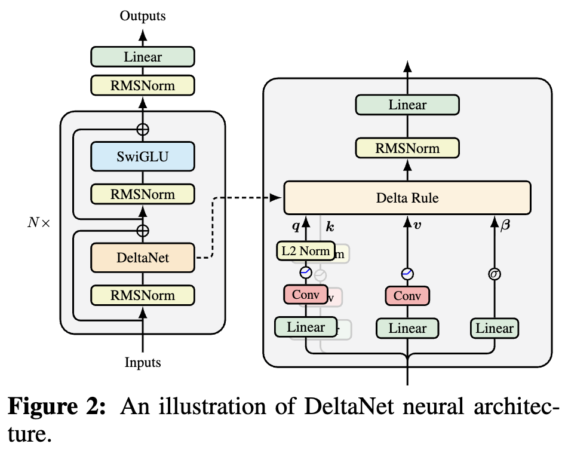

# 为什么线性注意力要加Short Conv？

> **作者**：苏剑林 | **日期**：2025-10-05 | **来源**：[科学空间](https://www.kexue.fm/archives/11320)

如果读者有关注模型架构方面的进展，那么就会发现，比较新的线性Attention（参考[《线性注意力简史：从模仿、创新到反哺》](https://www.kexue.fm/archives/11033)）模型都给Q,K,V加上了Short Conv，比如下图所示的[DeltaNet](https://papers.cool/arxiv/2406.06484)：



DeltaNet中的Short Conv

为什么要加这个Short Conv呢？直观理解可能是增加模型深度、增强模型的Token-Mixing能力等，说白了就是补偿线性化导致的表达能力下降。这个说法当然是大差不差，但它属于"万能模版"式的回答，我们更想对它的生效机制有更准确的认知。

接下来，笔者将给出自己的一个理解（更准确说应该是猜测）。

## 测试训练

从[《线性注意力简史：从模仿、创新到反哺》](https://www.kexue.fm/archives/11033)我们知道，目前的新式线性Attention背后的核心思想都是[TTT（Test Time Training）](https://papers.cool/arxiv/2407.04620)或者说Online Learning。TTT基于优化器更新与RNN迭代的相似性，通过优化器来构建（不一定是线性的）RNN模型，诸如DeltaNet、GDN、Comba等线性Attention都可以看成它的特例。

具体来说，TTT将K,V视为成对的语料 $(k_1, v_1), (k_2, v_2), \cdots, (k_t, v_t)$，我们用它训练一个模型 $v = f(S_t; k)$，然后输出 $o_t = f(S_t; q_t)$，其中 $S_t$ 是模型参数，用SGD更新：

$$S_t = S_{t-1} - \eta_t \nabla_{S_{t-1}} L(f(S_{t-1}; k_t), v_t)$$

当然，如果我们愿意，也可以考虑其他优化器，比如[《Test-Time Training Done Right》](https://papers.cool/arxiv/2505.23884)尝试了Muon优化器。除了可以改变优化器外，可以灵活改变的地方还有模型 $v = f(S_t; k)$ 的架构以及损失函数 $L(f(S_{t-1}; k_t), v_t)$。此外，我们还可以考虑以Chunk为单位的Mini-batch TTT。

不难想象，理论上TTT的灵活性非常高，可以构建任意复杂的RNN模型。当架构选择线性模型 $v = S_t k$ 且损失函数选择平方误差时，结果对应DeltaNet；如果我们加上一些正则项，那么可以衍生出GDN等变体。

## 灵魂拷问

将TTT放在前面，主要是想表明，当前主流的线性Attention的底层逻辑跟TTT一样，核心都是语料对 $(k_1, v_1), (k_2, v_2), \cdots, (k_t, v_t)$ 的Online Learning。这就很自然地引申出一个疑问：为什么要这样做？这样做究竟学出个什么来？

要回答这个问题，首先得反思一下"我们究竟想要什么"。按照Softmax Attention的特点，我们想要的应该是根据 $(k_1, v_1), (k_2, v_2), \cdots, (k_t, v_t)$ 和 $q_t$ 算出一个 $o_t$ 来，这个过程理想情况下应该依赖于全体 $(k, v)$。同时，我们还希望能常数复杂度实现这个目标，所以一个直观想法是先将 $(k, v)$ 压缩成（与t无关的）固定大小的State，然后再读取这个State。

怎么实现这个压缩呢？TTT的想法是：设计一个模型 $v = f(S_t; k)$，然后用这些 $(k, v)$ 对去"训练"这个模型，训练完成后，模型某种意义上就"背下"了这些 $(k, v)$ 对，这就相当于将全体 $(k, v)$ 压缩到了固定大小的模型权重 $S_t$ 中。至于 $q_t$ 怎么利用 $S_t$，直接将它代入模型中得到 $o_t = f(S_t; q_t)$ 是一个比较自然的选择，但原则上我们也可以设计别的利用方式。

也就是说，TTT的核心任务是利用"训练模型"约等于"背诵训练集"这件事情，来实现K,V的压缩。然而，"训练模型"约等于"背诵训练集"这件事情并不是那么平凡，它有一些前提条件。

## 键值同源

举个例子，如果我们取 $K = V$，那么TTT这套框架理论上就失效了，因为这时候模型 $v = f(S_t; k)$ 的最优解就是恒等变换，它是一个平凡解，这相当于没记住任何东西。像DeltaNet这种在线更新的或许还能抢救一下，而像[MesaNet](https://papers.cool/arxiv/2506.05233)这种基于准确解的就真的直接输出单位阵I了。

可能有读者会反问：好端端地为啥要考虑 $K = V$ 这种不科学的选择呢？的确，$K = V$ 是比较极端的选择，这里只是作为一个例子，说明"训练模型"约等于"背诵训练集"并不是随意成立的。其次，我们在[《Transformer升级之路：20、MLA好在哪里?（上）》](https://www.kexue.fm/archives/10907)已经验证过，对于Softmax Attention来说，$K = V$ 也能取得不错的结果。

这说明，$K = V$ 并不是Attention机制的本质障碍，但在TTT框架里边它却能导致模型失效，这是因为K,V完全重合，那么它们俩之间的回归就没有东西可学了。类似地，我们可以想象，K,V的信息重合度越高，那么它们之间可学的东西就越少，换言之TTT对"训练集"的记忆程度就越低。

在一般的Attention机制中，$q_t, k_t, v_t$ 都是由同一个输入 $x_t$ 经过不同的线性投影得到的，换句话说 $k_t, v_t$ 具有相同的源头 $x_t$，这就始终有种"自己预测自己"的感觉，可学的东西有限。

## 卷积救场

怎么让TTT在键值同源甚至 $K = V$ 时能学出更有价值的结果呢？其实答案很早就有了——可以追溯到Word2Vec甚至更早的年代——那就是不要"预测自己"，而是"预测周围"。

以[Word2Vec](https://papers.cool/arxiv/1301.3781)为例，我们知道它的训练方式是"中心词预测上下文"；之前流行的[BERT](https://papers.cool/arxiv/1810.04805)，预训练方式是MLM，它是某些词Mask掉来预测这些词，可以说是"上下文预测中心词"；现在主流的LLM，训练任务则是NTP（Next Token Predict），根据上文预测下一个词。很明显，它们的共同特点都是不预测自己，而是预测周围。

所以，想要改进TTT，那么就要改变 $(k_t, v_t)$ 这样的"自己预测自己"的配对方式，考虑到当前LLM以NTP为主，在TTT中我们也可以考虑NTP，比如 $(k_{t-1}, v_t)$ 来构建语料对，即用 $k_{t-1}$ 来预测 $v_t$，这样即便 $K = V$ 也能学出非平凡的结果。此时TTT内外都是NTP任务，具有漂亮的一致性。

不过，只用 $k_{t-1}$ 预测 $v_t$ 的话，似乎把 $k_t$ 浪费掉了，所以进一步的想法是把 $k_{t-1}$ 和 $k_t$ 以某种方式混合起来再预测 $v_t$。到这里，大家可能反应过来了，"把 $k_{t-1}$ 和 $k_t$ 以某种方式混合起来"这不就相当于kernel_size=2的Conv嘛！所以，给K加Short Conv，是将TTT的训练目标从"预测自己"转化为NTP，让TTT至少有能力学出一个n-gram模型。

至于给Q,V加Short Conv，则完全是顺带的，根据飞来阁（FLA群）的消息，给Q,V加虽然也有一点作用，但远不如给K加Short Conv带来的提升，这也算是佐证了我们的猜测。

## 文章小结

这篇文章对"为什么线性注意力要加Short Conv"这个问题给出了一个闭门造车的理解。

---

**转载地址**：https://www.kexue.fm/archives/11320

**引用格式**：

苏剑林. (Oct. 05, 2025). 《为什么线性注意力要加Short Conv？》[Blog post]. Retrieved from https://www.kexue.fm/archives/11320

```bibtex
@online{kexuefm-11320,
  title={为什么线性注意力要加Short Conv？},
  author={苏剑林},
  year={2025},
  month={Oct},
  url={\url{https://www.kexue.fm/archives/11320}},
}
```
