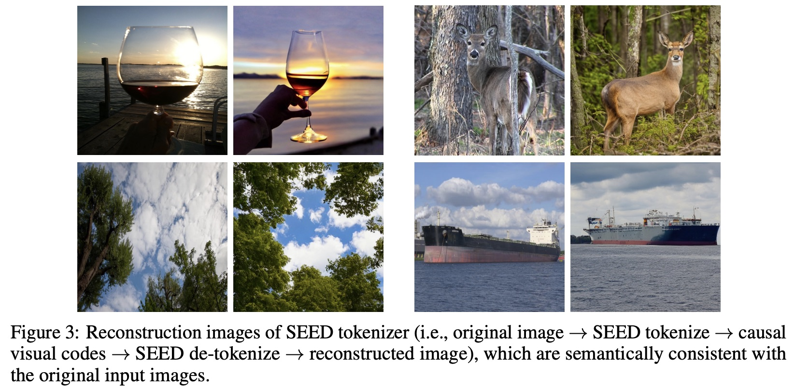
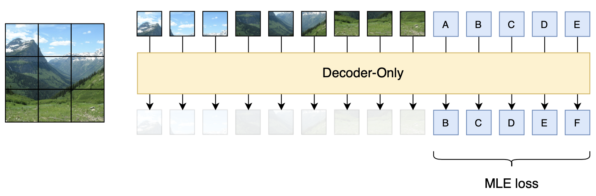
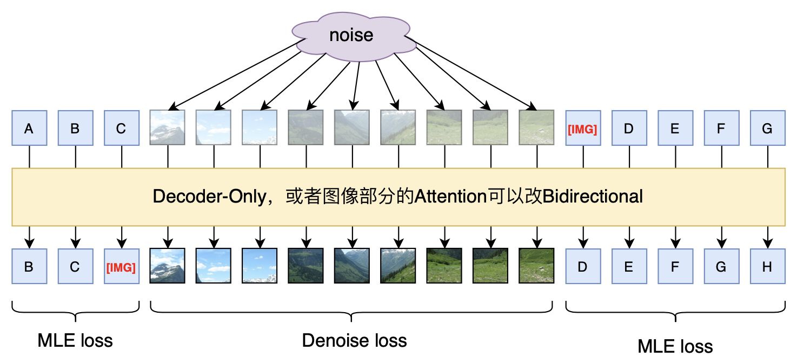

# "闭门造车"之多模态思路浅谈（一）：无损输入

> **作者**：苏剑林 | **日期**：2024-02-21 | **来源**：[科学空间](https://www.kexue.fm/archives/9984)

这篇文章分享一下笔者关于多模态模型架构的一些闭门造车的想法，或者说一些猜测。

最近Google的[Gemini 1.5](https://blog.google/technology/ai/google-gemini-next-generation-model-february-2024/)和OpenAI的[Sora](https://openai.com/sora)再次点燃了不少人对多模态的热情，只言片语的技术报告也引起了大家对其背后模型架构的热烈猜测。不过，本文并非是为了凑这个热闹才发出来的，事实上其中的一些思考由来已久，最近才勉强捋顺了一下，遂想写出来跟大家交流一波，刚好碰上了两者的发布。

事先声明，"闭门造车"一词并非自谦，笔者的大模型实践本就"乏善可陈"，而多模态实践更是几乎"一片空白"，本文确实只是根据以往文本生成和图像生成的一些经验所做的"主观臆测"。

## 问题背景

首先简化一下问题，本文所讨论的多模态，主要指图文混合的双模态，即输入和输出都可以是图文。可能有不少读者的第一感觉是：多模态模型难道不也是烧钱堆显卡，Transformer"一把梭"，最终"大力出奇迹"吗？

其实没那么简单。先看文本生成，事实上文本生成自始至终都只有一条主流路线，那就是语言模型，即建模条件概率$p(x_t|x_1,\cdots,x_{t-1})$，不论是最初的n-gram语言模型，还是后来的Seq2Seq、GPT，都是这个条件概率的近似。也就是说，一直以来，人们对"实现文本生成需要往哪个方向走"是很明确的，只是背后所用的模型有所不同，比如LSTM、CNN、Attention乃至最近复兴的线性RNN等。所以，文本生成确实可以All in Transformer来大力出奇迹，因为方向是标准的、清晰的。

然而，对于图像生成，并没有这样的"标准方向"。就本站所讨论过的图像生成模型，就有[VAE](https://www.kexue.fm/tag/vae/)、[GAN](https://www.kexue.fm/tag/GAN/)、[Flow](https://www.kexue.fm/tag/flow/)、[Diffusion](https://www.kexue.fm/tag/%E6%89%A9%E6%95%A3/)，还有小众的[EBM](https://www.kexue.fm/archives/6612)、PixelRNN/PixelCNN等，这些方法的区分，并不是因为它们用了RNN、CNN或者Attention导致效果上的不同，而是建模理论就有根本差别。而造成图像生成手段多样化的根本原因，是对连续变量进行概率建模的困难性。

对于一个长度为$l$的句子$(x_1,x_2,\cdots,x_l)$，它的每个$x_t$都来自于一个有限的词表，因此$p(x_t|x_1,\cdots,x_{t-1})$本质上就是分类任务，在"神经网络的万能拟合能力 + Softmax"的组合下，理论上任何分类任务都可以精确建模，这就是文本生成背后的理论保证。然而，我们通常会将图像看成是连续型向量，那么对于图像来说，$x_t$就是一个实数，纵然我们也可以做同样的条件分解，那么又该如何建模$p(x_t|x_1,\cdots,x_{t-1})$呢？注意此时$p(x_t|x_1,\cdots,x_{t-1})$是一个概率密度，概率密度的必要条件是非负且积分为1：

$$\int p(x_t|x_1,\cdots,x_{t-1}) dx_t = 1$$

除了正态分布，我们还能写出几个积分恒为1的函数呢？而能写出的函数如正态分布，并不足以拟合任意复杂的分布。说白了，神经网络是函数的万能拟合器，但不是概率密度的万能拟合器，这就是连续型变量做生成建模的本质困难，而图像生成的各种方案，本质上都是"各显神通"来绕过对概率密度的直接建模（除了Flow）。但离散型变量不存在这个困难，因为离散型概率的约束是求和为1，这通过Softmax就可以实现。

## 离散之路

这时候也许有读者会想：那么能不能将图像变成离散化的，然后套上文本生成的框架去做？确实可以，这是目前的主流思路之一（很可能没有"之一"）。

事实上，图像本来就是离散的，一幅$n\times n$大小的RGB图像，背后其实就是$3n^2$个0～255的整数，也就是说相当于长度为$3n^2$、vocab_size为256的句子。甚至往大了讲，计算机本质上是离散的，即它能表示的一切都是离散的，不管是文本、图像、语音还是视频，所以直接用它们的原始离散表示套用文本生成的框架在理论上是没有问题的，早些年的[PixelRNN](https://papers.cool/arxiv/1601.06759)、[PixelCNN](https://papers.cool/arxiv/1606.05328)等工作，就是直接在图像的像素空间上做自回归生成，之前我们在[《为节约而生：从标准Attention到稀疏Attention》](https://www.kexue.fm/archives/6853)介绍的OpenAI的Sparse Transformer，主要实验之一也是Pixel级别的图像自回归。

然而，直接在像素空间上操作的最大问题是——序列太长，生成太慢。在多数应用场景中，图片分辨率起码要达到256以上才有实用价值（除非只是为了用于小图表情包的生成），那么就算$n=256$，也有$3n^2\approx 20$万，也就是说为了生成一张256大小的图片，我们需要自回归解码20万步！虽然近来Long Context技术有了长足的进步，但这个成本依然很奢侈，而且生成时间上也很难接受。

为此，一个很容易想到的思路是"先压缩，后生成"，即通过另外的模型压缩序列长度，然后在压缩后的空间进行生成，生成后再通过模型恢复为图像。压缩自然是靠AE（AutoEncoder），但我们想要的是套用文本生成的建模方式，所以压缩之后还要保证离散性，这就需要[VQ-VAE](https://www.kexue.fm/archives/6760)，以及后来的[VQ-GAN](https://papers.cool/arxiv/2012.09841)，其中VQ还可以替换为近来的[FSQ](https://www.kexue.fm/archives/9826)。跟文本的Tokenizer类似，VQ-VAE/GAN就相当于"图像Tokenizer"的角色，它保持了编码结果的离散性，但序列长度明显缩小（比如分辨率降低为1/4，那么就是$3n^2\to(n/4)^2$，缩小48倍），并可以通过相应的Decoder恢复为原始图片（DeTokenize）。基于"图像Tokenizer"这个思路的多模态工作已经有很多，比如最近的[LWM](https://papers.cool/arxiv/2402.08268)和[AnyGPT](https://papers.cool/arxiv/2402.12226)。

不管原始的像素空间还是在压缩后的编码空间，它们都有一个共同的特点——都是二维特征，换句话说，文本只有左右一个维度，而图像则有左右、上下两个问题，那么在进行自回归生成的时候，就需要人工设计生成方向，比如先左右后上下、先上下后左右、从中心逆时针到四周、按照到左上角的距离排序等等。不同的生成方向可能会明显影响生成效果，这就引入了额外的超参，并且由于不够端到端而显得不够优雅。针对这个问题，我们可以用Cross Attention的方式对二维特征进行组合，输出只有单一方向的编码结果，相关工作可以参考[《Planting a SEED of Vision in Large Language Model》](https://papers.cool/arxiv/2307.08041)。

## 压缩损失

看上去通过"图像Tokenzier"的方式，多模态生成已经"迎刃而解"？不然，问题才刚刚开始。

诸如VQ-VAE、VQ-GAN的图像Tokenzier的最大问题在于，为了明显提高生成速度，缩短序列长度，对编码分辨率做了高度压缩（主流的是256×256→32×32甚至256×256→16×16），这导致了图像信息的严重损失。为了直观地感知这一点，我们可以参考SEED一文的重构效果：



可以看到，虽然重构图像确实很清晰，并且也基本保持了输入图像的整体语义，但局部细节完全不同，这意味着不可能基于该图像Tokenizer完成任意图文混合任务（比如OCR）。

进一步地，我们简单算一笔信息账，就能更清楚地知道信息损失有多严重了。首先，参考[《Generating Long Sequences with Sparse Transformers》](https://papers.cool/arxiv/1904.10509)的实验结果，我们可以知道ImageNet-64的平均信息熵是3.44比特/字节，当时的模型还不够大，理论上增大模型这个数字还可以进一步降低，我们就当它是3比特/字节，那么一个64*64的ImageNet图像，平均的总信息熵是$64\times 64\times 3\times 3$比特；接着，我们知道vocab_size为$V$的词表，每个token的平均信息熵是$\log_2 V$比特，如果要想将编码长度压缩为$L$，并且实现无损压缩，那么至少有

$$L \times \log_2 V \geq 64 \times 64 \times 3 \times 3$$

如果$L=1024=32\times 32$，那么至少有$V \geq 2^{36}\approx 7\times 10^{10}$，如果$L=256=16\times 16$，那么更是至少要$V \geq 2^{144}\approx 2\times 10^{43}$！很明显当前各种图像Tokenizer的codebook大小，都没有达到如此逆天的量级，所以结果必然是严重的信息损失！

一个自然的质疑是：为什么必须无损呢？确实，人也做不到无损，甚至人对图像的理解，信息损失可能比图像Tokenizer更严重。但问题是，模型的最基本要求是跟人类自己的认知对齐，换句话说，有损压缩没问题，但至少对人来说是无损，就好比丢掉红外光和紫外光，对人眼是完全无损的一样。然而，"对人无损"本身是一个很宽泛的概念，没有可计算的指标，VQ-VAE直接用L2距离去重构图像，由于信息损失，模糊是必然的，VQ-GAN补充了GAN损失，提高了清晰度，但也只能大体上保持全局的语义，无法完全对齐人的标准。更何况，谁也不知道人什么时候会提出新的更依赖于细节的图像任务，因此从通用智能的角度来看，无损压缩是必然的最终选择。

由此可见，在一个真正通用的多模态模型中，图像部分必然要比文本部分要困难得多，因为图像的信息量远大于文字。但其实人类自己创造的图像（比如画画）也不会比文字（比如写作）复杂多少，真正复杂的图像，是直接采集自大自然的照片。所以归根结底，文字只是人类的产物，而图像是大自然的产物，人不如自然聪明，所以文字也不如图像难，而真正通用的人工智能，本就是要往全面碾压人类的方向走的。

## 扩散模型

言归正传。就当前的图像生成技术来说，如果限定无损压缩，那么要不就回到像素空间做自回归，但正如前述所分析的，这样的生成速度难以接受，所以剩下的唯一选择就是重新回到连续空间，即将图像视为连续型向量，并且在无损压缩的限定下，唯二的选择就是Flow模型和扩散模型了。

Flow本身设计上就是可逆的，扩散模型也可以导出可逆的ODE方程，它们都是将标准高斯分布映射为目标分布，这意味着它们有足够的熵源。离散型和连续型生成有所不同，离散型自回归生成的熵源是seqlen和vocab_size，而vocab_size的贡献是对数增长的，所以主要靠seqlen，但是seqlen等价于成本，所以离散型的熵源是昂贵的；基于变换的连续型生成的熵源是高斯噪声，原则上可以无穷无尽，是廉价且可并行的。不过Flow为了保证每一层的可逆性，对架构做了明显修改，很可能会明显影响效果上限（没有直接证据，但Flow模型确实没做出过惊艳的生成效果就是了），因此剩下的唯一选择就是扩散模型了。

注意扩散只是图像生成方案的选择，对于图像理解，从无损的角度来说，任何编码手段都有失真的风险，所以最保证输入肯定就是原始图像了。因此，最保险的方式，应该是以Patch的方式直接输入原始图像，即类似[Fuyu-8b](https://huggingface.co/adept/fuyu-8b)的处理方式：



但是Fuyu-8b只是多模态输入，输出还是单模态的文本。如何给它补上图像生成能力呢？考虑到扩散模型在训练阶段就是一个去噪任务，所以一个或许可行的做法是：



训练阶段，输入文本和加噪的图像，文本的训练目标就是预测下一个token，图像的训练目标就是预测原图（或者噪声）；预测结果，文本部分还是token by token地递归，直到预测出[IMG]，然后就并行输入若干个噪声向量，按照扩散模型的方式进行采样图像。注意图像生成部分是并行的，所以原则上不Decoder-Only更好，因为如果Decoder-Only的话，就需要人为指定排序了，不同的排序可能会明显影响效果。在当前扩散模型的加速采样技术下，基本上10个steps就可以完成图像的生成，因此生成速度是可以接受的。

（**2024.08.26更新**：Meta的新出的[Transfusion](https://papers.cool/arxiv/2408.11039)跟上述方案基本一样，只是图片多加了一步Latent Encoder，效果颇佳；此外稍晚一点的[Show-o](https://papers.cool/arxiv/2408.12528)也大同小异，差别是将Diffusion也离散化了。）

## Patch输入

上述做法的一个关键是用到了Patch-based的扩散模型，所以最基本的是要验证这样的扩散模型设计是否可行（因为之前有说法是扩散模型本身非常依赖于已有的U-Net架构）。为此，笔者自己做了一些实验，也顺手调研了一些文献，下面总结一下自己的初步结论。

根据搜到的资料，最早尝试通过"Patch输入+Transformer"的组合做扩散模型的工作，应该是[《All are Worth Words: A ViT Backbone for Diffusion Models》](https://zhuanlan.zhihu.com/p/619033826)和[《Scalable Diffusion Models with Transformers》](https://papers.cool/arxiv/2212.09748)。两篇论文大致同期，并且做法也大同小异，前者（U-ViT）主要强调了U-Net中的"Long skip connection"的作用，后者（DiT）则强调了将扩散模型的时间t和条件标签y以adaLN的方式融入模型的必要性。不过，只有U-ViT尝试了直接以原始图像的Patch作为输入的做法，并且分辨率也只做到了64*64，对于256*256和512*512分辨率的图像，不管是U-ViT还是DiT，都是在[LDM](https://papers.cool/arxiv/2112.10752)的自编码器降维后的特征空间进行扩散的，这确实也是目前的主流做法，但跟前面说的一样，这种程度的压缩都伴随着严重的信息损失，很难说是真正通用的特征。

直接用原始图像的Patch而不是预训练的编码器特征作为输入，还有一个好处是避免造成特征间的孤立。比如，当我们需要同时输入两幅图像$I_1,I_2$的时候，基于编码器特征的通常做法是将$\text{encoder}(I_1),\text{encoder}(I_2)$输入到模型中，但问题是encoder本身就对图片内的语义做了一层交互，输入$\text{encoder}(I_1),\text{encoder}(I_2)$的话，$I_1,I_2$之间就欠缺了这一层交互，这就是图片间的特征孤立问题，更多细节可以参考[《Browse and Concentrate: Comprehending Multimodal Content via prior-LLM Context Fusion》](https://papers.cool/arxiv/2402.12195)。所以，倒不如文本、图像都直接输入原始形式，将所有交互都交给多模态模型自行决定，这样就不存在这个隔阂了。

当然，直接输入原始图像的Patch的做法没有成为主流，背后必然有其困难之处，笔者也自行实验了一下。实验任务是CelebA-HQ的扩散生成，分辨率为64*64和128*128，分别reshape为16*16*48和16*16*192后投影到模型中；模型就是一个普通的Pre Norm的Transformer，没有Long skip connection，模型主干是[GAU](https://www.kexue.fm/archives/8934)而不是MHA；位置编码是[2D-RoPE](https://www.kexue.fm/archives/8397)，时间Embedding直接加到Patch输入熵。

笔者的实验结果显示，不管是64*64还是128*128分辨率，它们确实都可以正常收敛，最终可以生成跟普通U-Net差不多的效果（没算FID，纯肉眼），但是需要训练更多的步数才收敛，比如都是单卡A800训练，128*128分辨率下普通U-Net大概1～2天就训出大致可看的结果，基于Transformer的架构则需要10多天才勉强可看。究其原因，大概是没有了CNN的Inductive Bias，模型需要花更多的训练步数才能学会适应图像的先验吧。不过对于多模态大模型来说，这大概不是什么问题，因为LLM所需要的训练步数本来就足够多。

## 文章小结

本文介绍了笔者关于多模态模型设计的构思——直接以原始图像的Patch作为图像输入，文本部分还是常规预测下一个Token，图像部分则用输入加噪图像来重构原图，这种组合理论上能以最保真的方式实现多模态生成。初步来看，直接以原始图像的Patch作为输入的Transformer，是有可能训练出成功的图像扩散模型的，那么这种扩散与文本混合的模型设计，也就有成功的可能了。当然，这只是笔者关于多模态路线的一些很潦草的想法，大部分没有经过实践验证，请大家斟酌阅读～

---

**转载地址**：https://www.kexue.fm/archives/9984

**引用格式**：

苏剑林. (Feb. 21, 2024). 《"闭门造车"之多模态思路浅谈（一）：无损输入》[Blog post]. Retrieved from https://www.kexue.fm/archives/9984

```bibtex
@online{kexuefm-9984,
  title={"闭门造车"之多模态思路浅谈（一）：无损输入},
  author={苏剑林},
  year={2024},
  month={Feb},
  url={\url{https://www.kexue.fm/archives/9984}},
}
```
