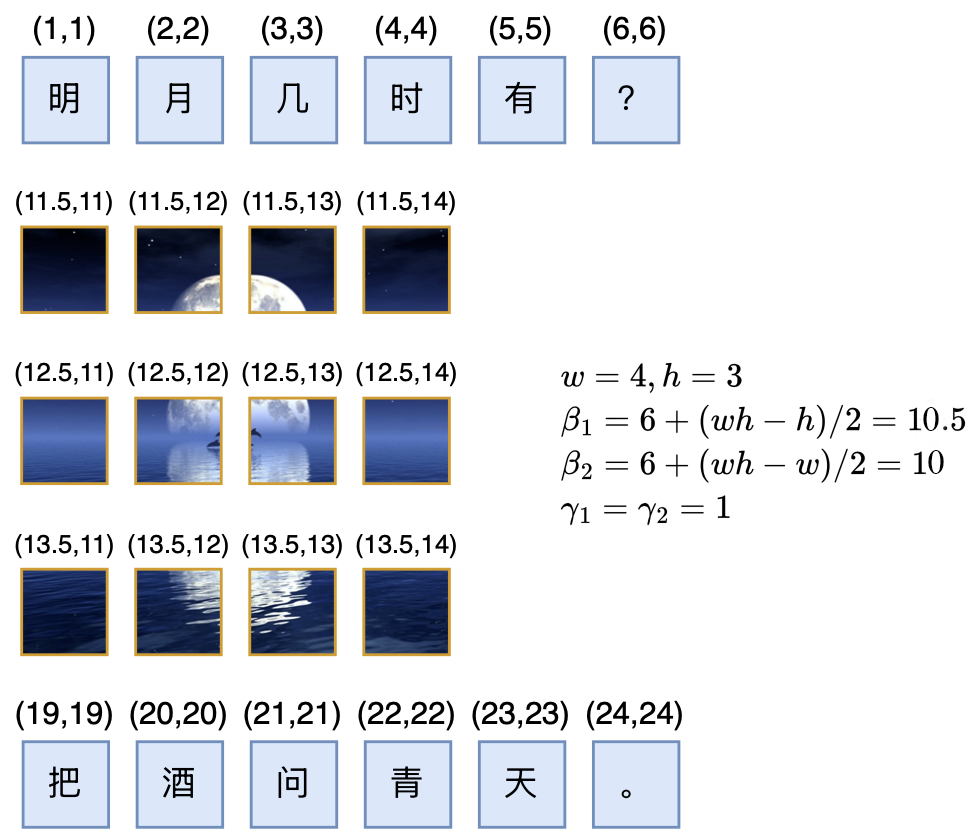
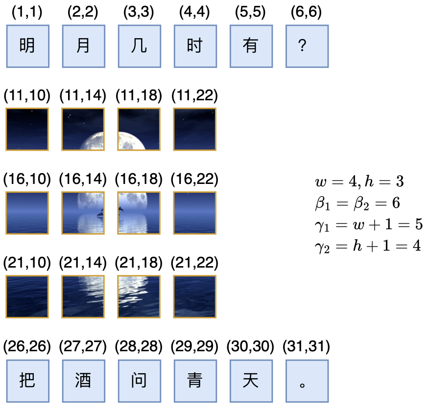
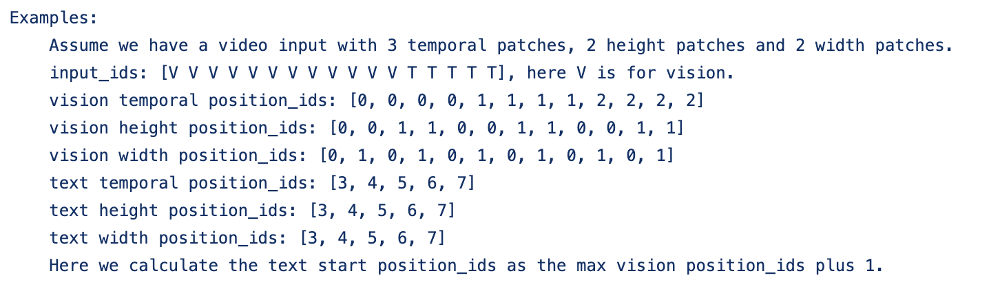

# "闭门造车"之多模态思路浅谈（三）：位置编码

> **作者**：苏剑林 | **日期**：2024-09-06 | **来源**：[科学空间](https://www.kexue.fm/archives/10352)

在前面的文章中，我们曾表达过这样的观点：多模态LLM相比纯文本LLM的主要差异在于，前者甚至还没有形成一个公认为标准的方法论。这里的方法论，不仅包括之前讨论的生成和训练策略，还包括一些基础架构的设计，比如本文要谈的"多模态位置编码"。

## 多模位置

多模态模型居然连位置编码都没有形成共识，这一点可能会让很多读者意外，但事实上确实如此。对于文本LLM，目前主流的位置编码是RoPE，更准确来说是RoPE-1D，因为原始设计只适用于1D序列。后来我们推导了RoPE-2D，这可以用于图像等2D序列，按照RoPE-2D的思路我们可以平行地推广到RoPE-3D，用于视频等3D序列。

然而，当多种模态混合输入时，困难就出现了：文本是1D序列，所以它的位置只是一个标量n；图像是2D的（"宽"和"高"），所以表达它的位置需要一个二维向量(x,y)；视频则在图像的基础上新增了一个时间维度，所以它的位置是一个三维向量(x,y,z)。当我们希望用同一个模型去处理三种模态的数据时，就要想办法糅合这三种不同形式的位置信息。

大家都知道，RoPE在实现上是绝对位置编码，但结合基于内积的Attention来用时，内积之后位置会自动作差，从而实现了相对位置编码的效果。可同一大小的向量可以作差，不同大小的向量怎么作差呢？这就是多模态位置编码的困难所在。

## 向后兼容

所以，我们希望设计一种多模态位置编码，它既可以多模态混合使用，在单模态下又能退化为对应的RoPE-1D/2D/3D，以充分解锁每个模态的能力。

既要保留完整的位置信息又要允许作差，那么我们就只能统一升维到最高维度。下面我们以图文混合模态为例，由于图像是2D的，所以我们将文本的位置编码也提升到二维，然后统一用RoPE-2D。

怎么升维都可以吗？并不是，我们希望它具有向后的**兼容性**，即当输入是纯文本时，它跟RoPE-1D完全等价。对比RoPE-1D与RoPE-2D，可以发现其实有 $R_n = R_{n,n}$，即位置为n的RoPE-1D跟位置为(n,n)的RoPE-2D其实是等价的，所以要想在图文混合中统一用RoPE-2D，并且对于纯文本能退化为RoPE-1D，那么就要将文本部分的位置坐标取为(n,n)的形式。

## 等价对称

通过上述分析，我们确定了图文混合模态统一用RoPE-2D的方案，并且由向后兼容性确定了位置n的文本Token的二维位置应该取(n,n)。接下来，我们需要构思的是图像部分的位置编码。

如果输入只有一张 $w \times h$ 个Patch的图像，那么它的位置坐标自然就是各个Patch本身的坐标。我们可以给每个坐标都加上 $(\beta_1, \beta_2)$ 而不改变效果，也可以给每个坐标都乘以 $(\gamma_1, \gamma_2)$，这样允许我们按需调整相邻位置的间隔。

现在我们考虑左右两段文本夹着中间一张图像时，$\beta_1, \beta_2, \gamma_1, \gamma_2$ 该怎么选取。

首先，我们假设文本的Token和Patch具有一定的**等价性**：经过合理的Patchify后每个Patch的地位跟Token等价，这意味着对于两段文本来说，它们相当于夹着一个wh个Token的句子。

接着，我们还需要引入**对称性**——图像第一个Patch与左段文本最后一个Token的位置差，等于右段文本第一个Token与图像最后一个Patch的位置差：

$$\begin{pmatrix} \beta_1 + \gamma_1 \\ \beta_2 + \gamma_2 \end{pmatrix} - \begin{pmatrix} L \\ L \end{pmatrix} = \begin{pmatrix} L + wh + 1 \\ L + wh + 1 \end{pmatrix} - \begin{pmatrix} \beta_1 + h\gamma_1 \\ \beta_2 + w\gamma_2 \end{pmatrix}$$

我们可以简单地取 $\gamma_1 = \gamma_2 = 1$，继而解得

$$\beta_1 = L + \frac{1}{2}(wh - h), \quad \beta_2 = L + \frac{1}{2}(wh - w)$$

这个方案我们称之为RoPE-TV（RoPE for Text and Vision）。



新版RoPE-TV（RoPE-Tie-v2）示意图

作为对比，旧版RoPE-Tie的位置坐标如下图所示：



旧版RoPE-Tie示意图

## 优劣分析

新方案有什么好处呢？首先，RoPE-Tie中图像内的相对位置跟它的大小有关，而新方案中Patch的间隔是固定的(0,1)和(1,0)，这可以让Patch的尺度更为一致。

其次，新方案中文本到图像、图像到文本之间会出现一个比较大的间隔 $\frac{1}{2}(wh-h, wh-w)$，然后文本内部、图像内部则都是固定的均匀间隔。直觉上，这种不同模态之间比较大的位置跳跃，可以更好地实现"模态隔离"，让单个模型既能更好地处理单模态内容，又保留了多模态之间的交互。

## 三维困境

对于"文本-视频"混合模态，对于一个 $w \times h \times t$ 的视频，根据相同的兼容性、等价性和对称性，我们可以推广得到

$$\beta_1 = L + \frac{1}{2}(wht - h), \quad \beta_2 = L + \frac{1}{2}(wht - w), \quad \beta_3 = L + \frac{1}{2}(wht - t)$$

但这个方案的美中不足在于 $\beta_1, \beta_2, \beta_3$ 依赖于t，这意味着我们需要提前知道生成多少帧的视频，这不符合时间维度应该可以无约束地往前推进的理想特性。

## 相关工作

阿里开源的Qwen2-VL提出了一种多模态旋转位置编码（M-ROPE），实际上就是沿用了RoPE-Tie的兼容性思想，但没有保留对称性和等价性。



M-RoPE的源码注释

用本文的记号，M-RoPE实际上就是取了 $\beta_1 = \beta_2 = \beta_3 = L$，$\gamma_1 = \gamma_2 = \gamma_3$，然后视频右段的文本的第一个Token的位置，直接取视频最大的位置坐标加1。这样确实不用提前确定帧数，但牺牲了对称性和等价性。

## 文章小结

本文分享了笔者关于多模态位置编码的后续思考，提出了构建多模态位置编码的三个原则：兼容性、等价性和对称性，改进了之前提出过的RoPE-Tie，最后讨论了"文本-视频"混合模态的位置编码设计和困难，以及Qwen2-VL的M-RoPE与RoPE-Tie的联系等。

---

**转载地址**：https://www.kexue.fm/archives/10352

**引用格式**：

苏剑林. (Sep. 06, 2024). 《"闭门造车"之多模态思路浅谈（三）：位置编码》[Blog post]. Retrieved from https://www.kexue.fm/archives/10352

```bibtex
@online{kexuefm-10352,
  title={"闭门造车"之多模态思路浅谈（三）：位置编码},
  author={苏剑林},
  year={2024},
  month={Sep},
  url={\url{https://www.kexue.fm/archives/10352}},
}
```
