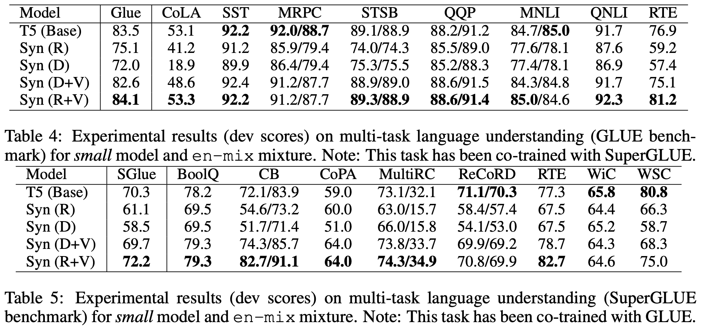
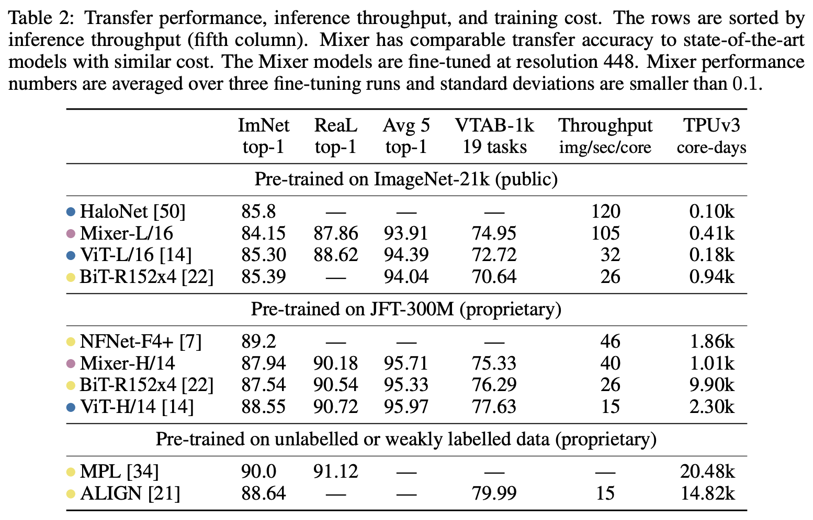

# 也来盘点一些最近的非Transformer工作

> **作者**：苏剑林 | **日期**：2021-05-24 | **来源**：[科学空间](https://www.kexue.fm/archives/8431)

以MLP为主的非Transformer结构试图取代Transformer并获得有竞争力的结果。本文盘点相关论文。

## 核心发现

实际上2020年的**Synthesizer**（Google，Random模式）就已经做了"用可训练参数矩阵替代QK计算Attention矩阵"的实验，效果不错。2021年5月的这波论文本质上是Synthesizer的延续或变体：

- **MLP-Mixer / ResMLP / Stack of FFN**：三者本质相同，都是Synthesizer的Random模式去掉了softmax
- **External Attention**：将K和V设为参数矩阵
- **FNet**：最有趣！用傅里叶变换替代Attention — 将Q,K换成 $[0,1,\cdots,n-1]^\top$，然后用虚指数 $e^{iB}$ 替代实指数的softmax，通过FFT实现 $O(n\log n)$
- **gMLP / aMLP**：为MLP-Mixer加上门控/Attention增强





## 笔者的评价

- 这些工作离成熟还远，不够优雅（无法处理变长输入）
- MLP替代Attention主要为了提速，但理论复杂度仍是 $O(n^2)$
- NLP场景下，这些模型的迁移性往往不如Transformer
- **FNet** 和 **CNN预训练** 两个工作最有启发
- 如果是短序列（<2000），Transformer本身已经是近乎线性的（FFN占主导），换MLP意义不大

---

**转载地址**：https://www.kexue.fm/archives/8431

**引用格式**：苏剑林. (May. 24, 2021). 《也来盘点一些最近的非Transformer工作》[Blog post]. Retrieved from https://www.kexue.fm/archives/8431

```bibtex
@online{kexuefm-8431, title={也来盘点一些最近的非Transformer工作}, author={苏剑林}, year={2021}, month={May}, url={\url{https://www.kexue.fm/archives/8431}}}
```
