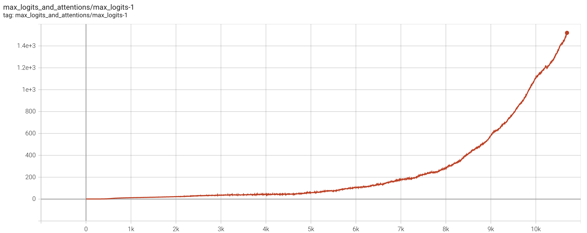
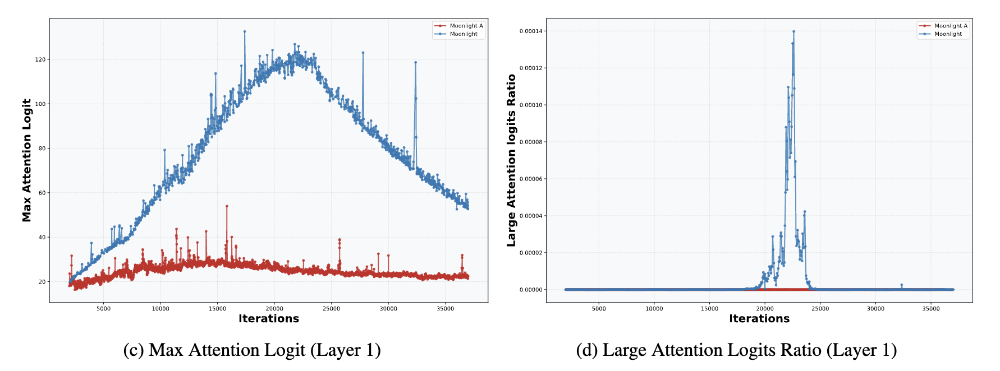
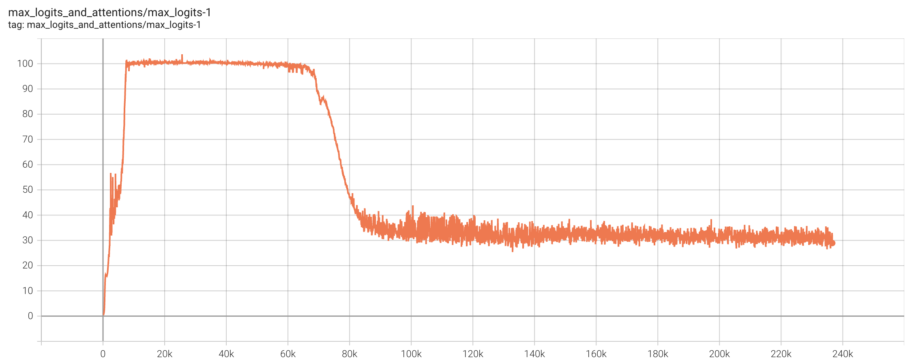
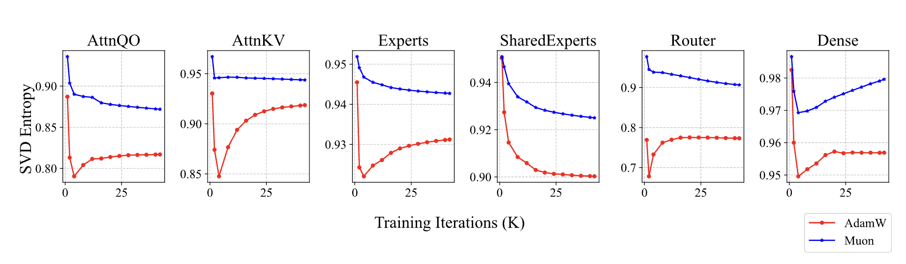

# QK-Clip：让Muon在Scaleup之路上更进一步

> **作者**：苏剑林 | **日期**：2025-07-12 | **来源**：[科学空间](https://www.kexue.fm/archives/11126)

四个月前，我们发布了[Moonlight](https://www.kexue.fm/archives/10739)，在16B的MoE模型上验证了[Muon](https://www.kexue.fm/archives/10592)优化器的有效性。在Moonlight中，我们确认了给Muon添加Weight Decay的必要性，同时提出了通过Update RMS对齐来迁移Adam超参的技巧，这使得Muon可以快速应用于LLM的训练。然而，当我们尝试将Muon进一步拓展到千亿参数以上的模型时，遇到了新的"拦路虎"——MaxLogit爆炸。

为了解决这个问题，我们提出了一种简单但极其有效的新方法，我们称之为"QK-Clip"。该方法从一个非常本质的角度去看待和解决MaxLogit现象，并且无损模型效果，这成为我们最新发布的万亿参数模型"[Kimi K2](https://moonshotai.github.io/Kimi-K2/)"的关键训练技术之一。

## 问题描述

我们先来简单介绍一下MaxLogit爆炸现象。回顾Attention的定义  

$$O = \text{softmax}(QK^\top)V$$

这里省略了缩放因子 $1/\sqrt{d}$，因为它总可以吸收到Q,K的定义中。"MaxLogit爆炸"中的Logit，指的是Softmax前的Attention矩阵，即 $QK^\top$，而MaxLogit指的是全体Logit的最大值，我们将它记为  

$$S_{\max} = \max_{i,j} q_i \cdot k_j$$

这里的max其实还要在batch_size维度上取，最终得到一个标量。而MaxLogit爆炸是指，$S_{\max}$ 随着训练的推进一直往上涨，增长速度是线性甚至是超线性的，并且在相当长的时间内没有稳定的迹象。



MaxLogit爆炸现象

MaxLogit本质上是一个异常值指标，它的爆炸意味着异常值超出了可控范围。具体来说，我们有  

$$|q_i \cdot k_j| \leq \|q_i\| \|k_j\| = \|x_i W_q\| \|x_j W_k\| \leq \|x_i\| \|x_j\| \|W_q\| \|W_k\|$$

由于x通常会加RMSNorm，所以一般情况下 $\|x_i\| \|x_j\|$ 是不会爆炸的，因此MaxLogit爆炸意味着谱范数 $\|W_q\|, \|W_k\|$ 有往无穷大发展的风险，这显然不是一个好消息。

## 已有尝试

Weight Decay能一定程度上预防MaxLogit爆炸，所以小模型出现MaxLogit爆炸的概率很小，即便像Moonlight这样的16B模型，MaxLogit最多涨到120后就自动降下来了。



Moonlight的MaxLogit自动降了下来

换句话说，MaxLogit爆炸更多出现在非常大参数量的模型中。另一个比较直接的思路是直接给Logit加softcap：

$$O = \text{softmax}(\text{softcap}(QK^\top; \tau))V$$

其中 $\text{softcap}(x; \tau) = \tau \tanh(x/\tau)$，由Google的[Gemma2](https://papers.cool/arxiv/2408.00118)引入。由于tanh的有界性，softcap自然是能够保证softcap后的Logit有界的，但无法保证softcap前的Logit是有界的，所以softcap只是将一个问题转化为了另一个问题。

也许Google自己都意识到了这一点，所以在后来的[Gemma3](https://papers.cool/arxiv/2503.19786)中没有用softcap了，而改用"QK-Norm"：

$$O = \text{softmax}(\tilde{Q}\tilde{K}^\top)V, \quad \tilde{Q} = \text{RMSNorm}(Q), \quad \tilde{K} = \text{RMSNorm}(K)$$

QK-Norm确实是压制MaxLogit非常有效的方法，然而它只适用于MHA、GQA等，不适用于MLA，因为QK-Norm需要把Q,K给Materialize出来，但对于MLA来说，它训练阶段跟Decoding阶段的Q,K并不一样，在Decoding阶段没法做QK-Norm。

## 直击目标

期间我们还尝试了一些间接手段，比如单独降低Q,K的学习率、单独增大它们的Weight Decay等，但都不奏效。最接近成功的一次是Partial QK-Norm，对于MLA来说，它的Q,K分为qr、qc、kr、kc四个部分，其中前三部分在Decoding时都是可以Materialize的，所以我们给这三部分都加上RMSNorm，结果是可以压制MaxLogit，但长度激活效果非常糟糕。

在失败多次之后，我们不禁开始反思：前面我们的尝试其实都只是压制MaxLogit的"间接手段"，真正能保证解决MaxLogit爆炸的直接手段是什么？终于，某天福至心灵之下，笔者总算反应过来：**MaxLogit本身就是触发缩放的最直接信号！**具体来说，当MaxLogit超过期望阈值 $\tau$ 时，我们直接给 $QK^\top$ 乘上 $\gamma = \tau/S_{\max}$，那么新的MaxLogit肯定就不超过 $\tau$ 了。乘 $\gamma$ 的操作，我们可以分别吸收到权重QK的权重上去，于是我们得到初版QK-Clip：

$$W_t = \text{Optimizer}(W_{t-1}, G_t)$$
$$\text{if } S_{\max}^{(l)} > \tau \text{ and } W \in \{W_q^{(l)}, W_k^{(l)}\}: \quad W_t \leftarrow W_t \times \tau/S_{\max}^{(l)}$$

## 精细调整

初版QK-Clip确实已经能成功压制MLA的MaxLogit，但经过仔细观察模型的"内科"后，我们发现它会出现"过度裁剪"的问题。

我们知道，不管哪种Attention变体都有多个Head，一开始我们是每一层Attention只监控一个MaxLogit指标，所有Head的Logit是放在一起取Max的，这导致QK-Clip也是所有Head一起Clip的。然而，当我们分别监控每个Head的MaxLogit后发现，实际上每层只有为数不多的Head会出现MaxLogit爆炸，如果所有Head按同一个比例来Clip，那么大部份Head都是被"无辜受累"的了。

所以，为了避免"殃及池鱼"，我们应该Per-Head地进行监控MaxLogit和QK-Clip。不过这里边又隐藏了另一个魔鬼细节：初版QK-Clip是将Clip因子平摊到Q,K上的，但是MLA的Q,K有qr、qc、kr、kc四部分，其中kr是所有Head共享的，如果对它Clip，那么同样会有"殃及池鱼"的问题。因此，对于(qr, kr)，我们应该只Clip到qr上去。

经过上述调整，最终版的QK-Clip为

$$W_t = \text{Optimizer}(W_{t-1}, G_t)$$
$$\text{if } S_{\max}^{(l,h)} > \tau:$$
$$\quad \text{if } W \in \{W_{qc}^{(l,h)}, W_{kc}^{(l,h)}\}: \quad W_t \leftarrow W_t \times \tau/S_{\max}^{(l,h)}$$
$$\quad \text{elif } W \in \{W_{qr}^{(l,h)}\}: \quad W_t \leftarrow W_t \times \tau/S_{\max}^{(l,h)}$$

## 扩展之路

在Kimi K2的训练中，我们设置阈值 $\tau$ 为100，总训练步数约为220k steps，从大致7k steps开始，就出现了MaxLogit超过 $\tau$ 的Head，此后在相当长的时间内，Muon Update和QK-Clip都在"拉锯战"。有趣的是，70k steps之后，所有Head的MaxLogit都主动降低到了100以下，QK-Clip不再生效。



经过接近70k steps的Muon和QK-Clip拉锯战后，MaxLogit主动降了下来

这表明，在Weight Decay的作用下，只要我们能稳住训练，模型最后很可能都会主动将MaxLogit降下来，QK-Clip的作用，正是帮助模型更平稳地度过训练初期。

## 原因思考

为什么Muon更容易导致MaxLogit爆炸呢？

Muon和Adam的区别是什么？Muon给出的更新量是经过msign运算的，所有奇异值都相等，即它的有效秩是**满秩**；而一般情况下的矩阵，奇异值通常都是有大有小，并且以前面几个奇异值为主，从有效秩的角度看它们是**低秩**的。

用公式来说，我们设参数 $W_{t-1}$ 的SVD为 $\sum_i \sigma_i u_i v_i^\top$，Muon更新量的SVD为 $\sum_j \bar{\sigma} \bar{u}_j \bar{v}_j^\top$，Adam更新量的SVD为 $\sum_j \tilde{\sigma}_j \tilde{u}_j \tilde{v}_j^\top$，那么  

$$W_t = \sum_i \sigma_i u_i v_i^\top + \sum_j \bar{\sigma} \bar{u}_j \bar{v}_j^\top \quad \text{(Muon)}$$
$$W_t = \sum_i \sigma_i u_i v_i^\top + \sum_j \tilde{\sigma}_j \tilde{u}_j \tilde{v}_j^\top \quad \text{(Adam)}$$

很明显，如果奇异向量对 $u_i v_i^\top$ 跟某个 $\bar{u}_j \bar{v}_j^\top$ 或 $\tilde{u}_j \tilde{v}_j^\top$ 很接近，那它们将会直接叠加起来，从而增大 $W_t$ 的奇异值。由于Muon的更新量是满秩的，所以它与 $W_{t-1}$ 的"碰撞几率"会远大于Adam的，所以Muon更容易增大参数的奇异值。



Muon与Adam训练的模型权重奇异值熵（等价于有效秩）比较

## 文章小结

本文提出了QK-Clip，它是MaxLogit爆炸问题的一种新思路，跟QK-Norm不同，它是对Q、K权重的一种事后调整方案，并不改变模型的前向计算，因此适用性更广，它是"Muon + MLA"组合在超大规模训练上的重要稳定策略，也是我们最新发布的万亿模型Kimi K2的关键技术之一。

---

**转载地址**：https://www.kexue.fm/archives/11126

**引用格式**：

苏剑林. (Jul. 12, 2025). 《QK-Clip：让Muon在Scaleup之路上更进一步》[Blog post]. Retrieved from https://www.kexue.fm/archives/11126

```bibtex
@online{kexuefm-11126,
  title={QK-Clip：让Muon在Scaleup之路上更进一步},
  author={苏剑林},
  year={2025},
  month={Jul},
  url={\url{https://www.kexue.fm/archives/11126}},
}
```
