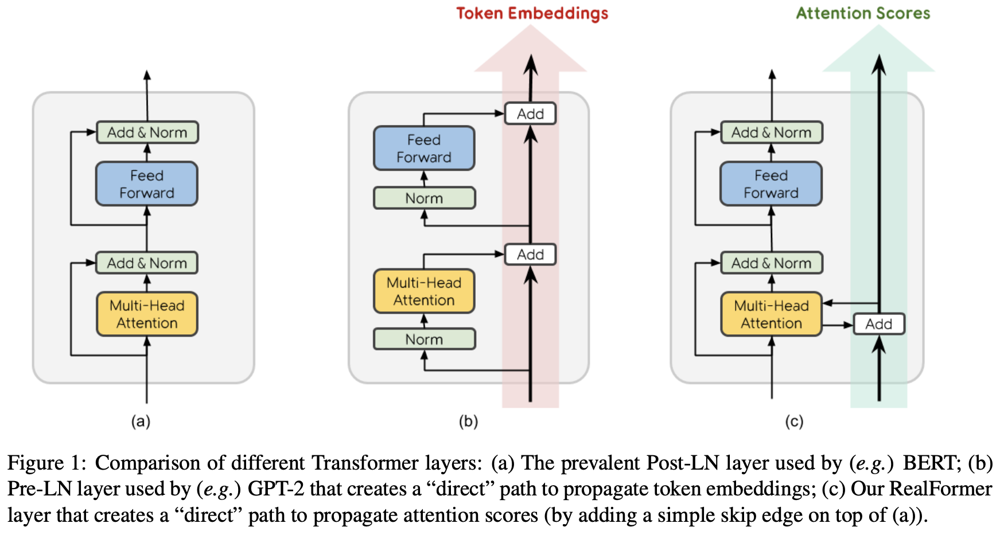
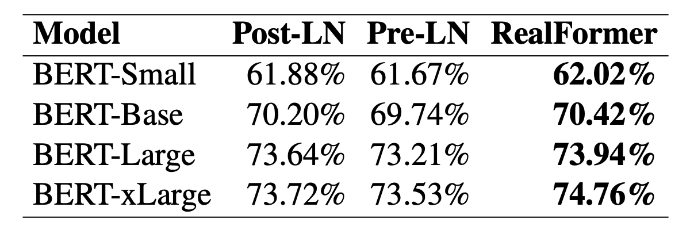
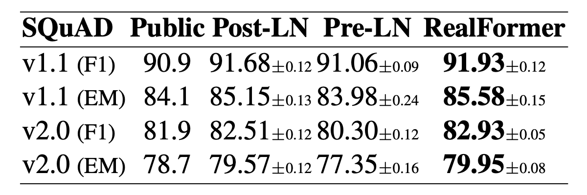
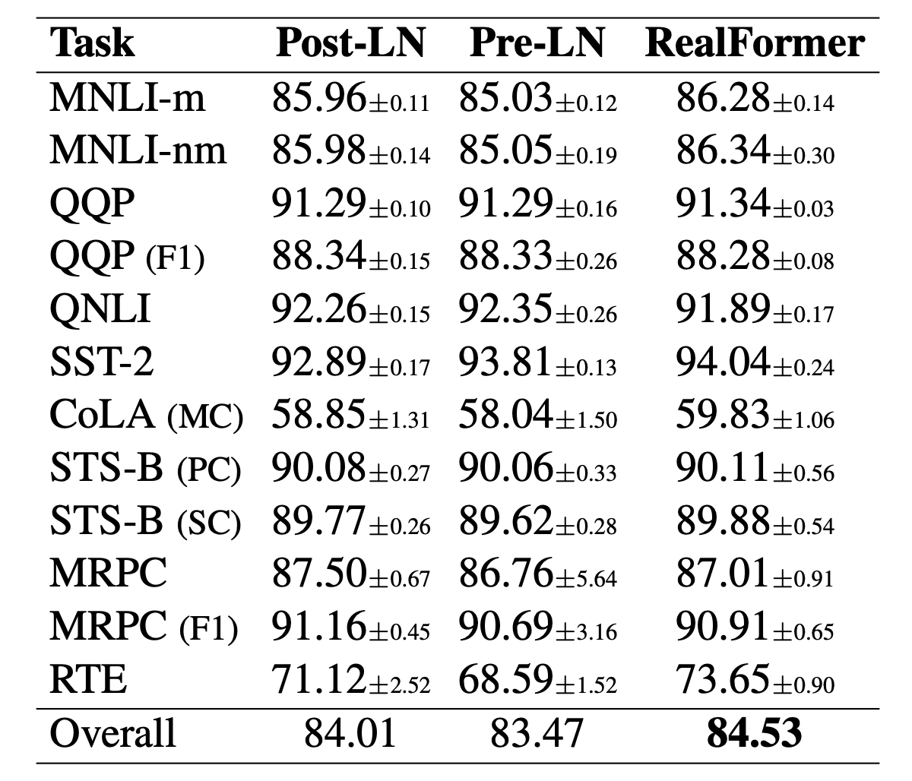
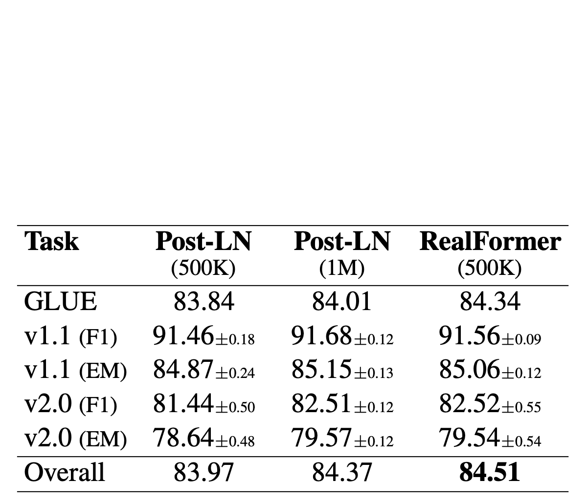

# RealFormer：把残差转移到Attention矩阵上面去

> **作者**：苏剑林 | **日期**：2020-12-24 | **来源**：[科学空间](https://www.kexue.fm/archives/8027)

大家知道Layer Normalization是Transformer模型的重要组成之一，它的用法有PostLN和PreLN两种，论文[《On Layer Normalization in the Transformer Architecture》](https://papers.cool/arxiv/2002.04745)中有对两者比较详细的分析。简单来说，就是PreLN对梯度下降更加友好，收敛更快，对训练时的超参数如学习率等更加鲁棒等，反正一切都好但就有一点硬伤：PreLN的性能似乎总略差于PostLN。最近Google的一篇论文[《RealFormer: Transformer Likes Residual Attention》](https://papers.cool/arxiv/2012.11747)提出了RealFormer设计，成功地弥补了这个Gap，使得模型拥有PreLN一样的优化友好性，并且效果比PostLN还好，可谓"鱼与熊掌兼得"了。

## 形式

RealFormer全称为"**Re**sidual Attention **L**ayer Trans**former**"，即"残差式Attention层的Transformer模型"，顾名思义就是把残差放到了Attention里边了。

关于这个名字，还有个小插曲。这篇博客发布的时候，RealFormer其实叫做Informer，全称为"Res**i**dual Atte**n**tion Trans**former**"，原论文名为[《Informer: Transformer Likes Informed Attention》](https://papers.cool/arxiv/2012.11747v1)，显然从Informer这个名字我们很难想象它的全称，为此笔者还吐槽了Google在起名方面的生硬和任性。隔了一天之后，发现它改名为RealFormer了，遂做了同步。不知道是因为作者大佬看到了笔者的吐槽，还是因为Informer这个名字跟再早几天的一篇论文[《Informer: Beyond Efficient Transformer for Long Sequence Time-Series Forecasting》](https://papers.cool/arxiv/2012.07436)重名了，哈哈～



PostLN、PreLN和RealFormer结构示意图

说回模型，如上图所示，RealFormer主要是把残差放到了Attention矩阵上面了，而整体依然保持了PostLN的结构，因此既保持了PostLN的性能，又融合了残差的友好。具体来说，就是原来第n层的Attention为  

$$\text{Attention}(Q_n, K_n, V_n) = \text{softmax}(A_n)V_n, \quad A_n = \frac{Q_n K_n^\top}{\sqrt{d_k}}$$

现在改为了  

$$\text{Attention}(Q_n, K_n, V_n) = \text{softmax}(A_n)V_n, \quad A_n = \frac{Q_n K_n^\top}{\sqrt{d_k}} + A_{n-1}$$

而已。全文终。

## 实验

当然，那么快就"全文终"是不可能的，好歹也得做做实验看看效果，但只看改动的话，确实已经终了，就那么简单。原论文做的实验很多，基本上所有的实验结果都显示在效果上：  

RealFormer ≥ PostLN ≥ PreLN

看来，这次PostLN也许真的可以退场了。部分实验结果如下：



MLM准确率对比



SQuAD评测对比



GLUE评测对比



不同训练步数效果对比

值得特别指出的是第一张图和第四张图。从第一张图我们可以看到，对于RealFormer结构，加大模型规模（large到xlarge）可以带来性能的明显提升，而ALBERT论文曾经提到加大BERT的模型规模并不能带来明显受益，结合两者说明这可能是PostLN的毛病而不是BERT的固有毛病，换成RealFormer可以改善这一点。从第四张图我们可以看到，RealFormer结构训练50万步，效果就相当于PostLN训练100万步，这表明RealFormer有着很高的训练效率。

除了上述实验外，论文还对比了不同学习率、不同Dropout比例的效果，表明RealFormer确实对这些参数是比较鲁棒的。原论文还分析了RealFormer的Attention值分布，表明RealFormer的Attention结果更加合理。

## 分析

这一节我们对RealFormer做一个简单的思考分析。

RealFormer对梯度下降更加友好，这不难理解，因为 $A_n = \frac{Q_n K_n^\top}{\sqrt{d_k}} + A_{n-1}$ 的设计确实提供了一条直通路，使得第一层的Attention能够直通最后一层，自然就没有什么梯度消失的风险了。相比之下，PostLN是LayerNorm(x+f(x))的结构，看上去x+f(x)防止了梯度消失，但是LayerNorm这一步会重新增加了梯度消失风险，造成的后果是初始阶段前面的层梯度很小，后面的层梯度很大，如果用大学习率，后面的层容易崩，如果用小学习率，前面的层学不好，因此PostLN更难训练，需要用小的学习率加warmup慢慢训。

那么PreLN改善了梯度状况，为什么又比不上PostLN呢？按照笔者的猜测，PreLN每一步都是x+f(x)的形式，到了最后一层就变成了x+f_1(x)+f_2(x)+⋯+f_n(x)的形式，一层层累加，可能导致数值和方差都很大，所以最后"迫不得已"会强制加一层Layer Norm让输出稳定下来。这样，尽管PreLN改善了梯度状况，但它本身设计上就存在一些不稳定因素，也许这就是它效果略差的原因。

事实上，很早就有人注意到残差的这个特点会造成不稳定，笔者之前研究GAN的时候，就发现[《Which Training Methods for GANs do actually Converge?》](https://papers.cool/arxiv/1801.04406)一文中的实现就把x+f(x)换成了x+0.1f(x)。受到他们实现的启发，笔者也试过将x+f(x)换成x+αf(x)，其中α是初始化为0的可训练标量参数，也取得不错的效果。今年年初的论文[《ReZero is All You Need: Fast Convergence at Large Depth》](https://papers.cool/arxiv/2003.04887)则正式地提出了这个方法，命名为ReZero，里边的实验表明用ReZero可以干脆去掉Layer Norm。遗憾的是，ReZero的论文没有对Transformer做更多的实验，而RealFormer也没有比较它与ReZero的效果差别。

读者可能会反驳，既然PreLN存在问题，那RealFormer的 $A_n = \frac{Q_n K_n^\top}{\sqrt{d_k}} + A_{n-1}$ 不也是存在同样的叠加问题吗？如果只看A，那么确实会有这样的问题，但别忘了A后面还要做个softmax归一化后才参与运算，也就是说，模型对矩阵A是自带归一化功能的，所以它不会有数值发散的风险。而且刚刚相反，随着层数的增加，A的叠加会使得A的元素绝对值可能越来越大，Attention逐渐趋于one hot形式，造成后面的层梯度消失，但是别忘了，我们刚才说PostLN前面的层梯度小后面的层梯度大，而现在也进一步缩小了后面层的梯度，反而使得两者更同步从而更好优化了；另一方面，Attention的概率值可能会有趋同的趋势，也就是说Attention的模式可能越来越稳定，带来类似ALBERT参数共享的正则化效应，这对模型效果来说可能是有利的。同时，直觉上来想，用RealFormer结构去做[FastBERT](https://papers.cool/arxiv/2004.02178)之类的自适应层数的改进，效果会更好，因为RealFormer的Attention本身会有趋同趋势，更加符合FastBERT设计的出发点。

此外，我们也可以将RealFormer理解为还是使用了常规的残差结构，但是残差结构只用在Q,K而没有用在V上：  

$$\text{Attention}(Q_n, K_n, V_n) = \text{softmax}(A_n)V_n$$
$$A_n = \tilde{Q}_n \tilde{K}_n^\top / \sqrt{d_k}, \quad \tilde{Q}_n = Q_n + \tilde{Q}_{n-1}, \quad \tilde{K}_n = K_n + \tilde{K}_{n-1}$$

这在一定程度上与 $A_n = \frac{Q_n K_n^\top}{\sqrt{d_k}} + A_{n-1}$ 是等价的，而PreLN相当于Q,K,V都加了残差。为啥V"不值得"一个残差呢？从近来的一些相对位置编码的改进中，笔者发现似乎有一个共同的趋势，那就是去掉了V的偏置，比如像NEZHA的相对位置编码，是同时在Attention矩阵（即Q,K）和V上施加的，而较新的XLNET和T5的相对位置编码则只施加在Attention矩阵上，所以，似乎去掉V的不必要的偏置是一个比较好的选择，而RealFormer再次体现了这一点。

## 总结

本文介绍了Google对Transformer的新设计RealFormer，并给出了笔者自己的思考分析。实验结果表明，RealFormer同时有着PostLN和PreLN的优点，甚至比两者更好，是一个值得使用的改进点。

---

**转载地址**：https://www.kexue.fm/archives/8027

**引用格式**：

苏剑林. (Dec. 24, 2020). 《RealFormer：把残差转移到Attention矩阵上面去》[Blog post]. Retrieved from https://www.kexue.fm/archives/8027

```bibtex
@online{kexuefm-8027,  
  title={RealFormer：把残差转移到Attention矩阵上面去},  
  author={苏剑林},  
  year={2020},  
  month={Dec},  
  url={\url{https://www.kexue.fm/archives/8027}},  
}
```
