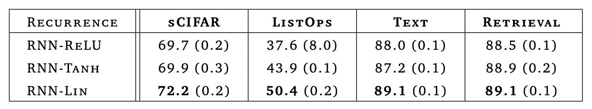
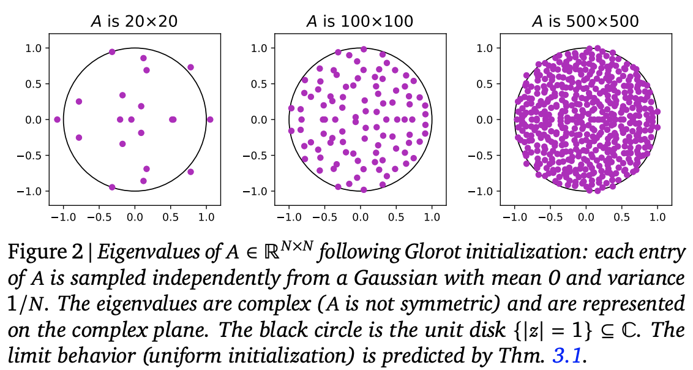
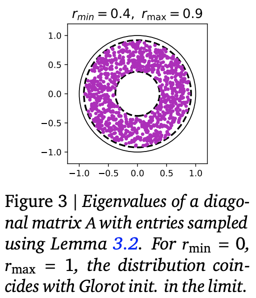
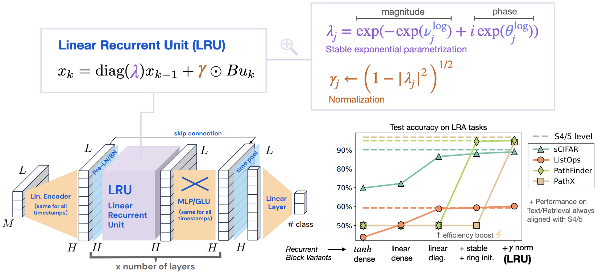
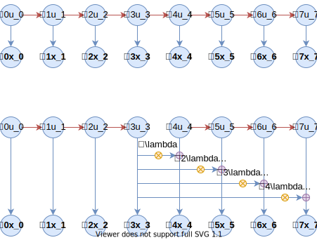

# Google新作试图"复活"RNN：RNN能否再次辉煌？

> **作者**：苏剑林 | **日期**：2023-03-28 | **来源**：[科学空间](https://www.kexue.fm/archives/9554)

当前，像ChatGPT之类的LLM可谓是"风靡全球"。有读者留意到，几乎所有LLM都还是用最初的[Multi-Head Scaled-Dot Attention](https://www.kexue.fm/archives/4765)，近年来大量的Efficient工作如[线性Attention](https://www.kexue.fm/archives/7546)、[FLASH](https://www.kexue.fm/archives/8934)等均未被采用。是它们版本效果太差，还是根本没有必要考虑效率？其实答案笔者在[《线性Transformer应该不是你要等的那个模型》](https://www.kexue.fm/archives/8610)已经分析过了，只有序列长度明显超过hidden size时，标准Attention才呈现出二次复杂度，在此之前它还是接近线性的。

那么，真有数万甚至数十万长度的序列处理需求时，我们又该用什么模型呢？近日，Google的一篇论文[《Resurrecting Recurrent Neural Networks for Long Sequences》](https://papers.cool/arxiv/2303.06349)重新优化了RNN模型，特别指出了RNN在处理超长序列场景下的优势。那么，RNN能否再次辉煌？

## 线性化

文章提出的RNN叫做LRU（Linear Recurrent Unit，线性循环单元），它是既可以并行又可以串行的极简线性RNN，训练和推断都具备高效的优势。LRU跟SSM、RWKV等工作有颇多相似之处。

最简单的RNN可以写为 $x_t = f(Ax_{t-1} + u_t)$，其中 $x_t, u_t\in\mathbb{R}^d, A\in\mathbb{R}^{d\times d}$，$f$ 是激活函数。传统认知中激活函数是非线性的，然而作者发现，如果将Transformer的Self Attention替换为RNN的话，**线性RNN效果才是最好的**。



*在LRA的各个任务上，线性RNN反而是最好的*

## 对角化

去掉激活函数，RNN简化为 $x_t = Ax_{t-1} + u_t$，反复迭代得到

$$x_t = \sum_{k=0}^{t} A^{t-k} u_k$$

这时候不难联想到矩阵对角化。几乎所有矩阵都可以在复数域对角化：$A = P\Lambda P^{-1}$，这意味着只要我们将一切运算在复数域中考虑，那么将线性RNN中的一般矩阵 $A$ 换成对角阵 $\Lambda$，模型能力不会有任何损失！

$$x_t = \Lambda x_{t-1} + u_t \quad\Rightarrow\quad x_t = \sum_{k=0}^{t} \Lambda^{t-k} u_k$$

## 参数化

对角矩阵的好处是一切运算都是element-wise的。不妨设 $\Lambda = \text{diag}(\lambda_1,\lambda_2,\cdots,\lambda_d)$，且 $\lambda$ 是复数，设 $\lambda = re^{i\theta}$，其中 $r\ge 0, \theta\in[0,2\pi)$：

$$x_t = \sum_{k=0}^{t} r^{t-k}e^{i(t-k)\theta}u_k$$

$r\le 1$ 以防止梯度爆炸，$r$ 初始化阶段应尽量接近1预防梯度消失。为此设 $r = e^{-\nu}$，$\nu = e^{\nu_{\log}}$，同时 $\theta = e^{\theta_{\log}}$。

## 初始化

Glorot初始化矩阵的特征值大致均匀分布在复平面上的单位圆内：



*Glorot初始化的矩阵的特征值均匀分布在单位圆盘内*

为了预防梯度消失，改进为在 $r\in[r_{\min}, r_{\max}]$ 的圆环内均匀采样。原论文实验显示 $r_{\min}=0.9, r_{\max}=0.999$ 效果较好。



*改为圆环初始化，大部分任务的效果更好*

另外，为了解决 $r$ 接近1时输出膨胀的问题，引入参数 $\gamma$，初始化为 $\sqrt{1-r^2}$：

$$x_t = \lambda x_{t-1} + \gamma u_t \quad\Rightarrow\quad x_t = \gamma\sum_{k=0}^{t}\lambda^{t-k}u_k$$



*LRU模型示意图*

## 并行化

LRU的一个重要特性是它本身有并行算法。利用分解（$T>t$）：

$$x_T = \sum_{k=0}^{T}\lambda^{T-k}u_k = \lambda^{T-t}\sum_{k=0}^{t}\lambda^{t-k}u_k + \sum_{k=t+1}^{T}\lambda^{T-k}u_k$$

这等价于将序列分为两半各自计算，然后将前一半的最后一个结果加权到后一半各个位置上：



*线性RNN的并行递归分解*

这就是Prefix Sum问题的"Upper/Lower"并行算法，将原本是 $O(L)$ 的循环步数改为了 $O(\log L)$。

## 实验效果

从效果上排序：$GAU > SA > RWKV > LRU > SLRU$

从实验结果可以得出：
1. LRU优于SLRU，表明引入复投影矩阵和复特征值确实有帮助
2. 当序列长度增加时，Attention系列效果会变好，而RNN系列则会下降——这是两者的本质差异
3. RWKV确实有可能是目前最好的RNN模型，但跟Attention类还有明显差距
4. RNN系列需要追平Attention系列，可能需要在LM任务上继续放大hidden_size

所以总的来说，经过优化的RNN模型在训练效率上并不逊色于Attention类模型，同时有着更好的推理效率，但在语言模型效果上跟Attention还有差距。

---

**转载地址**：https://www.kexue.fm/archives/9554

**引用格式**：

苏剑林. (Mar. 28, 2023). 《Google新作试图"复活"RNN：RNN能否再次辉煌？》[Blog post]. Retrieved from https://www.kexue.fm/archives/9554

```bibtex
@online{kexuefm-9554,
  title={Google新作试图"复活"RNN：RNN能否再次辉煌？},
  author={苏剑林},
  year={2023},
  month={Mar},
  url={\url{https://www.kexue.fm/archives/9554}},
}
```
