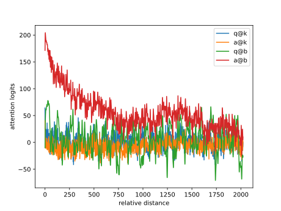
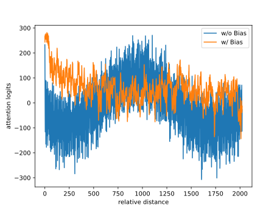

# Bias项的神奇作用：RoPE + Bias = 更好的长度外推性

> **作者**：苏剑林 | **日期**：2023-04-03 | **来源**：[科学空间](https://www.kexue.fm/archives/9577)

万万没想到，Bias项能跟Transformer的长度外推性联系在一起！

长度外推性是我们希望Transformer具有的一个理想性质，笔者曾在[《Transformer升级之路：7、长度外推性与局部注意力》](https://www.kexue.fm/archives/9431)、[《Transformer升级之路：8、长度外推性与位置鲁棒性》](https://www.kexue.fm/archives/9444)系统地介绍过这一问题。至于Bias项（偏置项），目前的主流观点是当模型足够大时，Bias项不会有什么特别的作用，所以很多模型选择去掉Bias项。

那么，这两个看上去"风牛马不相及"的东西，究竟是怎么联系起来的呢？且听笔者慢慢道来。

## 隐藏彩蛋

笔者在重温GAU论文时，发现了加性相对位置编码的"隐藏彩蛋"：

$$q_m^\top R_m^\top R_n k_n \to q_m^\top R_m^\top R_n k_n + a^\top R_m^\top R_n b$$

其中 $R_m, R_n$ 是RoPE的旋转矩阵，$a, b$ 是两个可学习参数。可以证明，当 $a=b=[\lambda,0,\lambda,0,\cdots,\lambda,0]^\top$ 时，结果正好是能改善长度外推性的Sandwich，其原理是 $a^\top R_m^\top R_n b$ 呈现出关于 $|m-n|$ 递减的趋势，加到注意力矩阵上能够起到局部化注意力的作用。

## 换成偏置

然而，往Attention矩阵额外加一项来增强长度外推性的方案都不够优雅。笔者考虑，如果 $a, b$ 分别是 $q_m, k_n$ 的Bias项，或许可以起到类似的效果：

$$q_m^\top R_m^\top R_n k_n \to (q_m + a)^\top R_m^\top R_n (k_n + b)$$

展开后：

$$q_m^\top R_m^\top R_n k_n + a^\top R_m^\top R_n k_n + q_m^\top R_m^\top R_n b + a^\top R_m^\top R_n b$$

由于 $q_m, k_n$ 比较"各向同性"，第二项和第三项的期望应为0，而第一项和第四项正是我们想要的。

## 实验结果

语言模型任务，模型架构：[GAU-α](https://www.kexue.fm/archives/9052)，训练长度512。

| 不同测试长度下的LM准确率 | 512 | 1024 | 2048 | 4096 |
|-------------------------|------|------|------|------|
| w/o Bias | 52.37% | 33.15% | 22.85% | 17.87% |
| **w/ Bias** | **52.75%** | **50.99%** | **45.25%** | **39.55%** |

Bias项确实不怎么影响训练效果（512长度），但却在长度外推性上面明显拉开了差距！



*加上Bias后四项内积对比*

可以看到，第4项确确实实呈现衰减趋势，并且其大小占据了主导地位。



*有无Bias的Attention矩阵对比*

没有Bias的模型（蓝色），Attention在训练长度范围内也呈现衰减趋势，但长度增加后就上升了，没有明显的局部性；带有Bias项的模型（橙色）的注意力矩阵呈现更明显的衰减趋势，局部化效应更强，从而有更好的外推性能。

【注：后来经过反复测试发现，此篇文章的长度外推结果可复现性比较不稳定（可能跟模型结构、超参数等紧密相关），请自行斟酌使用。】

## 延伸思考

之前做长度外推性的工作如ALIBI和XPOS都是没有加Bias项的，而KERPLE和Sandwich则是加了Bias项的。现在可以肯定KERPLE和Sandwich中的RoPE外推效果更好不是错觉了。

关于"Key的Bias可以去掉"的结论，是针对没有RoPE的Attention的（由于Softmax的存在，加上的bias可以约掉）。但经过RoPE后，$b$ 也算是 $m,n$ 的函数了，实际上是无法约掉的，因此对于加了RoPE的模型，Bias项去掉前后会有不一样的效果。

## 文章小结

本文分享了笔者发现的一个"万万没想到"的有趣结论：Bias项能增强RoPE模型的长度外推性！看似毫无存在感的Bias项，居然能跟Transformer的长度外推性联系在一起，让人不得不感叹细节的重要性。

---

**转载地址**：https://www.kexue.fm/archives/9577

**引用格式**：

苏剑林. (Apr. 03, 2023). 《Bias项的神奇作用：RoPE + Bias = 更好的长度外推性》[Blog post]. Retrieved from https://www.kexue.fm/archives/9577

```bibtex
@online{kexuefm-9577,
  title={Bias项的神奇作用：RoPE + Bias = 更好的长度外推性},
  author={苏剑林},
  year={2023},
  month={Apr},
  url={\url{https://www.kexue.fm/archives/9577}},
}
```
