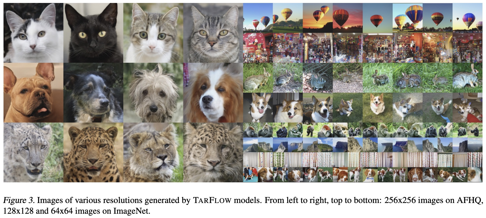
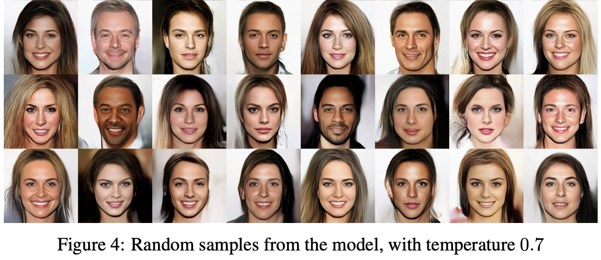
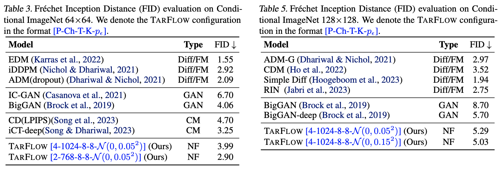

# 细水长flow之TARFLOW：流模型满血归来？

> **作者**：苏剑林 | **日期**：2025-01-17 | **来源**：[科学空间](https://www.kexue.fm/archives/10667)

不知道还有没有读者对这个系列有印象？这个系列取名"细水长flow"，主要介绍flow模型的相关工作，起因是当年（2018年）OpenAI发布了一个新的流模型[Glow](https://www.kexue.fm/archives/5807)，在以GAN为主流的当时来说着实让人惊艳了一番。但惊艳归惊艳，事实上在相当长的时间内，Glow及后期的一些改进在生成效果方面都是比不上GAN的，更不用说现在主流的扩散模型了。

不过局面可能要改变了，上个月的论文[《Normalizing Flows are Capable Generative Models》](https://papers.cool/arxiv/2412.06329)提出了新的流模型TARFLOW，它在几乎在所有的生成任务效果上都逼近了当前SOTA，可谓是流模型的"满血"回归。

## 写在前面

这里的流模型，特指Normalizing Flow，是指模型架构具有可逆特点、以最大似然为训练目标、能实现一步生成的相关工作，当前扩散模型的分支Flow Matching不归入此列。

TARFLOW的生成画风是这样的：



TARFLOW的生成效果

相比之下，此前Glow的生成画风是这样的：



Glow的生成效果

从数据上看，它的表现也逼近模型的最佳表现，超过了GAN的SOTA代表BigGAN：



TARFLOW与其他模型的定量对比

要知道，流模型天然就是一步生成模型，并且不像GAN那样对抗训练，它也是单个损失函数训练到底，某种程度上它的训练比扩散模型还简单。所以，TARFLOW把流模型的效果提升了上来，意味着它同时具备了GAN和扩散模型的优点，同时还有自己独特的优势（可逆、可以用来估计对数似然等）。

## 模型回顾

流模型和GAN都是希望得到一个确定性函数 $x = g_\theta(z)$，将随机噪声 $z \sim \mathcal{N}(0, I)$ 映射到目标分布的图片x，用概率分布的语言说，就是用如下形式的分布来建模目标分布：

$$q_\theta(x) = \int \delta(x - g_\theta(z)) q(z) dz$$

流模型通过设计适当的 $g_\theta(z)$，让积分可以直接算出来。设 $y = g_\theta(z)$，其逆函数为 $z = f_\theta(y)$，那么

$$-\log q_\theta(x) = -\log q(f_\theta(x)) - \log \left|\det \frac{\partial f_\theta(x)}{\partial x}\right|$$

这表明，将积分算出来需要两个条件：一、需要知道 $x = g_\theta(z)$ 的逆函数 $z = f_\theta(x)$；二、需要计算雅可比矩阵 $\frac{\partial f_\theta(x)}{\partial x}$ 的行列式。

## 仿射耦合

为此，流模型提出了一个关键设计——"仿射耦合层"：

$$h_1 = x_1, \quad h_2 = \exp(\gamma(x_1)) \otimes x_2 + \beta(x_1)$$

仿射耦合层是可逆的，其逆为

$$x_1 = h_1, \quad x_2 = \exp(-\gamma(h_1)) \otimes (h_2 - \beta(h_1))$$

仿射耦合层的雅可比矩阵是一个下三角阵，其行列式绝对值对数等于 $\gamma(x_1)$ 的各分量之和。

## 核心改进

TARFLOW留意到仿射耦合层可以推广到多块划分，即将x分成更多份 $[x_1, x_2, \cdots, x_n]$，然后按照类似的规则运算

$$h_1 = x_1, \quad h_k = \exp(\gamma_k(x_{<k})) \otimes x_k + \beta_k(x_{<k})$$

其中 $k > 1$，$x_{<k} = [x_1, x_2, \cdots, x_{k-1}]$。

到了Transformer时代，情况截然不同了。Transformer的输入本质上是一个无序的向量集合，不依赖局部相关性，因此以Transformer为主架构，就可以选择在空间维度划分，这就是Patchify。此外，$h_k = \cdots(x_{<k})$ 形式意味着这是一个Causal模型，也正好可以用Transformer高效实现。

所以，多块仿射耦合层跟Transformer可谓是"一拍即合"、"相得益彰"，这就是TARFLOW前三个字母TAR的含义（Transformer AutoRegressive Flow），也是它的核心改进。

## 加噪去噪

流模型常用的一个训练技巧是加噪，也就是往图片加入微量噪声后再送入模型进行训练。TARFLOW提出的是去噪。如果 $q_\theta(x)$ 是加噪 $\mathcal{N}(0, \sigma^2 I)$ 训练后的概率密度函数，那么

$$r(x) = x + \sigma^2 \nabla_x \log q_\theta(x)$$

就是去噪模型的理论最优解。所以有了 $q_\theta(x)$ 后，就不用另外训练去噪模型了。

综上所述，TARFLOW完整的采样流程是

$$z \sim \mathcal{N}(0, I), \quad y = g_\theta(z), \quad x = y + \sigma^2 \nabla_y \log q_\theta(y)$$

## 延伸思考

需要指出的是，TARFLOW虽然效果上达到了SOTA，但它采样速度实际上不如我们期望。我们仔细观察耦合层的逆就会发现，它实际上是一个非线性RNN！非线性RNN只能串行计算，这就是它慢的根本原因。

换句话说，TARFLOW实际上是一个训练快、采样慢的模型，这是分多块的仿射耦合层的缺点，也是TARFLOW想要进一步推广的主要改进方向。

## 文艺复兴

近年来，已经有不少工作尝试结合当前最新的认知，来反思和改进一些看起来已经落后的模型，并得到了一些新的结果。除了TARFLOW试图让流模型重新焕发活力外，最近还有对GAN的各种排列组合去芜存菁，得到了同样有竞争力的结果。更早一些，还有让ResNet更上一层楼的工作，甚至还有让VGG经典再现的RepVGG。当然，SSM、线性Attention等工作也不能不提，它们代表着RNN的"文艺复兴"。

期待这种百花齐放的"复兴"潮能更热烈一些，它能让我们获得对模型更全面和准确的认知。

---

**转载地址**：https://www.kexue.fm/archives/10667

**引用格式**：

苏剑林. (Jan. 17, 2025). 《细水长flow之TARFLOW：流模型满血归来？》[Blog post]. Retrieved from https://www.kexue.fm/archives/10667

```bibtex
@online{kexuefm-10667,
  title={细水长flow之TARFLOW：流模型满血归来？},
  author={苏剑林},
  year={2025},
  month={Jan},
  url={\url{https://www.kexue.fm/archives/10667}},
}
```
