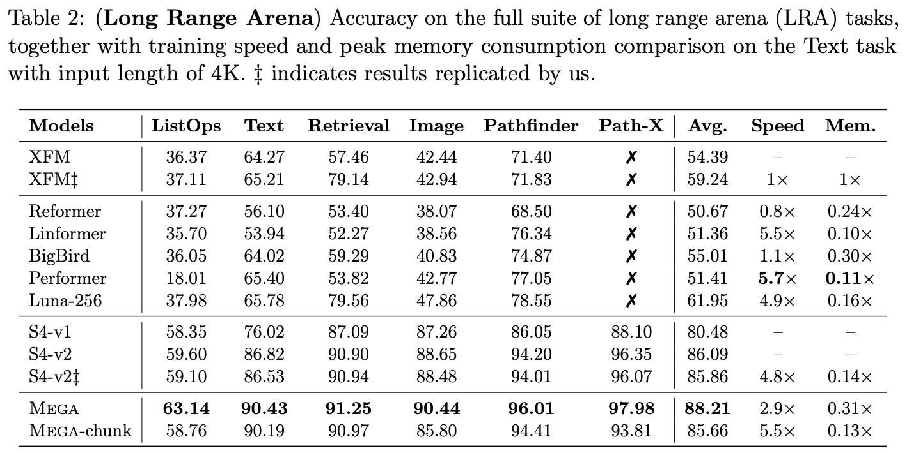
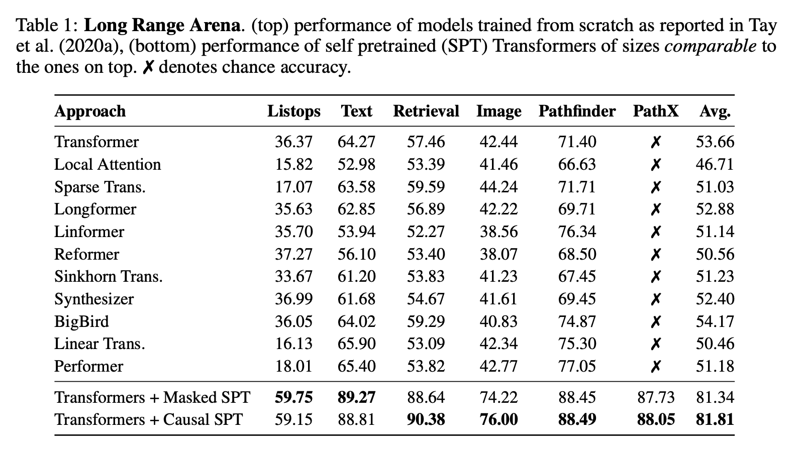
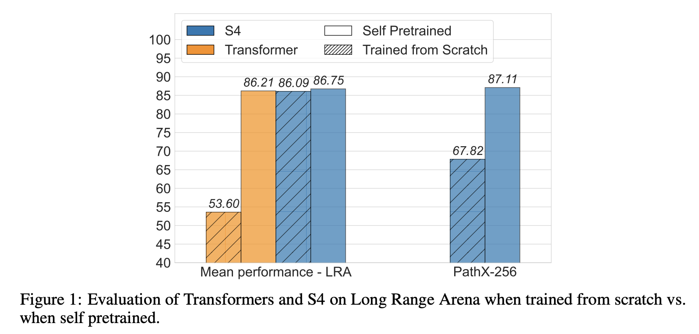
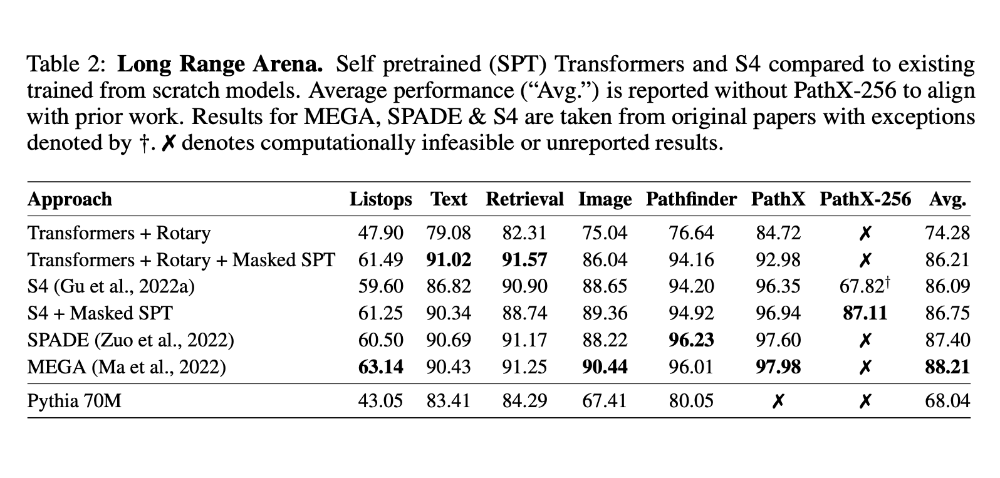

# 预训练一下，Transformer的长序列成绩还能涨不少！

> **作者**：苏剑林 | **日期**：2023-10-08 | **来源**：[科学空间](https://www.kexue.fm/archives/9787)

作为LLM的主流模型架构，Transformer在各类任务上的总体表现都出色，大多数情况下，Transformer的槽点只是它的平方复杂度，而不是效果——除了一个名为Long Range Arena（下面简称LRA）的Benchmark。一直以来，LRA一直是线性RNN类模型的"主场"，与之相比Transformer在上面有明显的差距，以至于让人怀疑这是否就是Transformer的固有缺陷。

不过，近日论文[《Never Train from Scratch: Fair Comparison of Long-Sequence Models Requires Data-Driven Priors》](https://papers.cool/arxiv/2310.02980)将这"缺失的一环"给补齐了。论文指出，缺乏预训练是Transformer在LRA上效果较差的主要原因，而所有架构都可以通过预训练获得一定的提升，Transformer的提升则更为明显。

## 旧背景

Long Range Arena（LRA）是长序列建模的一个Benchmark，提出自论文[《Long Range Arena: A Benchmark for Efficient Transformers》](https://papers.cool/arxiv/2011.04006)，从论文标题就可以看出，LRA是为了测试各种Efficient版的Transformer而构建的，里边包含了多种类型的数据，序列长度从1k到16k不等，此前不少Efficient Transformer的工作也都在LRA进行了测试。虽然在代表性方面有些争议，但LRA依然不失为一个测试Efficient Transformer的长序列能力的经典Benchmark。



*MEGA论文中的LRA结果*

可能会让部分读者意外的是，标准的Transformer（XFM）在这个Benchmark上的成绩并不出色，明显落后于一系列线性RNN类模型，比如经典的SSM（[S4](https://papers.cool/arxiv/2111.00396)、[S4D](https://papers.cool/arxiv/2203.14343)、[S5](https://papers.cool/arxiv/2208.04933)）或者此前我们介绍过的[LRU](https://www.kexue.fm/archives/9554)，甚至于此前的SOTA模型[MEGA](https://papers.cool/arxiv/2209.10655)，也需要在[GAU](https://www.kexue.fm/archives/8934)的基础上装备线性RNN模块（论文里边称为EMA）。总而言之，此前LRA上的模型排行情况，强烈地透露着"Attention可以有，但RNN必不可少"的信号。

**（注：LRA的完整成绩排行可以在 https://paperswithcode.com/sota/long-range-modeling-on-lra 查阅。）**

## 新结论

很明显，[《Never Train from Scratch: Fair Comparison of Long-Sequence Models Requires Data-Driven Priors》](https://papers.cool/arxiv/2310.02980)的出现打破了这一印象，它指出用训练集预训练就可以大大缩小两者的差距，并进一步提出"无预训练，不公平"的观点。



*"Transformer+预训练"相比于Transformer及各种Effective版的提升*

预训练的做法很简单，任务选择MLM或者GPT都可以，数据集则还是原本的训练集，这样一来除了增加了算力消耗外，并没有引入额外的知识来源，所以比较是公平的。事实上，不管是Transformer还是RNN，经过预训练之后都能获得明显的提升，只不过Transformer的提升更加明显：



*"Transformer+预训练"与"S4+预训练"*



*与SOTA模型的对比*

事后来看，论文的结论并不让人意外，甚至有点"显然成立"的感觉，但此前大家似乎都没往这个方向去想（或者是想到了但觉得不是关键？），所以作者们首先意识到并证明预训练在LRA的重要性，依然是非常值得称赞的。

预训练的重要性实际上表明了Inductive Bias在LRA上的重要性，因为LRA为了使得序列足够Long，它的token颗粒度是非常细的，比如文本任务是以字母为token的，图像任务是以像素为token并直接将二维图像展平为一维序列的，很明显这些任务既需要远程依赖，又有明显的局域性，线性RNN正好非常贴合它的特性。而Transformer相对来说没有那么明显的Inductive Bias，它还需要额外加位置编码才有位置信息，而即便加了也没有显著的局域性，因此更需要预训练来适应数据特性，或者说，通过预训练来补充Inductive Bias。

## 全剧终

本文跟大家快速分享了一个较新的实验结论，即预训练能有效提高各种模型在LRA上的成绩，尤其是Transformer经过预训练之后，效果基本上也能接近SOTA梯队，这打破了笔者一直以来LRA必须要加线性RNN的印象。

---

**转载地址**：https://www.kexue.fm/archives/9787

**引用格式**：

苏剑林. (Oct. 08, 2023). 《预训练一下，Transformer的长序列成绩还能涨不少！》[Blog post]. Retrieved from https://www.kexue.fm/archives/9787

```bibtex
@online{kexuefm-9787,
  title={预训练一下，Transformer的长序列成绩还能涨不少！},
  author={苏剑林},
  year={2023},
  month={Oct},
  url={\url{https://www.kexue.fm/archives/9787}},
}
```
