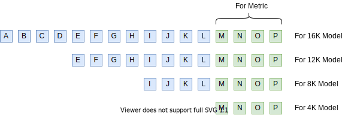
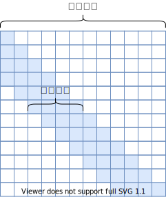
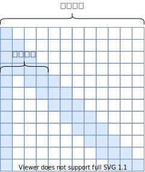
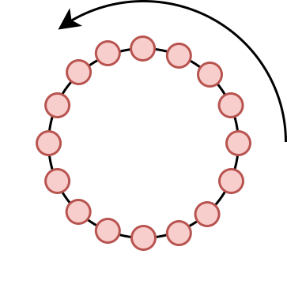
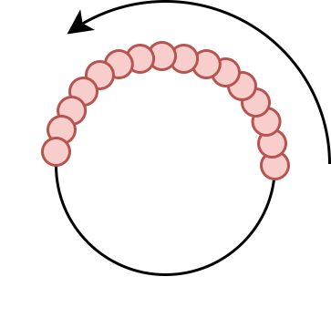

# Transformer升级之路：16、"复盘"长度外推技术

> **作者**：苏剑林 | **日期**：2024-01-18 | **来源**：[科学空间](https://www.kexue.fm/archives/9948)

回过头来看，才发现从第7篇[《Transformer升级之路：7、长度外推性与局部注意力》](https://www.kexue.fm/archives/9431)开始，"Transformer升级之路"这个系列就跟长度外推"杠"上了，接连9篇文章（不算本文）都是围绕长度外推展开的。如今，距离第7篇文章刚好是一年多一点，在这一年间，开源社区关于长度外推的研究有了显著进展，笔者也逐渐有了一些自己的理解，比如其实这个问题远不像一开始想象那么简单，以往很多基于局部注意力的工作也不总是有效，这暗示着很多旧的分析工作并没触及问题的核心。

在这篇文章中，笔者尝试结合自己的发现和认识，去"复盘"一下主流的长度外推结果，并试图从中发现免训练长度外推的关键之处。

## 问题定义

顾名思义，免训练长度外推，就是不需要用长序列数据进行额外的训练，只用短序列语料对模型进行训练，就可以得到一个能够处理和预测长序列的模型，即"Train Short, Test Long"。那么如何判断一个模型能否用于长序列呢？最基本的指标就是模型的长序列Loss或者PPL不会爆炸，更加符合实践的评测则是输入足够长的Context，让模型去预测答案，然后跟真实答案做对比，算BLEU、ROUGE等，[LongBench](https://papers.cool/arxiv/2308.14508)就是就属于这类榜单。

但要注意的是，长度外推应当不以牺牲远程依赖为代价——否则考虑长度外推就没有意义了，倒不如直接截断文本——这意味着通过显式地截断远程依赖的方案都需要谨慎选择，比如ALIBI以及[《Transformer升级之路：7、长度外推性与局部注意力》](https://www.kexue.fm/archives/9431)所列举的大部分方案，还有带显式Decay的[线性RNN](https://www.kexue.fm/archives/9554)，这些方案当序列长度足够大时都表现为局部注意力，即便有可能实现长度外推，也会有远程依赖不足的风险，需要根据自己的场景斟酌使用。

如何判断在长度外推的同时有没有损失远程依赖呢？比较严谨的是像[《Transformer升级之路：12、无限外推的ReRoPE？》](https://www.kexue.fm/archives/9708)最后提出的评测方案，准备足够长的文本，但每个模型只算每个样本最后一段的指标，如下图所示：



比如，模型训练长度是4K，想要看外推到16K的效果，那么我们准备一个16K tokens的测试集，4K的模型输入每个样本最后4K tokens算指标，8K模型输入每个样本最后8K tokens但只算最后4K tokens算指标，12K模型输入每个样本最后12K tokens但只算最后4K tokens算指标；依此类推。这样一来，不同长度的模型算的都是同一段tokens的指标，不同的只是输入的Context不一样，如果远程依赖得以有效保留，那么应该能做到Context越长，指标越好。

## 旋转位置

谈完评测，我们回到方法上。文章开头我们提到"旧的分析工作"，这里"新"、"旧"的一个主要特点是"旧"工作多数试图自行设置新的架构或者位置编码来实现长度外推，而最近一年来的"新"工作主要是研究带[旋转位置编码（RoPE）](https://www.kexue.fm/archives/8265)的、Decoder-Only的Transformer模型的长度外推。

先说个题外话，为什么如今大部分LLM的位置编码都选择了RoPE呢？笔者认为主要有几点原因：

> 1、RoPE不带有显式的远程衰减，这对于旨在Long Context的模型至关重要；
>
> 2、RoPE是一种真正的位置编码，通过不同频率的三角函数有效区分了长程和短程，达到了类似层次位置编码的效果，这也是Long Context中比较关键的一环；
>
> 3、RoPE直接作用于Q、K，不改变Attention的形式，与Flash Attention更契合，更容易Scale Up。

相比之下，诸如ALIBI、KERPLE等，虽然有时也称为位置编码，但它们实际上只是一种Attention Bias，没有太多位置信息，且不适用于Encoder，能用于Decoder大体上是因为Decoder本身的下三角Mask就已经有较为充分的位置Bias了，额外的Attention Bias只是锦上添花。此外它们无法在单个头内有效区分长程和短程，而是要通过在不同头设置不同的Decay因子来实现，这也意味着它们用于单头注意力（比如[GAU](https://www.kexue.fm/archives/8934)）的效果会欠佳。

## 窗口截断

好像又把话题扯偏了。简单来说，其实上两节的内容主要是想表达的观点是：目前看来，RoPE对于Long Context来说是足够的，所以研究RoPE的长度外推是有价值的，以及我们在选择长度外推方案时，不应牺牲远程依赖的能力。

在本站最早讨论长度外推的[《Transformer升级之路：7、长度外推性与局部注意力》](https://www.kexue.fm/archives/9431)一文中，我们判断长度外推是一个预测阶段的OOD（Out Of Distribution）的问题，尽管用今天的视角看，这篇文章的一些评述已经显得有点过时，但这个根本判断是依然还算正确，放到RoPE中，就是推理阶段出现了没见过的相对距离。为此，一个看上去可行的方案是引入Sliding Window的Attention Mask，如下图左所示：





当然，由于强行截断了窗口外的注意力，所以这个方案并不满足"不牺牲远程依赖的能力"的原则，但我们可以只将它作为一个Baseline看待。很遗憾的是，即便做出了如此牺牲，这个方案却是不Work的——连最基本的PPL不爆炸都做不到！对这个现象的深入分析，先后诞生[《LM-Infinite》](https://papers.cool/arxiv/2308.16137)和[《Efficient Streaming Language Models with Attention Sinks》](https://papers.cool/arxiv/2309.17453)两篇论文，并给出了几乎一样的答案。

答案可能让人意外：**开头的几个Token很重要，不能扔掉。**所以最后可用的Window Mask应该如上图右（LM-Infinite这篇论文管它叫"Λ-Mask"）。

为什么开头的Token会占据如此重要的地位呢？目前有两个不同的理解角度：

> 1、**开头的几个Token是绝对位置的"锚点"**：顾名思义，相对位置编码原则上只能识别相对位置，但有些任务可能比较依赖绝对位置，通过开头几个绝对位置约等于0的Token作为"标的"，每个Token就能够测出自己的绝对位置，而去掉开头几个Token后则缺失了这一环，从而完全打乱了注意力模式导致PPL爆炸；
>
> 2、**开头的几个Token是注意力的"回收站"**：由于注意力求和为1，所以注意力一定会分配到某些Token上，但有些情况下模型可能会发现"没什么Token值得注意的"，这时它选择将一部分注意力放到没什么信息量的前几个Token上，起到"不注意"的作用，去掉它们后模型会强行将注意力分配到其他无关的Token，从而扰乱了注意力模式。

## 位置内插

窗口截断的方式固然可以作为长度外推的一个不错的Baseline，同时"锚点"或者"回收站"的结果也让我们对注意力机制的工作方式有了进一步的理解，但正如前面所说，这是通过强行截断窗口外的注意力、牺牲远程依赖换来的，因此还不是最终的解决方案。

相对位置的OOD，直接表现就是预测阶段的相对位置超出了训练时的范围，由于没有被训练过，"越界"部分的行为无法预估。为此，一位网名为"kaiokendev"的网友提出了一个非常朴素的解决办法——"位置内插"——将预测的长文本的位置编码乘上因子$L_{train}/L_{test}$，缩放到训练长度范围内。没过多久，Meta在论文[《Extending Context Window of Large Language Models via Positional Interpolation》](https://papers.cool/arxiv/2306.15595)中也发布了同样的方法，命名为"Positional Interpolation（PI）"。

然而，位置内插并不算长度外推方案，至少不是免训练的长度外推方案，因为位置内插之后同样会有PPL爆炸的问题。原因也不难理解，尽管位置内插避免了远处的位置越界问题，但这同时压缩了邻近Token的距离，严重扰乱了模型的局部分辨率，而众所周知语言模型本身就是一个非常依赖于局部关系的任务，所以扰乱了局部自然就没法预测准了。

不过，这也并非说位置内插就没有价值了。我们知道，需要长度外推的读者，无外乎是两种情况：一种是没有资源去做长文本微调，希望能够从短文本模型直接得到一个可用的长文本模型，这种需求对长度外推的效果要求会比较高，位置内插就不适合他们了；另一种是有资源去做长文本微调，研究长度外推纯粹是为了得到一个更好的初始化模型，这种情况对模型修改带来的初始损失容忍度比较高，只要能够通过微调快速弥补回损失掉的效果即可，位置内插正好是属于此类方法。

## 保近压远

直接外推的问题是远处越界，而位置内插的问题是局部失真，看上去两者是互补的，能不能集两者之长呢？这就是[《Transformer升级之路：12、无限外推的ReRoPE？》](https://www.kexue.fm/archives/9708)所提出的Leaky ReRoPE，以及它的极限版本ReRoPE。

基于上一节的分析，我们不难推测实现免训练长度外推的要领是"保近压远"，即"保证局部不失真"和"压缩远处不越界"，Leaky ReRoPE通过一个非常直接的思路实现了这一点：它先设定一个窗口大小$w$内，将相对位置分为两部分，在窗口不改变相对位置实现"局部不失真"，在窗口外使用位置内插实现"远处不越界"。

如果将内插的因子$k$取到无穷大，这就得到极简的ReRoPE，它在窗口外的位置编码都变为$w$，意味着对于任意长的序列都不会越界，即理论上具备无限外推的潜力！事实上，Leaky ReRoPE和ReRoPE的表现确实都非常好，从Loss来看，它们能做到几乎不损失训练长度内的效果，并且实现了长度外推，且Context越长，Loss越低，说明它们在外推的同时还确实保证了远程依赖。

Leaky ReRoPE和ReRoPE的主要问题在于它们的代码实现稍微有点麻烦。跟Attention Bias类的位置编码不同，RoPE没法通过先构造相对位置矩阵然后才计算相对位置编码的方式来实现（那样效率太低），只能通过绝对位置编码的方式来实现相对位置编码，这意味着它只能实现线性增长的相对位置，而Leaky ReRoPE和ReRoPE的相对位置是分段线性的，这意味着朴素地实现的话，需要算两次Attention矩阵（得到两段不同的线性）然后将它们拼接起来，这样效率无疑明显降低了。

不过，好消息是当前主流的Attention加速手段如Flash Attention都是将Attention分块计算的，比如每128长度为一块，这样当序列足够长时，分段线性的块占比非常少（只有窗口边界附近），只有红绿混色的块才需要重复计算Attention，剩下同色的块都只需要计算一次，所以结合分块计算Attention的话，Leaky ReRoPE和ReRoPE所增加的计算成本几乎可以忽略的。

无独有偶，月初Arxiv上提交了一篇论文[《LLM Maybe LongLM: Self-Extend LLM Context Window Without Tuning》](https://papers.cool/arxiv/2401.01325)，其中提出了一种名为"Self-Extend"的免训练长度外推方法，它实际上就是在Leaky ReRoPE的基础上加了Round运算（四舍五入），使得每个相对位置都变回整数，进一步减轻相对位置的OOD问题。

## 转圈视角

尽管Leaky ReRoPE和ReRoPE的实际效果相当不错（至少Loss如此），但它们跟位置内插一样，都是直接操作位置编号（Position Ids），这给人一种"头疼医头，脚痛医脚"的感觉，欠缺了对内在规律的深入分析。因为对于模型来说，位置编号并不重要，位置嵌入（Position Embeddings）才是跟模型直接交互的，所以想要更深入地"直达病灶"，应该尝试从位置嵌入着手。

可能有读者疑问：位置编号跟位置嵌入不是一一对应吗？操作位置编号不等价于操作位置嵌入？是这样说，但两者的实际表现是不一样的，比如位置编号是无界的，但是位置嵌入是有界的（RoPE是三角函数组成，三角函数有界），跟模型直接打交道的是位置嵌入，位置编号OOD了，位置嵌入未必OOD，所以从位置嵌入角度分析，能更清晰地理解长度外推导致的OOD具体是什么表现，从而更加"对症下药"。

在[《Transformer升级之路：2、博采众长的旋转式位置编码》](https://www.kexue.fm/archives/8265)中我们推导RoPE的时候，是先利用复数推导了二维的解，然后将多个二维的解拼接成一个高维的解，这样一来，加了RoPE之后的$q,k$内积，可以用复数表示为

$$(R_m q)^\top (R_n k) = \text{Re}\left[\sum_{i=0}^{d/2-1} q_{[2i:2i+1]} k_{[2i:2i+1]}^* e^{i(m-n)\theta_i}\right]$$

其中$\theta_i$默认是$10000^{-2i/d}$，这是一个从1渐变到接近于0的函数。从欧拉公式$e^{it}=\cos t + i\sin t$可以知道，$e^{i(m-n)\theta_i}$实际上就单位圆上的点，当$m-n$逐渐变大时，这个点就在单位圆上转圈（真·旋转），$\theta_i$越大则转得越快，反之越慢。





假设训练长度为$L_{train}$，那么$m-n\in[0, L_{train}-1]$，接下来让我们充分发挥想象力：较大的$\theta_i$意味着转速越快，周期越短，于是在$m-n$从0到$L_{train}-1$期间，它已经被转了很多圈，也就是说圆上的每一个点几乎都被训练过，因此这些$\theta_i$几乎不存在OOD问题；相反，对于较小的$\theta_i$，当$m-n$从0到$L_{train}-1$时它可能还没转完一圈，这种情况下被训练过的点顶多只是圆上的一条弧，如果测试时遇到更大的$L_{test}$，那么就超出了训练过的弧范围，从而有无法预估的表现，这时候就需要通过内插将它压缩到原本的弧内。说白了，位置标号$m-n$是否OOD根本不重要，重要的是单位圆上的点是否被充分训练过，如果是，那么就可以不做改动（直接外推），否则就要想办法将它压缩到已经被充分训练过的那段弧上（位置内插）。

具体来说，对于$\theta_i$，我们可以算出周期为$T_i=2\pi/\theta_i$，然后可以算出在训练过程中它所转的"圈数"为$r_i=L_{train}/T_i=\theta_i L_{train}/(2\pi)$，我们可以设一个圈数的阈值$\tau$，圈数超过$\tau$的，就认为已经充分训练了，可以不加改动；圈数少于1的，$\theta_i$改为$\theta_i L_{train}/L_{test}$，意味着要把超出弧范围的重新缩放到弧内；至于剩下的部分，就在两者之间线性插值过渡。用公式表达就是：

$$\theta_i^{new} = [\gamma_i + (1-\gamma_i)\frac{L_{train}}{L_{test}}]\theta_i, \quad \gamma_i = \begin{cases}1, & r_i > \tau \\ 0, & r_i < 1 \\ \frac{r_i - 1}{\tau - 1}, & \text{others}\end{cases}$$

这就是[《YaRN: Efficient Context Window Extension of Large Language Models》](https://papers.cool/arxiv/2309.00071)一文所提出的免训练长度外推方案"YaRN"，在笔者的测试中，它的外推效果非常好，只是略逊于Leaky ReRoPE和ReRoPE。但要注意的是，YaRN只改变$\theta_i$的值，不改变Attention和RoPE的形式，因此不会有额外的实现成本和推理成本，在满足这个条件之下（即可以完全代入已有的实现），YaRN是笔者测试过的效果最佳的长度外推方法。

## 一些插曲

其实YaRN的故事还没完。YaRN除了引入$\theta_i$的改动外，还在Attention的Logits上多乘了一个Scale因子：

$$\lambda = (1 + 0.1\log\frac{L_{test}}{L_{train}})^2 \approx 1 + 0.2\log\frac{L_{test}}{L_{train}}$$

关于这个Scale的推导，可能会让人有点啼笑皆非，答案是根本没有推导，作者说他也没能从理论上推导出来，纯粹是实验发现加了以上Scale后PPL更低，以上形式也是通过实验拟合出来的。

其实这个带对数的结果，很明显跟[《从熵不变性看Attention的Scale操作》](https://www.kexue.fm/archives/8823)推导出来的$\log n$ Scale非常相似，只不过后者跟具体位置有关，而前者在确定了$L_{test}$之后就是一个常数。考虑到当$n$比较大时，$\log n$函数变化比较缓慢，所以在一定范围内取为常数也无可厚非，因此，不难猜测YaRN的这个Scale因子跟熵不变性的$\log n$ Scale应该是同源的。笔者也做过对比，将常数$\lambda$换成如下跟绝对位置$n$相关的因子，能起到相近的效果：

$$\lambda_n = \max(1, \frac{\log n}{\log L_{train}})$$

注意到

$$\frac{\log L_{test}}{\log L_{train}} = 1 + \frac{1}{\log L_{train}}\log\frac{L_{test}}{L_{train}}$$

YaRN是基于LLAMA和LLAMA2做实验的，前者训练长度是2K，后者是4K，我们有$1/\log 2048\approx 0.13$，$1/\log 4096\approx 0.12$，系数大致是式(6)的一半，差别不大，事实上这个系数的精确值可能不太重要，因为笔者也发现过式(7)更好的数据集，所以由此我们便算将式(6)近似地推导出来了。

相比YaRN本身，YaRN的作者Bowen Peng的故事也许更加称得上"引人入胜"，他早前所提出的NTK-RoPE是RoPE的第一种长度外推方案，其思路是只修改RoPE的底数$b$而不改变位置编号，从而间接实现"保近压远"的效果。不过NTK-RoPE的底数修改方案纯粹是经验性的，缺乏理论指导，而YaRN则从"转圈视角"给出了更清晰的理论分析。

## 文章小结

本文回顾了RoPE长度外推的主要技术路线，包括窗口截断、位置内插、Leaky ReRoPE/ReRoPE、YaRN等，并从"转圈视角"给出了更深入的理论分析。核心结论是：免训练长度外推的关键在于"保近压远"——保证局部位置编码不失真，同时压缩远处位置编码不越界。

---

**转载地址**：https://www.kexue.fm/archives/9948

**引用格式**：

苏剑林. (Jan. 18, 2024). 《Transformer升级之路：16、"复盘"长度外推技术》[Blog post]. Retrieved from https://www.kexue.fm/archives/9948

```bibtex
@online{kexuefm-9948,
  title={Transformer升级之路：16、"复盘"长度外推技术},
  author={苏剑林},
  year={2024},
  month={Jan},
  url={\url{https://www.kexue.fm/archives/9948}},
}
```
