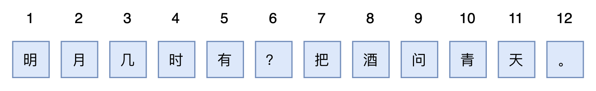
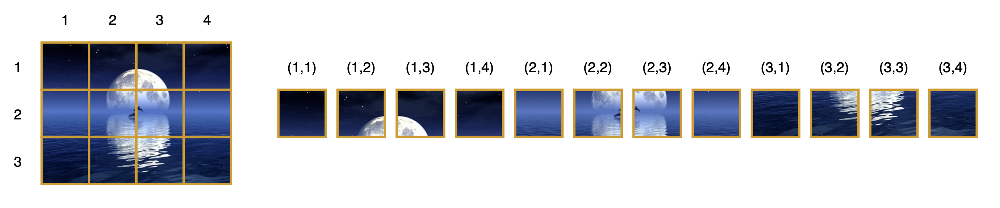
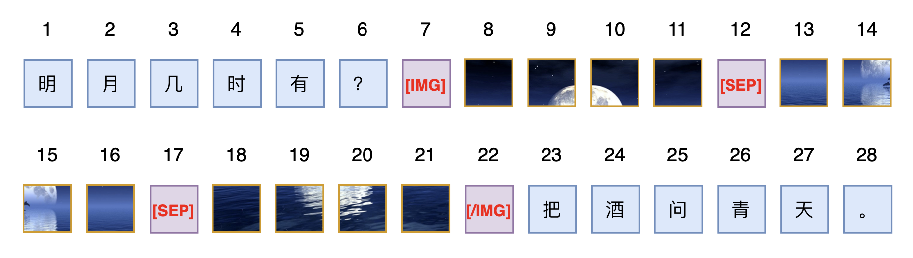
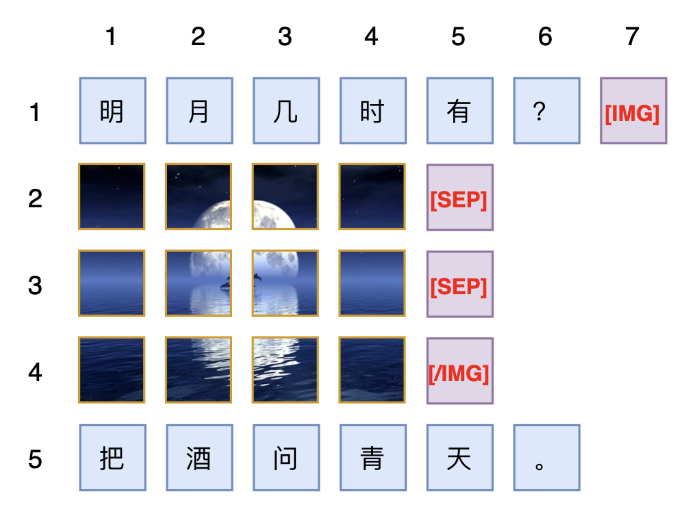
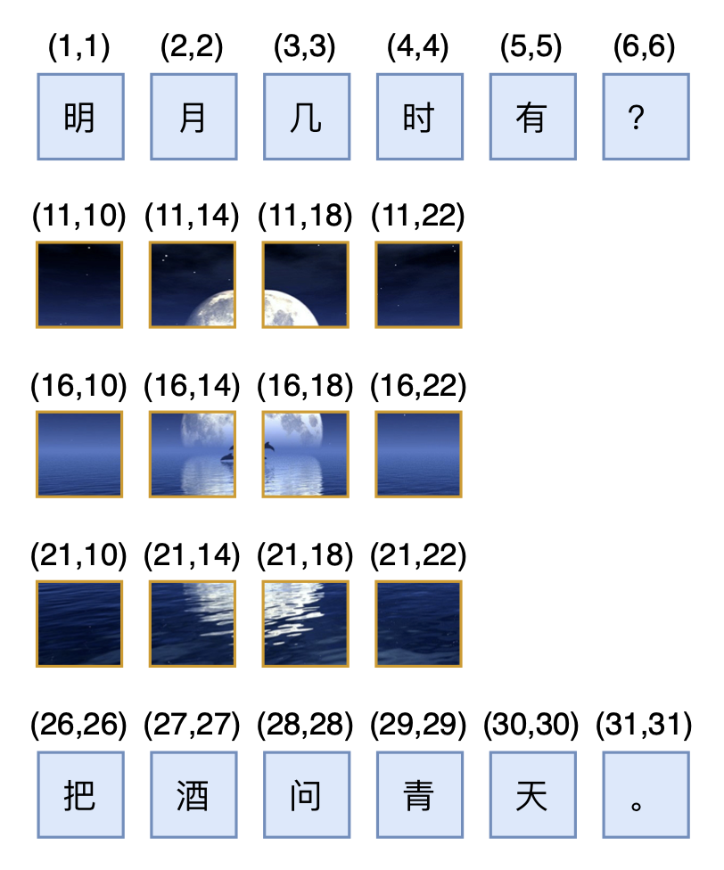

# Transformer升级之路：17、多模态位置编码的简单思考

> **作者**：苏剑林 | **日期**：2024-03-29 | **来源**：[科学空间](https://www.kexue.fm/archives/10040)

在这个系列的第二篇文章[《Transformer升级之路：2、博采众长的旋转式位置编码》](https://www.kexue.fm/archives/8265)中，笔者提出了旋转位置编码（RoPE）——通过绝对位置的形式实现相对位置编码的方案。一开始RoPE是针对一维序列如文本、音频等设计的（RoPE-1D），后来在[《Transformer升级之路：4、二维位置的旋转式位置编码》](https://www.kexue.fm/archives/8397)中我们将它推广到了二维序列（RoPE-2D），这适用于图像的ViT。然而，不管是RoPE-1D还是RoPE-2D，它们的共同特点都是单一模态，即纯文本或者纯图像输入场景，那么对于多模态如图文混合输入场景，RoPE该做如何调整呢？

笔者搜了一下，发现鲜有工作讨论这个问题，主流的做法似乎都是直接展平所有输入，然后当作一维输入来应用RoPE-1D，因此连RoPE-2D都很少见。且不说这种做法会不会成为图像分辨率进一步提高时的效果瓶颈，它终究是显得不够优雅。所以，接下来我们试图探寻两者的一个自然结合。

## 旋转位置

RoPE名称中的"旋转"一词，来源于旋转矩阵$R_n = \begin{pmatrix}\cos n\theta & -\sin n\theta \\ \sin n\theta & \cos n\theta\end{pmatrix}$，它满足

$$R_m^\top R_n = R_{n-m}$$

这样一来对于$q,k$（假设为列向量）的内积就有

$$(R_m q)^\top (R_n k) = q^\top R_m^\top R_n k = q^\top R_{n-m} k$$

最左边的式子中，$R_m q, R_n k$是独立进行的，不涉及到$m,n$的交互，所以它形式上是绝对位置，但最右端的等价形式只依赖于相对位置$n-m$，所以跟Dot-Product的Attention结合之后，它实质表现为相对位置。这个特性也让RoPE具备平移不变性：因为$(n+c)-(m+c)=n-m$，所以在应用RoPE之前全体绝对位置都加上一个常数，那么Attention的结果理论上不会变化（实际上受限于计算精度，可能有微小误差）。

以上是$q,k\in\mathbb{R}^2$的形式，对于$q,k\in\mathbb{R}^d$（其中$d$是偶数），我们需要一个$d\times d$的旋转矩阵，为此我们引入$d/2$个不同的$\theta$，构造分块对角矩阵

$$R_n^{(d\times d)} = \begin{pmatrix}\cos n\theta_0 & -\sin n\theta_0 & 0 & 0 & \cdots & 0 & 0 \\ \sin n\theta_0 & \cos n\theta_0 & 0 & 0 & \cdots & 0 & 0 \\ 0 & 0 & \cos n\theta_1 & -\sin n\theta_1 & \cdots & 0 & 0 \\ 0 & 0 & \sin n\theta_1 & \cos n\theta_1 & \cdots & 0 & 0 \\ \vdots & \vdots & \vdots & \vdots & \ddots & \vdots & \vdots \\ 0 & 0 & 0 & 0 & \cdots & \cos n\theta_{d/2-1} & -\sin n\theta_{d/2-1} \\ 0 & 0 & 0 & 0 & \cdots & \sin n\theta_{d/2-1} & \cos n\theta_{d/2-1}\end{pmatrix}$$

从实现上看，就是将$q,k$两两分组，每组取不同的$\theta$进行二维的旋转变换，这些是已有的RoPE内容，就不再详细展开了。原则上来说，我们只需要找到一个最低维的解，就可以通过分块对角的方式推广到一般维度，因此下面的分析都只考虑最小维度。

## 二维位置

当我们谈到"维度"这个概念时，可能会有多种含义，比如刚才我们说$q,k\in\mathbb{R}^d$，这就是说$q,k$都是$d$维向量，但本文所聚焦的RoPE-1D、RoPE-2D，它并不是指这个维度，而是指记录一个位置所需要的维度。



比如，我们要文本的某个token的位置，那么只需要一个标量$n$，记录它是第$n$个token。但对于图像来说，即便进行了patchify，它通常也会保留width和height两个方向维度，所以我们需要一对坐标$(x,y)$才能准确编码某个patch的位置：



上一节介绍$R_n$，它只编码了一个标量$n$，所以它是RoPE-1D，而为了更合理地处理图像输入，我们要推广到相应的RoPE-2D：

$$R_{x,y} = \begin{pmatrix}\cos x\theta & -\sin x\theta & 0 & 0 \\ \sin x\theta & \cos x\theta & 0 & 0 \\ 0 & 0 & \cos y\theta & -\sin y\theta \\ 0 & 0 & \sin y\theta & \cos y\theta\end{pmatrix} = \begin{pmatrix}R_x & 0 \\ 0 & R_y\end{pmatrix}$$

很明显，这只是$R_x$和$R_y$以分块对角的形式组合在一起，因此也很自然能将它推广到3D甚至更高维度。从实现上来理解就是更简单了，它就是将$q,k$都切分为两半（3D就是三等分、4D就是四等分，依此类推），每一半都是$\mathbb{R}^{d/2}$的向量，然后一半做$x$的RoPE-1D，另一半做$y$的RoPE-1D，最后再拼起来。

需要指出的是，从对称性和简洁性考虑，上面构造的$R_{x,y}$中对$x,y$我们使用了相同的$\theta$，但这原则上是非必须的，在适当情况下我们分别给$x,y$配置略有不同的$\theta$。

## 强行降维

现在我们看到，文本的位置是一个标量$n$，图片的位置则是一个向量$(x,y)$，两者并不一致，因此在处理图文混合输入时就需要一些技巧，来调和两者之间的不一致性。

最直接的方案，文章开头已经说了，就是直接展平图片为一维向量序列，然后就当作普通文本来处理，文本怎么加位置编码它就怎么加位置编码。这种思路自然是非常通用的，不限于加RoPE，也可以加任何绝对位置编码，笔者目测已有的一些多模态模型，如Fuyu-8b、Deepseek-VL、Emu2等，都是这样做的，可能细节处理上会有所不同，比如遇到不同行的patch可以考虑加个表示[SEP]的special token来分隔：



这个方案也契合了当前主流的Decoder-Only架构，因为Decoder-Only意味着即便不加位置编码，它也不是置换不变的，因此必须人为指定我们认为最佳的输入顺序，而既然要指定输入顺序了，按照所指定的顺序使用一维的位置编码也是很自然的选择。此外，在纯文本时这种方案的模型跟普通纯文本LLM无异，所以这也允许我们将训练好的文本LLM来继续训练成一个多模态模型。

然而，从笔者的角度看，位置编码的概念本身不应该和Attention的用法绑定，它应该普适于Decoder、Encoder乃至任意的Attention Mask。另一方面，保持位置的二维性才能最大程度上保留我们关于相近位置的先验，比如我们认为位置$(x+1,y)$和$(x,y+1)$都应该跟$(x,y)$具有相近的距离，但如果（先水平后垂直）展平的话，$(x,y)$变为$xw+y$，而$(x+1,y)$和$(x,y+1)$分别变为了$xw+y+w$和$xw+y+1$，前者与$xw+y$的距离就依赖于$w$而后者是固定的1。当然，我们还可以指定其他制定顺序，但不管怎么指定顺序，都无法完全兼容所有邻近位置的相近性，毕竟少了一个维度，可表达的相似性就少了很多。

## 统一升维

从向量空间的角度看，一维的标量可以看成一个特殊的二维向量，因此相比于展平为一维，如果我们反过来将所有输入的位置都统一到二维，原则上有更大的操作空间。

为此，我们可以考虑一种常见的排版方式：以图片为分隔符，对文本进行分段，连续的文本都视为一行，图片则视为多行文本，那么整个图文混合输入就相当于一篇多行长文，每个文本token或者图片patch，都有自己所属的行数$x$以及行内的顺序$y$，这就给所有的输入单元（token或者patch）都赋予了一个二维位置$(x,y)$，于是可以统一用RoPE-2D（其他2D形式的位置编码理论上也可以）来编码位置，同时还保持了原本图片位置的二维性。



很明显，该方案的主要优点是非常直观，它直接跟实际的视觉排版相对应，便于理解和推广。但它也有一个非常明显的缺点，那就是对于纯文本输入，它无法退化为RoPE-1D，而是变成了$x$始终为1的RoPE-2D，这样从已训练好的文本LLM出发来训练多模态LLM的可行性就值得怀疑。此外，以图片作为分割点的话，当图片比较多时，可能会让文本被分割得过于"支离破碎"，具体表现包括每一段文本的长度波动太大、本该连续的文本被强行换行等，这些都可能成为限制效果的瓶颈。

## 合二为一

如果要无损保留图片patch的位置信息，那么统一到二维然后用RoPE-2D（或者其他2D形式的位置编码）看上去是必然的选择，所以上一节的方案已经是走在了正确的方向上，我们需要进一步思考的是如何能够让它对于纯文本输入能够退化为RoPE-1D，以兼容已有的文本LLM。

首先，我们在前面已经提到过，$R_{x,y}$是$R_x$和$R_y$的分块对角组合，所以$R_{n,n}$是两个$R_n$的分块对角组合，而RoPE-1D的$R_n^{(d\times d)}$也是多个不同$\theta$的$R_n$的分块对角组合，由此可见，只要我们从$R_n^{(d\times d)}$选取不同的$\theta$给$x,y$，那么$R_{n,n}$就可以看成是RoPE-1D（即$R_n^{(d\times d)}$）的一部分。这样看来，要想RoPE-2D能退化为RoPE-1D，那么文本的位置应该采取$(n,n)$的形式，而不是像上一节那样用其他方式指定一个行号。

然后，在图片内部，我们则使用常规的RoPE-2D，对于单张$w\times h$个patch的图片来说，它的二维位置坐标展平后是

$$\begin{array}{cccccc}x & 1 & 1 & \cdots & 1 & 2 & 2 & \cdots & 2 & \cdots & h & h & \cdots & h \\ y & 1 & 2 & \cdots & w & 1 & 2 & \cdots & w & \cdots & 1 & 2 & \cdots & w\end{array}$$

如果这张图片位于一个长度为$L$的句子后面，我们这个句子的最后一个token的位置编码就是$(L,L)$，于是这张接在句子后面的图片的位置编码看上去应该是

$$\begin{array}{cccccc}x & L+1 & L+1 & \cdots & L+1 & \cdots & L+h & L+h & \cdots & L+h \\ y & L+1 & L+2 & \cdots & L+w & \cdots & L+1 & L+2 & \cdots & L+w\end{array}$$

但这并不完美，因为句子的最后一个token的位置是$(L,L)$，图片第一个patch的位置是$(L+1,L+1)$，它们相差$(1,1)$；假设这张图片后面再接一个句子，那么设该句子的第一个token的位置是$(K,K)$，图片的最后一个patch的位置则是$(L+h,L+w)$，当$w\neq h$时，不管我们怎么设置$K$，都不可能让$(K,K)$与$(L+h,L+w)$的差为$(1,1)$，即图片关于左右的句子存在不对称性，这就显得不够优雅。

为了改进这一点，我们可以将图片的$x,y$分别乘以正数$s,t$：

$$\begin{array}{cccccc}x & s & s & \cdots & s & 2s & 2s & \cdots & 2s & \cdots & hs & hs & \cdots & hs \\ y & t & 2t & \cdots & wt & t & 2t & \cdots & wt & \cdots & t & 2t & \cdots & wt\end{array}$$

只要$s,t\neq 0$，那么这个缩放对位置信息是无损的，因此这样的操作是允许的。而引入scale之后，假设句子的最后一个token的位置依旧是$(L,L)$，那么图片的位置同样是上述序列都加上$L$，此时"句子的最后一个token的位置"与"图片第一个patch的位置"之差就是$(s,t)$，如果我们希望"图片后面的句子的第一个token的位置"与"图片最后一个patch的位置"之差也是$(s,t)$，那么就应该有

$$(L+hs, L+wt) + (s,t) = (K,K) \Rightarrow (h+1)s = (w+1)t$$

考虑到$h,w$的任意性，并且希望保证位置ID都是整数的话，那么最简单的一个解自然是$s=w+1, t=h+1$，新句子第一个token的位置将会是$K=L+(w+1)(h+1)$。一个具体的例子如下图所示：



## 延伸思考

左边句子最后一个token的位置是$L$，右边句子第一个token的位置是$K=L+(w+1)(h+1)$，如果中间部分也是一个句子的话，那么可以推出该句子有$(w+1)(h+1)-1$个token，这也等价于说如果两个句子之间夹着一个$w\times h$的图片，那么对这两个句子的相对位置来说等价于隔着一个$(w+1)(h+1)-1$个token的句子。这个数字看起来有点不自然，因为看上去$wh$才是完美答案，但可惜这是保证所有位置ID都是整数的最简单解。如果允许非整数的位置ID，那么可以约定$w\times h$的图片等价于$wh$个token，反过来推出

$$s = \frac{wh+1}{h+1}, \quad t = \frac{wh+1}{w+1}$$

可能有读者要问：如果是两张不同大小的图片相邻，是不是就没有这样对称的方案了？这其实也不难，只要每张图片的前后，我们都加入special token来标记，如[IMG]、[/IMG]，并且special token当作普通文本token来编码位置，这样就直接避免了两张图片直接相邻的情况（因为按照约定，同一张图片的patch之间必然夹在[IMG]和[/IMG]，这两个token当作文本来处理，所以就等价于说每一张图片必然夹在两个文本之间）。此外，上述介绍中没有提及[SEP]，如果有需要自行引入即可，事实上只有用patch by patch的自回归方式做图片生成时，才有必要引入[SEP]，如果图片单纯是作为输入，或者图片生成用扩散模型来做，那么[SEP]则是多余的。

至此，我们关于将RoPE推广到图文混合输入的推导已经完成，如果需要一个名字，可以将最后的方案称之为"RoPE-Tie（RoPE for Text-image）"。不得不说的是，最后的RoPE-Tie并不算太漂亮，以至于给人一种"雕花"的感觉。从效果上来看，相比直接展平为一维用RoPE-1D，换用RoPE-Tie之后也不见得会有什么提升，它更多是笔者的强迫症的一个产物。所以，对于已经scale到了一定规模的多模态模型，就没有必要做出什么改动了，但如果还没有起步或者刚刚起步，那么不妨尝试一下RoPE-Tie。

## 文章小结

本文讨论了如何将RoPE-1D和RoPE-2D结合起来，来更好地处理图文混合的输入格式，主要思想是通过RoPE-2D支持图片的二维位置指标，并且通过适当的约束，使得在纯文本情况下能退化为常规的RoPE-1D。

---

**转载地址**：https://www.kexue.fm/archives/10040

**引用格式**：

苏剑林. (Mar. 29, 2024). 《Transformer升级之路：17、多模态位置编码的简单思考》[Blog post]. Retrieved from https://www.kexue.fm/archives/10040

```bibtex
@online{kexuefm-10040,
  title={Transformer升级之路：17、多模态位置编码的简单思考},
  author={苏剑林},
  year={2024},
  month={Mar},
  url={\url{https://www.kexue.fm/archives/10040}},
}
```
