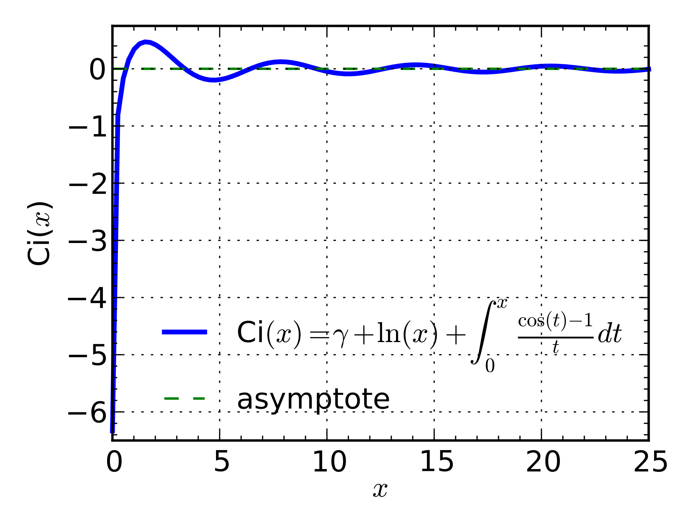

# Transformer升级之路：18、RoPE的底数选择原则

> **作者**：苏剑林 | **日期**：2024-05-29 | **来源**：[科学空间](https://www.kexue.fm/archives/10122)

我们知道，在RoPE中频率的计算公式为 $\theta_i = b^{-2i/d}$，底数b默认值为10000。目前Long Context的主流做法之一是，先在 $b=10000$ 上用短文本预训练，然后调大b并在长文本微调。上周的论文[《Base of RoPE Bounds Context Length》](https://papers.cool/arxiv/2405.14591)试图回答这个问题，它基于一个期望性质研究了b的下界，由此指出更大的训练长度本身就应该选择更大的底数，与训练策略无关。

## 期望性质

RoPE本质上是一个分块对角矩阵 $R_n$，然后利用恒等式

$$(R_m q)^\top (R_n k) = q^\top R_{n-m} k$$

给q,k注入绝对位置信息，并自动实现了相对位置的效果。其中 $\theta_i = b^{-2i/d}$，这里的b的取值就是本文要探讨的问题。

除了给模型注入位置信息外，我们期望RoPE能具备两个理想性质：

1. **远程衰减**：位置相近的Token平均来说获得更多的注意力
2. **语义聚合**：语义相似的Token平均来说获得更多的注意力

## 不等关系

所谓语义聚合，指的是当k与q相近时，不管它们的相对距离n-m多大，其注意力 $q^\top R_{n-m} k$ 平均来说都应该更大。假设q的每个分量都是独立同分布的，每个分量的均值为 $\mu$，方差为 $\sigma^2$，经过推导可得：

$$\mathbb{E}_{q,k,\varepsilon}[q^\top R_{n-m}\tilde{k} - q^\top R_{n-m}k] = \sum_{i=0}^{d/2-1} 2\sigma^2 \cos(n-m)\theta_i$$

如果训练长度最大为L，那么语义聚合性质可以用如下不等式近似描述：

$$\sum_{i=0}^{d/2-1} \cos m\theta_i \geq 0, \quad m \in \{0, 1, 2, \cdots, L-1\}$$

这个不等式的唯一可调参数就是 $\theta_i = b^{-2i/d}$ 中的b。存在一个最小的b使得上述不等式恒成立：

$$b^* = \inf\{b | f_b(m) \triangleq \sum_{i=0}^{d/2-1} \cos m b^{-2i/d} \geq 0, m \in \{0, 1, 2, \cdots, L-1\}\}$$

## 数值求解

由于 $f_b(m)$ 涉及到多个三角函数的求和，很难有解析解，因此只能诉诸数值求解。使用"Jax + GPU"进行暴力搜索，最终结果如下：

| L | 1k | 2k | 4k | 8k | 16k | 32k | 64k | 128k | 256k | 512k | 1M |
|---|-----|-----|-----|-----|------|------|------|-------|-------|-------|-----|
| $b^*$ | 4.3e3 | 1.2e4 | 2.7e4 | 8.4e4 | 2.3e5 | 6.3e5 | 2.1e6 | 4.9e6 | 2.4e7 | 5.8e7 | 6.5e7 |

## 渐近估计

渐近估计的思路，是用积分代替求和：

$$f_b(m) = \sum_{i=0}^{d/2-1} \cos m b^{-2i/d} \approx \int_0^1 \cos m b^{-s} ds = \frac{\text{Ci}(m) - \text{Ci}(mb^{-1})}{\ln b}$$

其中 $\text{Ci}(x) = -\int_x^\infty \frac{\cos t}{t} dt$ 是三角积分。



Ci(x)的图像【来自维基百科】

它的第一个零点是 $x_0 = 0.6165\cdots$，对于渐近估计来说可以忽略 $\text{Ci}(m)$，那么问题近似地变成了 $\text{Ci}(mb^{-1}) \leq 0$ 对于 $m = 1, 2, \cdots, L$ 恒成立，这意味着 $Lb^{-1} \leq x_0$，即

$$b \geq L/x_0 \approx 2L$$

或者简单点 $b^* = O(L)$。

## 相关思考

在[《Transformer升级之路：10、RoPE是一种β进制编码》](https://www.kexue.fm/archives/9675)中，我们将RoPE类比为一种β进制表示，其中 $\beta = b^{2/d}$，那么 $b^{-1} = \beta^{d/2-1}$ 正好是 $d/2$ 位β进制编码能够表示的最大数字，于是要表示0,1,2,...,L-1这L个位置编码，至少有 $b \geq L$，这个朴素的类比再次给出了"b应该随着L增大而增大"的结论。

另一方面，Meta最新发布的LLAMA3，训练长度为8192，但RoPE的底数选择了惊人的500000（5e5），这比前面的数值结果（8.4e4）还要大将近一个数量级。但不论如何，更大的文本长度选择更大的RoPE底数，似乎已经成为了很多训练人员的共识。

## 部分旋转

EleutherAI实验发现，如果只对部分维度加RoPE，会取得稍优的结果。以只旋转一半维度为例，它在数学上等价于选择如下的 $\theta_i$：

$$\theta_i = \begin{cases} b^{-4i/d}, & i < d/4 \\ 0, & i \geq d/4 \end{cases}$$

此时我们有

$$\sum_{i=0}^{d/2-1} \cos m\theta_i = \sum_{i=0}^{d/4-1} (1 + \cos m b^{-4i/d}) \geq 0$$

也就是不论m,b如何，我们所期望的不等式都自动成立，这意味着从本文的观点来看，部分旋转在赋予位置信息的同时有更好的语义聚合能力。同时，部分旋转对模型的长文本能力或许也更有利，因为不等式恒成立，所以按照本文的观点，不论长短文本训练都不用修改b。

值得一提的是，DeepSeek提出的MLA也应用了部分旋转，虽然在MLA的原始推导中，部分旋转更多是为了整合RoPE的无奈之举，但结合以往的部分旋转实验结果来看，也许MLA的优异效果有部分旋转的一分功劳。

## 文章小结

本文介绍了论文《Base of RoPE Bounds Context Length》，它从语义聚合的期望性质讨论了RoPE的底数下界，由此指出更大的训练长度应该选择更大的底数，而不单单是为了配合"先短后长"的训练策略。此外，部分旋转可以自动满足语义聚合条件，这可能是其效果更优的原因之一。

---

**转载地址**：https://www.kexue.fm/archives/10122

**引用格式**：

苏剑林. (May. 29, 2024). 《Transformer升级之路：18、RoPE的底数选择原则》[Blog post]. Retrieved from https://www.kexue.fm/archives/10122

```bibtex
@online{kexuefm-10122,
  title={Transformer升级之路：18、RoPE的底数选择原则},
  author={苏剑林},
  year={2024},
  month={May},
  url={\url{https://www.kexue.fm/archives/10122}},
}
```
