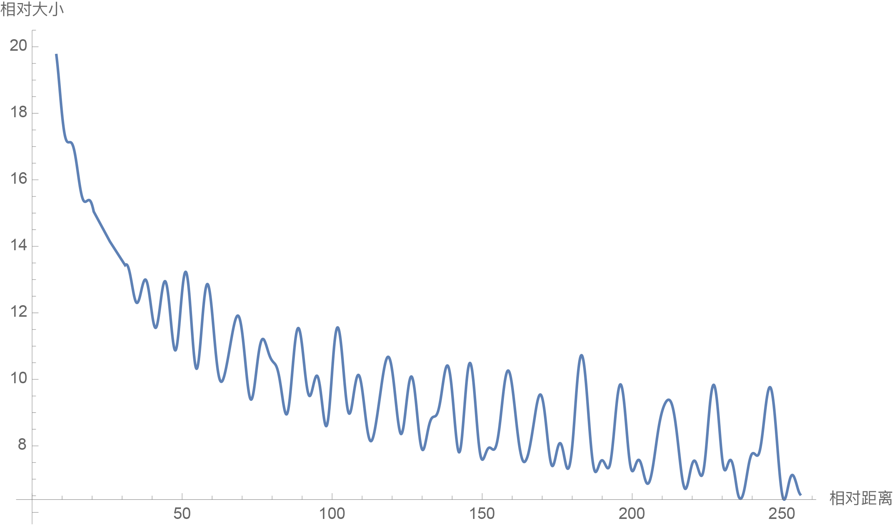

# Transformer升级之路：2、博采众长的旋转式位置编码

> **作者**：苏剑林 | **日期**：2021-03-23 | **来源**：[科学空间](https://www.kexue.fm/archives/8265)

本文介绍自研的Rotary Transformer（RoFormer）模型，其核心是"旋转式位置编码（RoPE）"——通过绝对位置编码的方式实现相对位置编码。它还是目前唯一一种可用于线性Attention的相对位置编码。

## 求解过程

目标：找到 $f(\boldsymbol{q}, m)$ 和 $f(\boldsymbol{k}, n)$，使得内积只依赖于相对位置：

$$\langle f(\boldsymbol{q}, m), f(\boldsymbol{k}, n)\rangle = g(\boldsymbol{q},\boldsymbol{k},m-n)$$

借助复数表示，解得二维情形：

$$f(\boldsymbol{q}, m) = \|\boldsymbol{q}\|e^{i(\Theta(\boldsymbol{q})+m\theta)} = \boldsymbol{q}e^{im\theta}$$

称为"旋转式位置编码"，因它对应向量的旋转。矩阵形式：

$$R_m = \begin{pmatrix}\cos m\theta_0 & -\sin m\theta_0 & 0 & 0 & \cdots \\ \sin m\theta_0 & \cos m\theta_0 & 0 & 0 & \cdots \\ 0 & 0 & \cos m\theta_1 & -\sin m\theta_1 & \cdots \\ 0 & 0 & \sin m\theta_1 & \cos m\theta_1 & \cdots \\ \vdots & \vdots & \vdots & \vdots & \ddots\end{pmatrix}$$

成立恒等式：$(R_m\boldsymbol{q})^\top(R_n\boldsymbol{k}) = \boldsymbol{q}^\top R_{n-m}\boldsymbol{k}$，保证Attention自动包含相对位置信息。

## 远程衰减

选用 $\theta_i = 10000^{-2i/d}$（沿用Sinusoidal方案），内积结果随相对距离增大而衰减：



*RoPE的远程衰减性（d=128）*

## 模型效果

RoFormer模型（RoPE + WoBERT）在CAIL2019-SCM长文本任务上表现优异：
- RoFormer-512: 64.29%（测试集）
- RoFormer-1024: 69.79%（测试集）

GitHub: https://github.com/ZhuiyiTechnology/roformer

已整理为论文[《RoFormer: Enhanced Transformer with Rotary Position Embedding》](https://papers.cool/arxiv/2104.09864)。

---

**转载地址**：https://www.kexue.fm/archives/8265

**引用格式**：苏剑林. (Mar. 23, 2021). 《Transformer升级之路：2、博采众长的旋转式位置编码》[Blog post]. Retrieved from https://www.kexue.fm/archives/8265

```bibtex
@online{kexuefm-8265, title={Transformer升级之路：2、博采众长的旋转式位置编码}, author={苏剑林}, year={2021}, month={Mar}, url={\url{https://www.kexue.fm/archives/8265}}}
```
