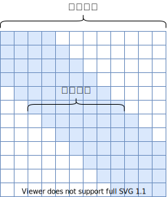
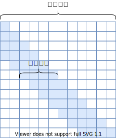
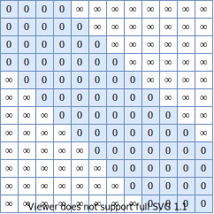
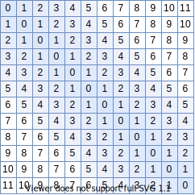
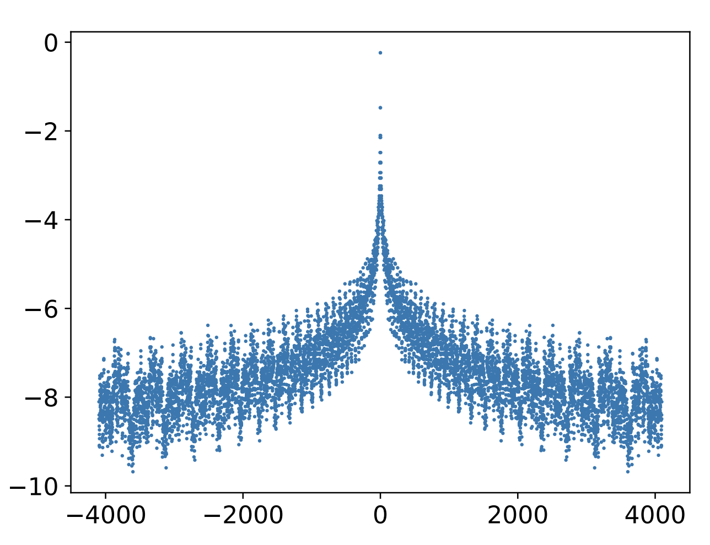

# Transformer升级之路：7、长度外推性与局部注意力

> **作者**：苏剑林 | **日期**：2023-01-12 | **来源**：[科学空间](https://www.kexue.fm/archives/9431)

对于Transformer模型来说，其长度的外推性是我们一直在追求的良好性质，它是指我们在短序列上训练的模型，能否不用微调地用到长序列上并依然保持不错的效果。下面我们来分析一下加强Transformer长度外推性的关键思路。

## 思维误区

第一篇明确研究Transformer长度外推性的工作应该是ALIBI，出自2021年中期。为什么这么晚才有人专门做这个课题呢？估计是因为我们长期以来，都想当然地认为Transformer的长度外推性是位置编码的问题，找到更好的位置编码就行了。

事实上，位置编码的"光滑性"是关键。外推性就是局部推断整体，泰勒级数近似就是经典的例子，它依赖的是给定函数的高阶光滑性。但是Sinusoidal或RoPE是一系列正余弦函数的组合，其相位函数是高频振荡函数，所以基于它的模型往往外推行为难以预估。

更准确的定位应该是：**长度外推性是一个训练和预测的长度不一致的问题。** 具体来说，不一致的地方有两点：

> 1. 预测的时候用到了没训练过的位置编码（不管绝对还是相对）；
> 2. 预测的时候注意力机制所处理的token数量远超训练时的数量。

## 超强基线

对于相对位置编码的Transformer模型，通过一个非常简单的Attention Mask就可以一次性解决以上两个问题：



*超强基线模型（双向注意力版）*



*超强基线模型（单向注意力版）*

这就是将预测时的Attention变为一个局部Attention，每个token只能看到训练长度个token。这样一来，每个token可以看到的token数跟训练时一致，就解决了第2个问题；同时由于是相对位置编码，位置的计数以当前token为原点，因此这样的局部Attention也不会比训练时使用更多的未知编码，解决了第1个问题。就这个简单的Attention Mask一次性解决了长度外推的2个难点，还不用重新训练模型，可谓是"超强基线"。

## 论文学习

### ALIBI

ALIBI所做的改动非常简单，只是在Softmax之前将Attention的计算从 $q_m^\top k_n$ 改为

$$q_m^\top k_n - \lambda|m-n|$$

其中 $\lambda>0$ 是超参数，每个head设置不同的值。ALIBI可以看成是基线模型的"光滑版"。



*基线模型所减去的矩阵*



*ALIBI所减去的矩阵*

### KERPLE、Sandwich、XPOS

KERPLE引入了可训练参数 $r_1, r_2$ 来一般化ALIBI。Sandwich将 $q_m^\top k_n + \lambda p_m^\top p_n$ 加到Attention上，通过拼接方式补充绝对位置信息。XPOS是RoPE的一脉相承推广，考虑 $q_m \to R_m q_m \xi^m, k_n \to R_n k_n \xi^{-n}$。



*dot(p_m, p_n) 的函数图像（减去了d/2）*

总的来说，这些工作本质上都是基线方案——局部注意力的变体，局部注意力是长度外推的关键环节之一。

---

**转载地址**：https://www.kexue.fm/archives/9431

**引用格式**：

苏剑林. (Jan. 12, 2023). 《Transformer升级之路：7、长度外推性与局部注意力》[Blog post]. Retrieved from https://www.kexue.fm/archives/9431

```bibtex
@online{kexuefm-9431,
  title={Transformer升级之路：7、长度外推性与局部注意力},
  author={苏剑林},
  year={2023},
  month={Jan},
  url={\url{https://www.kexue.fm/archives/9431}},
}
```
