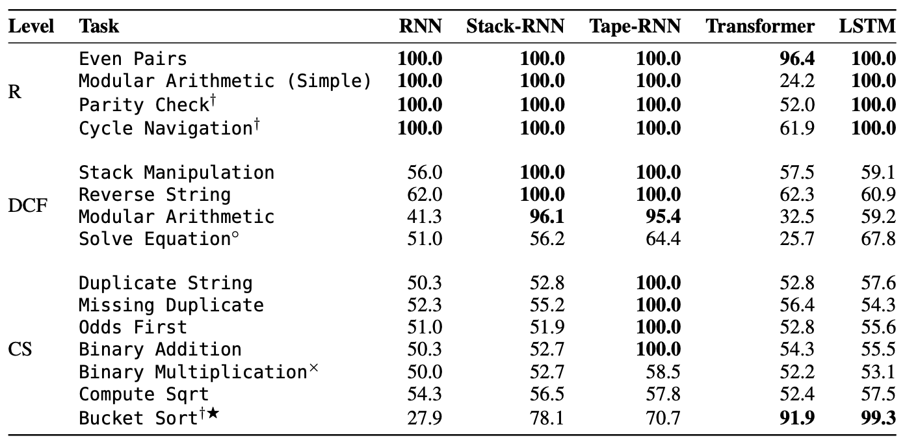
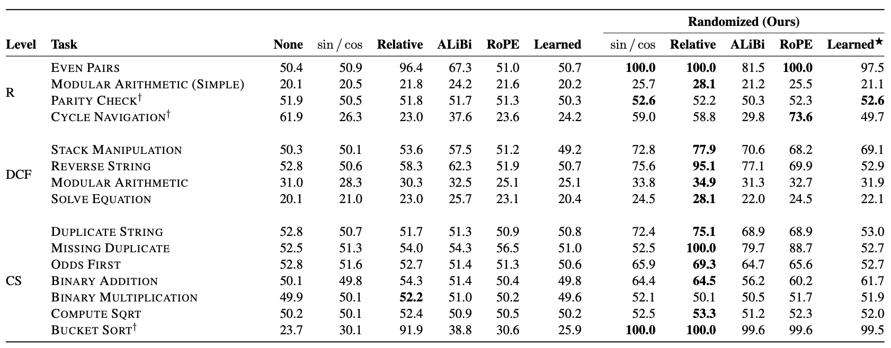

# Transformer升级之路：8、长度外推性与位置鲁棒性

> **作者**：苏剑林 | **日期**：2023-01-31 | **来源**：[科学空间](https://www.kexue.fm/archives/9444)

上一篇文章[《Transformer升级之路：7、长度外推性与局部注意力》](https://www.kexue.fm/archives/9431)我们讨论了Transformer的长度外推性，得出的结论是长度外推性是一个训练和预测的不一致问题，而解决这个不一致的主要思路是将注意力局部化。本文我们从模型对位置编码的鲁棒性角度来重新审视长度外推性这个问题，此思路可以在基本不对注意力进行修改的前提下改进Transformer的长度外推效果。

## 问题分析

长度外推性"训练和预测的长度不一致"的问题，具体不一致的地方有两点：

> 1. 预测的时候用到了没训练过的位置编码（不管绝对还是相对）；
> 2. 预测的时候注意力机制所处理的token数量远超训练时的数量。

其中，第2点我们在[《从熵不变性看Attention的Scale操作》](https://www.kexue.fm/archives/8823)已经初步讨论并解决了它，答案是将Attention加上 $\log$ 缩放。所以接下来集中精力解决第1点。

## 随机位置

一篇ACL22论文[《Randomized Positional Encodings Boost Length Generalization of Transformers》](https://openreview.net/forum?id=nMYj4argap)首次从这个角度考虑了该问题，方案很简单：

> **随机位置训练**：设 $N$ 为训练长度，$M$ 为预测长度，选定一个较大 $L>M$，训练阶段原本长度为 $N$ 的序列对应的位置序列是 $[0,1,\cdots,N-1]$，现在改为从 $\{0,1,\cdots,L-1\}$ 中随机不重复地选 $N$ 个并从小到大排列。

基于numpy的参考代码为：

```python
def random_position_ids(N, L=2048):
    return np.sort(np.random.permutation(L)[:N])
```

预测阶段同样可以随机采样位置序列，也可以直接在区间中均匀取点（实验效果显示均匀取点的效果一般好些），这就解决了预测阶段的位置编码没有被训练过的问题。

## 新的基准：CHE基准

很多相关工作以语言模型任务构建评测指标，但语言模型高度依赖局部信息（局域性），所以之前的方案很可能只是因为语言模型的局域性才有良好的外推表现。Google在论文[《Neural Networks and the Chomsky Hierarchy》](https://papers.cool/arxiv/2207.02098)提出了一个长度外泛化基准（CHE基准），给理解长度外推提供了新视角。



*若干模型在若干长度外推测试任务上的效果对比*

结果可能让人意外，"风头正盛"的Transformer的长度外推效果是最差的，评级如下：

$$\text{Transformer}_{R-} < \text{RNN}_R < \text{LSTM}_{R+} < \text{Stack-RNN}_{DCF} < \text{Tape-RNN}_{CS}$$

而随机位置训练为Transformer挽回了一些劣势：



*不同位置编码的Transformer在有无随机位置训练下的长度外推效果对比*

ALIBI这个在语言模型任务中表现良好的方法，在CHE基准上并无表现出什么优势，初步肯定了前面的猜测：各种Local Attention变体的方法表现良好，大概率是因为基于语言模型的评测任务本身有严重的局域性。

## 原理反思

从"序"的角度去理解随机位置训练。由于训练阶段的位置id是随机采样的，模型不大可能通过精确的位置id来获取位置信息，取而代之是通过位置序列的"序"来编码位置。随机位置训练"迫使"模型学会了一个等价类，即所有从小到大排列的位置序列都是等价的，这就是位置鲁棒性的真正含义。

更进一步，笔者考虑了等均值随机位置训练的思路：

```python
def random_position_ids(N):
    n = sample_from_xxx()
    return np.linspace(0, 1, N) * n
```

经过测试，指数分布和beta分布是比较适合的采样分布。结合 $\log n$ 缩放注意力，在MLM任务上能取得最佳的外推效果。

## 文章小结

本文从位置鲁棒性的角度思考了Transformer的长度外推性，得到了"随机位置训练"等增强长度外推性的新方案。同时，介绍了新的"CHE基准"，相比常规的语言模型任务，它具备更强的非局域性，可以更有效地评估长度外推相关工作。

---

**转载地址**：https://www.kexue.fm/archives/9444

**引用格式**：

苏剑林. (Jan. 31, 2023). 《Transformer升级之路：8、长度外推性与位置鲁棒性》[Blog post]. Retrieved from https://www.kexue.fm/archives/9444

```bibtex
@online{kexuefm-9444,
  title={Transformer升级之路：8、长度外推性与位置鲁棒性},
  author={苏剑林},
  year={2023},
  month={Jan},
  url={\url{https://www.kexue.fm/archives/9444}},
}
```
