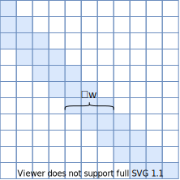
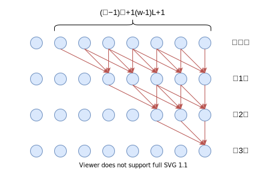

# Transformer升级之路：9、一种全局长度外推的新思路

> **作者**：苏剑林 | **日期**：2023-05-12 | **来源**：[科学空间](https://www.kexue.fm/archives/9603)

说到Transformer无法处理超长序列的原因，大家的第一反应通常都是Self Attention的二次复杂度。但事实上，即便忽略算力限制，常规的Transformer也无法处理超长序列，因为它们的长度外推性（Length Extrapolation）并不好，具体表现为当输入序列明显超过训练长度时，模型的效果通常会严重下降。

尽管已有一些相关工作，但长度外推问题离实际解决还比较远。本文介绍笔者构思的一种参考方案，它可能是目前唯一一种可以用在生成模型上、具备全局依赖能力的长度外推方法。

## 方法回顾

长度外推，也称为长度泛化（Length Generalization），此前我们在[《Transformer升级之路：7、长度外推性与局部注意力》](https://www.kexue.fm/archives/9431)、[《Transformer升级之路：8、长度外推性与位置鲁棒性》](https://www.kexue.fm/archives/9444)已经介绍过部分工作。然而，它们各有各的问题。

第一篇文章介绍的各种方案都是将注意力局部化的思路，虽然指标上能够体现出改进，但实质也就只是指标好看了一点，无法做到全局依赖的外推，所以对于真正需要长程依赖的场景（如In Context Learning）并无实质帮助；后者通过随机位置扰动增强对位置信号的鲁棒性，理论上有可能保留全局依赖，但该方法只适用于Encoder模型，不适合于GPT之类的自回归生成模型。

所以，长度外推问题依然是目前Transformer亟待解决但还没解决的一个问题。事实上这个问题不仅存在于Transformer中，像我们之前在[《Google新作试图"复活"RNN：RNN能否再次辉煌？》](https://www.kexue.fm/archives/9554)中介绍的线性RNN模型（包括很火的RWKV），其长度外推能力也并不好。在如今LLM时代，长度外推能力显得尤为重要，因为我们总希望模型能够处理任意长的文本，但又不可能把训练样本的长度拉到任意长。

## 平移不变

接下来我们将针对自回归式Transformer进行介绍，但方法对双向注意力的Encoder也是有效的。本质上来说，局部化注意力就是通过限制注意力的感知范围，来赋予整个模型"平移不变性"。平移不变性的一个简单基准是Window Attention，如下图所示：



*Window Attention*



*堆叠感受野示意图*

假设模型包含 $L$ 层堆叠的Window Attention，Window大小为 $w$，那么最后一层的每个token，最大的感受野是 $(w-1)L+1$。所以，假设训练长度为 $N$，那么在 $(w-1)L+1 = \alpha N\,(0<\alpha\le 1)$ 的约束之下，模型就能够获得一定的平移不变性，因为此时模型的最大感受野都不超过 $N$，所以模型的总感受野得到了较为充分的训练。$\alpha$ 越小，平移不变性通常越好。

然而，尽管这样能确保平移不变性的出现，但是会带来另外的问题，最严重的就是由于每层的感受野被限制在 $w$ 内，注意力机制的能力大大削弱，导致训练效果不如常规注意力（下面称为Full Attention）。此外，我们对长度外推的期望其实不仅仅是"平移不变性"，而是"平移**更好**性"，也就是说越往后效果应该越好才对（比如In Context Learning场景，给的examples越多，效果应该越好），所以模型还应该要能捕捉全局依赖的能力。

## 全局依赖

为此，笔者想到：Window Attention得到的结果本质上就是某种n-gram特征，只不过在多层堆叠之下这个n会变得比较大；而单层的Full Attention可以看作是某种"检索"（从query、key、value这些称呼就可以看出）和"融合"，它的规律相对来说比较容易分析，之前我们便在[《从熵不变性看Attention的Scale操作》](https://www.kexue.fm/archives/8823)得到了单层（全）注意力可以通过增加 $\log n$ 缩放因子来增强长度外推性的结论。

所以，笔者萌生了一个想法：

> 如果前面 $L-1$ 层通过Window Attention获得了n-gram特征，最后一层可否替换为带 $\log n$ 因子的Full Attention来检索和整合这些特征，以弥补效果上的差距和获得全局依赖的能力呢？

为此，我们提出如下注意力的组合方式（Hybird Window-Full Attention，简称HWFA）：

> 1. 前面 $L-1$ 层使用Window为 $w$ 的"Window Attention+[RoPE](https://www.kexue.fm/archives/8265)"，满足约束 $(w-1)(L-1)+1 = \alpha N$，这里 $N$ 是训练长度，为了兼顾训练效果和外推效果，建议在 $\alpha\le 3/4$ 的前提下选择尽量大的 $w$；
>
> 2. 第 $L$ 层使用带 $\log n$ 因子的Full Attention，但是不使用RoPE。

之所以前面要使用RoPE，是因为诸多实验结果已经表明RoPE有助于增强模型效果（至少base、large级别的模型如此），而最后一层不用RoPE，是因为超出训练长度的RoPE没有被训练过，会影响长度外推效果。事实上，前面 $L-1$ 层的RoPE已经足够为模型补充位置信息，最后一层不加RoPE，基本不会影响模型训练效果。

## 实验结果

很明显，HWFA是一种注意力的组合方式，它可以用于标准的多头注意力中，也可以用于[GAU](https://www.kexue.fm/archives/8934)等注意力变体中。笔者在[GAU_alpha](https://www.kexue.fm/archives/9052)的基础上进行了实验：训练长度512，24层GAU，前23层用Window Attention，Window大小 $w=16$，测试的是逐token准确率，对比的Baseline是全部层都是Full Attention+RoPE（即常规的默认用法）。

结果让人很鼓舞：

| 测试长度 | 512 | 4096 |
|----------|------|------|
| Baseline | 49.41% | 24.17% |
| **HFWA** | **48.70%** | **80.84%** |

512代表训练准确率（也可以叫内插准确率），4096代表外推准确率。为什么训练准确率才40多，而外推能到80多这么夸张？这是因为笔者在构造测试样本的时候，包含了部分重复拼接样本，即同一段不超过4096长度的文本，通过重复拼接达到4096长度，由于这些样本的后面部分是前面部分的重复，因此这部分准确率很高（即前面已经给出了标准答案），这说明跟我们想象的一样，这样的设计下的长度外推是不牺牲全局依赖能力的。

如果把重复样本剔掉，只保留正常的自然文本样本，那么结果也还能看：

| 测试长度 | 512 | 4096 |
|----------|------|------|
| Baseline | 49.41% | 23.16% |
| **HFWA** | **48.70%** | **48.15%** |

为了进一步验证全局依赖能力，笔者还做了[《Transformer升级之路：8、长度外推性与位置鲁棒性》](https://www.kexue.fm/archives/9444)中的even pairs任务（判断首尾字符是否相同），本文的方法能做到100%的外推准确率，这也说明模型能够学到全局依赖（注意力需要跨越整个序列，才能准确判断是否相同）。

笔者也做了一些消融实验，结果如下：

> 1. Window Attention不加RoPE，内插和外推效果都会下降；
> 2. Full Attention加上RoPE，外推效果会下降；
> 3. Full Attention不加 $\log n$ 因子，外推效果会下降；
> 4. 全用Window Attention，内插和外推效果都会下降；
> 5. 改为 $L-2$ 层Window Attention + 2层Full Attention，外推效果会下降；
> 6. $w=32$（此时 $(w-1)(L-1)>N$），外推效果会下降。

## 对比分析

可能有读者想问：怎么不见跟其他方法的对比？原因可能大家都想不到——因为当笔者在GAU上实验[《Transformer升级之路：7、长度外推性与局部注意力》](https://www.kexue.fm/archives/9431)的部分方法时，发现它们全都失效了（外推能力都很差）！

为什么会这样呢？笔者第一反应是这些相关工作实验的都是标准的多头注意力，而我实验的是GAU，作为注意力机制来看，GAU最大的特点是单头的（跟原版的GAU不同，笔者实验的GAU，同样是softmax归一化的），所以笔者感觉是多头和单头的差异，像ALIBI、Sandwich、XPOS等方案，它们的参数设计确实也都是为多头设计的，单头上的有效性确实有待验证。

然而，经过进一步验证，笔者发现单头和多头的差异对长度外推能力的影响并没有想象中大，说明必然还存在别的原因在里边。直到前几天，笔者才意识到另外一个重要区别：笔者一直都是用Post Norm架构，而主流的工作都用Pre Norm了。在[《为什么Pre Norm的效果不如Post Norm？》](https://www.kexue.fm/archives/9009)我们分析过，Pre Norm的深度其实略有"水分"，所以当给每一层Attention都施加局部化限制时，Pre Norm最后输出的特征其实更加局部化一些，从而外推效果也更好一些。

所以，从目前的结果看来，如果笔者坚持GAU+Post Norm的组合，那么本文的方法似乎是能实现长度外推的唯一方案。这是由"平移不变性"和"独立同分布"来保证的，前面 $L-1$ 层总感受野不超过训练长度的Window Attention导致了"平移不变性"，从而得到了一系列"独立同分布"的特征，而最后一层Full Attention对这些独立同分布的特征进行加权平均，从统计的角度看，独立同分布变量的平均结果是可以稳定外推的。

## 延伸思考

从笔者的实验结果可以看到，HWFA的组合相比Baseline，在训练效果上是略差一点的。所以一个很自然的担心是这个差异是否会随着模型尺度增大而进一步放大？又或者说，要是参数量增加到百亿甚至千亿，这样的设计是否跟标准设计一样具备涌现能力？这确实是LLM时代很多人对各种架构修改的担忧，即Scaling Law问题。诚然，在真正把HWFA的参数量放大到百亿规模之前，这个问题没有确定答案，但初步猜测应该会有能力瓶颈。

当然，HWFA目前还只能算是长度外推的一个Baseline，它的主要目的是做到长度外推的同时，保留全局依赖能力，初步来看它是有潜力做到的。接下来的工作是在保留全局依赖能力的同时，把HWFA的训练效果赶上Baseline。另外，HFWA只能在最后一层全Full Attention捕捉全局依赖，这估计也会有性能瓶颈，但如果是更多层，那么又会带来长度外推能力的下降，这也是一个亟待优化的问题。

值得一提的，由于前面 $L-1$ 层的Window Attention仅仅是有限的感受野，所以理论上换成CNN等模型也是有可能的，只要总的感受野不超过训练长度 $N$ 就行。所以，尝试将HWFA的思考跟其他基础架构结合，也是一个值得思考的方向。

## 文章小结

本文介绍笔者构思的一种长度外推方案，它通过Window Attention与Full Attention的结合，在形成长度外推能力的同时，保留了全局依赖能力，应该是目前唯一一种可以用在生成模型上、具备全局依赖能力的长度外推方法。

---

**转载地址**：https://www.kexue.fm/archives/9603

**引用格式**：

苏剑林. (May. 12, 2023). 《Transformer升级之路：9、一种全局长度外推的新思路》[Blog post]. Retrieved from https://www.kexue.fm/archives/9603

```bibtex
@online{kexuefm-9603,
  title={Transformer升级之路：9、一种全局长度外推的新思路},
  author={苏剑林},
  year={2023},
  month={May},
  url={\url{https://www.kexue.fm/archives/9603}},
}
```
