-----------


-----------


这两个问题放在一起看，其实非常有意思。**Pi 的 Chord 和 DeepSeek Harness 的 Cordis，表面上都在做“插件 + 服务 + 上下文 + 动态组合”，但底层目标并不一样。**

先给结论：

> **Chord 更像“应用运行时里的模块连接器”；Cordis 更像“整个应用的依赖注入 + 插件生命周期 + 事件总线”。**
>
> 两者有大量重叠，但 Chord 更强调**跨进程/跨运行环境和远程服务**，Cordis 更强调**同一应用进程内的插件组合、依赖解析、事件拦截和可逆注册**。

而你第一个问题的关键答案是：

> **Chord 不是“不用 DI”，而是它解决的问题已经超出了传统 DI。**

下面分开讲。

---

# 一、为什么 Chord 不直接用传统 DI？

先看普通 DI 到底解决什么问题。

例如 NestJS：

```text
UserService
   │
   ├── UserRepository
   └── Logger
```

你声明：

```text
UserService needs UserRepository
```

DI container：

```text
创建 UserRepository
      ↓
创建 UserService
      ↓
注入进去
```

它解决的是：

> **“这个对象需要哪些其他对象？”**

也就是：

```text
Object A
   ↓ depends on
Object B
```

这是经典 DI。

---

# 二、Chord 要解决的问题比这个大

Chord 面对的是：

```text
Browser
    │
Agent Worker
    │
Backend Service
    │
Another Worker
```

它需要解决：

```text
谁提供服务？
谁需要服务？
服务现在在哪？
服务断开怎么办？
服务能否被远程调用？
服务状态怎么同步？
模块升级怎么切换？
模块卸载时怎么清理？
```

这已经不是简单的：

```text
new A(B)
```

了。

所以我会把两者差异画成：

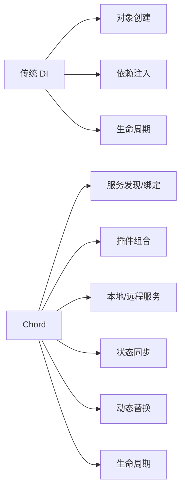

---

# 三、最简单的类比

传统 DI：

> “给我一个数据库对象。”

Chord：

> “给我一个 `UserService`。至于它现在由谁提供、在哪里运行、什么时候上线/下线，我不关心。”

所以：

```text
传统 DI

A ──inject──> B
```

而 Chord 更像：

```text
A
│
│ requires UserService
▼
Service Registry
│
│ currently provided by
▼
B
```

如果 B 被替换：

```text
A
│
│ still uses UserService
▼
Service Registry
│
├── old B
│
└── new C
```

A 不一定需要重建。

这就是 Chord 的一个重要区别。

---

# 四、Chord 其实仍然包含 DI 的思想

这一点必须说清楚。

Chord 并不是：

```text
DI ❌
Chord ✅
```

更准确的是：

```text
Chord
  =
Dependency Injection
+
Service Registry
+
Lifecycle
+
Remote Binding
+
State Replication
+
Plugin Composition
```

只是 Chord 不把“对象构造”当作核心问题。

它更关心：

> **一个功能由谁提供，以及这个功能在整个应用里如何存在。**

---

# 五、Cordis 反而非常接近传统 DI

看 DeepSeek 的 Cordis 文档就很清楚。

Cordis 定义：

```text
插件
  ↓
贡献 Service
  ↓
ctx.<key>
```

例如：

```text
ctx.tools
ctx.llm
ctx.sessions
ctx.agents
```

插件通过：

```text
inject
```

声明依赖，然后 Cordis 根据依赖决定加载顺序。

这本质上就是：

```text
Dependency Injection
+
Plugin Lifecycle
```

只是比 Spring/NestJS 的 DI 更动态。

---

# 六、Cordis 和 NestJS DI 的差别

可以这样看：

```text
NestJS DI

Module
  ↓
Provider
  ↓
Dependency Graph
  ↓
Object Instance
```

Cordis：

```text
Plugin
  ↓
Service
  ↓
Dependency Graph
  ↓
Plugin Activation
```

区别在于 Cordis 的“依赖对象”更偏向：

> **运行中的服务**

而不是：

> **某一个 class instance**

---

# 七、Cordis 比普通 DI 更强的地方：事件

这是 Cordis 与普通 DI 最大的差别之一。

DeepSeek 明确把：

```text
emit
waterfall
parallel
serial
bail
```

都作为事件机制。

尤其是：

```text
waterfall
```

实际上很像 middleware：

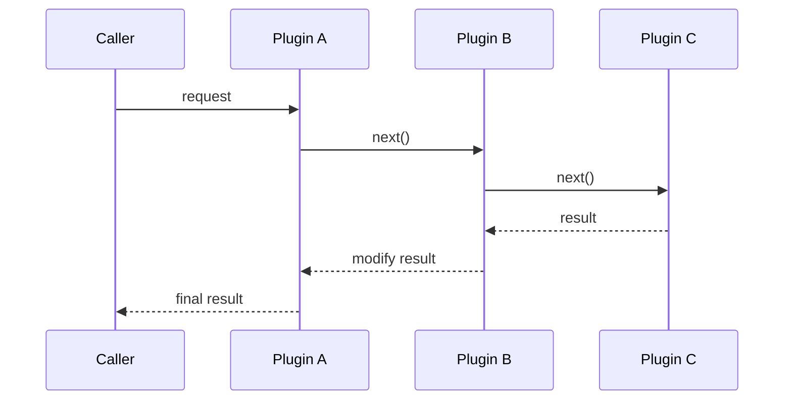

例如：

```text
agent/request
```

可能有：

```text
Plugin A
  ↓
权限检查
  ↓
Plugin B
  ↓
Prompt 修改
  ↓
Plugin C
  ↓
Telemetry
  ↓
Agent
```

传统 DI 本身不解决这个问题。

---

# 八、Cordis 最大特点：所有东西都是 Plugin

DeepSeek 的 architecture 文档非常明确：

> 模型适配器、工具注册表、会话日志、agent loop 本身都是插件。

也就是说 Cordis 的哲学是：

```text
没有：
“核心 Agent + 一堆插件”

而是：

Plugin
Plugin
Plugin
Plugin
Plugin
Plugin
    ↓
组成整个程序
```

甚至：

```text
Agent Loop
```

自己也是插件。

这是一个非常强的设计理念。

---

# 九、这和 Chord 很不一样

Chord 的理念更像：

```text
应用
│
├── Plugin
│
├── Plugin
│
├── Service
│
└── State
```

它不要求：

> “整个应用全部由插件组成。”

而 Cordis 基本就是：

```text
Application
    =
Plugin Tree
```

DeepSeek 文档直接把运行中的 dsh 描述成一棵 plugin tree。

所以：

### Cordis

```text
插件是应用的基本组成单位
```

### Chord

```text
插件是应用中可组合的模块
```

差异非常大。

---

# 十、Cordis 的 Plugin Tree

可以这样理解：

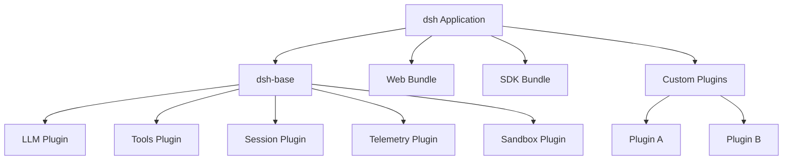

然后通过 patch：

```text
base
 ↓
bundle
 ↓
profile patch
 ↓
home patch
 ↓
CLI overlay
```

最终得到：

```text
runtime plugin tree
```

这个思路非常像：

```text
OSGI
+
DI container
+
middleware
+
plugin manager
```

---

# 十一、Chord 的模型反而更像“服务总线”

可以画：

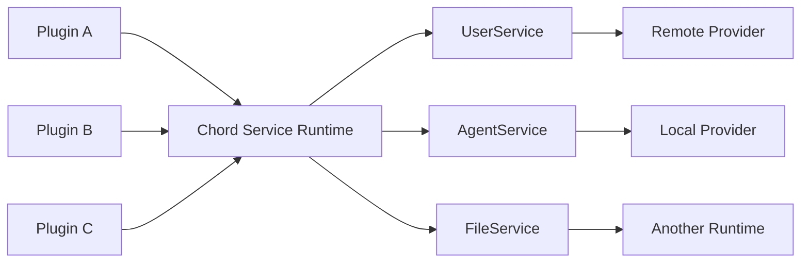

所以：

**Cordis 更像“插件系统”。**

**Chord 更像“插件 + service fabric”。**

---

# 十二、现在正式比较 Cordis 和 Chord

| 维度                     | Chord               | Cordis                |
| ---------------------- | ------------------- | --------------------- |
| 首要目的                   | 应用模块组合              | 插件化整个应用               |
| 核心对象                   | Service / Facet     | Plugin / Service      |
| DI                     | 有类似思想               | 很核心                   |
| Service Registry       | 核心                  | 核心                    |
| 依赖声明                   | Service requirement | `inject`              |
| 生命周期                   | 很重要                 | 很重要                   |
| 动态卸载                   | 强                   | 强                     |
| 动态替换                   | 强                   | 强                     |
| 事件系统                   | 有，但不是核心重点           | 极核心                   |
| Middleware / waterfall | 非核心                 | 核心                    |
| Remote Service         | **核心能力**            | 不是核心设计中心              |
| Replicated State       | **核心能力**            | 非核心                   |
| 跨进程                    | **设计目标之一**          | 更多是应用插件模型             |
| 跨运行环境                  | **明确支持**            | 更多依赖应用组合              |
| Plugin Tree            | 有                   | **核心模型**              |
| Profile / Bundle       | 有 Facet / Bundle    | **核心机制**              |
| Agent Loop             | 不关心                 | 可以作为 Plugin           |
| LLM                    | 不关心                 | 可以作为 Plugin           |
| Session                | 不关心                 | 可以作为 Plugin           |
| 用途                     | application runtime | application framework |

---

# 十三、最关键的架构差异

我认为真正的分界线只有三个。

## 第一：Cordis 是“组装程序”

```text
Plugin A
Plugin B
Plugin C
Plugin D
    ↓
Cordis
    ↓
Application
```

它解决：

> **程序怎么被组装起来。**

---

## 第二：Chord 是“连接运行中的程序模块”

```text
Browser
    │
Worker
    │
Backend
    │
Service
    │
State
    │
Chord
```

它解决：

> **运行起来之后，这些东西怎么互相提供能力。**

---

## 第三：Chord 天生考虑 remote

这是两者最大的实际差异。

Chord 明确定义：

```text
local service
remote service
service subscription
state snapshot
state update
```

而且专门设计：

```text
service catalogue
remote binding
replicated state
```

Cordis 的主要抽象仍然是：

```text
ctx
plugin
event
effect
```

---

# 十四、一个非常直观的对比

假设做一个 AI Coding Agent。

### Cordis 思路

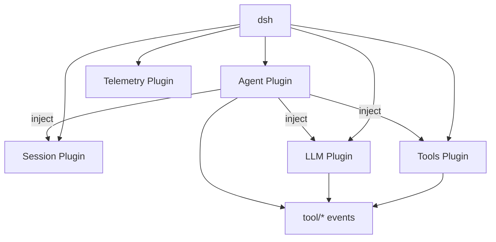

核心：

> **把 Agent 本身拆成一棵 Plugin Tree。**

---

### Chord 思路

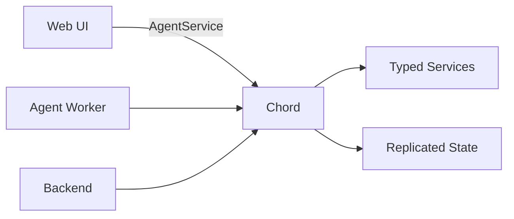

核心：

> **让 Agent Worker、Web UI、Backend 成为可以组合的 runtime components。**

---

# 十五、其实这两套设计可以组合

这点非常重要。

它们不是互斥的。

理想状态甚至可以：

```text
Cordis
   ↓
负责一个进程内部的 Plugin Composition

Chord
   ↓
负责不同 Runtime / Process 之间的 Service Composition
```

例如：

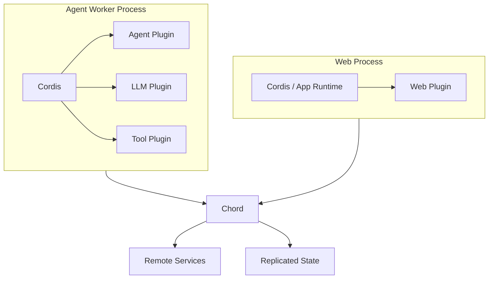

这样就是：

```text
Cordis
= 进程内部怎么组织

Chord
= 进程之间怎么组织
```

这其实是一个非常漂亮的组合。

---

# 十六、但 Pi 为什么自己没有直接照着 Cordis 做？

这里我认为是一个非常关键的工程判断。

Pi 的设计显然更偏：

```text
明确的核心 runtime
+
显式 service boundary
+
轻量 extension
```

而 DeepSeek 的设计偏：

```text
一切 Plugin
+
Plugin Tree
+
事件驱动
+
可逆副作用
```

Pi 不希望：

```text
Agent
```

本身被大量 event middleware 包围。

而是保持：

```text
Agent
 ↓
Agent Loop
 ↓
Tool
```

这条核心路径比较直接。

然后：

```text
Extension
Session
Telemetry
Protocol
Chord
```

逐渐向外扩。

---

# 十七、这也是两个项目气质非常不同的地方

### Cordis

哲学是：

> **不要有不可替换的核心。**

DeepSeek architecture 文档直接说：

> 不存在需要打补丁的特权内核。

整个应用都是 plugin。

这是很强的“everything is a plugin”哲学。

---

### Chord

哲学则更像：

> **给应用一个稳定的运行时骨架，然后让各个模块通过 Service/Facet 接入。**

所以它仍然有明显的 runtime primitives：

```text
FacetHost
Service
ReplicatedState
RemoteService
Context
```

而不是完全把所有东西都变成 plugin callback。

---

# 十八、所以第一问最终答案

你问：

> 为什么 Chord 不用传统 DI？

我会修正前面的说法：

**它不是不用 DI，而是不满足于 DI。**

传统 DI：

```text
“我要一个对象”
```

Chord：

```text
“我要一个服务”
       +
“这个服务可能在远程”
       +
“它可以被替换”
       +
“它有生命周期”
       +
“我还可能订阅它的状态”
```

所以关系是：

```text
传统 DI
   ↓
解决依赖注入

Chord
   ↓
DI
+
Service discovery
+
Lifecycle
+
Remote binding
+
State replication
+
Dynamic composition
```

---

# 十九、第二问最终答案：Cordis vs Chord 的本质

我会用一句最简单的话区分：

> **Cordis 是“怎么把一个程序拼起来”；Chord 是“怎么把已经运行起来的多个模块连接起来”。**

再极简一点：

```text
Cordis
    = Plugin Composition

Chord
    = Runtime Composition
```

而最新 DeepSeek Harness 自己的架构其实正好说明了这种区别：它把 **Cordis 作为整个 dsh 的底层插件框架**，模型、工具、session、agent loop 都可以成为 plugin；它的架构重点是 plugin tree、`ctx` service、inject、事件和可逆 effect。

Pi 的 Chord 则把重点放到了 **Facet / Service / Remote Service / Replicated State**，甚至明确声明它本身不依赖 Pi，可以作为独立应用组合 runtime 使用。

所以从架构思想上：

```text
                 Application Architecture
                         │
           ┌─────────────┴─────────────┐
           │                           │
       Cordis                       Chord
           │                           │
  “程序内部怎么组织”          “运行时模块怎么连接”
           │                           │
     Plugin Tree                  Service Graph
     DI / inject                  Local / Remote
     Event / waterfall            Replicated State
     Reversible effects           Facets / lifecycle
```

**如果只研究 Agent Framework，我会优先研究 Cordis。**

**如果研究“企业 Agent Platform / Agent Runtime”，我反而认为 Chord 更值得长期盯着，因为它开始触碰 `Agent Worker + Web + Service + Remote State + Runtime Composition` 这个更大的问题。**

而你现在正在考虑的企业 Agent 平台，实际上很可能最终会同时需要 **Cordis 所解决的“内部插件组合”能力 + Chord 所解决的“运行时服务组合”能力**。


-----------


可以。`Chord` 前面的解释确实太“架构师黑话”了。把术语全部去掉，直接说它**到底在解决什么问题、为什么 Pi 需要它、什么时候有用**。

---

# 先用一句人话解释 Chord

**Chord 就是一个“让一个应用里的不同模块、不同进程、不同机器彼此提供功能和共享状态”的小型运行时。**

它自己**不是 Agent**，也**不是 LLM framework**。

你可以先把它想成：

> **“给复杂应用搭积木的中间层。”**

比如一个 Agent 产品以后可能有：

```text
前端 Web
   │
   ├── Agent 聊天界面
   ├── 文件浏览器
   └── 实时任务状态

Agent Worker
   │
   ├── 跑 LLM
   ├── 跑工具
   └── 执行任务

后台服务
   │
   ├── 用户信息
   ├── 数据库
   └── 其他业务服务
```

这些东西可能不在一个进程里。

Chord 就负责让它们能够比较规整地：

```text
谁提供什么功能
谁需要什么功能
谁能调用谁
谁的状态可以共享
模块挂了之后怎么办
模块升级怎么替换
```

---

# 1. 为什么普通项目不需要 Chord？

如果你写一个普通 Node.js 程序：

```text
main()
 ├── db
 ├── service
 ├── agent
 └── ui
```

直接 import：

```typescript
import { userService } from "./userService";
```

就完事。

但是一旦系统变成：

```text
Browser
   ↓
Web Server
   ↓
Agent Worker
   ↓
Tool Worker
   ↓
Another Service
```

你就不能再简单：

```typescript
import { userService } ...
```

因为它们根本不在一个 JavaScript 进程里。

你马上要自己处理：

```text
RPC
连接
断线
重连
服务发现
状态同步
版本
生命周期
插件
```

**Chord 就是在解决这一堆问题。**

---

# 2. Chord 最核心的东西其实只有两个

先只记住：

```text
Service
State
```

## Service

就是：

> “我提供一个功能，你可以调用我。”

比如：

```text
UserService
 ├── getUser()
 └── updateUser()

AgentService
 ├── sendMessage()
 ├── abort()
 └── getStatus()

FileService
 ├── readFile()
 └── writeFile()
```

Chord 帮你管理：

```text
谁提供 UserService
谁需要 UserService
UserService 在本地还是远程
服务挂了没有
服务换了一个实现怎么办
```

---

# 3. State 就更好理解

比如 Agent 当前状态：

```json
{
  "status": "running",
  "currentTool": "grep",
  "progress": 62
}
```

如果 Agent 在 Worker 进程里：

```text
Agent Worker
      │
      │ state
      ▼
{ status: running }
```

而 Web UI 在另外一个进程：

```text
Web Browser
```

你希望 UI 能实时看到：

```text
running
 ↓
grep
 ↓
62%
 ↓
done
```

Chord 就提供了一套：

```text
共享状态
+
增量更新
```

机制。

---

# 4. 所以 Chord 可以先理解成这样

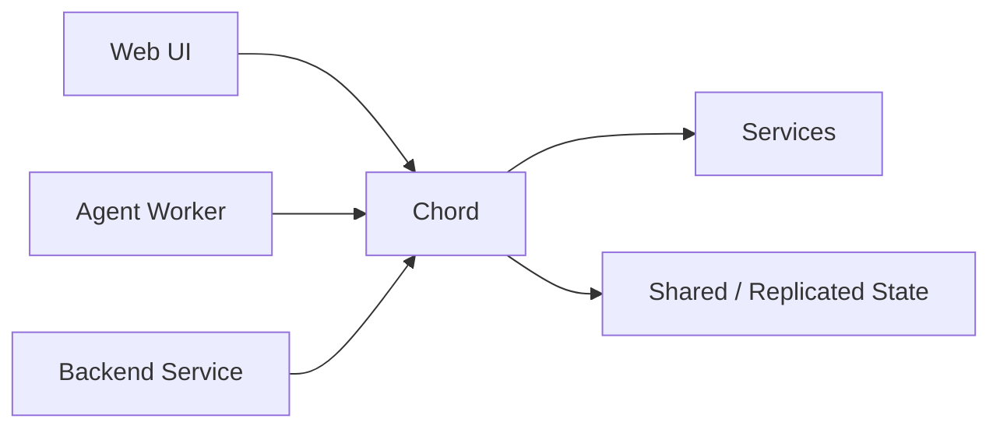

**Chord 在中间。**

它不是 Agent 本身。

它是：

> **把多个模块粘起来的东西。**

---

# 5. 那为什么叫 Facet？

这是 Chord 里最容易把人搞晕的词。

其实非常简单。

一个“插件”可能需要在不同地方运行。

例如一个插件叫：

```text
GitHub Plugin
```

它可能包含：

```text
GitHub Plugin
├── Worker 部分
├── Web UI 部分
└── Backend 部分
```

这三个部分就是 Facet。

可以直接理解成：

> **一个插件的不同“侧面”。**

例如：

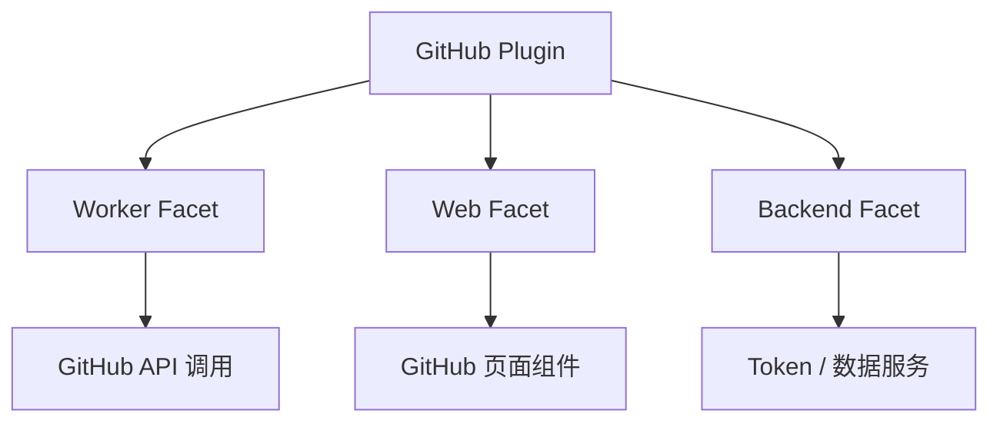

所以：

**Plugin = 一个完整功能**

**Facet = 这个功能在不同运行环境里的那一部分**

---

# 6. 为什么不直接叫 Plugin？

因为普通 Plugin 经常默认：

```text
加载进当前程序
```

但 Chord 想做的是：

```text
同一个功能
可以拆到多个环境
```

比如：

```text
GitHub Plugin

Browser
  └── UI

Agent Worker
  └── 工具

Server
  └── OAuth / 数据
```

这时候单纯叫 Plugin 已经不够表达了。

所以用了：

```text
Plugin
  ├── Facet A
  ├── Facet B
  └── Facet C
```

---

# 7. Facet 之间怎么通信？

通过 Service。

例如：

```text
Browser Facet
     │
     │ needs
     ▼
GitHubService
     ▲
     │ provides
     │
Server Facet
```

所以实际上：

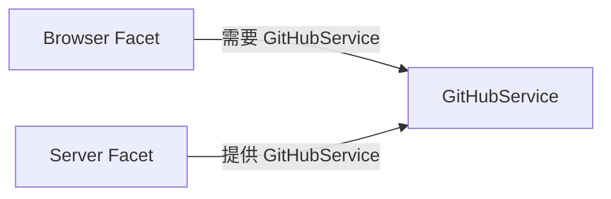

这里就开始体现 Chord 的价值了。

Browser 不需要知道：

```text
GitHubService
到底在哪个进程
到底在哪台机器
怎么 RPC
怎么建立连接
```

它只知道：

```text
我要 GitHubService
```

---

# 8. 这和传统微服务有什么区别？

其实有点像，但没那么重。

传统微服务经常是：

```text
Service A
   ↓ HTTP
Service B
```

你自己定义：

```text
REST API
OpenAPI
HTTP
认证
服务发现
```

Chord 更像：

```text
Application 内部的模块化运行时
```

它让你可以写成：

```text
consumer -> Service
provider -> Service
```

然后 Chord 负责：

```text
绑定
生命周期
远程调用
订阅
状态
```

所以我会把它理解成：

> **比普通 dependency injection 更远，比完整微服务平台更轻。**

---

# 9. Chord 的“Remote Service”到底是什么？

假设：

```text
Agent Worker
```

需要：

```text
UserService
```

而：

```text
UserService
```

在 Server 上。

传统做法：

```text
Agent
   ↓ HTTP
/api/user/123
   ↓
Server
```

Chord 做的是：

```text
Agent
   │
   ▼
UserService
   │
   │ remote binding
   ▼
Server
```

对于 Agent 来说，它拿到的还是一个 Service。

所以：

```text
本地 Service
```

和：

```text
远程 Service
```

尽量使用同一种编程模型。

---

# 10. 那 Replicated State 又是什么？

这个就和 Service 不一样了。

Service：

> **我找你办一件事。**

State：

> **你把你的当前状态告诉我。**

例如 Agent Worker：

```json
{
  "status": "running",
  "tool": "bash",
  "progress": 72
}
```

Web UI 只想订阅这个状态。

那么：

```text
Agent Worker
   │
   │ publish
   ▼
Chord
   │
   │ update
   ▼
Web UI
```

---

# 11. 为什么需要 Delta？

因为 Agent 状态变化特别频繁。

例如：

```text
progress = 70
progress = 71
progress = 72
progress = 73
...
```

没必要每次把整个对象发过去。

Chord 的 delta tracking 更像：

```text
第一次：

{
  status: "running",
  progress: 70
}

之后：

progress = 71

之后：

progress = 72
```

也就是：

```text
Snapshot
   +
Delta
   +
Delta
   +
Delta
```

README 对这个机制的描述就是：先有完整 base batch，之后使用 path-based changes，并可以在远端 apply。

---

# 12. 用一个真实一点的 Agent 例子

假设未来 Pi 有：

```text
Agent Worker
├── LLM
├── Tools
└── Session
```

同时：

```text
Web UI
```

想显示：

```text
当前问题
模型正在思考
正在执行 bash
bash 输出
当前 token
当前状态
```

那么非常自然：

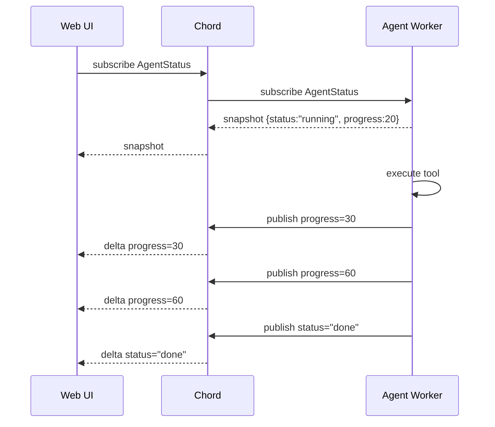

这个就是 Chord 最容易理解的使用场景。

---

# 13. Chord 还有一个很重要的能力：插件可以动态替换

Chord 的设计不只是：

```text
Service A → Service B
```

它还考虑：

```text
Service provider
     ↓
升级
     ↓
新版本 provider
```

也就是说：

```text
旧 Provider
     │
     │ running
     ▼
Chord

新 Provider
     │
     │ load
     ▼
Chord
```

然后切换。

README 对这一点描述得很明确：可以先加载候选版本、验证依赖，再完成切换，并尽量保持稳定的 Service handle；旧 provider 在成功切换后再释放。

这就比较像：

> **应用内部的小型动态模块平台。**

---

# 14. 为什么需要这个东西？

假设未来你的 Agent 平台有：

```text
Agent Core
Tool Service
File Service
Credential Service
LLM Service
Telemetry Service
UI Service
```

它们可能逐渐变成：

```text
             Application
                  │
       ┌──────────┼──────────┐
       │          │          │
     Agent       File       User
       │          │          │
       └──────────┼──────────┘
                  │
               Services
                  │
             Chord Runtime
```

此时如果没有类似 Chord：

```text
每个团队自己搞 RPC
每个团队自己搞插件
每个团队自己搞状态同步
每个团队自己搞生命周期
```

会越来越乱。

---

# 15. 但必须注意：Chord 不是 Agent Framework

这一点非常重要。

它不会负责：

```text
LLM reasoning
tool calling
agent loop
prompt
memory
RAG
planning
```

这些是：

```text
pi-agent-core
pi-coding-agent
```

负责的。

Chord 解决的是：

```text
Agent 是一个模块
```

之后：

> **这个模块怎么和整个应用里的其他模块组合。**

---

# 16. 所以 Pi 现在其实出现了两套完全不同的“运行时”

这个角度最容易理解。

## Agent Runtime

```text
pi-agent-core
       │
       ▼
Agent Loop
       │
       ├── LLM
       ├── Tool
       ├── State
       └── Conversation
```

解决：

> **AI 怎么工作。**

---

## Application Runtime

```text
Chord
       │
       ├── Plugin
       ├── Facet
       ├── Service
       ├── Remote Service
       └── Replicated State
```

解决：

> **整个应用怎么拼起来。**

---

# 17. 最终把它们放一起，你就容易懂了

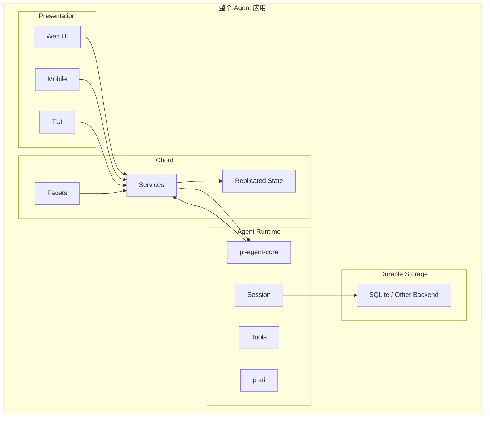

然后记住：

```text
pi-agent-core
   ↓
“Agent 怎么干活”

Session Backend
   ↓
“Agent 干过什么，停了还能不能恢复”

protocol/server/client
   ↓
“别人怎么访问这个 Agent”

telemetry
   ↓
“Agent 到底发生了什么”

Chord
   ↓
“这个 Agent 怎么和整个应用里的其他模块拼起来”
```

这才是我认为最接近人话的解释。

---

# 18. Chord 最值得你关注的，其实不是现在

对于你现在研究的企业 AI Platform，我尤其建议关注 Chord 的**思想，而不是直接照搬它**。

因为它实际上在解决一个很现实的问题：

```text
Agent
  ↓
逐渐不是一个函数
  ↓
变成一个长期运行的应用组件
  ↓
开始需要：
  ├── UI
  ├── 服务
  ├── 状态
  ├── 远程访问
  ├── 插件
  ├── 生命周期
  └── 动态升级
```

一旦走到这一步：

```text
Agent Framework
```

本身已经不够了。

你需要：

```text
Agent Runtime
+
Application Runtime
```

而 **Chord 就是在探索后者。**

所以如果把整个最新 Pi 用一句最简单的话总结：

> **`pi-agent-core` 负责“AI 会干活”，`AgentHarness` 负责“干活可以持续、恢复和管理”，`protocol/server` 负责“别人可以远程操作它”，`session-backends` 负责“状态可靠保存”，`telemetry` 负责“看清楚它怎么运行”，而 `Chord` 负责“把这个 Agent 和整个应用的其他模块拼起来”。**

这几个模块真正组合起来之后，Pi 的方向就已经明显不是早期 0.7.x 那种“一个终端里的 coding agent”了。


-----------


这几个模块放在一起看，意义非常大。它们并不是“新增几个工具包”，而是 Pi 正在从早期的 **local interactive coding agent**，逐渐演化成一个具备 **durable runtime、remote presentation、pluggable storage、vendor-neutral observability、application composition** 的 Agent Runtime。

尤其值得注意的是：当前 `main` 已经出现了一个新的核心抽象 **`AgentHarness`**，而 `protocol / server / client / session-backends / telemetry / chord` 基本都围绕这个方向展开。当前仓库的 `AgentHarness` 规范甚至已经把系统定义为“durable runtime for agent conversations”，强调中断后恢复且不重复已经结算的副作用。

---

# 一、先给结论：Pi 正在形成什么

我会把现在的 Pi 理解成：

```text
                         ┌──────────────────────────┐
                         │       Applications       │
                         │ CLI / TUI / IDE / WebUI  │
                         └────────────┬─────────────┘
                                      │
                           protocol / client / server
                                      │
                         ┌────────────▼─────────────┐
                         │   Agent Application      │
                         │       Runtime            │
                         │                            │
                         │ AgentHarness / AgentLane  │
                         │ Session / Branch          │
                         │ Operation / Recovery      │
                         │ Tool / Prompt / Hooks     │
                         └────────────┬─────────────┘
                                      │
                         ┌────────────▼─────────────┐
                         │      Agent Kernel        │
                         │      pi-agent-core       │
                         │ Agent Loop / State / Tool │
                         └────────────┬─────────────┘
                                      │
                         ┌────────────▼─────────────┐
                         │         pi-ai            │
                         │ Provider / Stream / Auth │
                         └──────────────────────────┘

                    ┌───────────────────────────────┐
                    │ Cross-cutting infrastructure │
                    │ telemetry / storage / chord   │
                    └───────────────────────────────┘
```

真正的新东西是：

> **Pi 开始把“一个 Agent 调用模型”与“一个可以长期运行、可恢复、可远程访问的 Agent 工作负载”区分开。**

这和 0.x 早期版本的思维方式已经明显不同。

---

# 二、最重要的新抽象：AgentHarness

先不要急着分别看四个 package。

真正的中心是：

```text
AgentHarness
   │
   ├── Session
   ├── Branch
   ├── AgentLane
   ├── Operation
   ├── Storage
   ├── Tool Registry
   ├── Prompt Resources
   ├── Hooks
   ├── Context
   └── Telemetry
```

当前规范直接把 AgentHarness 描述为：

> durable runtime for agent conversations

并定义了四个核心原语：

```text
accept
drive
requestAbort
inspectExecution
```

而 `prompt / resume / abort` 都只是组合这些底层能力的 convenience API。也就是说：

```text
prompt()
```

已经不再是架构上的最底层 primitive。

更底层的是：

```text
accept operation
      ↓
durable state transition
      ↓
drive
      ↓
next durable state
```

这是非常关键的变化。

---

# 三、`session-backends`：真正开始把 Session 当成数据库抽象

这是我认为这几个新模块里**最重要的一个**。

以前容易把 Session 理解成：

```text
messages.jsonl
```

现在不是。

当前 AgentHarness 的 Session 模型实际上是：

```text
Session
├── immutable Entry Tree
├── mutable Values
├── mutable Lists
├── Branches
├── Agent Lanes
└── Usage Ledger
```

规范明确把持久化数据分成三大类：

```text
entries        conversation tree
values/lists   current mutable state
usage ledger   cost history
```

并且强调：

> 每一个 durable payload 必须属于 entry、bound value/list 或 usage ledger。

所以 `session-backends` 的意义不是：

> “让 Session 可以改用 SQLite”

真正意义是：

> **把 Agent Runtime 的 durable state 与具体数据库彻底解耦。**

---

## 1. 当前 SQLite backend

当前提供的是：

```text
@earendil-works/pi-session-backend-sqlite-node
```

基于 Node `node:sqlite`。

其上层核心接口来自：

```text
@earendil-works/pi-agent-core
```

SQLite 只是 adapter/backend。

结构实际上是：

```text
AgentHarness
      │
      ▼
   Session
      │
      ▼
 Session Repository
      │
      ▼
 Session Backend
      │
      └── SQLite
```

而不是：

```text
AgentHarness
      ↓
SQLite API
```

---

# 四、Session backend 真正解决的是“多进程/恢复/生命周期”

SQLite backend 自己并不负责：

* distributed locking
* worker lease
* ownership takeover
* heartbeat
* scheduling

README 甚至明确说：

> host lifecycle guarantees one writable owner per Session

backend 不负责跨进程 ownership。

这是一个非常成熟的边界。

也就是说：

```text
Storage responsibility
        ≠
Runtime ownership responsibility
```

这两个问题被分开了。

---

## 2. 一个很重要的模型

```text
            Session
               │
       ┌───────┴────────┐
       │                │
   durable state      live owner
       │                │
    SQLite            Worker
```

SQLite：

> “现在 Session 数据是什么？”

Worker/Host：

> “现在谁有权修改这个 Session？”

这就是为什么后面又出现 `server / protocol`。

---

# 五、Session 的新模型实际上是“Conversation Tree + Execution State”

当前规范里非常重要的一点是：

```text
Conversation History
        ≠
Execution State
```

Session Tree 负责：

```text
messages
compaction
branch summary
custom entries
```

而 Agent Operation 负责：

```text
what is executing now
what step is next
what tool call is uncertain
how to recover
```

可以画成：

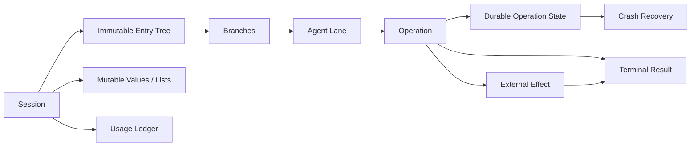

这个划分非常重要。

---

# 六、Pi 为什么现在需要 `protocol`

因为一旦 Session 和 Agent execution 被做成 durable runtime：

```text
Agent
```

就不再必须和：

```text
UI
```

处于同一个 process。

于是出现：

```text
Process A

Web / TUI / Mobile
       │
       ▼
     Client
       │
       ▼
    Protocol
       │
       ▼
     Server
       │
       ▼
 Agent Session Worker
```

当前 protocol version 已经是 **8**，不是简单 JSON-RPC。

协议层当前定义了：

```text
hello
request
cancel
response
service_update
attachment
```

以及：

```text
ServerTarget
SessionTarget
```

其中 `SessionTarget` 本身包含：

```text
serverId
sessionId
attachmentId
```

这个设计透露了一个非常重要的理念：

> **连接本身不是 Session。**

---

# 七、`attachmentId` 是非常值得注意的设计

因为真正的结构是：

```text
Server
 └── Session
       └── Attachment
             └── Client connection
```

而不是：

```text
Client
 └── Session
```

这样就能支持：

```text
同一个 Session
    │
    ├── TUI
    ├── Web
    ├── Mobile
    └── automation
```

各自有自己的 presentation attachment。

这也是为什么 server types 中明确存在：

```text
RoutedSessionHandle
RoutedSessionAttachment
RoutedServerServiceAttachment
```

并把“Session capability”与连接生命周期分开。

---

# 八、`server`：不是普通 HTTP Server

这里容易误解。

Pi 当前 `server` 并不是：

```text
Express/Fastify
     +
REST API
```

而更像：

> **Agent Runtime Presentation Gateway**

它做：

```text
Connection
   ↓
Handshake
   ↓
Protocol decode
   ↓
Request routing
   ↓
Session routing
   ↓
Service invocation
   ↓
Cancellation
   ↓
Event / update
```

当前 `Server` 明确管理：

* connection state
* handshake
* active request
* cancellation
* session routing
* server services
* attachment
* service subscriptions

---

# 九、Server 的核心时序

这个过程现在已经可以画得非常清楚：

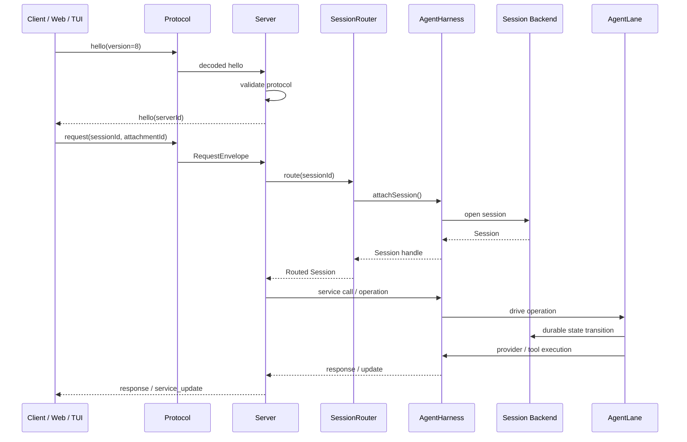

特别重要的是：

```text
UI ≠ Agent
UI ≠ Session Owner
Protocol ≠ Runtime
Server ≠ Storage
```

这些边界已经很清晰。

---

# 十、`protocol` 为什么没有直接规定 Transport

这也是很好的设计。

Protocol 负责：

```text
Envelope
Framing
Codec
Validation
Version
Targeting
Cancellation
```

而 `server` 只需要一个：

```text
ByteConnection
```

所以实际 transport 可以是：

```text
Unix socket
TCP
WebSocket
stdio
embedded transport
```

而 protocol 不需要知道。

Server 当前就是通过 listener / byte connection 接收数据。

这是一种比较标准的：

```text
Application Protocol
        ≠
Transport
```

分离。

---

# 十一、`client` 实际上是 Protocol 的反面

现在 package：

```text
@earendil-works/pi-client
```

提供：

```text
Client
createClientServiceTransport
ByteTransport
ByteTransportFactory
ConnectionState
ServiceSubscription
AttachmentChangeListener
```

所以：

```text
          ┌───────────────┐
          │   Application │
          └───────┬───────┘
                  │
              pi-client
                  │
              ByteTransport
                  │
               protocol
                  │
              server
                  │
              Session
```

这个结构已经明显在支持：

> **remote agent UI / mobile / Web frontend**

---

# 十二、`telemetry`：不是“接 OpenTelemetry”

这个模块非常容易被低估。

现在的设计不是：

```text
import OpenTelemetry
```

而是：

```text
Pi Telemetry Contract
        │
        ├── noop
        ├── in-memory
        ├── OpenTelemetry adapter
        ├── Sentry adapter
        └── custom backend
```

README 明确强调：

* vendor-neutral
* callback-based
* explicit `TelemetryContext`
* no global current-span
* no exporter
* no telemetry backend dependency

这是非常合理的。

---

# 十三、Pi 的 Telemetry 最大亮点：Explicit Context

当前模型是：

```text
TelemetryContext
       │
       ▼
   startSpan()
       │
       ▼
   TelemetrySpan
       │
       ├── child span
       ├── attributes
       ├── events
       └── status
```

而不是依赖：

```text
AsyncLocalStorage
global current span
```

README 甚至明确要求 Pi package **显式传递 TelemetryContext**。

这对 Agent Runtime 特别重要。

因为 Agent 中经常同时有：

```text
user request
  ├── LLM request
  │    ├── retry
  │    └── provider
  ├── tool
  │    ├── bash
  │    └── filesystem
  └── persistence
```

如果依靠 ambient global context，很容易出现 trace parent 混乱。

---

# 十四、Pi 的 Telemetry 已经不是单纯“trace”

它已经定义了：

```text
Span
Parent / Child
Attribute
Event
Status
Context
Schema
```

并且还有 typed schema：

```text
AI telemetry schema
Harness telemetry schema
Session telemetry schema
```

`pi-agent-core` 自己定义 domain telemetry schema，而 telemetry package 本身不拥有 Pi 领域知识。

因此：

```text
Telemetry package
     ↓
generic contract

Agent Core
     ↓
agent-specific schema
```

这个 ownership 非常正确。

---

# 十五、最关键的一点：Telemetry 不进入 Session

这非常值得强调。

当前设计明确要求：

> telemetry 是 diagnostics，不是 business state / session state。

同时 AgentHarness 文档也明确将 telemetry 与 durable Session 分开。

因此：

```text
Session
  = durable product state

Telemetry
  = diagnostic observation
```

不是：

```text
Session
  └── spans[]
```

这是企业 Agent 平台应该采用的边界。

---

# 十六、`Chord`：这其实是另一个级别

Chord 和前面四个 package 不一样。

它不是：

```text
Pi Agent infrastructure
```

而是：

> **generic application-composition runtime**

README 明确说：

> Chord does not depend on any other Pi workspace package and can be used by unrelated applications.

所以我会把它单独画成：

```text
                 Chord
                   │
       ┌───────────┼───────────┐
       │           │           │
    Facets       Services   Replicated State
       │           │           │
       └───────────┼───────────┘
                   │
             Remote Boundary
```

---

# 十七、Chord 的核心不是 Agent，而是 Service

Chord 的基本思想是：

```text
Plugin
  ↓
Facet
  ↓
Service
```

一个 Plugin 可以拆成多个 Facets：

```text
Plugin
├── worker facet
├── presentation facet
└── backend facet
```

然后：

```text
worker facet
    ↓
requires SomeService
    ↓
remote provider
```

因此它更像：

```text
Application Composition Runtime
```

而不是：

```text
Agent Framework
```

---

# 十八、Chord 的 Facet 非常重要

它允许：

```text
同一个 Plugin

          ┌─────────────┐
          │    Plugin   │
          └──────┬──────┘
                 │
       ┌─────────┼─────────┐
       ▼         ▼         ▼
    Worker   Presentation  Backend
```

分别部署到不同环境。

README 给的方向就是：

```text
backend
browser
TUI
worker
```

这与当前 Pi 的：

```text
Agent Worker
+
TUI
+
Remote WebUI
```

方向高度吻合。

---

# 十九、Chord 最有意思的是 Replicated State

Chord 提供：

```text
replicatedState()
```

生产者：

```text
state.foo = ...
publish()
```

然后远程消费者收到：

```text
snapshot
+
delta updates
```

并且底层有：

```text
track()
flush()
apply()
applyImmutable()
```

因此它实际上解决：

> “多个 runtime facet 怎样共享 application state？”

而不是：

> “Agent 怎样调用 LLM？”

---

# 二十、Chord 的 Delta 设计

例如：

```typescript
const changes = track({
    output: "",
    count: 0
});

changes.state.output += "done";
changes.state.count += 1;

const ops = changes.flush();
```

生成的不是：

```text
whole object snapshot
```

而是：

```text
operations
```

然后：

```text
replica = apply(previous, ops)
```

这非常适合：

```text
Agent streaming state
Tool progress
UI state
Remote worker state
```

因为 Agent UI 通常不需要每次重新传：

```json
{
  "all": "... gigantic object ..."
}
```

---

# 二十一、Chord 的 Remote Service Boundary 很值得研究

Chord 自己定义：

```text
service catalogue
service call
service subscribe
service unsubscribe
state snapshot
state update
```

但**不规定外层 transport**。

也就是说：

```text
Chord Service Protocol
        │
        ▼
Application Transport
        │
   ┌────┼────┐
   ▼    ▼    ▼
  RPC  WS  Unix
```

README 明确说 Chord 不规定 framing、routing、transport 和 outer wire envelope。

这和 Pi 的：

```text
protocol
server
```

形成了很有意思的互补。

---

# 二十二、现在可以看出 `server + protocol + chord` 为什么同时出现

它们实际上解决三个不同的问题：

```text
protocol
=
怎样在网络上传递消息？

server
=
怎样把请求路由到正确的 Session / Service？

chord
=
怎样让多个运行环境共享 Service / State？
```

可以画成：

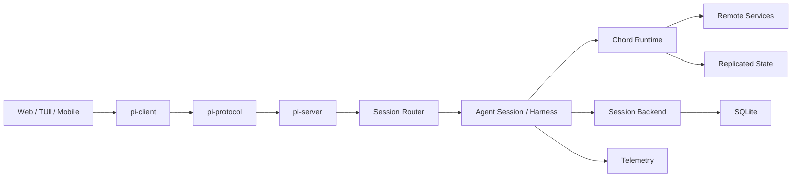

---

# 二十三、我认为现在已经出现“两套 State”

这是理解整个新架构的关键。

## Durable State

```text
Session
│
├── Entry Tree
├── Branch
├── Operation State
├── Values
├── Lists
└── Usage Ledger
```

存储：

```text
SQLite / future PostgreSQL / other backend
```

---

## Live Distributed State

```text
Chord
│
├── Service
├── Replicated State
└── Remote Facet
```

传输：

```text
RPC / websocket / custom transport
```

---

所以：

```text
Session Storage
        ≠
Chord Replicated State
```

前者关注：

> restart / durability / history

后者关注：

> live synchronization / composition / remote consumers

---

# 二十四、再加上 Telemetry，就形成第三种 State

```text
             Agent Runtime
                   │
       ┌───────────┼────────────┐
       │           │            │
       ▼           ▼            ▼
   Durable       Live        Diagnostic
    State        State          State
       │           │            │
   Session      Chord       Telemetry
       │           │            │
   SQLite       RPC        OTel/Sentry
```

这其实已经非常接近一个成熟企业 Agent Runtime 的基本架构。

---

# 二十五、最重要的恢复模型：Operation State Machine

当前 Harness 规范里还有一个非常重要的思想：

```text
accepted operation
        ↓
durable state
        ↓
drive
        ↓
external effect
        ↓
settlement
        ↓
next durable state
```

也就是说：

```text
Agent execution
```

已经被显式建模为：

> **durable state machine**

而不只是一个：

```typescript
while (...) {
   await llm();
   await tool();
}
```

---

# 二十六、这是为什么它能真正支持 Crash Recovery

例如：

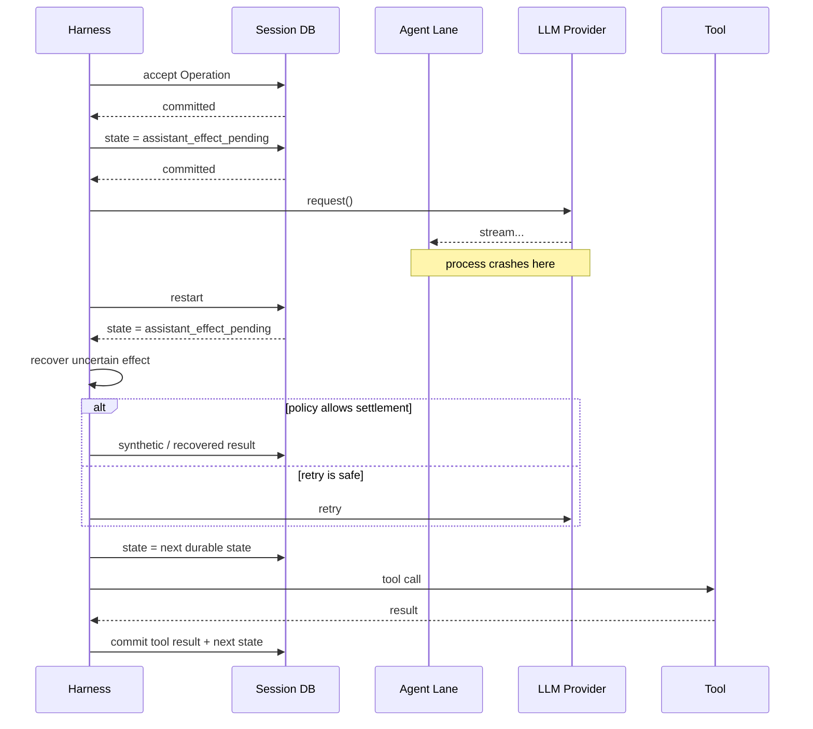

规范明确强调：

> crash recovery 从最后一个 committed operation state 开始，不 replay journal，也不根据“缺失了什么”来猜当前阶段。

这个设计比传统 Agent framework 要深很多。

---

# 二十七、最有价值的整体架构图

我建议以后研究 Pi，直接用下面这张。

```mermaid
flowchart TB

    %% =========================
    %% Presentation
    %% =========================

    subgraph PRESENTATION["Presentation / Client Layer"]
        WEB["Web UI"]
        MOBILE["Mobile"]
        TUI["TUI"]
        CLI["CLI"]
        CUSTOM["Custom Application"]
    end

    %% =========================
    %% Remote Connectivity
    %% =========================

    subgraph REMOTE["Remote Connectivity Layer"]
        CLIENT["pi-client"]
        PROTOCOL["pi-protocol"]
        SERVER["pi-server"]
        ROUTER["SessionRouter / Attachments"]
    end

    %% =========================
    %% Agent Application Runtime
    %% =========================

    subgraph RUNTIME["Durable Agent Application Runtime"]
        HARNESS["AgentHarness"]

        LANE["AgentLane"]
        OP["Operation"]

        SESSION["Session"]
        BRANCH["Branch"]

        ENTRIES["Immutable Entry Tree"]
        VALUES["Mutable Values / Lists"]
        LEDGER["Usage Ledger"]

        DRIVE["accept / drive / abort / inspect"]

        TOOLS["Tool Registry / Execution"]
        RESOURCES["Prompt / Skill / Resources"]
        HOOKS["Hooks / Events"]

        RECOVERY["Recovery / Abort / Close"]
        COMPACTION["Compaction / Branching"]
    end

    %% =========================
    %% Agent Kernel
    %% =========================

    subgraph AGENT["Agent Kernel"]
        CORE["pi-agent-core Agent"]

        LOOP["Agent Loop"]
        STATE["Agent State"]
        QUEUE["Steering / Follow-up"]

        TOOLCALL["Tool Execution"]
        CONTEXT["Context Transformation"]
    end

    %% =========================
    %% LLM Infrastructure
    %% =========================

    subgraph AI["LLM Infrastructure"]
        PIAI["pi-ai"]

        MODEL["Models"]
        PROVIDER["Providers"]
        AUTH["Auth"]
        STREAM["Streaming"]
        RETRY["Retry / Overflow"]
        USAGE["AI Usage"]
    end

    %% =========================
    %% Storage
    %% =========================

    subgraph STORAGE["Session Backend Layer"]
        REPO["Session Repository"]
        BACKEND["Session Backend Interface"]
        SQLITE["SQLite Node Backend"]
        FUTUREDB["Future PostgreSQL / Other Backend"]
    end

    %% =========================
    %% Application Composition
    %% =========================

    subgraph CHORD["Chord Application Composition Runtime"]
        FACETS["Facets"]
        SERVICES["Typed Services"]
        REMOTESVC["Remote Service Boundary"]
        REPLICA["Replicated State"]
        DELTA["Delta Tracking"]
        CHORDCTX["Chord Context"]
    end

    %% =========================
    %% Telemetry
    %% =========================

    subgraph OBS["Telemetry"]
        TCTX["TelemetryContext"]
        SPANS["Typed Spans"]
        SCHEMAS["Domain Telemetry Schemas"]
        ADAPTERS["OTel / Sentry / Logs / Custom Adapter"]
    end

    %% =========================
    %% Host
    %% =========================

    subgraph HOST["Host / External Effects"]
        FS["Filesystem"]
        SHELL["Shell / Process"]
        NETWORK["Network"]
        LLMEXT["External LLM APIs"]
    end

    %% =========================
    %% Presentation path
    %% =========================

    WEB --> CLIENT
    MOBILE --> CLIENT
    TUI --> CLI
    CUSTOM --> CLIENT

    CLIENT --> PROTOCOL
    PROTOCOL --> SERVER
    SERVER --> ROUTER
    ROUTER --> HARNESS

    %% =========================
    %% Harness
    %% =========================

    HARNESS --> SESSION
    HARNESS --> LANE
    HARNESS --> DRIVE
    HARNESS --> TOOLS
    HARNESS --> RESOURCES
    HARNESS --> HOOKS
    HARNESS --> RECOVERY
    HARNESS --> COMPACTION

    SESSION --> BRANCH
    SESSION --> ENTRIES
    SESSION --> VALUES
    SESSION --> LEDGER

    LANE --> OP
    OP --> DRIVE
    OP --> RECOVERY

    %% =========================
    %% Agent Kernel
    %% =========================

    HARNESS --> CORE
    CORE --> LOOP
    CORE --> STATE
    CORE --> QUEUE
    CORE --> TOOLCALL
    CORE --> CONTEXT

    LOOP --> PIAI
    TOOLCALL --> TOOLS

    %% =========================
    %% AI
    %% =========================

    PIAI --> MODEL
    PIAI --> PROVIDER
    PIAI --> AUTH
    PIAI --> STREAM
    PIAI --> RETRY
    PIAI --> USAGE

    PROVIDER --> LLMEXT

    %% =========================
    %% Storage
    %% =========================

    SESSION --> REPO
    REPO --> BACKEND
    BACKEND --> SQLITE
    BACKEND -. future .-> FUTUREDB

    %% =========================
    %% Host effects
    %% =========================

    TOOLS --> FS
    TOOLS --> SHELL
    TOOLS --> NETWORK

    %% =========================
    %% Chord
    %% =========================

    HARNESS --> FACETS
    FACETS --> SERVICES
    SERVICES --> REMOTESVC
    REMOTESVC --> REPLICA
    REPLICA --> DELTA
    FACETS --> CHORDCTX

    SERVER -. service transport .-> REMOTESVC

    %% =========================
    %% Telemetry
    %% =========================

    HARNESS --> TCTX
    CORE --> TCTX
    PIAI --> TCTX

    TCTX --> SPANS
    SPANS --> SCHEMAS
    SCHEMAS --> ADAPTERS
```

---

# 二十八、我认为这几个模块之间最正确的关系

可以进一步归纳成：

```text
                    ┌────────────────┐
                    │   pi-client    │
                    └───────┬────────┘
                            │
                    ┌───────▼────────┐
                    │  pi-protocol   │
                    └───────┬────────┘
                            │
                    ┌───────▼────────┐
                    │    pi-server   │
                    └───────┬────────┘
                            │
                    ┌───────▼────────┐
                    │  AgentHarness  │
                    └───────┬────────┘
                            │
       ┌────────────────────┼────────────────────┐
       │                    │                    │
       ▼                    ▼                    ▼
   Session               Agent               Chord
       │                    │                    │
       ▼                    ▼                    ▼
Session Backend         pi-agent-core        Services
       │                    │                Replicated State
       ▼                    ▼
    SQLite                pi-ai

                    ┌────────────────┐
                    │   telemetry   │
                    └────────────────┘
                       ↑    ↑    ↑
                       └────┴────┘
```

其中：

**Session Backend**
负责“我怎样可靠地保存 Agent 世界”。

**Protocol**
负责“我怎样把这个 Agent 世界暴露出去”。

**Server**
负责“谁现在连接到了哪个 Agent 世界”。

**Chord**
负责“不同 runtime/facet 如何组成一个 application，并共享 live service/state”。

**Telemetry**
负责“发生了什么，以及为什么发生”。

这五个问题是完全不同的。

---

# 二十九、为什么我认为这是 Pi 相比早期版本最大的架构跃迁

早期 Pi 更接近：

```text
User
 ↓
CLI
 ↓
Agent
 ↓
LLM
 ↓
Tools
```

现在正在变成：

```text
                       Client
                         │
                    Protocol
                         │
                      Server
                         │
                     Session
                         │
                 ┌───────┴────────┐
                 │                │
             Agent Lane       Session State
                 │                │
             Operation         Backend
                 │                │
            Agent Kernel        SQLite
                 │
                pi-ai

             ┌──────────────┐
             │    Chord     │
             │ live service │
             │ replicated   │
             │ state        │
             └──────────────┘

             ┌──────────────┐
             │  Telemetry   │
             └──────────────┘
```

所以它现在已经非常接近：

> **Agent Operating Runtime**

而不只是：

> **Coding Agent Library**

---

# 三十、对你现在研究的企业 Agent Platform，价值非常高的启示

结合你前面在设计的：

```text
LangChain / DeepAgents
        +
AgentCore
        +
LangSmith
        +
自建 AI Platform
```

我觉得 Pi 当前这波架构最值得吸收的不是某个 API，而是这四个边界：

```text
1. Agent Kernel
2. Durable Agent Runtime
3. Remote Presentation / Protocol
4. Application Composition
```

也就是：

```text
Agent
```

和

```text
Agent Service
```

必须分开。

更具体地说，你自己的平台最终很可能应该是：

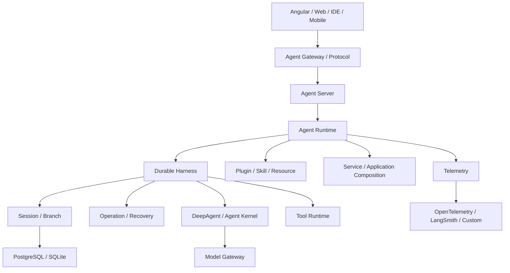

这里 **Pi 的新架构实际上给出了一个很好的参考答案：**

> `LangGraph/DeepAgents` 之类更偏 **Agent Kernel / execution graph**；
> Pi 当前新增的 `AgentHarness + session-backends + protocol + server + telemetry + chord` 则开始补齐 **Agent Application Runtime**。

而这恰好就是很多企业 Agent 平台现在真正缺少的一层。


-----------

基于 `earendil-works/pi` 当前 `main` 分支（截至 **2026-09-12**）的代码，我的判断是：**现在的 Pi 已经不是单纯的 coding-agent CLI，而是一个分层的 agent runtime / application harness。核心架构已经明显分成 `AI transport → Agent runtime → Session/Application runtime → Presentation/Integration` 四层。** 当前 `main` 的最新提交是 2026-09-11 17:42 UTC 的 `71dca871`。

## 1. 当前 Pi 的核心架构

仓库 README 已经明确把三个最重要的包定义为：

* `pi-ai`：统一多 Provider LLM API
* `pi-agent-core`：agent runtime、tool calling、state management
* `pi-coding-agent`：交互式 coding agent CLI

同时 monorepo 还包含 `tui`、`protocol`、`server`、`session-backends`、`telemetry`，以及独立的 `chord` runtime。

这里最重要的变化是：**`pi-coding-agent` 已经不再只是“CLI + Agent”**。

它自己拥有：

* `AgentSession`
* SessionManager
* ModelRegistry / ModelRuntime
* Context Compaction
* Extension Runtime
* Resource / Skill Loader
* Tool Registry
* Project Trust
* 多种 Run Mode
* SDK
* RPC

因此现在更准确的模型应该是：

> **pi-agent-core 是 Agent Kernel；pi-coding-agent 是完整 Agent Application Runtime。**

---

# 2. `pi-ai`：LLM abstraction layer

`pi-ai` 的职责非常清楚，而且最近的代码在继续强化模块边界。

它现在把几个概念明确拆开：

```text
Model
  ↓
Provider / API
  ↓
Streaming
  ↓
Auth
  ↓
Usage / Retry / Diagnostics
```

它并不是一个传统意义上的 LangChain Model abstraction，而更接近一个：

> **LLM transport + provider protocol compatibility layer**

当前 root export 已经明确区分：

* API implementations
* Provider factories
* Auth
* Models / Model Store
* compat
* Stream / retry / diagnostics / validation

并且 core 本身强调：

> 不引入 generated catalogs、provider factories、OAuth implementations 等副作用；这些能力被拆到子模块。

这其实是一个非常好的架构方向。

### `pi-ai` 的核心价值

它不是负责：

```text
"What should the agent do?"
```

而是负责：

```text
"How do I reliably talk to an LLM?"
```

因此它是下面这一层：

```text
Agent
   ↓
StreamFn
   ↓
pi-ai
   ↓
OpenAI / Anthropic / Google / ...
```

---

# 3. `pi-agent-core`：真正的 Agent Kernel

这一层是整个 Pi 最值得关注的部分。

当前 `Agent` 的设计已经相当成熟。

`Agent` 本身持有：

```text
AgentState
 ├── systemPrompt
 ├── model
 ├── thinkingLevel
 ├── tools
 ├── messages
 ├── isStreaming
 ├── streamingMessage
 ├── pendingToolCalls
 └── errorMessage
```

同时提供：

```text
prompt()
continue()
steer()
followUp()
abort()
reset()
subscribe()
waitForIdle()
```

以及：

```text
beforeToolCall
afterToolCall
shouldStopAfterTurn
prepareNextTurn
prepareNextTurnWithContext
transformContext
convertToLlm
```

这些 hook 已经意味着它不是简单的：

```text
LLM → Tool → LLM
```

而是真正的：

```text
Agent State Machine
+
Event Lifecycle
+
Tool Runtime
+
Context Transformation
+
Queueing
+
Interrupt / Steering
```

---

# 4. Pi Agent Loop 的真正结构

现在的 `pi-agent-core` 可以理解成：

```text
               ┌────────────────────┐
               │     Agent State    │
               │ messages / tools   │
               │ model / thinking   │
               └─────────┬──────────┘
                         │
                         ▼
                 ┌───────────────┐
                 │ Agent Loop    │
                 └───────┬───────┘
                         │
                 ┌───────▼────────┐
                 │   LLM Stream    │
                 │    pi-ai        │
                 └───────┬────────┘
                         │
                  assistant message
                         │
               ┌─────────▼──────────┐
               │ Tool Call Router   │
               └─────────┬──────────┘
                         │
               beforeToolCall
                         │
               ┌─────────▼──────────┐
               │ Tool Executor      │
               │ sequential/parallel│
               └─────────┬──────────┘
                         │
               afterToolCall
                         │
                         ▼
                 tool result message
                         │
                         ▼
                   next Agent Turn
```

特别值得注意的是，当前默认 tool execution 已经支持：

```text
parallel
sequential
```

而且 parallel 模式不是简单 `Promise.all`，代码里明确区分：

1. sequential preparation
2. concurrent execution
3. completion-order events
4. source-order tool result artifacts

这说明 Pi 已经在把 **agent execution semantics** 当成一个独立的 runtime 问题处理。

---

# 5. Steering / Follow-up 是 Pi 一个很重要的架构特征

很多 Agent framework 的模型是：

```text
user prompt
   ↓
agent runs
   ↓
agent stops
```

Pi 已经明显不是这样。

它维护两个 queue：

```text
Steering Queue
Follow-up Queue
```

语义分别是：

```text
steering
= 当前任务还没结束，我要改变它

follow-up
= 当前任务结束之后，再追加任务
```

而且支持：

```text
one-at-a-time
all
```

这意味着 Pi 的 Agent 更接近：

> **long-running interactive agent**

而不是一次性的 function executor。

这也是为什么 Pi 很适合：

* coding agent
* copilot
* interactive agent
* IDE agent
* terminal agent

---

# 6. `pi-coding-agent` 已经是第二个 Runtime Layer

真正复杂的地方实际上发生在这里。

`AgentSession` 明确说明自己：

> shared between interactive / print / rpc modes

并负责：

* Agent state
* Session persistence
* Model/thinking management
* Compaction
* Bash
* Session switching
* Branching

所以架构已经变成：

```text
Agent Kernel
      │
      ▼
AgentSession
      │
      ├── SessionManager
      ├── ModelRuntime
      ├── ResourceLoader
      ├── SettingsManager
      ├── ExtensionRunner
      ├── Tool Registry
      ├── Compaction
      ├── Retry
      ├── Trust
      └── Bash
```

这是整个 Pi 当前最关键的一层。

---

# 7. Session 已经不是简单 conversation history

这是 Pi 和很多 Agent framework 差异很大的地方。

当前 SessionManager 使用 tree structure。

每个 entry 有：

```text
id
parentId
timestamp
type
```

并且 entry 类型已经包括：

```text
message
thinking_level_change
model_change
compaction
branch_summary
custom
custom_message
label
session_info
```

因此 Session 实际上是：

> **persistent execution graph**

而不是：

> chat messages[]

可以把它理解成：

```text
                 Session Root
                      │
                 user message
                      │
                 assistant
                  /       \
               tool       tool
                │
             result
                │
             assistant
                │
          ┌─────┴─────┐
          │           │
       branch A    branch B
```

这也是为什么 Pi 可以天然支持：

* branch
* tree
* resume
* compact
* fork
* session switch
* session export

---

# 8. Compaction 是 Session Runtime 的一部分

这是另一个非常成熟的设计。

Compaction 并没有被设计成一个独立外挂，而是 Session Runtime 的能力。

大致关系：

```text
AgentSession
    │
    ├── Context Usage
    │
    ├── shouldCompact()
    │
    ├── Compaction
    │      ├── collect entries
    │      ├── summarize
    │      ├── branch summary
    │      └── cut point
    │
    └── overflow recovery
```

而且 Session 本身会记录：

```text
CompactionEntry
BranchSummaryEntry
```

所以 compact 不是：

```text
把旧消息删掉
```

而是：

> **把历史执行图压缩成新的可持久化语义节点。**

这个设计是合理的。

---

# 9. Extension System 已经接近 Plugin Runtime

现在 Pi 的 extension system 非常强。

`pi-coding-agent` 暴露的 Extension API 已经包含：

```text
Extension
ExtensionAPI
ExtensionRuntime
ExtensionRunner

ToolDefinition
RegisteredTool

Command
Shortcut
Autocomplete

EntryRenderer
MessageRenderer
MarkdownTransformer

UI Context
Widgets
Dialogs

Agent lifecycle events
Tool lifecycle events
Session lifecycle events
```

所以它已经不是：

```text
plugins = extra commands
```

而更接近：

> **embedded application plugin runtime**

这也是为什么一个 Extension 可以影响：

```text
system prompt
tool registry
tool execution
session
UI
commands
events
context
```

---

# 10. Resource / Skill / Prompt 已经成为 Agent Configuration Layer

在 `AgentSession` 上方还有一层：

```text
ResourceLoader
    │
    ├── extensions
    ├── skills
    ├── prompts
    ├── themes
    ├── context files
    └── system prompt
```

当前 `AgentSessionConfig` 明确把 `ResourceLoader` 注入 session。

所以 Pi 的“知识/行为配置”并不是完全硬编码。

更接近：

```text
Project
 │
 ├── skills
 ├── prompts
 ├── context
 ├── extensions
 └── settings
        ↓
    Resource Loader
        ↓
    Agent Session
```

这与现代 coding agent 的实际使用方式非常匹配。

---

# 11. ModelRuntime / ModelRegistry 解决的是另一个问题

这里 Pi 的设计也值得区分。

不要把：

```text
pi-ai Model
```

和：

```text
coding-agent ModelRuntime
```

看成一回事。

`pi-ai`：

```text
Model metadata
Provider
API
Auth
stream
```

而 coding-agent：

```text
ModelRegistry
ModelResolver
ModelRuntime
CredentialSynchronization
Provider configuration
scoped models
model switching
```

也就是说：

```text
pi-ai
   = LLM infrastructure

coding-agent ModelRuntime
   = application-level model lifecycle
```

这个分层非常合理。`AgentSessionConfig` 也是直接注入 `ModelRuntime`，而不是让 session 自己碰 provider internals。

---

# 12. Run Modes：同一个 Agent Runtime，多种 presentation

当前 coding-agent 有：

```text
InteractiveMode
PrintMode
RPC Mode
```

因此：

```text
                   AgentSession
                        │
          ┌─────────────┼─────────────┐
          ▼             ▼             ▼
     Interactive       Print         RPC
          │             │             │
         TUI           stdout       protocol
```

这是一个非常好的架构决定。

**Agent 本身不应该知道自己是在 TUI、CLI batch 还是 RPC server 中运行。**

Pi 当前已经基本实现这一点。

---

# 13. Protocol / Server 是独立 boundary

目前还有：

```text
packages/protocol
packages/server
```

Protocol 负责：

```text
CBOR
codec
framing
request
response
event
attachment
cancel
client/server hello
session target
RPC target
```

因此可以理解成：

```text
Agent Runtime
       │
       ▼
 Session Runtime
       │
       ▼
     RPC
       │
       ▼
  protocol/server
       │
       ▼
 remote client
```

这其实已经在为：

```text
local agent
remote agent
IDE client
Web UI
agent worker
```

打基础。

---

# 14. Chord 要单独看

现在 monorepo 中还存在：

`@earendil-works/chord`

但非常重要的一点：

**Chord 并不是 Pi Agent Runtime 的一个子层。**

README 明确写了：

> Chord is a standalone application-composition runtime
> it does not depend on any other Pi workspace package

它提供：

```text
Plugin
Facet
Service
Remote Service
Replicated State
Delta tracking
Context
```

所以我不会把 Chord 画成：

```text
Pi Agent
  ↓
Chord
```

而应该画成：

```text
                Application Runtime
                 /             \
                /               \
        Pi Agent Runtime       Chord
```

它更像是一个未来可以承载：

```text
Agent
TUI
WebUI
Remote Worker
Plugin
Service
```

的通用 application composition substrate。

---

# 15. 我认为 Pi 当前最合理的逻辑分层

可以把整个项目压缩成这 6 层：

```text
Layer 6 — Applications
    pi-coding-agent
    IDE / CLI / Web / custom apps

Layer 5 — Agent Application Runtime
    AgentSession
    SessionManager
    ExtensionRuntime
    ModelRuntime
    Compaction
    ResourceLoader
    Trust
    Tool Registry

Layer 4 — Agent Kernel
    pi-agent-core
    Agent
    Agent Loop
    Tool Execution
    State
    Queue
    Lifecycle

Layer 3 — LLM Infrastructure
    pi-ai
    Models
    Providers
    Auth
    Streaming
    Retry
    Usage

Layer 2 — Transport / IPC
    protocol
    server
    RPC

Layer 1 — Host Runtime
    Node.js
    filesystem
    process
    shell
    network
```

旁边还有一个横切层：

```text
Telemetry
Testing / Evals
Security / Sandbox
```

---

# 16. 完整 Mermaid 架构图

下面这张图我建议作为你以后理解 Pi architecture 的主图，而不是简单按目录画 package dependency：

```mermaid
flowchart TB

    %% ============================================================
    %% APPLICATION / PRESENTATION
    %% ============================================================

    subgraph APP["Application & Presentation Layer"]
        CLI["CLI"]
        TUI["Interactive TUI"]
        PRINT["Print / Batch Mode"]
        RPCMODE["RPC Mode"]
        SDK["Coding Agent SDK"]
        IDE["IDE / Custom App"]
        WEB["Remote Web UI / Client"]
    end

    %% ============================================================
    %% CODING AGENT RUNTIME
    %% ============================================================

    subgraph CAR["Pi Coding-Agent Application Runtime"]
        SESSION["AgentSession"]

        SESSION_MGR["SessionManager"]
        SETTINGS["SettingsManager"]

        MODEL_RUNTIME["ModelRuntime"]
        MODEL_REGISTRY["ModelRegistry / Resolver"]

        RESOURCE["ResourceLoader"]
        SKILLS["Skills / Prompts / Context"]
        EXT["ExtensionRunner / Extension Runtime"]

        TOOLS_REG["Tool Registry"]
        BASE_TOOLS["Built-in Tools"]
        CUSTOM_TOOLS["Custom / Extension Tools"]

        COMPACTION["Compaction Runtime"]
        BRANCH["Branch / Tree Management"]
        RETRY["Retry / Overflow Recovery"]

        TRUST["Project Trust"]
        BASH["Bash / PowerShell Execution"]

        EVENTBUS["Session Event Bus"]
    end

    %% ============================================================
    %% AGENT KERNEL
    %% ============================================================

    subgraph CORE["Pi Agent Core"]
        AGENT["Agent"]

        STATE["AgentState"]
        LOOP["Agent Loop"]

        QUEUE["Steering Queue"]
        FOLLOWUP["Follow-up Queue"]

        TOOL_EXEC["Tool Executor"]

        HOOKS["Agent Hooks"]

        CONVERT["Message / Context Conversion"]
        TRANSFORM["Context Transformation"]

        EVENTS["Agent Lifecycle Events"]

        STREAMFN["StreamFn"]
    end

    %% ============================================================
    %% PI AI
    %% ============================================================

    subgraph AI["Pi AI / LLM Infrastructure"]
        MODELS["Model Definitions"]
        MODEL_STORE["Model Store / Catalog"]

        PROVIDERS["Provider Factories"]

        AUTH["Credential Store / OAuth / Auth"]

        APIS["Provider API Implementations"]

        STREAM["Streaming / Event Stream"]

        RETRY_AI["Retry / Overflow / Diagnostics"]

        USAGE["Usage / Cost"]

        VALIDATION["Validation / TypeBox"]
    end

    %% ============================================================
    %% PROVIDERS
    %% ============================================================

    subgraph PROVIDER["External LLM Providers"]
        OPENAI["OpenAI"]
        ANTHROPIC["Anthropic"]
        GOOGLE["Google"]
        AZURE["Azure"]
        BEDROCK["AWS Bedrock"]
        MISTRAL["Mistral"]
        OTHER["Other / Custom Providers"]
    end

    %% ============================================================
    %% TOOLS / HOST
    %% ============================================================

    subgraph HOST["Host / Tool Environment"]
        FS["Filesystem"]
        SHELL["Shell / Process"]
        GIT["Git"]
        NETWORK["Network"]
        LOCAL["Local Runtime"]
        SANDBOX["Optional Sandbox / VM / Container"]
    end

    %% ============================================================
    %% RPC / SERVER
    %% ============================================================

    subgraph REMOTE["Remote / IPC Layer"]
        RPC["RPC"]
        SERVER["Server"]
        PROTOCOL["Protocol"]
        FRAME["Framing / CBOR / Codec"]
        ATTACH["Attachments"]
        CANCEL["Cancellation"]
    end

    %% ============================================================
    %% CROSS CUTTING
    %% ============================================================

    subgraph X["Cross-Cutting"]
        TELEMETRY["Telemetry"]
        EVALS["Evals / Tests"]
        LOGGING["Diagnostics / Logging"]
    end

    %% ============================================================
    %% APPLICATION -> CODING AGENT
    %% ============================================================

    CLI --> SESSION
    TUI --> SESSION
    PRINT --> SESSION
    RPCMODE --> SESSION
    SDK --> SESSION
    IDE --> SDK
    WEB --> RPC

    %% ============================================================
    %% SESSION RUNTIME
    %% ============================================================

    SESSION --> AGENT
    SESSION --> SESSION_MGR
    SESSION --> SETTINGS
    SESSION --> MODEL_RUNTIME
    SESSION --> RESOURCE
    SESSION --> EXT
    SESSION --> TOOLS_REG
    SESSION --> COMPACTION
    SESSION --> BRANCH
    SESSION --> RETRY
    SESSION --> TRUST
    SESSION --> BASH
    SESSION --> EVENTBUS

    RESOURCE --> SKILLS
    EXT --> TOOLS_REG

    TOOLS_REG --> BASE_TOOLS
    TOOLS_REG --> CUSTOM_TOOLS

    MODEL_RUNTIME --> MODEL_REGISTRY
    MODEL_RUNTIME --> AUTH

    %% ============================================================
    %% AGENT CORE
    %% ============================================================

    AGENT --> STATE
    AGENT --> LOOP
    AGENT --> QUEUE
    AGENT --> FOLLOWUP
    AGENT --> TOOL_EXEC
    AGENT --> HOOKS
    AGENT --> EVENTS
    AGENT --> STREAMFN

    LOOP --> CONVERT
    LOOP --> TRANSFORM
    LOOP --> STREAMFN

    STREAMFN --> STREAM

    LOOP --> TOOL_EXEC
    TOOL_EXEC --> TOOLS_REG

    HOOKS --> TOOL_EXEC
    HOOKS --> EVENTS

    QUEUE --> LOOP
    FOLLOWUP --> LOOP

    %% ============================================================
    %% SESSION <-> AGENT
    %% ============================================================

    SESSION_MGR --> STATE
    SESSION_MGR --> BRANCH

    COMPACTION --> SESSION_MGR
    BRANCH --> SESSION_MGR

    EVENTBUS --> EVENTS

    %% ============================================================
    %% AGENT -> AI
    %% ============================================================

    STREAMFN --> APIS
    STREAMFN --> MODELS

    APIS --> PROVIDERS
    MODELS --> MODEL_STORE
    MODEL_REGISTRY --> MODELS

    APIS --> AUTH
    APIS --> STREAM
    APIS --> RETRY_AI
    APIS --> USAGE
    APIS --> VALIDATION

    %% ============================================================
    %% AI PROVIDERS
    %% ============================================================

    APIS --> OPENAI
    APIS --> ANTHROPIC
    APIS --> GOOGLE
    APIS --> AZURE
    APIS --> BEDROCK
    APIS --> MISTRAL
    APIS --> OTHER

    %% ============================================================
    %% TOOL EXECUTION
    %% ============================================================

    BASE_TOOLS --> FS
    BASE_TOOLS --> SHELL
    BASE_TOOLS --> GIT
    CUSTOM_TOOLS --> LOCAL

    BASH --> SHELL

    FS --> LOCAL
    SHELL --> LOCAL
    GIT --> LOCAL
    NETWORK --> LOCAL

    LOCAL -. optional isolation .-> SANDBOX

    %% ============================================================
    %% RPC
    %% ============================================================

    RPCMODE --> RPC
    RPC --> SERVER
    SERVER --> PROTOCOL

    PROTOCOL --> FRAME
    PROTOCOL --> ATTACH
    PROTOCOL --> CANCEL

    RPC --> SESSION

    %% ============================================================
    %% CROSS CUTTING
    %% ============================================================

    AGENT -. telemetry .-> TELEMETRY
    SESSION -. telemetry .-> TELEMETRY
    AI -. telemetry .-> TELEMETRY

    AGENT -. evaluation .-> EVALS
    SESSION -. evaluation .-> EVALS

    AGENT -. diagnostics .-> LOGGING
    SESSION -. diagnostics .-> LOGGING
    AI -. diagnostics .-> LOGGING
```

---

# 17. 如果进一步压缩成“真正核心”的架构图

实际上，理解 Pi 最重要的只有下面这一张：

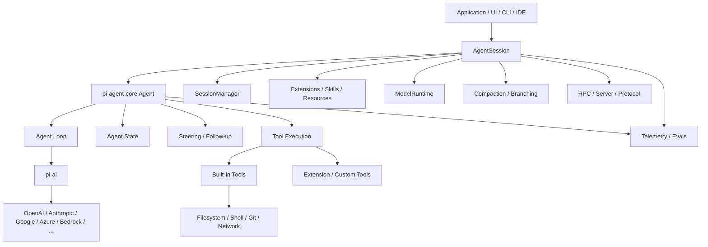

这个版本其实最能表达 Pi 的核心思想：

> **Agent Core 不知道 UI；Session Runtime 不等于 Agent Loop；LLM Provider 不等于 Agent；Extension 是 Runtime capability；Session 是持久化 execution state。**

---

# 18. 我对当前 Pi 架构的评价

我的总体评价是：**架构已经非常成熟，而且比很多“Agent Framework”更加接近真正可长期演进的 Agent Operating Runtime。**

尤其有五个设计值得注意。

### ① `pi-ai` / `pi-agent-core` 分离是正确的

```text
LLM infrastructure
        ≠
Agent runtime
```

这样以后：

```text
pi-agent-core
```

可以接：

```text
pi-ai
OpenAI SDK
Anthropic SDK
local inference
custom inference gateway
```

不会被 provider 绑死。

### ② `AgentSession` 是非常关键的一层

很多框架只有：

```text
Agent
```

Pi 实际上是：

```text
Agent
  +
Persistent Session
  +
Application Runtime
```

这是更接近真正产品的模型。

### ③ Session Tree 是非常强的设计

普通 Agent：

```text
messages[]
```

Pi：

```text
persistent execution tree
```

因此 branch / fork / compact / replay / resume 都变得自然。

### ④ Extension 已经接近 Runtime Plugin System

它已经可以改变：

```text
Tool
Prompt
Context
UI
Events
Session
Commands
```

所以 Pi 的扩展能力不是“插件式 CLI”，而是 runtime extension。

### ⑤ Chord 是另一条更大的架构路线

Chord 当前并不是 Pi Agent 的核心依赖，而是一个独立的 application-composition runtime，重点是：

```text
plugin
facet
service
remote service
replicated state
```

所以从长期演进看，Pi 现在其实存在两条方向：

```text
                 Pi
                  │
        ┌─────────┴──────────┐
        │                    │
 Agent Runtime          App Composition
        │                    │
 pi-agent-core             Chord
 pi-coding-agent          services
 session                  replication
 tools                    remote facets
 extensions
```

---

## 19. 对你自己的 Agent 平台设计，最值得借鉴的其实不是 `Agent`

结合你前面在研究的 **DeepAgents + AgentCore + LangSmith + 自建 AI 平台**，Pi 最值得借鉴的反而是这一层：

```text
                 Agent
                   │
            AgentSession
                   │
      ┌────────────┼─────────────┐
      │            │             │
 Session       ModelRuntime   Extensions
      │            │             │
 Compaction      Auth         Tools
 Branching       Provider     Skills
 Persistence     Model        Prompt
      │            │             │
      └────────────┼─────────────┘
                   │
              Run Modes
          ┌────────┼────────┐
          │        │        │
         TUI      CLI      RPC
```

也就是说，你自己的企业 Agent Platform 如果参考 Pi，**不要只复制 Agent Loop**。

更合理的目标应该是：

```text
                  AI Platform
                       │
             ┌─────────┴─────────┐
             │                   │
         Agent Runtime      Agent Application
             │                   │
        Agent Loop          Session Runtime
        Tool Executor       Persistence
        State               Compaction
        Model               Extension
        Hook                Resource
             │                   │
             └─────────┬─────────┘
                       │
                  Infrastructure
             ┌─────────┼──────────┐
             │         │          │
           LLM       Sandbox    Telemetry
         Gateway      /exec       /eval
```

这个思路其实比单纯：

```text
LangGraph
    +
AgentCore
    +
LangSmith
```

更接近一个完整的 **Agent Platform Runtime**。

当前 Pi 的代码结构已经明确支持这种理解：`Agent` 是 kernel，`AgentSession` 是 application runtime，`pi-ai` 是 LLM infrastructure，而 RPC/protocol 和 extensions 则形成外部集成与扩展边界。


------------------


