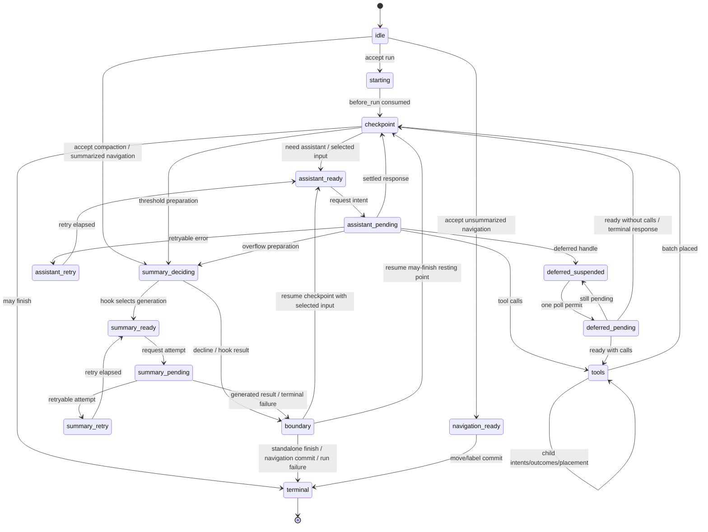

# AgentHarness — 实现规范

各节编号（§N.M）用于交叉引用；part 级目录：

- [Part 0 — 导引](#part-0--orientation): 系统模型 · 三种 store · 完整示例 · 非目标 · 记号/源类型 · validation 边界 · 实现状态
- [Part 1 — Storage](#part-1--storage): 模型 · identity · bound values/lists · transactions · queries · usage ledger · backends · 理由
- [Part 2 — 对话树](#part-2--the-conversation-tree): entries · placement · Branches/AgentLanes · metadata · branch queries/context · branch index · forks · Session/repository（含 C1、search）· precise rewrite
- [Part 3 — operation 状态机](#part-3--the-operation-state-machine): operations · state · lane state · transition rule · graph · acceptance · assistant · tools · summaries · navigation · inbox · boundary · terminal results
- [Part 4 — 执行、recovery、abort、close](#part-4--execution-recovery-abort-close): Drive · effect gate · mutation line · attachment · recovery · abort · close · faults
- [Part 5 — 公开 surface](#part-5--public-surface): lane · harness · Session/Branch · snapshots · events · hooks · execution blocks · telemetry
- [Part 6 — 未来：partitioned retention（Postgres）](#part-6--future-partitioned-retention-postgres)
- [Part 7 — Schema 演化](#part-7--schema-evolution)
- [Part 8 — Work packages](#part-8--work-packages)
- [Part 9 — Invariants 与测试](#part-9--invariants-and-tests): 38 个 invariants · race 目录 · 测试层级
- [附录 A — 术语表](#appendix-a--glossary) · [附录 B — Coding-agent v3-format 兼容性](#appendix-b--coding-agent-v3-format-compatibility) · [附录 C — 开放问题](#appendix-c--open-questions)

# Part 0 — 导引

## 0.1 这是什么

一个用于 agent 对话的 durable runtime：它持久化对话和 operation 状态，使被中断的工作能够恢复，而不重复已 settle 的 effects。本文档是规范性 specification；§0.9 标记了那些已规定但尚未实现的部分。公开类型声明位于 §0.7 中列出的源文件——本文档只在该声明本身的形状就是一条规则时才重复它。

## 0.2 系统模型

一个 **session** 有四部分：一个不可变的 **entry tree**（message、compaction、branch summary 或应用定义的 custom entries；branches 共享该树，从而在保留历史的同时支持 branching、compaction、forking 和并行工作）；位于 bound typed addresses 的可变 **values 和 lists**（内置项：session name、entry labels；应用定义自己的抗碰撞 addresses）；**Branches 和 AgentLanes**（一个 Branch 是一条具名的数据路径，带有可移动的 tip；一个 AgentLane 增加了完整的 model 配置、queues 以及至多一个 operation；sessions 可以以零个 Branch 或 AgentLane 开始，`main` 是一个普通的显式名称）；以及一个 append-only 的 **usage ledger**。

Session 层拥有全局 durable 数据和 Branch 能力。**harness** 通过四个原语驱动 lanes——`accept` durable 地创建一个 operation，`drive` 推进一个预期的 operation，`requestAbort` durable 地请求取消，`inspectExecution` 原子地报告当前执行与最新 terminal 执行——外加若干便捷方法（`prompt`、`resume`、`abort`、……），它们把这些原语与 process-local 的等待策略组合起来。serving 层也可以改为通过 alarms、jobs 或另一个 host runtime 来调度 `drive` 调用。harness 还拥有 harness 范围的 tool 和 prompt-resource registries、hooks、passive events 以及 runtime 配置。

一个 **operation** 是一个已接受的 lane 工作单元：run、compaction 或 navigation。不可变的 metadata 记录 identity、intent 和起始点；一个 total 的 current state 记录 phase、control 和 recovery 数据；queued input 属于该 lane。Acceptance 与 execution 所有权是分离的：一个已接受的 operation 可能没有 process-local driver。Completion 会删除 operation 所有的 state，并写入一条不可变的 result record。

**Context。** 每个异步公开的 harness/lane/Session/Branch/repository/storage 方法都接受一个显式的尾随 `Context`；同步注册（`events.on()`、`hooks.on()`）是无 context 的，并且 handlers 在被调用时会收到一个 Context。Context 之所以存在，是因为并发调用需要独立的 telemetry 父子关系，并且 RPC adapter 必须把一个请求的取消作为 `context.abortSignal` 携带。共享 receivers 绝不保留调用方的 Context，也不通过 `AsyncLocalStorage` 发现一个。Request-ID RPC 取消已实现：client 将其 signal 映射到 `cancel(requestId)`，server 则派生一个请求 Context，带有一个 `AbortController`，在匹配的取消或断开时 abort。Trace 注入/提取以及远程 telemetry-parent 重建已规定但未实现（T1，§5.8）。Context 是 process-local 的调用权威，绝不是 durable 数据：abort 它不会调用 `requestAbort()`，也不会写入 `cancel_requested`。

**Storage**（Part 1）在三种 durable form 之上暴露原子 transactions 和 queries。`pi.op.meta` 每个 operation 写入一次；`pi.op.state` 在每次 transition 后替换为完整的 current state；有界进度的 tool checkpoints 是辅助性的，绝不证明 effect 完成。terminal transaction 删除 operation 所有的 values/lists，并写入不可变的 `pi.result/{operationId}`。任何部分 transaction 都绝不可见。

## 0.3 三种 store

Parts 1–5 中的一切都可以从四条规则推出。

**1. 三种 store，一个 invariant。**

```text
entries        conversation tree — write-once, append-only
values/lists   current mutable state — replaceable values; append-only lists
               (append or whole-list delete)
usage ledger   cost history — append-only rows
```

*每个 payload 都在一个 entry、一个 bound value/list 或 ledger 中；不存在第三个地方。* 一个 entry 是完整的对话记录：placement 和 payload 在同一行。一个 `Value<T>` 只持有其当前值；一个 `ValueList<T>` 持有按写入序列排序的不可变元素，只能整体删除。在 tree placement 之前 durable 地存在的完整内容——queued input、deferred writes、已 finalize 的乱序 tool results——等待在 `pi.pending.entry` 中，并在将其 placement 的那个 transaction 中成为一个 entry；tool 进度只有在它的 effect 不确定时才可占用 `pi.pending.tool_output`；streamed assistant frames 只有在其 response 处于 effect-pending 时才占用 `pi.pending.assistant_frame`（§3.7）。按 backend 的 projections（branch index、search、stats）是可重建的，且不携带权威。

**2. 原子 transactions**（§1.4）：entry/usage 插入以及 value/list 写入以 all-or-none 方式提交，序列号严格递增；transaction 内部不存在 crash state；这是唯一的写入原语。

**3. durable restart point**（§3.2）：在每次 durable transition 之后，harness 用*完整的、total 的* current state 替换 `operationState(operationId)`——绝不依赖先前状态。在 task loss 之后，recovery 读取它并从相应的 procedure 开始，绝不重放 journal，也绝不从缺失的内容推断位置。小的捕获值内联；大的稳定 payloads 位于同级的 operation 所有的 addresses，或通过 id 命名；terminal transaction 删除它们，只留下对话、ledger 以及少量 lane/session values。

**4. Intent 与 settlement**（§0.4 trace、§3.7–§3.8）：provider requests 和真实 tool calls 被包裹在两次 commit 中——intent（“即将执行 X；output 将使用 ids R 和 U”）、不确定的 effect，然后是 settlement（完整 output + next state，对 tools 还包括 source-ordered materialization）。Hooks 则遵循一个 replay 契约：hook result 在消费它的那个 transaction 中变为 durable，而该 transaction 之前的 crash 可能重跑该 hook。因此每个外部 effect 都可以在没有 durable settlement 的情况下发生；intents 在 replay policy 依赖它的地方明确说明了这一点，而幂等 hooks 把它当作一个非目标接受。

## 0.4 完整示例 — 一个 Slack thread

一个用户在一个有 400 条历史 entries 的 channel 中发帖；应用创建一个锚定在该 channel tip 的 lane，并调用 `lane.prompt(...)`。规范的写入顺序（每个 `TX[...]` 是一次原子 commit）：acceptance 是无 hook 的，不启动任何 task 或 effect；intent 在发送任何内容之前铸造 response/usage ids；streamed events 追加紧凑的 frames 而不阻塞 stream（§3.7）；settlement 一起提交 response、usage、next state 和 frame-list deletion；tool calls 遵循 intent → effect → outcome settlement，按 assistant source 顺序 materialize；terminal transaction 删除 operation values/lists 并写入 `pi.result/O`：

```text
TX[ insert entry n1 (user msg), upsert pi.branch.tip = n1,
    upsert pi.op.meta/O, upsert pi.op.state/O = starting,
    upsert pi.lane.state = { currentOperationId: O } ]
… first drive owns real work; before_drive then before_run …
TX[ insert injected messages if any, upsert pi.branch.tip when needed,
    upsert pi.op.state/O = checkpoint need_assistant ]
TX[ upsert pi.op.state/O = assistant ready (config snapshot) ]
TX[ upsert pi.op.state/O = effect_pending (reserves response n2, usage u1) ]
… provider streams …                                  ← the uncertain window
TX[ append pi.pending.assistant_frame/O:n2 += frame ]    ← zero or one per non-terminal
                                                        event, enqueued without awaiting
TX[ insert entry n2, insert usage u1, upsert pi.branch.tip = n2,
    delete list pi.pending.assistant_frame/O:n2,
    upsert pi.op.state/O = tools (result id n3 reserved) ]
TX[ upsert pi.op.tool_args/O:s1:0, upsert pi.op.state/O = call 0 effect_pending ]
… tool runs; selected bounded updates may replace pi.pending.tool_output/O:n3 …
TX[ upsert pi.pending.entry/n3 = finalized tool result,
    delete pi.pending.tool_output/O:n3, upsert pi.op.state/O = call 0 outcome_ready ]
TX[ insert entry n3, delete pi.pending.entry/n3, upsert pi.branch.tip = n3,
    upsert pi.op.state/O = checkpoint ]
… second turn: ready · intent · stream · settle (n4, u2) …
TX[ delete pi.op.meta/O, pi.op.state/O, pi.op.tool_args/O:*,
    set pi.result/O = { operationId: O, kind: "run", status: "completed",
                        fromTipId, tipId: n4, startedAt, endedAt },
    upsert pi.lane.state = { currentOperationId: null,
                             lastOperationId: O, inbox: [] } ]
```

在任意两个 transactions 之间杀死进程并重启：harness 读取该 lane 所需的 values，看到哪一个最后提交，然后继续。在 provider stream 期间死亡会留下一个可能已被计费、且可能已产生也可能未产生 output 的 request——这是唯一真正不确定的窗口；§4.5 说明了策略，而已提交的 frame 前缀为 synthetic settlement 和 reconnect 显示保留最新的 durable partial，而不证明该 request 是如何结束的。同一 channel 中的第二个 thread 在相同的共享历史上运行它自己的 lane，且无需协调。

## 0.5 完整示例 — 一次 mid-tool crash

model 为 `lane.prompt("delete the stale migrations and run the test suite")` 返回两个 tool calls。harness 提交 batch plan，然后为 call 0 提交带其精确 arguments 和 `replay: "never"` 的 intent。该 tool 删除文件，每 100 ms 发出有界进度，并每两秒请求一次 durable checkpoint。进程在一个 checkpoint 提交后死亡：

```text
TX[ insert entry n2 (assistant, 2 calls), insert usage u1, upsert pi.branch.tip = n2,
    upsert pi.op.state/O = tools (result ids n3, n4 reserved) ]
TX[ upsert pi.op.tool_args/O:s1:0, upsert pi.op.state/O = call 0 effect_pending,
                                                    replay: "never" ]
… tool deletes files; live updates u1 … u19 …
TX[ upsert pi.pending.tool_output/O:n3 = bounded update u1 ]
… live updates u2 … u19 …  ← CRASH
```

重启后，`pi.op.state` 显示 `calls[0].status = "effect_pending", replay = "never"`，因此该删除不会被重跑。稍后的一次 drive 按 §4.5 对该 orphan 进行 reconcile：最新的 durable checkpoint 内容加上显式的 interruption warning，作为 synthetic error 在 reserved id 下 staged，然后正常 materialize：

```text
TX[ upsert pi.pending.entry/n3 = synthetic interrupted result containing u1,
    delete pi.pending.tool_output/O:n3, upsert pi.op.state/O = call 0 outcome_ready ]
TX[ insert entry n3, delete pi.pending.entry/n3, upsert pi.branch.tip = n3,
    upsert pi.op.state/O = call 0 completed ]
```

每个 tool call 都有一个 result，且没有任何东西运行两次；如果没有已提交的 checkpoint，result 只包含该 warning。如果该 tool 声明了 `replay: "safe"`（一次 read、一次 query），harness 则会用已持久化的 arguments 重新执行它。

## 0.6 非目标

- **Exactly-once external effects** —— 带副作用的 hooks 必须是幂等的，并以 operation id 为 key。
- **Provider stream resumption** —— harness 绝不重新附加到 provider stream；已提交的 frames（§3.7）为 recovery 和 reconnect 显示保留最新的 durable partial，而已 settle 的 response 在任何东西对其进行分类之前被*完整地*持久化。
- **Multiple writable owners** —— 同一时刻恰好只有一个 host 指定的 owner 可以持有一个 writable Session；通常该 owner 是其 Session worker，而 server 可能在移交之前临时拥有一个新创建或 fork 出来的 destination。Storage backends 不强制执行这条 host-lifecycle 规则。只读的 repository 工作（例如 SQLite source snapshot）可以与 worker 重叠（§1.7、§2.7）。Lanes 覆盖了看起来像 multi-writer 的工作负载。
- **Work scheduling** —— harness 绝不创建平台 alarms、绝不扫描 repositories 以寻找被放弃的 sessions、绝不租借 hosted submissions，也绝不承诺 HTTP receipt；它通过 `drive` 报告 durable waits，由 serving 层决定何时再次调用。
- **Replication** —— 一个 session 只存在于一个地方。
- **Durable write history** —— values 只保留 current state，lists 只保留到 whole-list deletion 为止；没有任何 API 或 table 暴露被替换的 values 或被删除的元素。测试的 write-order 断言使用围绕 `commit()` 的 instrumented decorator（Part 9）；生产审计属于 telemetry（§5.8）。
- **Deletion as a runtime feature** —— entries 和 usage rows 绝不删除：compaction 改变的是 provider context，而不是 storage；terminal cleanup 只删除 values/lists；`retainedTail` 把旧消息向前复制，summaries 从旧内容派生，因此 compaction 不是擦除。合规级别的擦除是管理性的 precise rewrite（§2.9），这是唯一被认可的例外。

## 0.7 记号与源类型

- `TX[ a, b, c ]` —— 一次原子 commit，写入按该顺序进行。写入词汇表：`insert entry`、`insert usage`、`setValue`、`deleteValue`、`appendList`、`deleteList`。Traces 可以把一个 bound address 缩写为其持久化的 `namespace/key`；这绝不是 API 签名或第二个 key 参数（§1.3）。
- Ids 是 UUIDv7s（§1.2），缩写为 `e_*`/`u_*`/`op_*`；在时间前缀重要之处，示例会显示它。
- `S(next)` 用 next total state 覆写 `operationState(operationId)`；`L(next)` 对 `laneState(lane)` 同理。
- 声明式规则、transition/race 表格、invariants 以及被明确称为规范性的 traces 是规范性的；被标记为 informative 的示例和章节则不是。**must / must not** 强调义务，但并非唯一的规范性措辞。这澄清了旧的简写：测试所消费的表格是契约的一部分。

路径约定：`src/...` 相对于 `packages/agent/`；像 `session/types.ts` 或 `agent-harness.ts` 这样的裸 harness 路径相对于 `packages/agent/src/harness/`；`docs/...` 相对于 `packages/agent/`；以 `packages/` 开头的路径相对于 repository 根。源类型出处：`AgentMessage`、`AgentTool`、`AgentToolResult`、`QueueMode`、`ThinkingLevel` —— `packages/agent/src/types.ts`。`Skill`、`PromptTemplate`、`AgentHarnessResources`（下文简写为 `Resources`）、`AgentHarnessTool*` 家族、`AgentHarnessStreamOptions`/`Patch` —— `packages/agent/src/harness/types.ts`。`Model`、`Models`、`Tool`、`Usage`、`RetryPolicy`、`StopReason`、`AssistantMessage`、`ImageContent`、provider messages、stream options、deferred handles —— `packages/ai`；`AiContext` 是 pi-ai 的 provider request `Context` 的别名，用于将其与 harness 调用 `Context` 区分开。`AssistantMessageFrame`、`AssistantMessageFrameEncoder`、`reduceAssistantMessageFrames` —— `packages/ai` `src/utils/assistant-message-frame.ts`；harness 不定义第二个 frame codec 或 reducer。`CompactionSettings`、`CompactionPreparation`、`CompactResult`、`BranchPreparation`、`BranchSummaryResult` —— `packages/agent/src/harness/compaction/`；除非本文档改变它们，否则既有的 preparation 和 split-turn 算法保持为实现。`TelemetryContext` 和 schema helpers —— `packages/telemetry`；agent 所有的 schemas —— `src/harness/telemetry.ts`。`Context`、`ContextKey`、`BACKGROUND_CONTEXT`、派生 helpers —— `src/harness/context.ts`。Harness/lane 公开声明 —— `src/harness/agent-harness.ts`；Session/storage 声明 —— `src/harness/session/types.ts` 和 `session/values.ts`。

公开的 `QueueMode` 是 `"all" | "one-at-a-time"`。公开的 `RetryPolicy` 是 `{ enabled, maxRetries, baseDelayMs, maxAgentDelayMs? }`；operation state 存储归一化后的 `{ maxAttempts, baseDelayMs, maxAgentDelayMs }`。`maxRetries`、`baseDelayMs` 以及可选的 `maxAgentDelayMs` 必须是有限非负安全整数，并且 `maxRetries + 1` 必须保持安全；禁用的 retry 归一化为一次 attempt；省略的 `maxAgentDelayMs` 默认是 60 秒；delay 和 `notBefore` 的算术在 `Number.MAX_SAFE_INTEGER` 处饱和。公开的 `CompactionSettings` 是 `{ enabled, reserveTokens, keepRecentTokens }`；两个 token count 都必须是有限非负安全整数。Constructors 和 setters 在发布之前拒绝无效设置。`AgentHarnessStreamOptions` 及其 patch 包含 `deferred?: boolean | { window?: "15m" | "1h" | "24h" }`；structural requests 总是强制它为 false。`SettledAssistantMessage` 是 `AssistantMessage & { stopReason: Exclude<StopReason, "pending"> }`。Provider dispatch 在请求时通过 `Models` 解析 durable 的 `{ provider, modelId }` identity（这也会应用 auth）；缺失或被调换的 registry 条目会像未知 tool 一样在带内使请求失败。

## 0.8 Validation 边界

内部的 pi 对象是可信的 typed values：Session、storage、operation procedures 以及进程内扩展既不做 runtime shape 校验，也不做防御性克隆。Storage 仍然强制执行其操作 invariants（atomicity、sequence allocation、unique ids、parent existence）；backends 按需 serialize/parse；被外部编辑或形状损坏的 storage 不受支持。Runtime schema validation 属于不可信的 wire 边界——未来的一个 protocol-schema slice 会为可序列化的 pi-ai/harness 数据定义共享的 TypeBox schemas，并从它们派生 TypeScript 类型，而不给内部路径添加校验。Attachment 只校验发布小型 lane/operation projection 所需的关系（§3.3、§4.4）；详细的状态导向引用是消费时检查（`watch` 校验其 snapshot 所需的 pending/entry 判别式以及 message-role 关系；drive 校验 transition 输入），而可选的 assistant-frame lists 和 tool checkpoints 可以缺失。

## 0.9 实现状态

WP00–WP07 已完成（Part 8）：operation graph、公开 lane runtime 以及 SQLite host-ownership 对齐均已实现。Part 9 陈述了所需的 conformance matrix；它并不是声称所列的每一行都已经有一个专门的测试。已知缺失的行为和当前的契约债务，各自在其所在章节再次标注：

- **J1 — JSONL snapshot compaction（§1.7）：** 已规定，未实现；目前 dead bytes 从不被回收。
- **C1 — raw RemoteSession（§2.8）：** 所规定的 remote mutation transport 与已交付的 process-local 产品相矛盾；在实现任一方向之前需要做出决定。
- **R12 — `watchSession`（§5.2）：** 公开方法抛出 `SliceNotImplemented`；这是唯一被 stub 的 Harness 方法。
- **T1 — telemetry（§5.8）：** span 词汇表已声明；生产环境只启动 tool-hook span。RPC ingress 有 request-ID 取消，但没有 trace propagation。
- **S3 — search（§2.8）：** 仅设计；当前的 `src/search/index.ts` 骨架与它冲突，且没有实现。
- **R11 — schema migrations（Part 7）：** 机制已规定；受 activation gate 控制；不存在也不需要 migration。
- **WP08 — named-branch 与 streaming forks（§2.7）：** 正在 Slice A 上推进。显式 scope 和 named-branch 选择、ancestry validation、configured-lane enforcement 以及封闭的标量 fork policy 已实现。Lists、sequence/high-water 保留、直接 Memory 构造以及有界的 JSONL/SQLite 传输仍有待完成。
- **SQLite branch divergence（§2.6）：** 当前的 compaction-bounded 算法在一个未 compacted 的 branch 上可能复制 O(history)，与其 bounded-prefix 目标相矛盾。
- **H1 — contract/test closure：** 公开的 `OperationStatus` 包含 `"running"`，但当前观察只产生 `"open"`/`"aborting"`（§5.4）；pre-rewrite 的 abort 契约在 resolve/signal 之前绑定 `operation_abort`，但当前代码先 signal，并在释放 line 之前绑定 recipients（§4.6）；Part 9 仍是所需的 conformance matrix，而不是声称每一行都有专门的测试。
- **Source declaration corrections：** `CommitResult.stats` 和 `SessionReader.getStats()` 已实现；旧的 inline 声明省略了它们，尽管其他旧章节依赖 post-commit totals（§1.4、§2.8）。旧的 execution-block 声明也早于当前的源形状：独立的 `streamHarnessAssistant` 允许缺少 `afterResponse`，而 durable Harness 调用方总是提供它；tool phases 直接携带 `AgentHarnessTool`、`toolContext` 和 invocation capabilities，并在立即得到 raw result 之后创建规范的 result message（§5.7）。这些是源形状修正，而不是对 durable 边界的改变。
- **Gate close typing（§4.2）：** 生产契约只允许 `HarnessClosed | HarnessFault`；源当前把私有原语放宽为 `Error`，孤立测试使用了它。生产调用遵守更窄的规则；收窄源类型仍属于 H1 清理工作。
- **Precise rewrite（§2.9）** 和 **partitioned Postgres（Part 6）：** 管理性/未来工作；没有实现。

Storage format 4 仍是 WIP（pre-stabilization）：形状可能原地改变而不需要 migrations；不要为它们虚构 migration 义务。详细的未来工作清单是 [`post-wp05-roadmap.md`](post-wp05-roadmap.md)。

---

# Part 1 — Storage

Storage 对 agents、lanes 或 conversations 一无所知。它存储 entries 和 usage rows，更新 bound values/lists，并回答一个小的固定 query 集合。Parts 2–4 完全建立在此之上。

## 1.1 模型

声明：`session/types.ts`、`session/values.ts`。语义：

```ts
type JsonValue = null | boolean | number | string | JsonValue[] | { [k: string]: JsonValue };

/** Write-once complete conversation record: placement and payload in one row.
    Created in exactly one transaction, never modified or deleted. Concrete
    entry types: §2.1. */
interface EntryBase {
  id: string;                // UUIDv7 (§1.2)
  parentId: string | null;
  seq: number;               // storage-assigned at commit
  timestamp: number;         // Unix ms, storage-assigned at commit
  type: "message" | "compaction" | "branch_summary" | "custom";
  customType?: string;       // when type === "custom"
}

/** The only mutable store, addressed by bound typed addresses. */
function value<T>(namespace: string, key = ""): Value<T>;      // kind: "value"
function list<T>(namespace: string, key = ""): ValueList<T>;   // kind: "list"
interface StoredValue<T> { address: Value<T>; value: T; seq: number }  // seq of last set
interface ListElement<T> { seq: number; value: T }             // global write seq of the append

/** Append-only cost ledger row. Never modified, never deleted (§1.6). */
interface UsageRow {
  id: string;                // UUIDv7 (§1.2)
  seq: number;
  usage: Usage;
  entryId?: string;          // the entry this cost belongs to, when there is one
  adjustment: boolean;       // true = caller-supplied reconciliation, not a provider report
  details?: JsonValue;
}
```

## 1.2 Identity

每个 id——operation、entry、usage、每个 reserved id——都是来自该 session id generator 的 **UUIDv7**（§2.8）；legacy imports 会重新铸造以符合规范（附录 B）。`accept` 可以接收调用方提供的 operation id，使一个 durable host submission 与 harness operation 共享同一个 identity；调用方必须按同样的契约铸造它，并且绝不重用它。省略则在内部铸造。前 48 位是铸造时间，因此每个引用都是自描述的且可按时间排序；所接受的代价是 ids 会泄露创建时间。（Part 6 的 informative Postgres 草图建立在这个前缀之上。）

铸造规则：(1) ids 在其提交 operation 开始时用 `now()` 铸造——直接 appends 在同一 transaction 中 place；assistant/tool ids 落后于 placement 至多一个请求时长；(2) **tool-result ids 继承其 assistant id 的 timestamp**（`idGenerator.next(timestampMs?)`，新的随机尾部），因此一个 call-and-results 分组在 id 顺序下是时间内聚的，即使跨越午夜也是如此；(3) synthetic settlements 在已预留的 ids 下写入（§4.5）——没有特殊情况。

**Opaque payloads** —— custom entry `data`、application values、`details`、message text —— 可能内嵌 entry ids；harness 绝不追踪这些引用，它们可能过期。复制内容，不要引用它。

**绝对规则。** 在一个 session 内，entries 和 usage rows 绝不删除——precise rewrite（§2.9）是唯一的例外。缺失的 parent 总是 corruption。

## 1.3 Bound values 与 lists

公开的 storage 抽象是一个 **bound typed address**：`value<T>(namespace, key?)` 命名一个可替换的 durable value，`list<T>(namespace, key?)` 命名一个由 `T` 组成的 append-only durable list。Namespace 和 key 只绑定一次；之后每次读取或写入只接收该 address。不存在全局 value-type map、token catalog、declaration merging 或独立的 application-state storage 机制。内置 constructors 位于 `session/values.ts` 中并直接导入——没有 runtime catalog 或 dependency-injection bundle；core 与 applications 使用相同的通用 constructors。

规则：

- `namespace` 必须非空；两个组成部分都不得包含 `\u0000`。
- Namespace `pi` 以及每个 `pi.*` namespace 按契约保留给内置项；每个内置 namespace 都以 `pi.` 开头。应用使用 `pi.*` 是 trusted-programming 缺陷；constructors 不执行所有权检查——由精确的 constructor 测试、而非 runtime privilege checks 来强制执行该约定。
- 空 key 是合法的，并寻址一个 session 范围的 value 或 list。
- Object identity 没有 durable 含义；相等的 `(kind, namespace, key)` 三元组命名同一个位置。
- 用不兼容的 TypeScript 类型构造同一个位置是 trusted-programming 缺陷。在一个 storage version 中，value 和 list addresses 不得共享同一个 `(namespace, key)`；storage 不执行跨 kind 的碰撞检查。
- 改变 namespace、key grammar、kind 或不兼容的 value shape 需要 migration（Part 7）。后续 operations 在 address 构造之后绝不接受另一个 key。

完整的内置清单：

| Address constructor                             | Kind  | 持久化 namespace、key                                    | Value                            | 含义                                 |
| ----------------------------------------------- | ----- | -------------------------------------------------------- | -------------------------------- | ------------------------------------ |
| `branchTip(lane)`                               | value | `pi.branch.tip`, lane                                    | entry id 或 `null`               | 该 lane 下一步 append 到哪里         |
| `laneConfig(lane)`                              | value | `pi.lane.config`, lane                                   | `LaneConfiguration`              | 完整的 lane 配置                     |
| `laneState(lane)`                               | value | `pi.lane.state`, lane                                    | `LaneState` (§3.3)               | current/last operation ids 与 inbox  |
| `operationResult(opId)`                         | value | `pi.result`, operation id                                | `OperationResultRecord` (§3.13)  | 不可变的 terminal 观察               |
| `operationMeta(opId)`                           | value | `pi.op.meta`, operation id                               | `OperationMeta` (§3.1)           | acceptance 数据；写入一次            |
| `operationState(opId)`                          | value | `pi.op.state`, operation id                              | `OperationState` (§3.2)          | total durable restart point          |
| `operationToolArgs(opId, stepId, sourceIndex)`  | value | `pi.op.tool_args`, `{opId}:{stepId}:{sourceIndex}`       | effective arguments              | 在 clearance 时写入一次              |
| `operationToolMemo(opId, invocationId, name)`   | value | `pi.op.tool_memo`, `{opId}:{invocationId}:{name}`        | `JsonValue`                      | invocation 范围的 durable memo       |
| `operationPreparation(opId, taskId)`            | value | `pi.op.preparation`, `{opId}:{taskId}`                   | `DurableStructuralPreparation`   | structural preparation               |
| `pendingEntry(entryId)`                         | value | `pi.pending.entry`, reserved entry id                    | `PendingEntry`                   | 等待 placement 的完整内容            |
| `pendingToolOutput(opId, invocationId)`         | value | `pi.pending.tool_output`, `{opId}:{invocationId}`        | `AgentToolResult<unknown>`       | 最新的有界进度 checkpoint            |
| `pendingAssistantFrames(opId, responseEntryId)` | list  | `pi.pending.assistant_frame`, `{opId}:{responseEntryId}` | `AssistantMessageFrame` elements | 已提交的 stream-frame 前缀           |
| `sessionName`                                   | value | `pi.session.name`, empty key                             | string                           | session name                         |
| `entryLabel(entryId)`                           | value | `pi.entry.label`, entry id                               | string                           | entry label                          |

恰好五个导出的 scan-prefix constructors 封装了 lane inventory 和 operation-cleanup grammar。它们的结果只作为 namespace 范围的 `scanValues()` 输入有效，绝不能作为精确的 get/set/delete addresses：

| Prefix constructor | Namespace | Prefix key |
|---|---|---|
| `branchTipInventoryPrefix()` | `pi.branch.tip` | `""`（所有 lanes） |
| `operationToolArgsPrefix(opId, stepId?)` | `pi.op.tool_args` | `{opId}:` 或 `{opId}:{stepId}:` |
| `operationToolMemoPrefix(opId, invocationId?)` | `pi.op.tool_memo` | `{opId}:` 或 `{opId}:{invocationId}:` |
| `operationPreparationPrefix(opId)` | `pi.op.preparation` | `{opId}:` |
| `pendingToolOutputPrefix(opId)` | `pi.pending.tool_output` | `{opId}:` |

```ts
/** Unplaced content: current mutable state until the placement transaction
    writes the complete entry and deletes this value (§2.2). */
type PendingEntry =
  | { type: "message"; payload: AgentMessage }
  | { type: "custom"; customType: string; payload?: JsonValue };
    // absent custom payload = a custom entry with no data
```

`DurableStructuralPreparation`（`session/types.ts`）是一个双变体 union：`kind: "compaction"` 带 `messagesToSummarize`、`turnPrefixMessages`、`retainedTail`、`isSplitTurn`、`tokensBefore`、可选的 `previousSummary`、`fileOps`、`settings`；以及 `kind: "branch_summary"` 带 `messages`、`fileOps`、`totalTokens`。`fileOps` 是 `{ read, written, edited: string[] }`。

生命周期：

```text
pi.lane.*  pi.session.*  pi.entry.*   session-lived semantic values
pi.result                             immutable lane-lived records, one per terminal operation
pi.op.*                               operation-lived; deleted no later than the terminal transaction (§3.13)
pi.pending.entry                      until placement, cancellation, or owning-operation cleanup
pi.pending.tool_output                only while its invocation is effect-pending
pi.pending.assistant_frame            only while its response is effect-pending
```

- `pi.op.meta` 和 `pi.op.preparation` 恰好写入一次；`pi.op.tool_args` 每次调用写入一次。Invocation memos 在 invocation 到达 `outcome_ready` 时消亡。每个 `pi.op.*` value 最迟在 terminal transaction 被删除。
- lane inbox 及其 pending payloads 比 operations 存活更久，只有在被消费或被取消时才消亡；operation 所有的 staged tool outcomes 在 placement 或 terminal cleanup 时消亡（§3.11）。
- Tool output 是可选的辅助状态：outcome staging 原子地删除它；safe replay 在重新执行之前删除它；unsafe recovery 可能把它消费进一个 interrupted result。
- Assistant frames 是按全局写入 `seq` 排序的辅助 list elements。缺失的 list 是合法的。Frames 绝不证明 request admission、completion 或 failure，也绝不选择 restart point；settlement 原子地删除精确的 bound list（§3.7）。
- `pi.result` records 由 terminal transactions 写入一次，runtime 绝不更新或删除它们，recovery 也绝不读取它们。
- 删除一个 bound value 会移除它；在 address 类型允许的地方，JSON `null` 与缺失保持区别。

## 1.4 Transactions

一个 `Write` 是六种操作之一的擦除后 storage 记录——entry insert、usage insert、value set/delete、list append/delete——携带 `(namespace, key)` 以及适用时的 value。Raw write shapes 是 storage 内部实现：所有代码都通过 `insertEntry(entry)`、`insertUsage(row)`、`setValue(address, next)`、`deleteValue(address)`、`appendList(address, element)` 和 `deleteList(address)` 构造它们，这些函数在擦除之前检查 bound address/value 关系。Value helpers 不能以 list addresses 为目标，反之亦然；`NoInfer<T>` 使 address 成为权威，而不是放宽 `T`。

```ts
interface CommitResult {
  firstSeq: number; seqs: number[]; timestamp: number;
  stats: SessionStats;   // session totals immediately after this commit
}
```

规则：

1. 一个 transaction 以 **all-or-none** 提交；没有任何可观察状态具有部分写入而非其他写入。
2. Writes 按给定顺序接收**严格递增**的 `seq`；gaps 在 transaction 内部和之间都是合法的；`seq` 在整个 session 范围内跨所有 lanes 和写入种类单调。一个 value `set` 用其分配的 `seq` 标记该存储值。
3. Writes 在 transaction 内按顺序应用：一个 entry 可以命名在同一 transaction 中更早创建的 parent；一个存储的 value 可以引用其中更早创建的 entry/usage ids。一个 placement transaction 插入完整 entry 并同时删除其 `pendingEntry(id)`（§2.2）——两者绝不同时存在。
4. Entry 和 usage ids 共享一个 session 范围的 id namespace；在任一已存在的 id 下写入任一 kind 都是 **corruption**，而不是 update。
5. 一个 value `set` 替换当前值；`delete` 移除它；之后的 `set` 重新创建它；不保留历史。命名不存在 key 的 `delete` 是 no-op，因此诸如清除未设置 label 的公开删除仍然合法。
6. 一次 list `append` 携带一个元素，且绝不读取已有元素。Elements 在 commit 之后不可变，并按分配的写入 `seq` 排序；来自无关写入的 gaps 无关紧要。不存在逐元素的 update、delete、insertion 或 truncation。
7. 一次 list `delete` 移除 `(namespace, key)` 下的每个元素；删除不存在的 list 是 no-op；在一个 transaction 中先 `delete` 再 `append` 会原子地创建一个新的 list。“Append-only”描述的是 key 存在期间的 elements——whole-key deletion 是 lifecycle cleanup，而不是 element mutation。
8. 一个 session 上的 transactions 是 **serialized** 的：一个 writer，一个 queue。

Session 把 typed transactions 传给 storage，不带 codec、runtime shape validation 或 cloning。一次失败的已准入 commit 会使 **harness fault**（§4.8）：所有 effects 停止，所有调用 reject，进程必须重启。部分应用的 transaction 不被容忍。

## 1.5 Queries

一个 `Storage` 实例服务一个 session；repository 的发现与生命周期在它之外（§2.8）。

```ts
interface Storage {
  commit(writes: Write[], context: Context): Promise<CommitResult>;
  getEntries(ids: string[], context: Context): Promise<Map<string, Entry>>;
  getValue<T>(address: Value<T>, context: Context): Promise<StoredValue<T> | undefined>;
  /** Internal namespace-scoped prefix scan; the bound address key is the prefix. */
  scanValues<T>(prefix: Value<T>, context: Context): Promise<StoredValue<T>[]>;
  readList<T>(address: ValueList<T>, options: ListReadOptions | undefined,
              context: Context): Promise<ListElement<T>[]>;
  scanBranch(q: StorageBranchScan, context: Context): Promise<Entry[]>;           // §2.5
  scanBranchStructure(q: StorageBranchScan, context: Context): Promise<EntryStructure[]>;
  scanEntries(q: EntryScan, context: Context): Promise<Entry[]>;   // session-wide inventory
  scanUsage(q: UsageScan, context: Context): Promise<UsageRow[]>;  // ledger read (§1.6)
  getStats(context: Context): Promise<SessionStats>;               // maintained projection
  close(context: Context): Promise<void>;
}
```

`EntryStructure` 是 entry 减去 payload 字段（`id`、`parentId`、`seq`、`timestamp`、`type`、`customType`）。`EntryScan`/`UsageScan` 按 `type`/`customType`（仅 entries）、`fromSeq`/`toSeq`、`order: "asc" | "desc"`、`limit` 过滤。`ListReadOptions` 是 `{ cursor?: { seq }, order?: "asc" | "desc" (default "asc"), limit? }`；limit 必须是正的安全整数，默认 1,000，并在超过 10,000 时 clamp。

List 读取语义：ascending 返回 `seq > cursor.seq`，descending 返回 `seq < cursor.seq`；结果在 `limit` 之前排序；不存在的 key 和空 key 都返回 `[]`；调用方用最后一个元素的 `seq` 继续，空 page 结束迭代。Cursor 是序列过滤器，而不是 snapshot 或 key-incarnation token：并发的后续 appends 可能出现在后续 ascending pages 上，而在 whole-key delete 之后，读取只是把比较应用于存活的 elements。这里刻意没有无界的“读取整个 list”helper。

`scanValues(prefix)` 是 namespace 范围的，把 bound key 解释为前缀，并按 key 升序返回值。Core inventory/cleanup 只使用 §1.3 的五个 prefix constructors；core 调用点不重复原始 reserved grammar。普通读取使用精确 addresses。不存在跨 namespace 的 value dump 或 durable write log。Entry inventory 使用 `scanEntries`，ledger 读取使用 `scanUsage`，totals 使用 stats projection（§1.6），test-order 断言使用 instrumented decorator（Part 9）。

Recovery 和 execution 读取必须是 index-driven 且有界的：绝不从缺失的 value 推断状态（不存在可供 fold 的历史）。精确解引用是允许的——current typed state 可以命名一个有界的 entries 和 values 集合，而由 current state 派生的精确 list address 可以有界分页读取并由其 consumer 归约（assistant frames 使用 `reduceAssistantMessageFrames`，§3.7）。Base restore 绝不读取 lists（§4.4）。公开的 inventory/debugging APIs 通过 Session 和 Branch 暴露显式的 limits/pagination。

`close()` 是幂等的：封闭 admission，拒绝该实例上后续的 reads/commits，排空在封闭之前已准入的 commits，然后释放 backend resources。Durable 数据通过 repository 重新打开；writable-owner 移交属于 host lifecycle，而不是 Storage。

## 1.6 Usage ledger

每个已 settle 的 provider attempt 写入一个 `UsageRow`——成功的、失败的、重试的和 synthetic 的都一样，包括其 operation 之后 abort 的 attempts。一个被 recovery 丢弃或替换的孤立 structural/deferred intent 没有 settled outcome，并可能使其预留的 response/usage ids 未被使用；仅放弃本身不写入 synthetic usage row，而任何已提交的 usage 仍然保留。Settlement 把 response entry 与其 usage row 一起写入（§3.7）；synthetic settlements 在预留的 usage id 下写入 zero usage。Rows 是 append-only 的：terminal cleanup 绝不删除 ledger rows，因此 billing 在 orchestration state 发生的一切之后仍然存活。

- `entryId` 命名该成本所属的 entry（当存在时）；在产生 entry 之前失败的 structural attempts 以及独立的 adjustments 没有。
- `adjustment: true` 标记调用方提供的 reconciliation（`recordUsage`，§5.1），而不是 provider report；format-3 import 写入一行聚合的 adjustment row（附录 B）。
- Provider-attempt usage ids 在 intent commit 中预留，因此 settlement 在恰好承诺的 id 下写入。Adjustment rows、tool-reported usage、hook 提供的 compaction/navigation usage（§3.9、§3.10）以及 import aggregates 在 commit 时铸造 ids；没有任何东西预留它们。
- `getStats()` 是一个在 ledger 加上 message-entry count 之上维护的 projection——`messageCount` 只计 `message` entries。在每次 commit 之后它都等于 ledger 之和（由 conformance 断言，Part 9）。Rows 在 commit 时通过 `usage` event 到达应用（§5.5）；`scanUsage` 按 seq 范围把它们读回，因此一个持久化已应用的最大 event `seq` 的 consumer 可以用 `scanUsage({ fromSeq })` 追上进度。Recovery 绝不读取 ledger。

## 1.7 Backends

同一个 model 的三种编码随产品发布——Memory、JSONL、SQLite——并且都通过相同的 conformance suite（Part 9）。每个都记录该 session 的 `storageVersion`（Part 7）：JSONL 是一个 header 字段，SQLite 是一个 catalog 列；Memory sessions 总是当前的。Partitioned Postgres 仅为 informative（Part 6）。

### Memory

用于 entries、scalar values、list arrays 和 usage rows 的 Maps，物理上以 `namespace + separator + key` 为 key。一个 queue 序列化 commits。一次 commit 检查 storage invariants，分配 sequences 和 transaction timestamp，然后同步应用 writes；准入一个 transaction 所需的全部 validation 和 serialization 都在任何 map 发生变更之前完成。Value delete = map delete；list append 推入带 sequence 的 element；whole-key list delete 移除该 array；list reads 按独占 cursor 过滤并切片到已校验的 limit。Reads 是 map 查找；`scanBranch` 在 RAM 中遍历 `parentId`。Memory 返回 typed values 而不克隆，并且恰好持有 live state——不存在 log。

### JSONL

该文件是 Memory maps 的 **replay recipe**，而不是 state。每个 `commit()` 对应一条物理行：storage 分配 sequence/timestamp 字段，然后把一次已提交的 write 编码为一行 JSON object，或把若干次编码为一行 **array line**。header 行是 `{"v":4,"kind":"header","id":…,"storageVersion":1,"createdAt":…,"cwd":…}`，外加可选的 `parentSessionId`、`legacyParentSessionPath`，以及由 fork destinations 和 v3 normalization 写入的 `nextSeq` high-water mark（未来的 J1 rewrites 需要它）。

- 这是 format 4。pre-WP01 未完成的 format-4 拼写已被原地替换；不存在也不需要为它做 migration。Coding-agent format 3 仍然受支持（附录 B）。
- Open 按顺序把行重放进 maps——entries/usage 累积；之后的 value `set` 覆写，`delete` 移除；list `append` 添加 `{ seq, value }`，list `delete` 移除该 key。这是*解码*，而不是 recovery 逻辑。Open 校验持久化的 sequence 单调性（严格递增，gaps 合法）和 timestamps，并且绝不重新生成已提交的 timestamps。之后所有 queries 都在 RAM 中运行。
- **被撕裂的最终行会被整体丢弃**，包括 array line 的每个元素，并在新写入被准入之前被截断——这使“transaction 内部没有 crash 前缀”在这里成立。格式错误的*内部*行或无效 framing 是 corruption。未来的更旧 storage version 只有在显式的 R11 migration 定义了那个 total 映射时才被解码；migration 之后的 compaction 会淘汰其 bytes。
- Durability 是 process-crash 级别的：已 resolve 的 `commit()` 能在进程死亡后存活；不承诺 fsync。可选地为每个 entry 保留 `(offset, length)` 并惰性加载 payloads——仅在 profiling 要求时。

**Snapshot compaction（J1 —— 已规定，未实现）。** 在 SQLite 中，value `set` 是原地 upsert；在 JSONL 中，每次 `set` 都 append，因此一个 30-turn 的 run 在 terminal `delete` 之后留下约 10 行死掉的 `pi.op.state`：即使逻辑状态没有增长，文件也随写入历史增长。所规定的修复通过临时文件 + atomic rename 把文件重写为 `header + current entries + current values + surviving list elements + usage rows`。存活的行走保留其原始 `seq` 值（被丢弃行留下的 gaps 是合法的；不重新编号）。每个存活的 list element 被重写为一条携带其原始 `seq` 的 append record，按 sequence 顺序合并——绝不折叠成一次 synthetic append——因此 list cursors 得以存活。被删除的 lists 不产生 snapshot records；`nextSeq` high-water mark 被保留，因此丢弃一行尾部的 delete 行不能允许 sequence 重用。当 dead-bytes 比率越过阈值时在 open 时 compact，在 terminal 或 outcome-staging deletion 把文件推过阈值之后 compact，并且在 schema migration（Part 7）之后总是 compact；在 compactions 之间，操作是 append-only 的，每次 commit 为 O(1)。

在 J1 落地之前，被删除的 pending payloads、被取代的 state revisions、被取代的 tool checkpoints 以及被删除的 frame lists 会无限期地作为 bytes 滞留——逻辑删除是立即的；物理删除目前从不发生。因此 tool 作者承担有界的 checkpoint values、节奏和重复抑制的责任（bash：每 100 ms 一次 live updates，至多每两秒一次 checkpoints，且仅在发生变化时；在每个 checkpoint 50 KiB 的情况下，持续变化的 output 每十分钟增加约 15 MiB）。Assistant frame lists 随 model output 线性增长；[mobile assistant-output handoff](mobile-handoff/01-harness/05-assistant-output/message-update.md) 用在 scoped storage 中 tracked output 取代逐 frame 的 durable 和 replication 写入。每个 terminal operation 有一条小的不可变 `pi.result` record 被永久保留，并被复制进之后每个 snapshot——按设计，result 的增长与 operation 数量呈线性。需要及时物理移除敏感 cancelled 内容的部署在 terminal 边界处主动 compact，前提是 J1 已存在。

### SQLite

Backend：`packages/session-backends/sqlite-node`。**默认每个 session 一个数据库文件；支持共享 container。** 在没有 `databasePath` 的情况下，安全的字母数字/下划线/连字符 ids 保留 `{id}.sqlite`；其他每个显式 id 都使用对其 UTF-16 code units 做 `~` 前缀的 base64url 编码，因此分隔符、点、百分号和 Unicode 无法逃出 `directory`。在有 `databasePath` 的情况下，任意数量的 Sessions 共享一个 container。Metadata 报告规范的物理 container 路径。每一行 authoritative 和 projection 行都以 `session_id` 为 scope；共享 containers 是一种受支持的部署模式，而不是要去除的实现细节。SQLite 提供原子 transactions 和一致的 WAL snapshots，而不是 Session 所有权。

`001_initial.sql`（storage version 1），全部以 `session_id` 为 scope：

```sql
entries(id, parent_id, seq, type, custom_type, timestamp, payload) WITHOUT ROWID;
  -- ix_entry_parent(parent_id), ix_entry_seq(seq, type)
scalar_values(namespace, key, seq, value, PRIMARY KEY (namespace, key)) WITHOUT ROWID;
list_values(namespace, key, seq, value, PRIMARY KEY (namespace, key, seq)) WITHOUT ROWID;
usage_ledger(id, seq, entry_id, adjustment, usage, details) WITHOUT ROWID;
  -- ix_usage_seq(seq)

-- Private branch index (§2.6). Not values/lists; no equivalent in other backends.
branch_entries(branch_id, entry_id, entry_seq, entry_type,
               PRIMARY KEY (branch_id, entry_id)) WITHOUT ROWID;
  -- ix_be_seq(branch_id, entry_seq, entry_id, entry_type): entry_seq must directly
  --   follow branch_id or ORDER BY needs a temp b-tree; trailing columns cover
  --   id-only reads. ix_be_type(branch_id, entry_type, entry_seq, entry_id),
  --   ix_be_entry(entry_id)
branch_meta(branch_id PRIMARY KEY, tip_entry_id, tip_seq, base_branch_id, base_seq);
  -- unique ix_bm_tip(tip_entry_id)

sessions(id, created_at, parent_session_id, storage_version, metadata,
         message_count, usage_payload, next_seq);        -- one row per Session
```

Triggers 在 storage 层强制执行共享的 entry/usage id namespace 以及有序的 parent 插入。不支持 pre-WP01 的 format-4 SQLite 文件；migration 机制属于 R11。

一次 `commit()` 是一个 SQL transaction：插入 entries 和 ledger rows，替换/删除 scalar values，插入/whole-list-delete list elements，维护 branch index，更新 session stats（`message_count`、聚合的 `usage_payload`）。绝不 update 或 delete 一个 entry 或 ledger row；可变性仅限于 values/lists、branch index、stats、sequences 和 catalog row。List 分页是 `SELECT seq, value FROM list_values WHERE namespace = ? AND key = ? AND seq > ? ORDER BY seq ASC LIMIT ?`（descending 对称；在没有 cursor 时省略该谓词）；通过 `EXPLAIN QUERY PLAN` 断言它使用主键且没有临时排序。

**每个可能写入的 transaction 都必须以 `BEGIN IMMEDIATE` 开始。** 一个在写入之前先读取的 deferred `BEGIN` 会取得一个 read snapshot，并且之后必须升级到 write lock；如果期间有另一个 writer 提交，SQLite 会使该升级失败——而 `busy_timeout` 无法挽救它，因为等待无法刷新过期的 snapshot；唯一的恢复方式是 rollback 并完整重试。每次 commit 在写入之前都读取 session row 的 `next_seq`，因此在每个写入 transaction 中读取先于写入；branch creation（§2.6）也在插入之前读取最新的 compaction。一致的只读 snapshot transactions——fork capture（§2.7）——可以使用 deferred `BEGIN` read transaction；它们绝不升级为 write。旧的一刀切措辞覆盖了每个 transaction，并与其自身的只读 fork 规则相冲突；这把该规则收窄到源行为，而不削弱任何写入路径。

**Session 所有权由 host 权威决定。** 通常恰好一个 worker 拥有一个可写的 Session；create/fork 管理可能拥有一个 destination，但仅到它关闭该 Session 并把 metadata 交给 worker 为止。Memory、JSONL 和 SQLite 不会检测到第二个进程打开同一个 Session 进行写入；绕过 server/worker lifecycle 是 trusted-host 缺陷。SQLite 没有 lease、fence、heartbeat 或 replacement ownership 原语。一个 repository 仍然拒绝重复的可写 handles，并在一个进程内预留它拥有的 create/open/fork/delete destinations。host 在删除之前关闭一个 worker；共享 container 的删除在一个 `BEGIN IMMEDIATE` transaction 中只移除该 Session 的 rows，而按文件的删除会移除其数据库和 WAL/SHM sidecars。

数据库访问有三种显式模式：有意的 create-or-open、no-create read-write 以及 no-create read-only。Metadata `open` 和删除使用 no-create read-write 访问；listing 和 external fork sources 使用 no-create read-only 访问，因此缺失的路径绝不会变成空数据库。可写的 `open`/`delete` metadata 必须解析到与 repository 关联的物理路径。外来 fork source 则从其精确物理路径读取，并且绝不能与具有相同 Session ID 的活跃本地 source 别名。

只读 fork 访问可能与 worker 重叠：WAL 允许 server 的 repository 在 worker 持续提交的同时捕获一个活跃的 worker 所有的 source。每个 source 都使用一个独立的只读连接和一个 deferred read transaction，该 transaction 绝不升级或声称可写权威；它在那个 transaction 内部校验 Session row 和 storage version，并且看到的每个 source transaction 要么完全在其 snapshot 边界之前，要么完全在其之后。对于同 repository 的 open source，reader 先打开，source commit queue 上的一个短 callback 会启动该 transaction 并在释放 queue 之前确立其 snapshot。WAL frames 只有在 commit record 落地时才变得可见，因此没有 fork 会看到一次 commit 的一部分。选定的 rows 在 source reader 保持打开的同时流式写入一个临时的磁盘 staging 数据库；在该 reader 关闭之后，stage 流式写入一个 destination `BEGIN IMMEDIATE` transaction，并在 `finally` 中被移除。后续的 source commits 可能在 staging 期间完成。Repository close 封闭 admission，启动每个 open Session close，等待全部 settle，并直接报告一个错误或在一个 `AggregateError` 中报告多个错误。

`scanBranch` 的每个物理 segment 使用一个 JOIN（§2.6 组合 segment ranges）：

```sql
SELECT e.id, e.parent_id, e.seq, e.type, e.custom_type, e.timestamp, e.payload
FROM branch_entries b
CROSS JOIN entries e ON e.id = b.entry_id
WHERE b.branch_id = ? AND b.entry_seq > ? AND b.entry_seq <= ?
ORDER BY b.entry_seq;
```

`CROSS JOIN` 是必需的：它强制 `branch_entries` 作为外层循环；若不加约束，planner 可能从 `entries` 驱动，扫描它，并通过 temp b-tree 排序。在测试中断言该 plan（`SEARCH b USING COVERING INDEX ix_be_seq …`，然后是 `SEARCH e USING PRIMARY KEY`）；任何带有 `USE TEMP B-TREE FOR ORDER BY` 或 `entries` 扫描的 plan 都是回归。`scanBranchStructure` 是同一个 query 去掉 payload 列；`getEntries` 是主键 `IN (...)` 查找。

在 per-session-file 模式下，precise rewrite（§2.9）可以构建一个新的数据库（`VACUUM INTO` 或在一个 read snapshot 上做 row copy）并像 JSONL 一样把它原子地替换到旧路径上。共享 container 的 rewrite/fork 只复制所选 Session 的 rows，且不得重写无关的 Sessions。Fork staging 在两种布局中都写入一个单独的临时文件；precise-rewrite tooling 仍是管理性的未来工作。

## 1.8 为什么是 write-once 加 values 和 lists

贯穿始终所依赖的推论：attachment 是有界的（每个 lane 固定数量的 projection point reads，§4.4；一次 compaction-bounded watch scan 加上精确的状态导向读取，§5.4；durable 路径上唯一的 reducer 是 pi-ai 在一个精确有界 list 上的 frame reducer，§3.7）；crash states 是可枚举的——在 transactions 之间，绝不在其内部；cleanup 是删除，而不是收集——一个 30-turn 的 run 替换 `operationState` 约 30 次然后删除它，只留下对话、ledger 和少量 lane/session values（JSONL 把物理回收推迟到 J1；逻辑状态相同）；recovery 绝不通过重写来修复——它 append entries，并只替换它拥有的 values，使用与正常执行会提交的相同 transitions，因此中断并重跑得到相同结果；readers 绝不看到部分状态。Staging writes 是刻意为之的：queued content 在入队时序列化进 `pi.pending.entry`，在 placement 时再次序列化进其 entry；已 finalize 的 tool outcomes 在 source-ordered materialization 之前 stage，防止一个已完成的并行 effect 在 crash 之后重放；assistant settlements 天生就是 placed 的，其 frames 随 settlement 原子地消亡。Staging 总是只有一个 owner，并随 placement 或 cleanup 原子地消亡。

---
# Part 2 — 对话树

## 2.1 Entries

一个 **entry** 是完整的已存储行（§1.1）：placement 字段和 payload 在一起。`getEntries` 和各个 scan 返回的正是已提交的内容——没有 materialization 步骤，没有 join。

```ts
interface MessageEntry extends EntryBase {
  type: "message"; message: AgentMessage; terminate?: true;
}
interface CompactionEntry extends EntryBase {
  type: "compaction"; summary: string; retainedTail: AgentMessage[];
  tokensBefore: number; details?: JsonValue; usage?: Usage; fromHook: boolean;
}
/** fromId: the summarized branch's pre-navigation tip — the producing
    operation's sourceTipId (§3.10) — or null when that source is the root. */
interface BranchSummaryEntry extends EntryBase {
  type: "branch_summary"; fromId: string | null; summary: string;
  details?: JsonValue; usage?: Usage; fromHook: boolean;
}
interface CustomEntry extends EntryBase {
  type: "custom"; customType: string; data?: JsonValue;
}
type Entry = MessageEntry | CompactionEntry | BranchSummaryEntry | CustomEntry;
```

规则：`type`/`customType` 是结构性字段——branch queries 按它们过滤，branch index 对它们做 denormalize（§2.6）；`customType` 恰好设置在 custom entries 上；payload 字段绝不驱动结构。Assistant entries 总是包含一个 `SettledAssistantMessage`——在写入之前拒绝 `pending`。Tool-result entries 携带 `terminate?: true`，这是 orchestration state `ToolResultMessage` 没有字段可表达的。每个 compaction 和 branch summary 都携带 `fromHook`（`true` = hook output，`false` = generated）。每个 compaction 都存储一个完整的 `retainedTail`（为空时是 `[]`）；**context 绝不读取越过一个 compaction**——compaction 是一个自包含的 checkpoint，而不是指向历史的指针。只有 custom entry 可以缺少 `data`。Payloads 是内联的；两个 entries 绝不共享已存储内容，也不存在去重层。

## 2.2 Placement

> 一个 **entry** 在 placement 发生时被完整地创建。在 placement *之前* durable 的内容是当前可变状态，等待在一个 `pendingEntry(id)` value 中；placement transaction 写入 entry 并删除该 pending value。此后两者都不再被修改。

**Born placed** —— assistant responses 以及对一个 idle lane 的直接 appends；content 和 placement 在同一个 transaction 中到达（`TX[ insert entry, upsert pi.branch.tip ]`）。

**Content first —— queued input。** `steer`、`followUp`、`nextRun` 和 deferred tree writes 在入队时铸造 entry id 并构造 `pendingEntry(id)`；queue state 通过该 id 引用 content，而这两个 transactions 可能相隔很远：

```text
t0  TX[ upsert pi.pending.entry/e_q1 = { type: "message", payload: <200KB message> },
        S(next){ ...inbox.steer += "e_q1" } ]
t1  TX[ insert e_q1 (parent e_a3), delete pi.pending.entry/e_q1,
        upsert pi.branch.tip/main = "e_q1", S(next){ ...inbox.steer -= "e_q1" } ]
```

在 `t1` 之前 crash：仍然 queued；之后：placed，pending value 消失。直到 placement 或 cancellation 为止，pending value 和 entry 中恰好存在一个；cancellation 删除该 value，content 绝不进入树（§3.11）。

**Content first —— 已 finalize 的并行 tool outcomes。** 一个 tool result id 最初是 `pi.op.state` 中的一个普通 reserved string。当 execution 和 `after_tool` 完成时，完整的 final `ToolResultMessage` 被 staged 在 `pendingEntry(resultEntryId)` 中，该 call 变为 `outcome_ready`；只有当每个更早的 source position 都 ready 时，它才进入树（`t0`：stage + `outcome_ready`；`t1`：在更早的 result 之后 insert + delete pending + `completed`）。Effects 按完成顺序 settle，而 entries 按 assistant source 顺序 materialize。在 `t0` 之前 crash：effect 不确定；在 `t0` 之后：绝不重新执行；在 `t1` 之后：不可变 entry。

**Id 在 content 存在之前就被预留。** Assistant response、tool-result 和 usage ids 作为字符串在 operation state 中铸造。Assistant settlement 直接 place 其结果；在 effect 窗口期间，预留的 response id 还为辅助 frame list 充当 key，settlement 会删除该 list（§3.7）。

推论：一个 queued 或 outcome-ready 的 item 对 tree queries 不可见，但通过其所属 state 和 `pendingEntry(id)` 可见；queue placement/cancellation 和 outcome-ready materialization 会随其 state 变化原子地删除 `pi.pending.entry`；一个 reserved tool-result id 经历 `string only → pi.pending.entry → immutable entry`，在 commit 边界处没有两种表示共存；queued input 付出刻意的 double-write（§1.8），而已 finalize 的 tool outcomes 在 source ordering 要求时于 placement 之前 stage 一次——这次额外的写入防止已完成的并行 effects 在 crash 之后重放。

## 2.3 Branches 与 AgentLanes

一个 `Branch` 是穿过树的一条具名路径的数据；它恰好在其 tip value `pi.branch.tip/{name}` 存在时存在（entry id 或 `null`）。一个 Branch 只拥有其 tip、branch-relative queries 和 direct append——一次 raw append 总是在当前 tip 插入，并在一次 Session mutation 中移动 tip。它没有 model、queues、operation state、hooks 或 execution policy。

一个已配置的 `AgentLane` 是一个 Branch 加上完整的 agent state：`pi.lane.config/{name}`（`LaneConfiguration = { model: { provider, modelId }, thinkingLevel, activeToolNames }`）、`pi.lane.state/{name}`（`LaneState`，§3.3），以及每个 terminal operation 一个 `pi.result/{operationId}`。

`AgentHarness.lane(name, options?, context)` 是原子的 get-or-create：一个缺失的 Branch 会同时写入其 tip、不可变的 Harness seed configuration 和 idle lane state；一个 data-only Branch 接收 configuration 和 idle state 而不移动其现有 tip；一个完整的 AgentLane 原样返回；部分组合会作为 corruption fault。并发的 acquisitions 发布并返回同一个 process-local AgentLane。一个新的 Session/Harness 可能没有 Branches 或 AgentLanes；`main` 只在被显式获取时才创建。在一次活跃 run 期间，AgentLane append 方法保留 operation-aware deferred-write 语义；一次 raw Branch append 仍然是直接的，而在一个 Harness 拥有该 lane 时修改那个 raw Branch 是 trusted-programming 缺陷。

## 2.4 Session metadata 与 application values

Session name 和 entry labels 是树之外的 latest-wins values（`sessionName`、`entryLabel(entryId)`，§1.3）。`getName`/`setName` 和 `getLabel`/`setLabel` 包装它们；传入 `undefined` 表示删除，删除一个不存在的 value 是 no-op（§1.4）；这些写入立即提交，绝不移动 tip。应用定义自己的稳定抗碰撞 addresses（`value<T>("my-app.state")`、`list<T>("my-app.events")`）；不存在内置的 application namespace 或独立的 application-state API。Fork 行为在 §2.7 中定义；应用拥有自己的 migration policy。

## 2.5 Branch queries 与 context

```ts
interface BranchScan {
  start?: string;           // required at Storage; Branch/AgentLane default to the receiver's tip
  stopAtType?: EntryType;   // scan ends after the first match, inclusive
  stopAtId?: string;
  type?: EntryType; customType?: string;
  order?: "newestFirst" | "oldestFirst";   // default newestFirst
  limit?: number;
  cursor?: { seq: number };                // EntryCursor
}
type StorageBranchScan = BranchScan & { start: string };
```

语义：取从 `start` 朝向 root 的路径，对其排序（默认 `newestFirst`），在第一个 `stopAt` 匹配处**包含地**停止，按 `type`/`customType` 过滤，应用独占 cursor（`newestFirst` 保留 `seq < cursor.seq`，`oldestFirst` 保留 `seq > cursor.seq`），然后 `limit`。一个 `stopAt` entry 只有在它同时通过过滤时才被返回。`stopAtType` 在排序之后应用——`oldestFirst` 配合 `stopAtType: "compaction"` 会停在最旧的 compaction segment——因此规范 context 读取使用 `newestFirst` 一直读到最新的 compaction，然后反转该有界结果。

**Context projection** —— 一个 provider request 是如何构建的：

1. `scanBranch({ start: tip, order: "newestFirst", stopAtType: "compaction" })`.
2. 反转为 oldest-first。如果一个 compaction 终止了扫描，context 是它的 `summary`，然后是它的 `retainedTail`，然后是其后的每个 entry。**更早的内容都不读取。**
3. 丢弃 stop reason 为 `error`、`aborted` 或 `deferred` 的 assistant responses；保留真正的 output-limit `length`。
4. 让 custom entries 通过 `entryProjectors`；未投影的 custom entry 绝不进入 context。
5. 运行 `transform_context`，然后运行 `toProviderMessages`。

overflow response 不需要专门的省略规则：它以 stop reason `error` 提交（§3.7），并被规则 3 丢弃。

**Append-only context invariant。** 在一个 lane 的各个请求之间，provider context 必须只在尾部增长：在先前请求的尾部之前插入会使 provider 的 KV cache 失效并使成本倍增。这就是为什么 mid-run writes 推迟到 checkpoints，在那里它们在尾部 append。Compaction 是唯一一次刻意的 cache 失效，用来换取更小的 context。

## 2.6 branch index

Memory 和 JSONL 在 RAM 中遍历 parent pointers。SQLite 维护一个私有的 segmented branch cache，使一次分叉的 append 不会复制完整的 root 前缀。`branch_entries` 存储物理上存在于一个 segment 中的 entries；`branch_meta` 存储其 tip 和可选的 `{ baseBranchId, baseSeq }`。一个 segment 在逻辑上包含其在 `baseSeq` 之上的自身 rows，加上通过 `baseSeq` 引用的 base 前缀。

Append：(1) 如果一个 branch tip 等于 lane tip，append 一行并移动该 tip；(2) 否则解析一个实际覆盖该 tip 的 branch，通过完整的 segment chain 找到位于该 tip 处或之下的最新 compaction，只复制该 compaction 之后到该 tip 的 rows，并把更旧的前缀设为新 segment 的 base；(3) append 新 entry 并使其成为新的 segment tip。

**已知矛盾（开放）：** 复制上界是最新的 compaction，因此从一段很长的*未 compacted* transcript 首次分叉会复制 O(history) rows——在这种情况下“无无界复制”的目标未达成。实现按所写的 compaction-bounded 算法进行。解决这个问题需要一种 segment 表示，能在 parent 边界处引用一个覆盖 segment（已在 `post-wp05-roadmap.md` 中列出）；specification 和表示必须一起改变。

先读取最新的 segment；如果请求的范围跨越 `baseSeq`，则沿 base chain 继续，并把上界限制在该边界处；在过滤/限制之前把 segment 结果合并为请求的顺序。有两条正确性规则是强制性的：base branch 自身必须在其逻辑范围内覆盖该 tip（在一个 ancestor 中包含该 tip 是不够的），并且 newest-compaction 搜索必须遍历 base chain（只检查最新的物理 segment 可能错过它）。cache 必须保持：一条 segment chain 跟到其末端得到精确的 root path，没有 gaps 或重复；包含某个 entry 的所有 chains 在其之下都一致；runtime reads 绝不回退到 table scan 或 parent walk；stale branches 仍是有效的 cache history；只有显式的 repair 操作才从 entries 重建 cache。测试断言这些 invariants 和所需的 query plans；没有 wall-clock 阈值是规范性的。

## 2.7 Forks

一个 fork 是一个 repository 操作，作用于一个一致的 source-storage 边界。Destination metadata 把 source id 记录为 `parentSessionId`。

```ts
type ForkOptions =
  | { scope: "branch"; branch: string; entryId?: string;
      position?: "before" | "at"; id?: string }
  | { scope: "tree"; id?: string };
```

**Branch scope** 要求具名的 source Branch 是一个完整的已配置 AgentLane：tip、configuration 和 lane state 必须都存在。缺失的 tip 是一个未知 Branch；一个 data-only Branch 会 reject；一个部分的 configuration/state 对，或没有 tip 的 lane values，是 corruption。`entryId` 在提供时必须位于具名 Branch 的 current-tip ancestry 上，包含端点；省略则选择当前 tip。`position` 默认是 `"at"`；`"before"` 选择 target 的 parent，并可能在一个 root entry 之前产生 `null` 的 destination tip。`null` source tip 只有在没有 `entryId` 时才合法。destination 恰好包含那一个同名 Branch、其选定的 path 和 tip、复制的 configuration 以及新的 idle lane state。

**Tree scope** 复制每个不可变 entry，包括从所有当前 tips 都不可达的 entries；每个 Branch tip；每个已配置 lane 的 configuration 加上同名的新 idle lane state；以及每个 data-only Branch（作为 data-only）。一个部分的 configuration/state 对，或没有 tip 的 lane values，是 corruption，会 reject 而不是被丢弃。一个无 branch 的 source 产生一个无 branch 的 destination。

**两种 scope** 都复制 session name，并且只为被复制的 entries 复制 labels。它们排除 usage ledger、`pi.result`、每个 `pi.op.*` 以及每个 `pi.pending.*` value/list，包括 pending entries、tool checkpoints 和 assistant frames。Destination usage 从零开始，`messageCount` 统计被复制的 message entries。被复制的 entries 保留 ids。

Application state 遵循 scope，而不是历史 sequence cutoff：tree scope 复制每个当前 application scalar 和每个存活的 application list element；branch scope 一个都不复制。Current state 没有可用于重建更早时间点的被替换 values 或被删除 list elements，因此禁止按 `seq <= selectedTipSeq` 过滤存活的 rows。应用重新派生 branch-scoped state。

一个封闭的 core policy 对每个 namespace 分类。Session name 复制；labels 取决于被复制 entry 的成员资格；branch/lane values 被一致地重建；operation、pending 和 result namespaces 排除；application namespaces 遵循 scope。确切的 namespace `pi` 以及每个其他未声明的 `pi.*` namespace 仅当存在当前存活的 scalar 或 list state 时才 reject。被替换或删除的历史已不存在，不能仅凭它本身拒绝一个 fork。

被复制的 entries、values 和 list elements 保留其 source `seq`。被重写的 tips 和新的 idle lane states 复用 source rows 的当前 sequences，而 destination `nextSeq` 等于 source high-water mark，因此没有 sequence 可以被重用。Memory 在其 commit-queue 边界处直接构造 destination state。JSONL 捕获一个固定的只读文件前缀，并使用有界的磁盘支持的 passes 而不修改 source。SQLite 建立一个独立的 read snapshot，流式写入一个临时 staging 数据库，关闭 source reader，然后在一个 destination transaction 中发布该 stage。之后的 source commits 完全在该 fork 之外。

## 2.8 Session 与 repository 边界

`Storage` 只服务一个 session。`Session` 拥有全局 metadata、values/lists、entry 和 usage queries、Branch discovery/creation、一条 mutation line 以及一个 backend lifecycle；它不实现 Branch，也没有隐式的 main。完整声明：`session/types.ts`。接口按组划分（每个异步方法都接受一个尾随 `Context`）：

- **`SessionReader`**（由 Session 和 mutation capabilities 实现）：`getEntries(ids)`、`getStats()`、`getValue(address)`、`scanValues(prefix)`、`readList(address, options?)`、`scanBranch(query: StorageBranchScan)`。
- **`SessionMutation extends SessionReader`**：`commit(writes)` —— 零次或一次 attempt，不释放 —— 以及 `end()` —— 等待任何已准入的 commit，使其失效，并释放。`SessionMutator = Omit<SessionMutation, "end">`。
- **`Branch`**：`name`、`getTipId()`、`findEntries(query?: BranchScan)`、`findEntry(query?: BranchScan)`、`appendMessage(message)` 和 `appendCustomEntry(customType, data?)`（两者都返回新的 entry id）。
- **`Session<M extends SessionMetadata>` extends SessionReader**：`metadata`、`idGenerator: { next(timestampMs?) }`、`getEntry(id)`、`findEntries`/`findEntry`（session 范围的 `EntryQuery`：`type?`、`customType?`、`order?: "asc"|"desc"`、`limit?`、`cursor?`）、`getName`/`setName(name | undefined)`、`getLabel`/`setLabel(targetId, label | undefined)`、`branch(name)`、`createBranch(name, at)`、`beginMutation()`、`mutate(callback)`、`setValue`/`deleteValue`/`appendList`/`deleteList`、`close()`。

所有受支持的 mutations 都在一条无 key 的 Session line 上序列化（§4.3）。`beginMutation()` 是显式的 scope；**每个直接调用 `beginMutation()` 的调用方都必须在 `finally` 中调用 `end()`**。`Session.mutate()` 是 callback 便利方法，总是在 `finally` 中结束；正常的 harness/plugin 代码使用 `mutate`。普通的 Session 和 Branch 读取绕过该 line：每次读取观察到最新完全应用的 commit，但多次读取不是一个 snapshot——对于一致的 read-decide-write，请使用 `mutate()`。

**C1 — raw RemoteSession（矛盾，需要决策）。** begin/read/commit/end lifecycle 曾被规定为 RemoteSession 的 transport 契约：worker 在 server 持有唯一具体 Session line 的同时运行其本地 callback 和 publication，然后发送 end；断开或超时终止该 scope；不存在调用方选择的 lane key。不存在任何实现、protocol schema、client facade、server 持有的 scope、worker adapter 或 conformance test——已交付的产品刻意删除了 raw `RemoteSession`，转而采用 process-local Session 加 routed semantic services。C1（Part 8，roadmap）必须决定是实现还是废止这个契约；如果 C1 委托一个 remote Session，它必须保留相同的 read → decide → commit → process-local publication → end 顺序（invariant 38）。在做出决定之前，把该 remote lifecycle 视为有争议的 specification，而不是当前行为。

一个 repository 只创建 metadata/header/catalog state：没有 Branch、configuration 或 lane state。`createBranch` 原子地校验 name、absence 和一个非 null target，并且只写入 tip。`SessionRepo` 暴露 `create`、`open`、`list`、`delete` 和 `fork`，并带有实现特定的 metadata/list-option generics。

### Search

**S3 —— 仅设计，未实现。** 当前的 `src/search/index.ts` 导出一个草拟的 `SessionSearchService` 骨架（`sync()`、`notify()`、返回数组的 `searchEntries()`），它与本设计相冲突且没有实现；S3 必须在实现之前协调公开 API。设计：

Search 是一个**独立 service，拥有自己的 store**；repository 对它一无所知，也不暴露任何 search 方法。一个 sync utility 消费 `repo.list()` 和只读 session opens 来为 index store 提供输入；应用构造该 service，在启动时或按计划运行 sync，把 notify utility 接到它们的事件流以获得新鲜度，直接查询该 service，并在 `repo.delete()` 的同时调用 `search.remove()`（或把 stale rows 留给下一次 reconciliation）。调用方通过它们已经持有的 repository 来 join metadata 并获取 entries。草拟接口：`SessionSearchHit { sessionId, entryId }`；`SessionSearchOptions { entryTypes?, limit?, signal? }`；`SessionSearch<T>.search(text, options?): AsyncIterable<T>`；`SessionSearchService { searchSessions({ text, limit? }): Promise<SessionSearchResult[]>; searchEntries?: SessionSearch; remove(sessionId); close() }`（`limit` 计 sessions；`SessionSearchResult { sessionId }`；display services 可以用 `timestamp`、`snippet`、`score`、`top` 扩展 hits/results）；catch-up targets 实现 `SessionSearchSyncTarget { getCursor(sessionId, storeGeneration), indexBatch(batch), remove(sessionId) }`，并带有 `SearchIndexBatch { sessionId, storeGeneration, fromSeq, toSeq, entries: { entryId, seq, text, timestamp }[] }`。

**Indexing 是 pull-based 的；events 只是提示。** 该 store 为每个 session 保留一个 durable cursor——已索引的最高 entry `seq`。Sync 通过 repository 枚举 sessions（旧的、新的、被复制的文件都一样），读取 `scanEntries({ fromSeq: cursor + 1 })`，按 `(sessionId, entryId)` 幂等地索引 message-entry text，并在同一个 store transaction 中推进 cursor；mid-batch crash 会重新索引到相同状态，而多年已有的 sessions 用同一个循环追上进度。Notify 不携带内容——一次 poke 触发一次 debounced pull；丢失的 poke 会被下一次 sweep 捕获。该 index 是一个可重建的 projection，权威为零；indexing failures 绝不影响 harness 或 commits。读取一个其 worker 正在写入的 Session 通过 backend 的只读路径是合法的：host lifecycle 防止第二个可写 owner，而 WAL 提供跨进程 snapshot reads。precise rewrite（§2.9）可能重新编号 seqs，因此 cursors 以 `(sessionId, storeGeneration)` 为 key；该 rewrite 递增一个 generation counter，不匹配会触发完整 re-index。参考实现：一个独立的 SQLite 数据库——一张覆盖 `(session_id, entry_id, text)` 的 FTS5 表加上 cursor 表——在 JSONL session files 之上原样工作；多个进程可以共享它（WAL、`busy_timeout`、`BEGIN IMMEDIATE`、幂等的 rows、单调的 cursor updates；writers 序列化）。

**开放问题 —— metadata filtering。** Coding-agent 的 resume flow 按 `cwd` 过滤；其他 repositories 没有 cwd 概念，而 search options 是刻意通用的。候选方案：(a) typed filter 透传（service 对每个 repo 的 filter 词汇表泛型化）；(b) 通过 repo 自身的 listing 预先限制，传入一个可能巨大的候选 id 集合；(c) 在 app 中后置过滤——**不健全**，在排序后的 `limit` 之后再过滤会丢结果；(d) 在 sync 时索引选定的 metadata 字段并原生过滤，使 service 与这些字段耦合，并在它们变化时要求 re-sync。与 S3 一并确定。

## 2.9 precise rewrite

Entries 和 usage rows 绝不删除（§1.2）；唯一被认可的例外是 **precise rewrite**：一个管理性的 repository 操作，它在一个一致的 snapshot 上把保留集合——entries、usage rows、semantic values、lane values、不可变 result records——复制进一个全新的 session store，完全像 fork 那样，然后原子地用它替换旧的 store。它的 keep-predicate 可以表达任何 runtime 机制都不能表达的东西：合规级别的擦除（包括复制进 `retainedTail`s 和 summaries 的内容）、修剪被放弃的 branches、重新铸造 legacy-format ids（附录 B）。它是 harness 之上的工具——没有 harness surface 暴露它，没有 core 规则依赖它，并且**不存在任何实现**。

即使 rewrite 移除了一个由 `fromTipId`/`tipId` 命名的 entry，result records 仍被保留；这些指针随后刻意悬空——record 的 identity、kind、terminal status、error 和时间仍然有效，而 transcript 解引用则反映该擦除。Rewrites 不静默删除或修改不可变的 operation dispositions。

# Part 3 — operation 状态机

## 3.1 Operations

```ts
interface OperationMeta {
  operationId: string;
  lane: string;
  sourceTipId: string | null;    // lane tip before acceptance
  startedAt: number;
  intent:
    | { kind: "run"; promptEntryIds: string[] }
    | { kind: "compaction"; customInstructions?: string }
    | { kind: "navigation"; targetId: string | null; summarize: boolean;
        label?: string; customInstructions?: string };
}
```

`OperationMeta` 是不可变的 acceptance 数据：写入一次，与一个完整的 `operationState(operationId)` 配对，由 terminal transaction 删除（§3.13）。对于 runs，`promptEntryIds` 只命名归一化的 request messages；被 acceptance 捕获的 queued items 以及之后的 hook messages 不是 prompt intent。一个 operation id 可以在 acceptance 之前提供或铸造；它把一次 host submission 与 `inspectExecution`、`drive` 和 result record 关联起来，但它不是一个无界的 acceptance-idempotency index。process-local 的 operation `{ meta, state }` 绝不作为一个对象存储。

## 3.2 Operation state —— durable restart point

`operationState(operationId)` 持有一个扁平的 13-leaf union 中的一个成员；每次 transition 替换完整值；不存在 finished state——terminal completion 删除它。完整字段：`session/types.ts`。共享形状：

```ts
type Control = { status: "running" } | { status: "cancel_requested"; requestedAt: number };

interface OperationScope {           // carried by every leaf
  control: Control;
  settings: { compaction: CompactionSettings; steeringMode: QueueMode;
              followUpMode: QueueMode; toolExecution: "sequential" | "parallel" };
  latestAssistantEntryId: string | null;
}

type Continuation =
  | { kind: "need_assistant"; overflowRecoveryUsed: boolean }
  | { kind: "may_finish"; includeFinalAssistant: boolean };
interface CheckpointData { continuation: Continuation; triggerEntryId: string }

type ResultBoundary =
  | { kind: "resume_checkpoint"; resumeAfter: CheckpointData }
  | { kind: "finish" }
  | { kind: "commit_navigation"; targetId: string; label?: string };
interface SummaryTask {
  taskId: string; reason?: "manual" | "threshold" | "overflow";
  customInstructions?: string; boundary: ResultBoundary;
}

type OperationState =            // at:
  | StartingOperation                    // "starting"
  | CheckpointOperation                  // "checkpoint"
  | AssistantReadyOperation              // "assistant.ready"
  | AssistantEffectPendingOperation      // "assistant.effect_pending"
  | AssistantRetryWaitOperation          // "assistant.retry_wait"
  | ToolsOperation                       // "tools"
  | DeferredSuspendedOperation           // "deferred.suspended"
  | DeferredEffectPendingOperation       // "deferred.effect_pending"
  | SummaryDecidingOperation             // "summary.deciding"
  | SummaryReadyOperation                // "summary.ready"
  | SummaryEffectPendingOperation        // "summary.effect_pending"
  | SummaryRetryWaitOperation            // "summary.retry_wait"
  | NavigationReadyToCommitOperation;    // "navigation.ready_to_commit"
```

四个 `summary.*` leaves 携带一个 `SummaryTask`；summary kind 从封闭的 boundary union 派生，绝不重复。`ToolBatch`/`ToolCall` 仍是一个嵌套的子状态机，因为并行的 children 确实会并发 settle——一个 `ToolCall` 是 `{ sourceIndex, resultEntryId }` 加上 `planned | effect_pending{replay} | outcome_ready{terminate} | completed{terminate}`。大内容留在被引用的同级 addresses；state 只包含有界 policy 以及 dispatch 和 recovery 所需的 ids。一个 live procedure 的 JavaScript continuation 比 durable leaf 更细粒度：在 `assistant.effect_pending` 提交之后，一个 live 进程 await provider；在 process loss 之后，同一个 leaf 意味着 unknown-outcome recovery。

## 3.3 Lane state 与 restore projection

```ts
interface LaneState {
  currentOperationId: string | null;
  lastOperationId: string | null;
  inbox: Array<{ entryId: string; kind: "steer" | "followUp" | "nextRun" | "write" }>;
}
```

Attachment 为每个已配置 lane 读取 `branchTip`、`laneConfig` 和 `laneState`；如果 `currentOperationId` 命名了 O，还读取 `operationMeta(O)` 和 `operationState(O)`。它校验必需的存在性、lane/id 一致性以及 intent 到 leaf 的可达性。它绝不读取 `operationResult`：`lastOperationId` 只是一个观察指针。

在 Harness 拥有该 Session 期间，恢复出来的 process-local projection 是权威的；每个受支持的 mutation 都在 Session mutation line 上提交，并在释放之前发布匹配的 projection。Attachment 不解引用 transcript、inbox payloads、deferred sources、frames、tool arguments/checkpoints/memos、preparations 或 staged outcomes——`watch` 和 drive procedures 在消费这些引用时校验它们（§4.4）。缺失的可选 frame lists 和 tool checkpoints 是合法的；相互矛盾的必需内容会使其 consumer fault。

## 3.4 原子 transition 规则

> 在内存中计算出一个完整的 next state，然后原子地提交使其为真所需的每个 entry、usage row、value/list write 和 projection change。

由 Session mutation line 提供的 `Lane.state` 是 control 权威。Drive procedures 绝不为了选择工作而重读 `laneState`、`operationMeta`、`operationState`、`branchTip`、`laneConfig` 或 `operationResult`；storage reads 解引用由 current state 命名的 ids，或枚举 operation 所有的 cleanup addresses。§4.1 的 single-writer 规则由此而来：并发的 inbox 调用只改变 `LaneState.inbox`，`requestAbort` 只改变 `control`（排空选定的 inbox tags），因此 settlement 保留当前的 inbox/control 字段；并行的 tool children 保留 child-status fencing。Providers、tools、hooks、timers 和 event delivery 在 mutation callbacks 之外运行。

## 3.5 graph



`terminal` 和 `boundary` 是解释性节点，不是 durable leaves。每个 summary result 在 `ResultBoundary` 上恰好切换一次：恢复一个外围 run、完成 standalone compaction，或原子地提交 navigation。Cancellation 是正交的；在普通 dispatch 之前，它把 13 个 leaves 中的每一个都路由到 reconciliation（§4.6）。

## 3.6 Acceptance

`accept(request, context)` 在 mutation line 之外归一化不可变输入，然后执行一条 acceptance command：检查 lane 处于 idle、校验 durable inputs、提交 metadata 加上 initial leaf、发布 events、返回 `OperationAdmission`。它不安装 Drive，也不调用任何 hook、provider、tool、timer 或 process owner。Run acceptance 从该 lane 唯一的、有序的 inbox 中选择符合条件的 items：

| Tag | Idle acceptance |
|---|---|
| `write` | 全部 |
| `nextRun` | 全部 |
| `steer` | 根据 `steeringMode` 为全部或最旧的 |
| `followUp` | 根据 `followUpMode` 为全部或最旧的 |

被选中的 items 无论 tag 如何都按全局 admission 顺序 place；request prompt entries 更新，排在其后。Selection 在同一个 transaction 中删除每个 `pendingEntry(id)` 并只移除被选中的 inbox ids；mode 的剩余项和迟到的 admissions 保持 queued。一个空的 public prompt 只有在被捕获的 queued content 至少 place 一条对话消息时才合法——这是 structural 便捷操作之后使用的普通 continuation-run acceptance。

| Request | 初始 durable leaf 与 acceptance writes |
|---|---|
| prompt, skill, template | 选中的 queued entries + 归一化的 prompt entries；`OperationMeta`；无 payload 的 `starting`；lane current id |
| compaction | durable preparation + `OperationMeta`；带 boundary `finish` 的 `summary.deciding`；lane current id |
| summarized navigation | preparation + `OperationMeta`；带 boundary `commit_navigation` 的 `summary.deciding`；lane current id |
| unsummarized navigation | `OperationMeta`；`navigation.ready_to_commit`；lane current id |

Structural preparation 可以在 mutation line 之外运行，但 acceptance command 在提交之前会重新校验观察到的 source tip 和 idle state。pre-acceptance 失败不写入任何内容：busy lane、空/无效 message、缺失 skill/template、无可 compact、无效 navigation、未知 target；model/tool registry 的可用性只在之后的 effect 边界处检查。`starting` 在 cancellation 检查和 `before_drive` 之后被 Drive 消费；`before_run` 离线运行，一次 commit place 其 injected messages 并进入 `checkpoint`——该 commit 之前的 crash 可能重复该 hook，之后的 crash 则不能。并发的 accepts 在 Session line 上序列化（失败者：`LaneBusy`）；acceptance 之后的 crash 会留下一个 open 的 initial leaf，只有之后的 `drive` 才会推进它。

## 3.7 Assistant generation

四个阶段：读取 compaction-bounded context 并解析捕获的 model/tools → 运行 `before_request` 并用 response/usage ids 提交 `assistant.effect_pending` → 准入并消费 provider stream → 提交 response entry + usage + frame cleanup + 一个已分类的 successor。

request identity 是稳定的 lane identity `Session metadata id + ":" + lane name`（§5.7）。intent 快照 lane configuration、stream options、retry policy、trigger 和 overflow-recovery flag。一个不可用的已捕获 model 或已配置 tool 会在 intent 之前以机器可读的 configuration error 终止性失败，不伪造 response 或 usage。

Settlement 提交完整的 response entry、usage row、branch tip、`pendingAssistantFrames(O, R)` 的删除，以及恰好一个 successor：

| Settled response | Successor |
|---|---|
| 已接受的 tool calls | 带 reserved result ids 的 `tools` |
| 仍有 attempts 余量的 retryable error | `assistant.retry_wait` |
| 首次带 preparation 的 overflow | 带 `resume_checkpoint` 的 `summary.deciding` |
| 有效的 deferred handle | `deferred.suspended` |
| stop 或真正的 output-limit length | `checkpoint{may_finish}` |
| terminal error、耗尽的 retry、无效 deferred handle、第二次 overflow 或空的 overflow preparation | terminal failed result |

retry timer 在 mutation line 之外运行，并且只在 `notBefore` 之后进入 `assistant.ready`；cancellation 或 close 获胜，不启动另一个请求。每个 response/usage/decision 要么一起落地，要么都不落地。

### Streamed frame persistence

在一个已准入的 assistant 或 deferred effect 期间，一个 `AssistantMessageFrameEncoder` 把 provider events 转换为紧凑的 recovery frames。一个可转换事件会同步入队一次 invocation-fenced append 到 `pendingAssistantFrames(operationId, responseEntryId)`，并发出对应的 live message event。provider loop 绝不逐 frame await storage；Session FIFO 保留顺序，每个 promise 都带有 fault observation，而 settlement 在 `after_response` 和 final commit 之前 await 最新入队的 frame write。

每次 append 都检查同一个 response id 仍处于 effect-pending：在 settlement 之前被准入的一次 append 可能先提交；在 settlement 之后到达该 line 的那次会 decline，且无法重建该 list。Frames 是辅助性的——缺失是合法的，它们不证明 request 完成，而一个看起来完整的前缀在 settlement 提交之前仍会作为 unknown outcome 恢复。Recovery 用 `reduceAssistantMessageFrames` 归约该精确 list，合成文档所述的 partial result，并在其下一次 durable decision 中删除该 list。Structural summary streams 刻意不持久化任何 frames。JSONL 在 snapshot compaction（J1）之前物理记录这些 appends，即使逻辑删除之后也是如此。[mobile assistant-output handoff](mobile-handoff/01-harness/05-assistant-output/message-update.md) 用 ephemeral scoped storage 中 tracked pending output 取代这条路径，同时保留 unknown-outcome recovery。

### Classification order

首个匹配者获胜：

1. 当前 durable control 是 `cancel_requested` → 归一化为 `aborted`；reconciliation 将其 terminalize 为 aborted；
2. adapter 报告的或已识别的 context overflow → 归一化为 `error`；进入一次 overflow summary，如果 recovery 已经使用过则 terminal-fail；
3. 有效的 deferred handle → suspend；无效 handle → terminal failure；
4. 仍有 attempts 余量的 retryable error → retry wait；否则 terminal failure；
5. 已接受的 tool calls → tools；
6. stop 或真正的 output-limit length → `checkpoint{may_finish}`。

Overflow 在 retryability 之前检查。Error、aborted 和 deferred assistant entries 保留为 durable history，但按 §2.5 从后续 provider context 中省略。一个真正被截断且携带 calls 的 response 会产生 synthetic error tool results，而不是执行可能已损坏的 arguments。

## 3.8 Tools

Tool execution 把 effect completion 与 source-ordered tree placement 分离：

| From | Trigger | Transaction | To |
|---|---|---|---|
| call _i_ `planned` | clearance 通过（`before_tool`、lookup、arg validation） | `TX[ upsert pi.op.tool_args/O:{stepId}:{i} = effective args, S(call i = effect_pending, replay) ]` | dispatch |
| call _i_ `effect_pending` | tool 调用 `onUpdate(partial, { checkpoint:true })` | 在 invocation fencing 之后 `TX[ upsert pi.pending.tool_output/O:{resultEntryId} = partial ]`；state 不变 | `effect_pending` |
| call _i_ `effect_pending` | effect settle；最新 update delivery 和最新 checkpoint write 已 await；`after_tool` 已应用 | `TX[ upsert pi.pending.entry/{resultEntryId} = finalized result, delete pi.pending.tool_output/O:{resultEntryId}, delete pi.op.tool_memo/O:{resultEntryId}:*, S(call i = outcome_ready, terminate) ]`，并在 commit 后发 `tool_end` | `outcome_ready` |
| call _i_ `planned` | 未知 tool / 无效 args / `before_tool` 阻止或抛出 / control 已取消 | `TX[ upsert pi.pending.entry/{resultEntryId} = complete synthetic result, S(call i = outcome_ready, terminate) ]`，并在 commit 后先发 `tool_start` 再发 `tool_end`；无 effect intent | `outcome_ready` |
| source-ready prefix | 第一批非 completed calls 为 `outcome_ready` | `TX[ insert result entries in source order, delete their pi.pending.entry values, insert reported usage, upsert pi.branch.tip, S(calls = completed / next checkpoint) ]` | `completed` 或 checkpoint |

**Updates 与 checkpoints。** 每次 `onUpdate` 都是一次 process-local `tool_update` 观察：同步 callback 发出事件并在内部保留最新的 delivery promise；tools 既不接收也不 await 它。`checkpoint:true` 还额外请求替换该 invocation 的有界 durable progress snapshot：每次这样的调用在 mutation line 上同步入队一次 invocation-fenced value replacement，附加普通的 harness-fault observer，并只替换 process-local 的最新 checkpoint-write promise 引用。没有 checkpoint write 被丢弃或合并；Session FIFO 保留请求顺序，每次 mutation 在执行时都校验同一个 call 仍处于 `effect_pending`。只有 tool 控制节奏、重复抑制和有界性——在 trusted-tool 契约下，请求 checkpoints 快于 storage commits 会排队占用内存，而 API 不强加任何通用 byte cap 或 truncation。当 tool promise settle 时，harness 停止接受 updates 并关闭 checkpoint admission；迟到的请求返回而不提交。在 `after_tool` 之前，该 procedure await 最新 update-delivery promise **以及**最新 checkpoint-write promise——每一个都意味着其队列中更早的一切都已完成。Checkpoint writes 排在 outcome staging 之前，而 staging 删除该 value；一次失败的 checkpoint commit 遵循普通的 storage-fault 路径并阻止 staging。

**Staging。** Outcome staging 是 tool 从此绝不可能重放的那个点。在 `after_tool` 之后，该 procedure 构造完整的规范 final result——独立于 progress snapshots 有界——并 stage 其 `ToolResultMessage`；state 只携带 `terminate` 和 reserved id。staging commit 在已提交 state 安装之后发布 `tool_end`，因此该事件是该 call 处于 `outcome_ready` 的 durable 证据。对于一次新的 synthetic call，同一个 staging commit 先发布 `tool_start` 再发布 `tool_end`；它绝不越过外部 tool-effect 边界，也不运行 `after_tool`。Tool 报告的 usage 留在 staged message 内直到 materialization，在那里其 ledger row 与 entry 原子地提交；新增的 tool names 同样从 materialized transcript 点开始生效，绝不从不可见的 staging 开始。

`tool_start`/`tool_end` 界定的是一次新 call 的公开处理以及 finalized-result 的可用性，而不一定是一次外部 effect。历史事件不被重放：一个 unsafe 恢复的 `effect_pending` call 由初始 snapshot 表示为 running，并且只在其 interruption result stage 时可能发出一个 recovery-tagged `tool_end`。一次 safe replay 的 checkpoint-clear commit 发布其 recovery-tagged `tool_start`；其 staging commit 稍后发布 `tool_end`。

在任何 outcome stage 之后，该 procedure 从第一个非 completed 的 source position 开始 materialize 连续的 `outcome_ready` 前缀；多个 results 可能在一个 transaction 中进入树，每个都 parent 到前一个插入的 result。当 final call materialize 时，同一个 transaction 删除来自 `scanValues(operationToolArgsPrefix(O, stepId))` 的 addresses 并选择：**每个** completed call 都设置 `terminate: true` → `checkpoint{may_finish, includeFinalAssistant: false}`；否则 `checkpoint{need_assistant(overflowRecoveryUsed: false)}`。`terminate` 让一个 tool 无需另一次 provider turn 即可结束 run（用一个“submit final result” tool 取代 structured output）；result record 仍然不内嵌 message payload。

Modes：**sequential** —— clear → intent → execute → finalize → stage → materialize，一次一个 call；**parallel** —— clearance 和 intent 按 source 顺序，effects 和 post-effect hooks 独立 settle，每个完整 outcome 按完成顺序立即 stage，tree materialization 保持 source 有序。

被阻止的和无效的 calls 跳过 intent/execution，但仍 stage 一个 synthetic outcome。缺失 tool 实现是普通的 unknown-tool 情况：stage 一个 `isError:true` 的 `ToolResultMessage`，说明该具名 tool 不可用，然后继续该 batch 和之后的 assistant turn；harness 直接构造该 message，省略 `details`，并且不得为 tool 的类型化 details 契约虚构一个值。staging 之前的 crash 会重跑普通的 clearance，包括在其 replay 契约下的 `before_tool`；staging 之后的 crash 绝不重跑该 hook 或 tool。

Calls 在内部按 `sourceIndex` 追踪（在 assistant message 的完整 content array 中的位置）；hooks 和 events 看到的是 provider `toolCallId` 和 tool name。一个 provider `toolCallId` 只在其 tool-call batch 内唯一，并可能被之后的 assistant message 重用。`AgentHarnessToolInvocation.invocationId` 等于预留的 session-unique `resultEntryId`，在 safe replay 中保持稳定，并在 `operationToolMemo(O, invocationId, name)` 下限定 durable memos 的 scope。Memo names 必须非空且不含 `:`；`setMemo(name, undefined)` 删除。Memo 操作在返回其 promises 之前在 mutation line 上同步入队，而 tools 必须 await 写入；每个 job 在执行时校验同一个 effect-pending invocation，因此一次入队的 memo write 不能比 staging 存活更久。pre-return write 在 staging 之前按 FIFO 排序，然后被 staging 删除；post-return call 在 capability 过期后 reject；不存在单独的 write drain。Flue 风格的具名 effect memoization（`step.do(name, effect)`）await 这些操作：已提交的 value 在 replay 时返回，而 memo commit 之前的 crash 可能重跑该 effect。不存在嵌套的 per-step replay state，也不存在 exactly-once external-effect 承诺。

## 3.9 Summary generation —— compaction 与 navigation summaries

Compaction 和 navigation summaries 共享一个 durable quadruple：`summary.deciding → summary.ready → summary.effect_pending ↔ summary.retry_wait`。`SummaryTask.boundary` 决定语义：

| Boundary | 用途 | 成功发布 |
|---|---|---|
| `resume_checkpoint` | run 内部的 threshold/overflow | compaction entry，然后为 queued input 和 run continuation 做一次原子 boundary plan |
| `finish` | standalone compaction | compaction entry 加上 terminal compaction result |
| `commit_navigation` | summarized navigation | 在一次 commit 中完成 move、summary entry、可选 label 以及 terminal navigation result |

Preparation 是存储在 `operationPreparation(operationId, taskId)` 的不可变内容，与进入 `summary.deciding` 在同一个 transaction 中；`before_compaction` 离线运行。decline、hook 提供的结果、生成的结果、model 缺失或 terminal generation failure 都会在一个 boundary switch 处汇合；cancellation 绝不采用 boundary continuation。

如果选择了 generation，`summary.ready` 捕获 configuration、stream options、retry policy 和 result id。每个嵌套 provider request 在 `summary.effect_pending` 内部都有其自己的 durable request/usage intent，其 usage 在另一个嵌套 request 开始之前提交。Structural request options 强制 `cacheRetention: "none"` 和一个新的 request identity；structural streams 不发出 assistant-message lifecycle，也不持久化任何 frames。一次丢失的 effect-pending attempt 是未知的，并在捕获的 policy 下重试；已提交的 attempt usage 保留在 ledger 中。

Threshold compaction 由 transcript recency 守卫：它只在 `shouldCompact` 为 true 且最新的 compaction entry 比 checkpoint trigger 更旧时才运行，因此一次成功的 compaction 就是它自己的 durable marker；decline 绝不提交回 threshold-checking checkpoint，因此不存在额外的 checked flag。

Overflow trace：assistant settlement 把 response 归一化为 `error` + usage + overflow preparation → `summary.deciding{boundary: resume_checkpoint{need_assistant(true)}}`；summary attempts 运行 intent → effect → usage/result；publication 在一次 commit 中提交 compaction entry + 选定的 write/steer items + `assistant.ready`。overflow response 保持 durable，但被排除在 summarized context 之外。`overflowRecoveryUsed: true` 防止第二次 compaction 循环；第二次 overflow 会使该 run terminal-fail。

## 3.10 Navigation

Unsummarized navigation 直接 accept 进入 `navigation.ready_to_commit`；summarized navigation 用 `commit_navigation` 进入共享的 quadruple。成功的 transaction 是原子的：可选的 hook usage → 把 tip 移到 target → 可选的 summary entry（parent 为 target，tip 移到它）→ 可选的 target label → operation cleanup + 不可变 navigation result + idle lane state。一次 summarized decline 不移动任何东西。commit 之前的 abort 不移动任何东西并记录 `aborted`；commit 之后该 operation 已经 completed。`navigation_end` 告诉 replicas 进行 rebase，因为新 tip 可能在其 transcript 之外；`WatchHandle.resnapshot()` 捕获替换用的 snapshot（§5.4）。

## 3.11 Inbox、queues、deferred writes

每次 queued admission 都铸造一个 entry id，并原子地把 `pendingEntry(id)` 加上一个带 tag 的 item 写入该 lane 唯一的、有序的 inbox。Enqueue 在 idle 时、在任何 operation family 期间、在 deferred suspension 期间以及在 durable cancellation 之后都被接受。Tags 决定资格，而不是所有权：

| Drain point | 符合条件的 tags |
|---|---|
| idle acceptance | 所有 `write` 和 `nextRun`；按 mode 选择的 `steer` 和 `followUp` |
| run boundary | 所有 `write`；按 mode 选择的 `steer`；按 mode 选择的 `followUp` 仅在 `may_finish` 时 |
| idle direct append | 所有更早的 `write`，然后是新的 direct entry |
| abort | 所有 `steer` 和 `followUp` 被移除并返回；`nextRun`/`write` 保留 |

在一次 drain 内，被选中的 items 总是按全局 inbox 顺序 place；queue modes 按 tag 选择，并把剩余项留在其原始相对位置。`nextRun` 绝不在 mid-run 被消费，也绝不阻止 finish。一次对一个 boundary 来说迟到被准入的 steer 保持 queued，并在下一个 boundary 或 idle acceptance 时变得符合条件——这不是错误。

`steer`、`followUp`、`nextRun` 和 operation-aware append 都使用相同的 staging 路径，并发出权威的完整 `queue_update`；不存在单独的 `write_pending` event。`LaneSnapshot.queues` 使用相同的、有序的 `LaneQueuedItem[]`；clients 按 `kind` 分组而不对其重新排序。

`cancelQueued(id)` 在 mutation line 上执行一次 triage：pending item → 移除它并删除其 payload，`cancelled`；不可变 entry 存在 → `already_consumed`；两者都不是 → `not_found`（一次丢失/重试的 cancellation 把 `not_found` 当作成功）。Terminal cleanup 绝不删除 lane 所有的 inbox payloads。Writes 可以在一次无界 structural operation 期间保持 pending；需要立即 placement 的调用方使用 `waitForIdle()` 然后 append，而 `runWhenIdle()` 提供序列化的 process-local callback 所有权——两者都不创建 durable scheduling state。

## 3.12 checkpoint 与 boundary procedure

一次 boundary pass 做出一个决定，并且至多提交一次。它可以执行有界的 transcript/payload reads 并在 mutation line 之外运行 `before_run_end`，但绝不为了记住一次 drain 而提交回 `checkpoint`。对于普通 checkpoint：

1. 按全局顺序选择符合条件的 `write` + `steer`；
2. 如果没有任何项投影，评估由 transcript 派生的 threshold guard；
3. 路由 `need_assistant`，或在 `may_finish` 时选择符合条件的 `followUp`；
4. 如果仍在 finishing，捕获一个 no-write 结论并离线运行 `before_run_end`；
5. 重新进入 mutation line 并重新规划；如果 inbox/control 变化则丢弃过期的 hook output；
6. 提交以下之一：选中的 entries + `assistant.ready`、`summary.deciding`、hook follow-up + `assistant.ready`，或 terminal transaction。

共享的 structural `resume_checkpoint` publication 使用同一个 planner，只是禁用 threshold checking；其 compaction entry、选中的 queued entries、inbox deletion、tip movement 和 successor leaf 一起提交。一个没有选中输入的 `may_finish` 结果可能停在 `checkpoint`，以便同一个 live Drive 可以运行 finish mediation；它不能重新触发 threshold，因为新的 compaction 比 trigger 更新。Failures 直接 terminalize；它们不消费 queued lane input 来挽救失败的 operation——该 input 仍可供之后的普通 run 使用。

## 3.13 Terminal transactions 与 result records

```ts
interface OperationResultRecord {
  operationId: string;
  kind: "run" | "compaction" | "navigation";
  status: "completed" | "declined" | "aborted" | "failed";
  error?: OperationError;
  fromTipId: string | null;
  tipId: string | null;
  startedAt: number;
  endedAt: number;
}
```

每条 terminal path 都在与其最终业务写入相同的 transaction 中执行一个通用后缀：procedure-specific entries/usage/tip writes → 删除所有 operation 所有的 `pi.op.*` 以及 pending progress/frame/outcome addresses → 恰好设置一次 `operationResult(operationId)` → 设置 `laneState{ currentOperationId: null, lastOperationId: operationId, inbox: preservedCurrentInbox }`。这是实现的规范性写入顺序。旧的 §3.13 正文把 result 列在 cleanup 之前，而其完整 trace 和源码先做 cleanup；这里以源码和 trace 为准解决该矛盾。

该 record 是公开的 settled outcome，而不是指向 hydrated outcome object 的指针；它不内嵌任何 entries，也绝不被 recovery 读取。`fromTipId`/`tipId` 界定该 operation 的 transcript segment；一次 precise rewrite 可能使任一指针悬空（§2.9），而不改变所记录的 disposition。Records 是不可变的、lane 生命的，并为每个 operation 保留；J1 snapshot compaction 必须把它们向前携带。`getResult(id)` 是一次 value read。`drive(id)` 是 total 的：当前 id 安装/加入 lane Drive，一个已存在的 record 返回 `{ kind: "settled", outcome: record }`，两者都不是则返回 `OperationMismatch`；`LaneState.lastOperationId` 和 `LaneSnapshot.lastResult` 暴露最新的 record，而不限制对更旧 ids 的访问。在 `cancel_requested` 下的 terminal commit 总是记录 `aborted`，因此 `completed`/`declined`/`failed` 意味着 terminal control 仍在 running。Operation cleanup 绝不删除 lane inbox；usage rows 和不可变 transcript entries 在 terminal cleanup 之后存活。

# Part 4 — 执行、recovery、abort、close

## 4.1 live operation task

一个 open operation 无论本进程是否执行它都有 durable state。一个 `Drive` 是该 lane 所有的、用于一次 pass 的 process-local continuation：它回答该 lane 是否已经有 live continuation，提供 effect gate，并暴露一个共享的 completion。

```ts
class Drive {
  readonly operationId: string;
  readonly completion: Promise<DriveOutcome>;
  readonly gate: Gate;
  readonly context: Context;       // installing invocation cancellation removed
  readonly waitForRetry: boolean;
  deferredPermits: number;         // 1 when installed with pollDeferred
}
```

第一个匹配的 `drive` 调用方在 Session mutation line 上安装该 Drive；之后每个匹配的调用方观察到同一个 `Drive.completion`。第一个调用方不是 owner：所有调用方都是观察 peers，而 Lane 拥有 execution。每个调用方只把自己的观察与 `context.abortSignal` 竞速——在安装之前获胜的 signal 不启动任何东西；在安装之后它只 reject 该调用方的 invocation，绝不移除、替换或取消该 Drive。Durable cancellation 只通过 `requestAbort` 存在。

一个 Drive 是唯一的顶层 state-advance writer。Inbox 方法只修改 inbox 字段，`requestAbort` 只修改 control，而 close 封闭 mutation admission——因此一个 live procedure 的 operation identity 和 `at` leaf 不能并发改变，procedures 也不会反复校验 operation 存在性、id、kind、Drive identity 或预期 `at`。在 await 外部工作之后，它们重新进入 mutation line 并接收最新的权威 `Lane.state`，保留并发的 control/inbox 变化。并行的 tool children 是例外：sibling call statuses 确实会竞速，因此 call identity/status 和 source-ready-prefix 检查仍然保留。

该 task 直接运行 async procedures——没有 graph interpreter 或 action scheduler。Lane 提供两个 mutation 操作：当 control 被取消时，`continueOperation` 返回显式的 `cancel_requested` 而不调用 planner，否则把 next state write 与 projection publication 配对并返回 planner 的结果；`settleOperation` 尽管有 cancellation 也执行已准入的 effect settlement 和 tool-child transitions，并拥有通用 terminal 后缀。Intent publishers 使用 `continueOperation`，outcome publishers 使用 `settleOperation`：cancellation 阻止新的 durable intent，但不能擦除已准入的工作。

一次 pass 在 terminal result 或 durable wait 处结束；该 pass 清除 `activeDrive`，并且没有 live pass 会在进程内被替换。crash 或 close 会销毁/分离该 continuation；之后的 attachment 在另一次 pass 开始之前从 durable values 重建 `Lane.state`。普通 procedures 是直线的：准备不可变输入 → 发布 durable intent → 执行 effect → 发布一个 durable outcome。Recovery 直接从扁平的 `state.at` leaf dispatch；cancellation reconciliation 在普通 dispatch 之前运行，并且绝不启动新的普通 effects。

## 4.2 Effect gate

`Session.mutate` 为 durable races 排序，但普通的 hook/provider/tool/timer admission 发生在 transaction 之外。每个已安装的 `Drive` 拥有一个 split gate：

```ts
interface Gate {
  readonly signal: AbortSignal;
  /** Synchronously checks admission and invokes the operation with no yield between. */
  admit<T>(invoke: () => T): T;
}
interface GateControl {
  beginAbort(cancellation: Promise<void>): void;
  signalAbort(): void;
  close(error: HarnessClosed | HarnessFault): void;
}
type GateState =
  | { status: "open" }
  | { status: "aborting"; cancellation: Promise<void> }
  | { status: "closed"; error: Error };
```

Procedures 只接收 `drive.gate`；`Drive` 私下保留 `GateControl`，并且不存在面向 procedure 的 `assertOpen`。源原语当前把 `close(error: Error)` 作为类型，以便孤立测试可以用一个通用 error 关闭，但生产环境的 `Drive` closure 只提供 `HarnessClosed | HarnessFault`；上面更窄的声明是生产契约，更宽的源类型属于 H1 清理。`Gate.admit(invoke)` 执行唯一的检查并立即返回 `invoke()`：aborting → 抛出 `AbortRequested(cancellation)`；closed → 抛出该 closing error。gate 拥有协作式的 `AbortController`，以 `gate.signal` 暴露。

`requestAbort(operationId, context)` 是 durable cancellation 原语。有一个匹配的 live Drive 时，它创建 abort-mutation promise，并在 lane mutation 之前同步调用 `drive.beginAbort(promise)`；已提交的 marker resolve 该 promise，然后 `drive.signalAbort()`。id 不匹配会 resolve 它并返回 `OperationMismatch`；一次 commit fault 会 reject 它并以 `HarnessFault` 关闭。没有 Drive 时，requestAbort 提交或观察该 marker，但不启动任何 pass。

**admission 边界必须是同步的。** Preparation 先完成；然后 gate check 和 operation invocation 是一个同步表达式——把 preparation 本身包进 `admit` 是错误的，因为 abort 可能在 preparation 于 admission 之后 await 时获胜：

```ts
await prepareRequest();   // all preparation first
const admittedContext = withAbortSignal(drive.gate.signal, drive.context);
const stream = drive.gate.admit(() =>
  models.streamSimple(model, aiContext, {
    ...options,
    signal: admittedContext.abortSignal,
    telemetryContext: admittedContext.telemetryContext,
  }),
);
```

admitted 边界是公开的 Models/tool/hook 操作，而不是最终的 SDK syscall：一次 Models 调用同步返回一个 lazy stream，之后的 auth resolution、provider loading 和 delegation 仍属于该 admitted 操作，并拥有同一个 signal。

完整的 admission 目录：

- **Hook aggregates**（一次 `admit` 包裹完整的已注册 pipeline，而不是每个 handler）：`before_drive`、`before_run`、`before_run_end`、`transform_context`、`before_request`、`before_payload`、`after_response`、`before_tool`、`after_tool`、`before_compaction`、`before_navigation`。
- **Provider operations：** 一次 assistant `Models.streamSimple`、每个单独的 structural-summary request、一次显式的 `Models.streamDeferred` poll。Best-effort `cancelDeferred` 是 cancellation cleanup，并使用其单独的 close-only signal。
- **其他：** 一次真实的 `tool.execute` 以及每个 assistant/structural retry timer 的创建。Unknown、invalid、blocked 和 synthetic tool outcomes 不启动任何 tool，也不使用 gate。

没有其他代码调用 `Gate.admit`。它不包裹 commits、公开的 queue/configuration/value/tree mutations、纯分类、transaction construction、synthetic settlement、argument/system/context preparation、一个已准入的 promise、cancellation reconciliation 或 passive listeners。

两种可能的顺序：**admission first** —— `Gate.admit` 同步检查和调用；`requestAbort` 开始 durable cancellation；marker 提交；`signalAbort` 拉动已准入操作的 signal。**Abort first** —— `beginAbort` 同步关闭普通 admission；之后的 `Gate.admit` 抛出 `AbortRequested`，`invoke` 绝不运行；task 等待 marker 并 reconcile。

该 gate 不是 durable state、mutex、scheduler 或 mutation line。如果进程在 cancellation commit 之前死亡，已关闭的 gate 消失，且不存在 cancellation；recovery 只信任 durable control。每个 catalog item 都有 abort-first/admission-first 测试；preparation 必须先于 `admit`，而 admitted signal 必须到达异步的 Models auth/loading/provider 工作。

## 4.3 Session mutation line

每个受支持的 mutation 都使用 §2.8 中那条无 key 的 Session line：读取和至多一次 commit 通过该 capability 发生，成功的 commits 发布其精确的 process-local projection 并同步绑定 event recipients，而 `end()` 释放。Lane commands、lane acquisition、progress writes、Branch creation/appends、metadata/value writes 以及一致的 restore/watch capture 都使用这条 line——为了更简单的所有权模型，刻意牺牲了 lanes 之间的 preparation 重叠。Storage 保留其独立的 commit serializer，用于原子应用和 session 全局 sequence 分配。

`Session.mutate()` 是受信任的，但容易被误用：callback 必须使用提供的 mutator 进行有界读取及其唯一一次 commit。在 callback 内调用一个公开的 Session writer 会把嵌套写入排在活跃 callback 之后；await 它会导致死锁。Plugins 不得在持有该 line 时执行嵌套的公开写入或无界工作。

一个 Drive procedure 使用当前拥有的 Lane projection 进行控制流；Lane 把每次 operation-state write 与匹配 projection 的发布配对，因此 settlement 保留更新的 inbox/control 字段。Providers、tools、hooks、timers、event delivery、idle waits 和 Drive completion 都留在这条 line 之外。在一个 Harness 拥有对应 AgentLane 时进行 raw Branch mutation 可能使 projection 过期，这是 trusted-programming 缺陷；AgentLane 方法是在拥有期间 operation-aware 的 surface。

## 4.4 Attachment 与 open-operation inventory

`AgentHarness.create(options, context)` 执行一次有界的无 key Session mutation，以在发布 Harness 之前盘点并恢复完整的 AgentLanes。它不启动任何 hook、provider、tool、timer、Drive 或 application callback。

Attachment 盘点 Branch tips 与 lane configuration/state 的并集。一个只有 tip 的 Branch 是 data-only，不发布为 AgentLane；一个完整的 lane 有 tip + configuration + lane state 以及可选的兼容 current operation metadata/state；部分或孤立的 lane values 会使 attachment fault；零个 Branches 且没有 main 是合法的。Per-lane restore 恰好执行 §3.3 的读取和校验——不多不少。

返回的 `open` array 为每个带 current operation 的已恢复 lane 包含一个 item，并省略 data-only Branches 和 idle lanes。它是 inventory，而不是调度或所有权。已配置的 model identities 在其实际 effect 边界之前保持为未解析的字符串。

## 4.5 Driving 与 crash recovery

Recovery 只在一个 open operation 没有 `Drive` 且一个匹配的 `drive({ operationId }, context)` 安装了真正的 pass owner 时才开始。`AgentHarness.create` 绝不 drive；`resume(context)` 在不暴露其 id 的情况下 inspect 并 drive 当前 operation，并授予该 pass 一个 deferred-poll permit；没有 task 时 `requestAbort` 提交 cancellation 但不安装任何东西，而下一次 drive 直接进入 reconciliation。

该 pass 首先 inspect 所拥有的 control projection：请求了 cancellation → 既不调用 `before_drive` 也不调用 `before_run`，进入 §4.6。否则 gate 并调用 `before_drive`；失败会 reject 该 pass，而不使 harness fault，也不写入 durable progress。Model/tool 实现只在需要它们的边界处解析：一个不可用的 provider/model 或已配置的 request tool 是在 request intent 之前的 non-retryable configuration failure，一个不可用的 requested tool 是一个 synthetic error result；两者都不会挂起该 operation。之后 durable phase 决定工作：`starting` 按 §3.6 运行并 settle `before_run`；一个没有 owner 的 pending effect 是 orphan，遵循下表；所有其他 phases 按普通方式继续。

| Orphaned restart point | Activation recovery |
|---|---|
| assistant generation `effect_pending` | 从 `pendingAssistantFrames(O, R)` 读取有界的 pages，用 `reduceAssistantMessageFrames` 归约，并在 reserved ids 下提交一个携带重建 partial 的 synthetic zero-usage `error` response（没有已提交的 start frame → `api:"unknown"`、捕获的 provider/model 字符串、空 content）。包含一条显式 warning：request 被中断，之前的内容是最新已提交的 partial，更新的 live output 可能缺失，外部 outcome 未知。同一个 transaction 删除该 frame list。已提交的 error 随后遵循普通分类：attempts 仍有余量 → retry wait，并在之后的某次编号 attempt 中使用新的 ids；达到 cap → terminal failure。其中的 partial tool calls 绝不执行，`after_response` 也绝不运行——没有可信任的完整 provider result 可供转换。 |
| structural generation `effect_pending` | 把整个 attempt 视为不确定，包括任何已完成但其中间文本是 process-local 的首次 split-turn request。在捕获的 policy 下推进到之后的 `ready` attempt，或在 cap 处失败。已提交的 request-usage rows 保留在 ledger 中。 |
| tool call `effect_pending` | 存储的声明和当前声明都是 `safe`：删除任何旧的 progress checkpoint，并用相同的 invocation memos/id 重新执行已持久化的 arguments。实现缺失、当前声明不再 safe，或存储的声明为 `never`：合成 interruption 而不是挂起——存在时保留 checkpoint content/details/usage，忽略其 added-tool/termination 提示，追加显式的 latest-durable/newer-live-may-be-missing/unknown-outcome warning，并在没有 `after_tool` 的情况下 stage 一个 non-terminating error（无 checkpoint → 省略 `details`）。 |
| deferred poll `effect_pending` | 没有 poll permit → 保持 suspended；可能在 snapshots 中暴露其 durable partial。有 permit 且捕获的 model 可解析 → 用相同的 poll number 和新的 response/usage ids 替换该未知 poll 并 fetch 一次；replacement intent 删除被放弃的旧 frame list。捕获的 model 不可用 → 删除那个旧 frame list 并进入 configuration-provenance failure，而不伪造 settlement。不存在 cap。 |

在 orphan recovery 移除或取得每个 pending effect 的 live 所有权之后，普通 procedures 继续。已经 `outcome_ready` 的 calls 不需要 identity 或 effect recovery；普通的 source-order materialization place 它们已 staged 的 results。Recovery 不是第二个端到端 driver。

原子 transactions 没有内部前缀，因此每个对重复敏感的效果都有相同的四个 durable crash 位置：

| Crash point | Durable restart point | Activation behavior |
|---|---|---|
| intent commit 之前 | 先前的普通 state | 像什么都没发生一样运行普通 procedure |
| intent 之后、effect admission 之前 | `effect_pending` | outcome 与 effect 期间 crash 无法区分；应用上表 |
| effect 期间/之后、settlement 之前 | `effect_pending` | 相同的 unknown-outcome policy |
| settlement commit 之后 | output + usage + next state | 继续；绝不重新 settle |

Queue application 和最终 structural commits 保持原子（Part 3）：在一次 commit 之前 crash 看到先前完整 state，之后 crash 看到下一个。durable abort 之后的 crash 会激活 reconciliation；terminal cleanup 之后的 crash 看到 idle lane 及其不可变 `pi.result`。

Retry waits 是普通的可重启 states，有两种 caller policies：`waitForRetry: false` 返回 waiting/`notBefore` 且不带 timer，由调用方安排一次唤醒，之后 drive 同一个 id；`waitForRetry: true` 通过 `drive.gate` 准入并启动 retry timer——timer 到达 `notBefore` 时校验同一个 current wait 并提交 `ready`，`requestAbort` 在 durable cancellation 之后唤醒它以便 reconciliation 运行，而 close 以无 durable write 的方式 reject 本地 task。在 `notBefore` 时或之后，任一 policy 都在所拥有的 projection 中校验同一个 current durable wait 并提交 `ready`，无需不必要的 timer。

## 4.6 Abort 与 cancellation reconciliation

Invocation cancellation 与 durable cancellation 是不同的：abort 一个调用方的 `Context` 只停止该调用方的观察，绝不修改 operation state。Durable cancellation 只通过 `requestAbort(operationId, context)` 或 `abort(context)` 便捷方法存在。

对于一个匹配的 current operation，首次请求按顺序：(1) 当存在 live Drive 时同步调用 `Drive.beginAbort()`，在 marker pending 期间阻止新的 effect admission；(2) 在 mutation line 上设置 `control = { status: "cancel_requested", requestedAt }`；(3) 在同一 commit 中从 inbox 移除每个 `steer` 和 `followUp` item 并删除其 pending payload，保留 `nextRun` 和 `write`；(4) commit 之后，发布 Lane projection，resolve abort mutation，并 signal live gate；(5) 在释放 mutation line 之前，绑定 `operation_abort` 和任何 `queue_update` recipients；(6) 投递这些 events，然后返回 `{ operationId, newlyRequested: true, steer, followUp }`。Signal callbacks 在 event recipients 被绑定之前运行，但之后没有任何 Lane mutation 能先发布，因为当前 mutation 仍拥有 Session line。

被 drain 的 messages 只存在于那个返回值和 event 中——没有 durable drained-control 字段。commit 之后的 process crash、transport loss 或丢失的 response 会永久丢失这些 payloads：一个显式的产品权衡。对同一个仍然 open 的 cancelled operation 重复请求会返回 `newlyRequested: false`，drains 为空且没有重复 event。一个过期的 id 返回 `OperationMismatch`，且无法取消另一个 operation。`requestAbort` 绝不安装 Drive；没有 Drive 时它只提交或观察该 marker，之后的 `drive` 会 reconcile。`abort()` inspect 当前 id，请求 cancellation，然后确保观察到一次 same-id reconciliation pass；一个 idle lane 返回 `NoActiveOperation`。

在每次普通 dispatch 之前，Drive 检查 control；`cancel_requested` 会路由到一个覆盖全部 13 个 leaves 的 total reconciliation switch，它不启动任何新的普通 hook/provider/tool 工作。它 settle 或重建已准入的 assistant/deferred outcomes，保留已提交的 frame prefixes；中断不安全的 orphaned tools，只在 policy 允许的地方安全重放，并 stage 和 source-order 已 durable 的 outcomes；丢弃未原子发布的 process-local structural results；用 Drive 的 close-only signal best-effort 取消一个 deferred provider handle；并删除 operation 所有的 values/lists，记录一个 terminal `aborted` result。Lane 所有的 `nextRun`/`write` items 保持 queued。Close 不是 abort（§4.7）。

## 4.7 Close —— 一次受控 crash

Close 不写入 cancellation 或 terminal state。它封闭 harness 和 Lane mutation admission，通过 harness-close 边界 reject 调用方观察，保持 detached pass promises 被观察，排空在封闭之前已准入的 Session mutations，然后关闭 storage。封闭之后产生的 provider/tool result 无法提交——其下一次 Lane mutation 会以 `HarnessClosed` reject。Drive 不被替换，durable operation state 不变，因此重新打开看到与 process loss 相同的 restart point。host 是否还 signal 协作式的 provider/tool 工作属于本地资源清理；它不得写入 cancellation、合成 settlement、移除 durable operation 或创建 ownership-loss recovery 路径。

## 4.8 Faults

一次失败的已准入 storage commit 会使整个 harness fault：它关闭 Drive gates，以 `HarnessFault` reject barriers 和 pending/future calls，并要求进程重启——绝不是一个预期的 `Err` result。`faulted:true` 出现在观察关闭之前获得的 snapshots 中；reopen 从最后成功的 transactions 恢复。

Close 以 `HarnessClosed` reject 活跃的 drive 和 convenience-operation promises；已 resolve 的 admissions 保持 durable，尚未被接受的 calls 返回 `Err(Closed)`，而没有 `Result` 通道的 surfaces 在 close 时及之后以 `HarnessClosed` reject。Provider、tool 和孤立的 hook 失败保持 per-lane 和带内。来自受信任的确定性应用计算（`systemPrompt`、`toolContext`、`toProviderMessages`、一个 `entryProjector`）的 throw/rejection 会使 harness fault；`AgentTool.prepareArguments` 是刻意的例外，被归一化为一个 synthetic tool error。

# Part 5 — 公开 surface

## 5.1 lane surface

一个 `AgentLane` 是一个具名 Branch 之上具备执行能力的 facade。完整声明：`agent-harness.ts`。每个异步方法都接受一个尾随 `Context`。完整的方法清单：

- **Branch surface**（与 `Branch` 相同的五个方法，§2.8，加上 operation-aware append 行为）：`getTipId`、`findEntries`、`findEntry`、`appendMessage`、`appendCustomEntry`。
- **Primitives：** `accept(request: OperationRequest) → OperationAdmissionResult`；`drive(options: { operationId; waitForRetry?; pollDeferred? }) → DriveResult`；`requestAbort(operationId) → AbortRequestResult`；`getResult(operationId) → OperationResultRecord | undefined`；`inspectExecution() → LaneExecutionInfo`。
- **Conveniences：** `prompt(text, images?)` 和 `prompt(message | message[]) → RunResult`；`skill(name, additionalInstructions?) → RunResult`；`promptFromTemplate(name, args?) → RunResult`；`compact({ customInstructions? }?) → CompactionResult`；`navigateTree(targetId, options?: { summarize?; label?; customInstructions? }) → NavigationResult`；`resume() → ResumeResult`；`abort() → AbortResult`。
- **Queues：** `steer`/`followUp`/`nextRun(message: string | AgentMessage, images?) → QueueResult`；`cancelQueued(entryId) → CancelQueuedResult`。
- **其他：** `recordUsage(usage, { entryId?; details? }?) → RecordUsageResult`；`waitForIdle()`；`runWhenIdle(callback)`；`getModel`/`setModel(identity: { provider, modelId })`；`getThinkingLevel`/`setThinkingLevel`；`getActiveTools`/`setActiveTools(names)`；`watch() → WatchHandle<LaneSnapshot>`。

`OperationRequest` 是 `prompt`（text+images 或 message(s)）、`skill`、`prompt_template`、`compaction` 和 `navigation` requests 的 union，每个都带一个可选的、由调用方提供的 `operationId`（§1.2、§3.1）。

四个 primitives 是 `accept`、`drive`、`requestAbort`，以及用于观察的 `getResult`/`inspectExecution`。`accept` 不提交任何 process owner；`drive` 安装或加入一个 lane 所有的 pass，报告 durable retry/deferred waits，并在不打扰当前 operation 的情况下返回旧的 result records；每个调用方只用自己的 Context signal 竞速自己的观察；`requestAbort` 受 expected-id 栅栏保护，是唯一的 durable cancellation 原语。

Conveniences 只增加 process-local 的等待策略：`prompt`/`skill`/`promptFromTemplate` 组合 acceptance 和 drive；`resume` inspect 并 drive 任何 current operation，授予一个 deferred poll permit；`abort` 请求 durable cancellation 并观察 reconciliation；`compact`/`navigateTree` settle structural operation A，然后在仍有 queued conversational input 时可能 accept 并 drive 一个普通的 empty-prompt run B——B 有一个新的 id 和普通的 `run_start`，而一个竞争的 acceptance 可能赢得那个 idle 窗口，此时该 convenience 只返回 A。Primitive 和 convenience 的历史是等价的，并且在外部可复现；这一层之下不存在 scheduler、auto-start-on-reopen 或隐藏的 continuation。

### Results

```ts
interface SuspendedRun { operationId: string; status: "suspended"; deferred: DeferredHandle }

type RunResult = Result<OperationResultRecord | SuspendedRun,
  LaneBusy | InvalidMessage | UnknownSkill | UnknownTemplate | Closed>;
type CompactionResult = Result<
  { compaction: OperationResultRecord; run?: OperationResultRecord | SuspendedRun },
  LaneBusy | NothingToCompact | Closed>;
type NavigationResult = Result<
  { navigation: OperationResultRecord; run?: OperationResultRecord | SuspendedRun },
  LaneBusy | InvalidNavigation | UnknownTarget | Closed>;
type ResumeResult = Result<OperationResultRecord | SuspendedRun, NothingToResume | Closed>;
type QueueResult = Result<{ entryId: string }, InvalidMessage | Closed>;
type CancelQueuedResult = Result<{ kind: "cancelled" | "already_consumed" | "not_found" }, Closed>;
type AbortResult = Result<
  { operationId: string; steer: AgentMessage[]; followUp: AgentMessage[] },
  NoActiveOperation | Closed>;
type RecordUsageResult = Result<{ usageId: string }, Closed>;

type DriveOutcome =
  | { kind: "settled"; outcome: OperationResultRecord }
  | { kind: "waiting"; operationId: string; reason: "retry"; notBefore: number }
  | { kind: "waiting"; operationId: string; reason: "deferred"; deferred: DeferredHandle };
type DriveResult = Result<DriveOutcome, OperationMismatch | Closed>;
type AbortRequestResult = Result<
  { operationId: string; newlyRequested: boolean;
    steer: AgentMessage[]; followUp: AgentMessage[] },
  OperationMismatch | Closed>;
```

`SuspendedRun` 只用于 convenience，绝不存储。Terminal outcomes 恰好是不可变的 record；调用方通过 Branch/Lane queries 单独获取 entry payloads。Queue admission 返回预留的 `entryId`；`AbortResult`/`AbortRequestResult` 携带 family-neutral 的 `operationId` 加上被 drain 的 steer/follow-up messages；`recordUsage` 写入一行 adjustment row 并返回其 id。

`waitForIdle` 在更早准入的 lane jobs settle、没有 current operation 且没有 idle callback 拥有该 lane 之后 resolve；多个 waiters 可能一起 resolve，之后工作可能紧接着开始。`runWhenIdle` 序列化一个 process-local callback owner，在 return 或 throw 时释放；该 callback 不得调用同一 lane 上的另一个 mutating 方法（否则它会排在自己后面等待）；close 会 reject 尚未启动的 callbacks 并等待一个已经在运行的。`setModel` 存储 `ModelIdentity`，而不是一个 live registry object——一个不可用的 identity 仍是有效的 configuration，并在之后 generation 解析它时带内失败。超出一个 branch 的 tree browsing、fork administration、label inventory 以及 Session/repository listing 刻意不是 AgentLane 方法；serving/RPC facade 在 lane 旁边组合那些 read services，而不是拓宽它。

## 5.2 harness

完整声明：`agent-harness.ts`。`AgentHarness<TContext>` 方法（全部带尾随 `Context`）：

- `lane(name)` / `lane(name, { createAt?: string | null })` → `AgentLane`；`lanes() → LaneInfo[]`。
- `getName`/`setName(name | undefined)`；`getLabel`/`setLabel(targetId, label | undefined)`。
- Harness 全局配置——tool 实现是代码，无法持久化，active names 存在于每个 lane 的 configuration 中，而 `setTools` 只替换 registry：`getTools`/`setTools`、`getResources`/`setResources`、`getStreamOptions`/`setStreamOptions`、`getRetryPolicy`/`setRetryPolicy`、`getCompactionSettings`/`setCompactionSettings`、`getSteeringMode`/`setSteeringMode`、`getFollowUpMode`/`setFollowUpMode`。
- `watchSession() → WatchHandle<SessionSnapshot>`；`hooks`；`events`；`close()`（干净地 detach，§4.7——durable open operations 保持 open）。

`AgentHarness.create(options, context)` 返回 `{ harness, open: OpenOperation[] }`，其中 `OpenOperation = { lane, operationId, kind, startedAt, aborting?: true }`，`LaneInfo = { name, tipId, operation: CurrentOperationInfo | null }`。

**R12：** `watchSession` 当前抛出 `SliceNotImplemented("watchSession")`——这是唯一被 stub 的 Harness 方法。当前的 `SessionSnapshot` 是 `{ lanes: LaneInfo[]; faulted: boolean }`；R12 决定它是否保持这么小。

把一个 open `Session` 传给 `create` 会把 orchestration 所有权转移给该 attachment 尝试，然后是返回的 Harness，直到 `close` resolve；如果 create reject，所有权返回调用方。在拥有期间，对一个已配置 AgentLane 的 raw Branch mutation 以及对保留的 `pi.*` control addresses 的直接写入可能使权威 Lane projection 过期，属于 trusted-programming 缺陷；session 全局 application values 仍然可用。`create` 不创建任何东西，并在返回之前为每个完整 lane 恢复小型 durable projection（§4.4）；`open` 为每个带 durable current operation 的 lane 恰好包含一个 item，省略 idle lanes，只从 durable cancellation control 复制 `aborting:true`，并且它是可能过期的 inventory——不是 reservation、identity prediction 或 drive claim。详细的 snapshot payloads 只由 `watch(context)` 读取。

### Options

`AgentHarnessOptions<TContext>`：`session`、`models`；不可变的 lane seed `model`、`thinkingLevel?`（默认 `"off"`）、`activeToolNames?`（默认：初始 tool names）——在 `create` 时捕获，初始化每个缺失的 AgentLane，绝不覆盖已存在的完整 lane configuration；`tools?`、`toolContext?`（一个 `TContext` 值或 `(context) => TContext | Promise<TContext>`）、`systemPrompt?`（string 或 sync/async `(toolContext, context) => string`，按请求求值）、`resources?`（skills、prompt templates）、`streamOptions?`、`retry?`、`compaction?`、`steeringMode?`、`followUpMode?`、`toolExecution?`（`"sequential" | "parallel"`，默认 parallel）、`toProviderMessages?`、`entryProjectors?: Record<string, EntryProjector>`，其中 `EntryProjector` 是 sync/async `(entry: CustomEntry, context) => AgentMessage[] | undefined`。`Resources = AgentHarnessResources<Skill, PromptTemplate>`。`AgentHarnessStreamOptions` 是 §0.7 中精选的类型；它排除 signal 和 provider lifecycle callbacks，这些由 harness 拥有。

`AgentHarnessTool` 用 `execute(toolCallId, params, onUpdate, toolContext, invocation, context)` 取代 `AgentTool.execute`；update callback 是 `(partialResult, options?: { checkpoint?: true }) => void`；`AgentHarnessToolInvocation` 是 `{ invocationId, operationId, turnId, getMemo(name), setMemo(name, value | undefined) }`——`invocationId` 是一个不透明的 session-unique logical call id，等于预留的 result entry id，而 `setMemo(name, undefined)` 删除。

不存在 harness 级别的 telemetry 默认值：一个共享的 harness 可能服务并发调用方，每个 method/callback 只使用其显式的 invocation Context，`context.telemetryContext` 始终是 telemetry parent，而 runtime 配置不得重新引入 receiver 级别的 fallback。

`create` 把三个 seed 字段复制进一个不可变的 `LaneConfiguration`，把 model 存储为 `{ provider, modelId }`；已存在的完整 lanes 只使用其当前 config。`lane` 在 Session mutation line 上原子地 get 或 create/attach，在它 create 或 attach 时使用该 seed；缺失的 lanes 使用 `options.createAt ?? null`，已存在的 lanes 忽略它。Commit 成功发布那一个 Lane object，并在释放 line 之前同步绑定 `lane_created` recipients，然后在外部 await 投递。无效 names 和未知的非 null targets 以 `InvalidLane`/`UnknownTarget` reject；部分 durable 组合会 fault。Lane configuration 和 Harness metadata setters 同样在提交的 Session job 中绑定它们的 events。应用通过 `setStreamOptions({ deferred: ... })` 或初始 `streamOptions` 选择启用 deferred generation；`before_request` 可以按 attempt patch 同一个精选字段。Initial、replacement 和 hook-patched stream options 是受信任的 typed 内部值；patch deletion 语义在发布之前应用，而返回声明类型之外值的 extensions 是有缺陷的，而不是被 runtime 校验的。

`systemPrompt`、`toolContext`、`toProviderMessages` 和 `entryProjectors` 是确定性/幂等的计算 callbacks：它们接收当前 invocation Context，并可能在 crash 之后重复；有副作用的拦截属于 hooks。`systemPrompt` 按 provider request 求值；`transform_context` 随后接收并且可以在 request 局部转换 messages 和该 prompt——durable run context 属于 `before_run` 的 message injection，而不是 request-local transformation。`toolContext` 每个 live batch 解析一次；每个 bound call 都接收其稳定 invocation 以及一个必需的同步 update callback，即使没有 live listener 也是如此。一个 `replay:"safe"` tool 可以在 `getMemo`/`setMemo` 之上实现具名 durable effect memoization；已提交的 values 在 replay 中存活直到该 call 到达 `outcome_ready`，而 tools 必须 await memo writes。这些方法是 invocation 范围的 capabilities，而不是 raw Session access。

## 5.3 Session 与 Branch

Session 全局的 metadata、values/lists、global entry queries、Branch discovery/creation、mutation、id generation 和 close 位于 `Session` 上（§2.8）；Session 没有 tip 或 implicit-main 方法。`Branch` 刻意很窄（§2.8）：因为 receiver 已经命名了一个 Branch，其 query 方法是 `findEntries`/`findEntry`，而直接 appends 总是原子地扩展其当前 tip。AgentLane 暴露相同的五个方法并增加 operation-aware append 行为。不存在嵌套的 tree/store/view accessor。

## 5.4 Snapshots 与 subscription

```ts
interface LaneSnapshot {
  lane: string;
  transcript: Entry[];
  tipId: string | null;
  lastResult?: OperationResultRecord;
  configuration: LaneConfiguration;
  stats: SessionStats;
  operation: null | {
    id: string; kind: "run" | "compaction" | "navigation";
    startedAt: number; fromTipId: string | null;
    status: "running" | "open" | "aborting";
    retry?: { attempt: number; maxAttempts: number; nextAttemptAt: number };
    deferred?: { handle: DeferredHandle; poll: number };
    streamingMessage?: AssistantMessage;
    runningTools: Array<
      | { status: "running"; toolCallId: string; toolName: string; args: unknown;
          result?: AgentToolResult<unknown> }
      | { status: "settled"; toolCallId: string; toolName: string; args: unknown;
          result: AgentToolResult<unknown>; isError: boolean }
    >;
  };
  queues: LaneQueuedItem[];
  faulted: boolean;
}

interface WatchHandle<T> {
  snapshot: T;
  start(listener: EventListener): void;
  resnapshot(context: Context): Promise<T>;
  unsubscribe(): void;
}
```

`OperationStatus` 包含 `"running" | "open" | "aborting"`，但当前 snapshot 和 reducer 路径只产生 `"open"` 和 `"aborting"`；`"running"` 没有已定义的 producer，被作为 contract cleanup 追踪（§0.9、roadmap）。

`watch(context)` 在 Session mutation line 上捕获一个一致的 presentation snapshot，然后暴露在其之后序列化的 events。Capture 执行一次 compaction-bounded transcript read、由 `lastOperationId` 命名的最新 result 查找、当前 stats，以及针对 inbox payloads、frames、deferred source、effect-pending tool progress 和 outcome-ready staged results 的精确状态导向读取。一个 running tool 的可选 `result` 是其最新完整的 progress snapshot；一个 settled tool 的必需 `result` 是最终的，并保留在 `runningTools` 中，直到它自己的 `entry_added` 把 presentation 移到 transcript。必需的缺失引用会使 capture fault；可选的 frame/checkpoint 缺失是合法的；results 与 recovery 保持无关。`queues` 是那一个全局有序的带 tag inbox（包括 pending writes）；`configuration`、`stats` 和 `faulted` 使初始 snapshot 在任何 event 到达之前自足。首次 snapshot、reconnect capture 和 `resnapshot()` 共享一条路径。

`reduceLaneSnapshot(snapshot, event)` 是规范性的 client fold：对于非 navigation 历史，把一个 snapshot 在其自身 events 上折叠会产生下一个 snapshot。它对 `navigation_end` 返回 `{ rebase: true }`；client 调用 `handle.resnapshot(context)`，而不拆除或重新订阅。Resnapshot 在 event-bus delivery 尾部标记一个 barrier，同时 mutation line 仍持有已捕获的 boundary——已入队的 pre-boundary watcher deliveries 被作废，post-boundary events 被保留直到新 snapshot 安装——因此从 listener 内部调用它既不会死锁，也不会重新折叠过期的 queue/usage state。reducer 忽略其他 lanes 的 events，应用 session 范围的 usage totals，并克隆其输入而不是修改调用方 state。

Operation-terminal events 是 `run_end`、`navigation_end`，以及仅当 open snapshot operation kind 为 standalone compaction 时的 `compaction_end`；in-run 的 `compaction_start`/`compaction_end` 是 open run 内部的 segment brackets。`run_suspend` 是非 terminal 的，并让该 operation 带着一个 deferred descriptor 保持 open；`run_resume` 清除它。

## 5.5 Events

Events 是被动的 committed-state/lifecycle 观察：它们绝不驱动执行，也绝不从 durable history 重放。`HarnessEvent` 为 lane 范围的 payloads 增加 `lane`，并可能为实际的 orphan recovery/replay 增加 `recovery: true`。完整 payload unions：`agent-harness.ts`。权威的分组：

| Group | Events 与必需数据 |
|---|---|
| operation | `run_start{runId,startedAt}`, `compaction_start{runId,reason,startedAt}`, `navigation_start{runId,targetId,startedAt}`, `operation_abort{operationId,steer,followUp}` |
| terminal/segment | `run_end{runId,status,fromTipId,tipId,endedAt,error?}`, `compaction_end{runId,reason,status,endedAt,entryId?,error?}`, `navigation_end{runId,status,fromTipId,tipId,endedAt,error?}` |
| suspended/retry | `run_suspend{runId,reason:"deferred",deferred,poll}`, `run_resume{runId}`, `retry_scheduled{step,attempt,maxAttempts,delayMs,notBefore,errorMessage}`, `retry_start`, `retry_end` |
| transcript | `message_start`, `message_update{message,event,frame?}`, `message_end{message,entryId?}`, `entry_added{entry}` |
| tools/turns | `turn_start`, `turn_end`, `tool_start`, `tool_update`, `tool_end` |
| replicated state | `queue_update{queues}`, lane/global `config_update`, `usage{row,totals}`, `lane_created{at}` |
| metadata/faults | `value_update`, `fault`, `handler_error` |

`queue_update` 在每次 inbox 变化之后携带完整的、有序的 `LaneQueuedItem[]`，并且是唯一的权威 queue event；不存在 `write_pending`。Lane configuration updates 携带 `previous` 和 `value`；全局的带数据 configuration updates 也一样，而 tools/resources 保持仅通知，因为 code registries 不被复制。Usage events 携带来自 `CommitResult`/storage stats 的权威已提交 totals。

Acceptance 在其 transaction 之后发布：start event、message lifecycle 加上为已 place 的 queued/request entries 发布的 `entry_added`，然后当 capture 改变了 inbox 时发布 `queue_update`。Standalone structural starts 在 `accept` resolve 之前发布。Provider streaming 和 `tool_update` 观察可能先于持久化最终内容的 transaction；`tool_start` 从确立新 effect intent 或 synthetic outcome readiness 的 commit 发出，`tool_end` 只在其 finalized result stage 之后发出，而 `entry_added` 始终意味着该不可变 entry 可查询。`tool_start` 为一个预期的 effect 携带 effective arguments，为一个立即的 synthetic result 携带 source arguments；`tool_end` 携带 finalized result，但不重复 arguments。

Clients 依赖 terminal taxonomy：`run_end` 关闭一个 run；`navigation_end` 关闭 navigation 并要求 snapshot rebase；standalone-compaction 的 `compaction_end` 关闭 compaction；in-run 的 `compaction_start`/`compaction_end` 是不清除 run 的嵌套 segment brackets；`run_suspend` 让 operation 保持 open。每个 structural start 都有一个匹配的 end，包括 `aborted`。`compaction_end.status` 是 `completed | declined | failed | aborted`（成功携带 `entryId`）；`run_end` 是 `completed | failed | aborted`；`navigation_end` 还允许 `declined`。

event bus 在 commit 之后同步绑定 recipients 和 Context，按 mutation 顺序序列化投递，并使公开 operation await 其保留的 delivery promise。Listener failures 发出 `handler_error`，且不回滚已提交 state。`watch` recipients 在 mutation line 上安装，因此没有 event 落在 snapshot 和 subscription 之间。`reduceLaneSnapshot`（§5.4）是受支持的 fold；clients 不应使用第二个 reducer 重建 operation terminality 或 queue/config/stat state。

## 5.6 Hooks

Hooks 是被 await 的拦截点。Registration 是 harness 全局的：`Hooks.on(name, handler, options?: { id? })` 返回一个 unsubscribe 函数；`HookHandler` 接收 event 加上 `{ lane, runId }`（`HookInvocation`）以及作为其最终参数的当前 operation Context，并同步或作为 promise 返回结果。Registration 是 host-local 配置，不保留任何调用方 Context；嵌套的 handler 工作必须从 invocation Context 派生，而不是从 harness 默认值。一个 registration `id` 只是可选的可观测性 metadata——不是唯一性、持久化路由、replay identity 或 durability protocol。Extension 私有的 durable state 属于 extension 所有的 bound values/lists 或经审计的 custom entries，以 lane/operation id 为 key；extension 拥有 replay、cleanup 和 idempotency。

规范的 hook 契约（event/result 字段形状如 `agent-harness.ts` 中所声明）：

| Hook | Event | Result | Durability |
|---|---|---|---|
| `before_run` | `{ prompt: AgentMessage[], resources }` | `{ messages? }` | transition-consumed：injected messages 和 checkpoint 一起提交 |
| `before_drive` | `{ operation: "run"\|"compaction"\|"navigation" }` | `void`；失败会 reject 该 pass 且无 durable progress | pass-local |
| `before_run_end` | `{ runId, messages }` | `{ followUp?: string }` | transition-consumed：一个 follow-up 和 continuation 一起提交，或 terminal transaction 消费 no-follow-up 决定 |
| `transform_context` | `{ messages, systemPrompt }` | `{ messages?, systemPrompt? }` | request-local |
| `before_request` | `{ model, step: "assistant"\|"deferred"\|"compaction"\|"branch_summary", attempt, streamOptions }` | `{ streamOptions?: AgentHarnessStreamOptionsPatch }` | request-local：intent 只存储其指定的派生 request metadata |
| `before_payload` | `{ model, payload: unknown }` | `{ payload }` | request-local |
| `after_response` | `{ status?, headers?, message: SettledAssistantMessage }` | `{ message? }`（必须保持 role） | transition-consumed：被转换的 message 喂给 settled response entry；cancellation 或 overflow 可能在 commit 时将其归一化 |
| `before_tool` | `{ toolCallId, toolName, args }` | `{ args?, block?: { reason, terminate? } }` | transition-consumed：effective arguments 随 effect intent 提交，或一个 blocked outcome 被 staged |
| `after_tool` | `{ toolCallId, toolName, args, content, details?, isError, usage? }` | `{ content?, details?, isError?, usage?, terminate? }`（逐字段 patch） | transition-consumed：finalized result 随 `outcome_ready` staging 提交 |
| `before_compaction` | `{ reason: "manual"\|"threshold"\|"overflow", preparation: CompactionPreparation, customInstructions? }` | `{ decline?, compaction?: CompactResult }` | transition-consumed：decline、提供的结果或对 generation 的选择作为下一个 structural transition 提交 |
| `before_navigation` | `{ targetId, preparation: BranchPreparation, customInstructions? }` | `{ decline?, summary?: BranchSummaryResult }` | transition-consumed，同上 |

时序与重复：

| Hook | 何时运行 / 重复 |
|---|---|
| `before_drive` | 每个新安装的真实 drive pass 一次，在 cancellation 检查之后、recovery 或普通工作之前；在每次 wait/suspension 或 process loss 之后重复；joiners 不重跑它 |
| `before_run` | 在一个 run durable 地处于 `starting` 期间、`before_drive` 之后；可能重跑直到其消费 commit 成功；该 transition 之后绝不 |
| `transform_context`, `before_request`, `before_payload` | 每个 request attempt 一次，包括 retry 和 replay；`transform_context` 在 `toProviderMessages` 之前的 `AgentMessage` 层；`before_payload` 作用于 provider 特定的 wire payload |
| `after_response` | 每个 settled response 一次，在 streaming settle 且最新 frame write 完成之后（§3.7），在 `message_end` 和 commit 之前；除非 abort 在它开始之前获胜 |
| `before_tool` | 校验之后、执行之前；每次 call execution；当一个 orphaned unsafe call 被合成而不执行时不运行 |
| `after_tool` | 执行之后、outcome staging 之前；每个已执行 result 一次，除非 abort 在它开始之前获胜；在 safe replay 时运行 |
| `before_compaction`, `before_navigation` | 在 `deciding` 中；一次，直到某个 structural source 提交；一旦 generation 是 durable 的就不再运行 |
| `before_run_end` | 在一个正常 finish boundary 处；在该 boundary 处 crash 之后可能重复；abort、terminal failure 或耗尽的 auto-compaction 时绝不运行 |

统一语义：

- Handlers 按 registration 顺序运行，在该 hook 转换一个值时每个都看到先前的 aggregate output。一次 throw 会发出 `handler_error`，跳过该 handler，并让其余继续——除了 **`before_drive` fail closed 并 reject 该 pass，而 `before_tool` fail closed 并阻止该 tool**。一次已接受 operation 的 hook invocation 调用 `drive.gate.admit(() => runPipeline(...))`；单个 handlers 不是单独的 gate checks。
- Aggregation：`before_run` 追加 messages，每个后续 handler 看到 prompt 加上先前的 injections，全部由消费它的 `starting → checkpoint` transaction 应用一次。`transform_context`、request/payload/response 和 `after_tool` 的转换通过逐字段 patch 合并链接。`before_tool` 的 argument replacements 链接并被重新校验；第一个 block 是 terminal 的，后续 handlers 不再运行。`before_compaction`/`before_navigation` 在第一个 decline 或提供的结果处停止；如果全部都不返回，则选择 generation；decline 加一个 result 是 handler error，像 throw 一样被忽略。`before_run_end` 使用最新的已定义 follow-up。
- Durability classes：**pass-local** results 只控制当前 process-local pass——没有任何东西记录该 hook 运行过。**Request-local** values 只在构造/执行该 provider request 期间存在——transformed context、system prompts、stream-option patches 和 provider payloads 不是 durable request snapshots，而一次 retry 或重建的 request 会运行新的 middleware。**Transition-consumed** output 反映在执行依赖的 durable transition 的 transaction 中：在它提交之前，output 可能丢失且该 hook 可能按 recovery 路径再次运行；之后，recovery 观察结果 state/content，而不是重跑该 hook。不存在单独的 hook-completion record。Events 暴露 post-hook values；passive listeners 无法转换它们。
- `before_request` 接收 `AgentHarnessStreamOptions` 并返回 `AgentHarnessStreamOptionsPatch`；两者都不能包含 signal 或 provider lifecycle callback。`after_response` 必须保留 assistant role，并且只有在 harness signal 已经 aborted 时才可能返回 `aborted`。`before_navigation` 只对 summarized navigation 运行；unsummarized navigation 不能 decline。

没有外部 hook 是全局 exactly-once 的。Transition-consumed hooks 把其解释后的 output 与依赖的 durable progress 一起提交；pass-local 和 request-local hooks 则不。在消费 transaction 之前 crash 可能丢失 output，并在 procedure 重试时重复该 hook，而合成 unknown outcome 的 recovery 路径可能跳过它。外部副作用需要 extension 所有的 idempotency，以稳定的 operation 或 invocation ids 为 key。

## 5.7 Harness execution blocks

harness 拥有 `src/harness/execution/` 下专门构建的 execution blocks；它们为 operation procedures 实现 provider 和 tool 机制，并且对 durable operation state、lanes、retries、classification、queues 或 storage 一无所知。`src/agent-loop.ts` 是一个独立的兼容性实现，不基于这些 blocks 修改或重建——其 exports、注入的 `StreamFn`、callback shapes、mutable-context 行为和 event ordering 均不变。

### Assistant streaming

`assistant.ts` 拥有一个已批准的 provider request（`streamHarnessAssistant(messages, config, context)`；形状见源码）。在 request intent 提交之前，assistant procedure 校验捕获的 durable `{ provider, modelId }` 能在 `Models` 中解析，并运行 `before_request`；在该 commit 之后，request adapter 解析同一对值，派生 admitted Context，并在其组合的 abort signal 和 telemetry parent 下通过 `drive.gate.admit(...)` 调用 `Models`。Block 顺序：`transformContext` → `toProviderMessages` → 构造 provider `AiContext` → 把精选的 stream options + thinking level 映射到 `SimpleStreamOptions` → 安装 `context.abortSignal`、`context.telemetryContext`、`beforePayload`、metadata capture → `request(...)` → 要么 `observer.start` 然后 `observer.update`*，要么一个没有 start/update 的 pre-generation error → 完整 settle 该 stream → `afterResponse(settled message, captured metadata)` → `observer.end` → 返回 settled message。

它绝不修改 `messages`；每个 callback 都接收相同的 invocation Context，除非其 adapter 刻意派生一个 child span Context。observer 把实际的 start/update events 喂给一个 per-stream `AssistantMessageFrameEncoder`，并同步入队每个返回的 invocation-fenced frame append，而不 await storage（§3.7）；已被某个已入队 frame 覆盖的 events 不返回 frame。standalone block 的源配置使 `afterResponse` 对不需要 durable frame/hook mediation 的调用方成为可选；旧的 inline 声明使它成为必需。durable Harness procedure 必须始终安装它——即使没有 hook listeners——因为它首先停止 frame admission 并 await 最新 frame-write promise，然后才执行可选的 `after_response` pipeline。一个 pre-generation `error` 不发出 synthetic start：adapter 在 response hook 之后只调用 `observer.end`。`start` 之前的 update 或成功的 `done`、重复的 start 或 terminal 之后的 event 都是 provider protocol defect。如果 abort 中断了已停驻的 `afterResponse` adapter，该 block await 携带的 abort-mutation promise，跳过该 hook，用原始 settled message 发出 `observer.end`，并返回它，以便调用方在当前 cancellation control 下提交它。`beforePayload` 映射到 pi-ai 的 payload callback；metadata capture 映射到 pi-ai 的 `onResponse`，后者在 response body 被消费之前运行——与 `afterResponse` 不同，后者在之后转换 settled message。harness 不通过 `AgentHarnessStreamOptions` 暴露这两个 callback。

request function、而不是 block，拥有 registry dispatch、auth 和 admission：它解析捕获的 model，派生 admitted Context，并完全如 §4.2 所示在 `gate.admit` 内调用 `models.streamSimple`，另外传入 ``sessionId: `${session.metadata.id}:${lane.name}` ``。检查与调用之间不存在 yield；异步的 auth/lazy/provider 工作是 admitted request 的一部分，并拥有 admitted signal。普通的 assistant requests 为每个 lane 派生那一个稳定的 cache/affinity identity；一个 Session 中的 lanes 绝不共享它，而 identity-prefix 变化可能错过旧 cache entries，但不能错误地重用它们——不存在 durable lineage 或 rotation state。Structural summary requests 使用新的 identities 和 `cacheRetention: "none"`；deferred polling 不发送 cache identity。一个在 intent 之后消失的捕获 identity 会在 reserved ids 下成为一个带内 provider error；一个在 intent 之前就不可用的 identity 成为一个 non-retryable configuration failure，不伪造 response 或 usage（§3.7、§4.5）。既有的 summary helpers 保留其独立的基于 `Models` 的 generation 逻辑，但以相同方式 gate 它们的 `Models` 调用。

### Tool phases

`tools.ts` 在 §3.8 的精确 durable boundaries 处暴露 phases——`prepareToolCall`、`applyBeforeToolDecision`、`executeToolCall`、`finalizeToolCall`、`createToolResultMessage`（形状见源码）。Hooks 保持为单独的 gated invocations，commits 保持为显式的 operation-procedure statements；两者都不隐藏在 callback bag 后面。batch procedure 组合：prepare（lookup、`prepareArguments`、initial validation）→ `before_tool` → 应用决定（block 或校验 replacement arguments）→ 提交 `pi.op.tool_args` + effect-pending intent，并在 commit 后发 `tool_start` → execute（effect + live updates + checkpoint requests）→ 停止 updates、使 memo capability 过期、关闭 checkpoint admission → await 最新 `tool_update` delivery 和最新 checkpoint write → `after_tool` → finalize → 提交 `pi.pending.entry` + `outcome_ready` + invocation cleanup，并在 commit 后发 `tool_end` → 把 source-ready outcomes materialize 为 entries + usage。

Unknown tools、`prepareArguments` failures、无效的 initial/replacement arguments 以及 blocked calls 会产生一个立即的 raw error `AgentToolResult`，带 `isError: true` 且不虚构 `details`；`createToolResultMessage` 在 staging `outcome_ready` 之前构造规范的 synthetic message。它们的 outcome-staging commit 先发 `tool_start` 再发 `tool_end`；它们仍然不调用任何 tool effect 或 `after_tool`。旧的 inline 声明则把一个 `ToolResultMessage` 直接放在立即 outcome 中。`AgentHarnessTool.prepareArguments` 是确定性/幂等的计算，并可能在 intent 之前重复；有副作用的 policy 属于 `before_tool`。在 `tool.execute` admission 时，`executeToolCall(call, gate, onUpdate, toolContext, invocation, context)` 派生 `withAbortSignal(gate.signal, context)` 并直接通过 `gate.admit(...)` 调用 `AgentHarnessTool.execute`，尾随 admitted Context；不存在中性的 `AgentTool` adapter。旧的四参数声明和 adapter 描述早于这个源形状。该 block 把预期的 tool throws 转换为 error result，并在 tool promise settle 时停止接受 updates；所声明的 raw tool-effect span 直到 T1（§5.8）才发出；update/checkpoint promise 保留和 await-both 规则遵循 §3.8。`finalizeToolCall` 在 outcome staging 和 commit 后 `tool_end` 之前应用逐字段 patch。

在开始一个 live batch 中的任何 call 之前，该 procedure 解析一次 `toolContext`，并把当前 `AgentHarnessTool` registry 过滤到完整的捕获 active-name 集合，保留那个 procedure-local snapshot。`executeToolCall` 调用点提供每个 call 的稳定 invocation（`invocationId: resultEntryId`、`operationId`、`turnId`、memos）、update callback、tool context 和当前 invocation Context。一个缺失的实现——或一个在捕获 active names 之外的 provider call——成为 §3.8 的 synthetic unknown-tool result，并且不会挂起该 batch。每个 call 都观察到相同的 application context 以及它自己稳定的 invocation identity。Safe replay 创建一个新的 code/context snapshot，但在删除过期的 progress checkpoint 之后传递相同的 invocation id 和 memos。`AgentHarnessTool.replay` 默认是 `"never"`。

这里刻意没有 harness 的 `executeToolBatch`。在 parallel mode 中，该直接 procedure 做一次 source 有序的 start pass；每个 position 要么启动一个真实 promise，要么保留一个立即 outcome 直到它能被 staged。Effects/finalization 独立 settle：每个完整 result 按完成顺序提交 `outcome_ready`，而一个单独的 Session mutation job 按 source 顺序 materialize 连续的 ready 前缀。在 durable 层面，completed calls 构成一个前缀，而后缀可能混合 `planned`、`effect_pending` 和 `outcome_ready`——例如在 completed 前缀之后是 `[effect_pending, outcome_ready, effect_pending]`。一次 crash 只丢弃未 staged 的 process-local outcomes；recovery 安全地重放或中断 orphaned effects，在不解析 tool code 的情况下 materialize 已 ready 的 outcomes，并为 planned positions 重跑普通 clearance。同一个 procedure 拥有 cancellation 和 durable batch completion。Genuine-`length` calls 绕过 effects，但 stage 其指定的 synthetic outcomes（§3.7）。

legacy agent loop 仍是普通 streaming 和 tool execution 的行为证据；harness 的差异是刻意的——`before_tool` 返回显式的、经过重新校验的 replacement arguments，hooks 有显式的 gate boundaries，parallel outcomes 按完成顺序 stage，entries 按 source 顺序 materialize。Remote protocol adapters 在返回 typed provider values 之前校验不可信的 wire 数据；harness 信任那些 typed values 以及所有进程内 tool/hook/extension values，违反它们是 adapter 或 extension 缺陷，而不是 storage validation 情形。预期的 provider failures 仍成为 assistant `error` settlements，tool preparation/argument failures 成为 synthetic tool results，抛出的 hooks 保持其文档所述处理，而无效的公开调用方操作在 acceptance 之前返回其声明的错误。

## 5.8 Telemetry

使用既有的基于 callback 的 `TelemetryContext`、no-op/reference 实现、typed schema 机制和 agent 所有的 schemas；不要发明第二个契约。Invocation Context 作为尾随参数显式传递；不允许 core `AsyncLocalStorage`、全局 active span 或可变的 receiver 默认值。

本地 Context 传播和 request-ID RPC 取消遵循 §0.2，并有这些补充：child work 在启动 child span 时派生一个新的不可变 Context；一个 pre-aborted request 不启动任何 server 工作；一个 request 或 drive joiner 不能取消另一个调用方。一个已 abort 的 `context.abortSignal` 不得在 control 仍 running 时调用 `requestAbort()`、写入 `cancel_requested` 或提交 durable aborted result——只有显式的 `requestAbort`/`abort` 拥有那个 transition。Context objects、signals、telemetry objects 和 backend-native span objects 绝不 durable 存储，也绝不作为业务参数序列化。RPC 当前携带 cancellation metadata，并重建一个新的本地 cancellation Context。T1 保留旧的、已规定的 trace recipe：client 注入 trace metadata；server 把传入的 trace parent 提取到一个本地 `TelemetryContext`；然后在调用 core 之前派生一个同时带有 `withAbortSignal` 和 `withTelemetryContext` 的新 invocation Context。T1 必须定义 trace carrier 编码并实现该重建；它不重新开启 composition 规则。选定的 adapter 管理的 typed values 是否也可以跨越仍是一个 RPC 设计决定。Shared receivers 不保留任何调用方 Context，也不暴露 receiver 级别的 telemetry 默认值；表示一次 invocation 的 process-local objects（一个 drive pass、一个 event subscription）可以仅为该 invocation 保留其派生的 Context。Buffered events 保留 `{ event, context }`；`emitBatch` 同步绑定 recipients，因此延迟的本地 handlers 和 RPC event frames 保留 source lineage。

**T1 —— 已声明，大部分未实现。** `src/harness/telemetry.ts` 和生成的 `docs/telemetry-schema.md` 声明了下方的 span 词汇表，但生产环境只启动 `pi.harness.hook`，且仅针对已注册的 `before_tool`/`after_tool` handlers。AI options 传播 `telemetryContext`，但没有任何 provider path 启动 `pi.ai.request`，也没有在任何地方发出 tool-effect span。Server request ingress 有 request-ID cancellation signaling，但没有 trace carrier，也没有 client/server RPC spans。T1 必须首先协调是否每个已声明的 span 都是想要的，然后实现或移除；RPC trace propagation 和一个 exporter 是单独的后续工作。已声明的 spans：

```text
pi.harness.run | compaction | navigation
pi.harness.checkpoint | turn | step | tool | hook | sleep | event_handler
pi.session.write
pi.ai.request
```

T1 委托实现的 specified span 语义：operation、step、tool、hook、event 和 write 的 parents 遵循实际的 async procedure 嵌套；sleep spans 允许 run、compaction、navigation、turn 和 checkpoint parents；`stepId`/`taskId` 关联 retries 和 recovery。每个 provider request/fetch/cancel 都使用 `pi.ai.request`；每个真实或安全重放的 phase-two tool effect 使用一个 tool span。每个 storage transaction 都使用一个 `pi.session.write`，其 start attributes 包含 `pi.session.item_count` 和 `pi.session.item_kinds`（`entry`、`usage`、`value`、`list`）；list appends/deletes 绝不报告为 value replacements；调用 procedure 可以提供其 lane/operation ids，storage 绝不从 payloads 推断它们；end attributes 包含 first 和 last committed sequence。Tool-checkpoint、invocation-memo 和 assistant-frame commits 是这个 span 下的普通 value/list writes，不发出额外的 tool- 或 provider-effect span；address namespaces 可以作为 attributes，但 snapshot 和 frame content 绝不进入 telemetry。当一个 mutation 返回而未提交时不发出任何 span；synthetic settlements 和 blocked/invalid tools 不发出 provider/tool-effect span。

Telemetry attributes 可以包含已声明的 ids、names、counts、durations、statuses 和 usage——绝不包含 prompts、completions、tool arguments/results、file contents、provider payloads、headers、handles 或 credentials。Events 和 hooks 可以包含此类内容。生成的 schema document 和 adapter/runtime conformance tests 保持权威；implementation slices 只通过这些 schemas 扩展 instrumentation。

# Part 6 — 未来：partitioned retention（Postgres）

**Informative；没有规范性规则。** Memory、JSONL 和 SQLite 从不分区，也绝不删除 entries 或 usage rows（§1.2）；没有 core 规则引用本 part。它记录了为什么 §1.2 的 identity 选择对于一个可能带 TTL retention 的 Postgres 部署是足够的：UUIDv7 按字节序即时间序排序，因此 entries、usage ledger 和 `branch_entries` 可以在 id 上使用 `PARTITION BY RANGE`，以 period-boundary UUIDs 作为边界，且不需要 partition column，而 values、`branch_meta`、stats 和 sessions 留在一个热的不分区 catalog 中。丢弃一个 period 需要一个在线 pre-pass repairer（对跨越进入该 period 的边重新 parent、通过 value-seq CAS 把 dormant tips 置 null、在排他性管理所有权下通过 §3.13 terminal transaction 强制过期 open operations、uuid-range-delete labels），然后在 delta repair 周围加一个 transactional lock barrier，再加上普通的 `DETACH PARTITION`，这样每次 commit 要么看到完全附加的 period，要么看到没有它的完全修复后的 store。一个 `DEFAULT` partition 吸收 id 早于每个已附加 partition 的游离 inserts，并且绝不被丢弃。一个接纳外部 repairer 的 backend 必须在 commit transaction 内执行 value reads 和 CAS checks；交付的单 writer backends 不需要这样的规则。Retention policy、period granularity 和 partition-count limits 在该 backend 成为现实之前保持未指定。

# Part 7 — Schema 演化

**R11 状态：机制已规定，未实现；受 activation gate 控制。** 不存在也不需要 format-4 migration：Memory 仅支持 current，JSONL 和 SQLite 拒绝不受支持的 storage versions，而 SQLite 只运行幂等的 `001_initial.sql`。R11 在 format 4 稳定之后、第一个不兼容 durable 变更之前立即成为必需；format 4 仍是 WIP，pre-stabilization 的形状变化原地发生，不需要 migrations。

**问题以及为什么在这里很小。** Durability 快照的是形状像*今天*状态机的 in-flight state；交付一个不同的机器后，旧的 durable state 仍存在于 mid-run。Migration 成本与必须转换的内容成正比：entries 和 usage rows（多年）无法重写，必须保持读取兼容；lane/semantic values 每个 lane 只有几个；`pi.op.*` 只对 open operations 存在（通常为零）；`pi.pending.entry` 持有 queued items 加上 staged tool outcomes；`pi.pending.tool_output` 只有可选的 open-call checkpoints；`pi.pending.assistant_frame` 只有 open-response frames（通常为零）。由于不保留历史，整个可变 surface 只有几十个当前 values/lists，而 host 在 migration 开始之前分配一个可写 owner——migrate-on-open 没有并发 writer。

**机制：storage version 加 migrate-on-open。** 一个 session 级别的 `storageVersion` 位于 catalog 或 header 中。一个版本号胜过带版本的 namespace 后缀（`pi.lane.state.v2`）：只需检查一个数字，链式 `v1→v2→v3` migrations，不探测历史 namespace 名称，address 组件对 point lookups 保持稳定。

```text
open session:
  version == current → proceed
  version  < current → run migrations in order, each one transaction:
                         convert lane/semantic/pending values,
                         handle open operations, bump the version
  version  > current → refuse to open (older binary, newer session)
```

链式 migrations 在排他性的、host 分配的可写所有权下、在 `open()` 返回之前运行。每一步原子地提交其转换和 version bump，因此 mid-chain crash 会从记录的版本恢复；conversions 必须对已转换的 values 幂等，而普通的 field mappings 天然如此。

JSONL 在每个方向上都有一个麻烦：当 R11 添加 migrations 时，replay 必须恰好解码 migration 所命名的、更旧版本的 value/list records，因为 pre-migration bytes 仍留在文件中；一次 migration 随后触发 snapshot compaction（J1），其 temp-file-and-rename 原子地持久化新 header 版本并淘汰旧 bytes。在 crash 与 compaction 之间，版本特定的解码加上幂等的转换使中间状态无害。这些都没有为 pre-WP01 的 WIP format-4 拼写增加兼容性。Legacy format 3 早于 `storageVersion`；它在加载时通过附录 B 归一化，并在其第一次 format-4 写入时获得当前版本。

**Migrations 是 total 的。** Value conversion 是 field mapping；state-machine 形状变化则更多——一个旧的 `pi.op.state` 在 mid-phase 可能在新机器中没有逐字段等价物。一个 vN→vN+1 migration 转换每个已存储的 value/list：lane/semantic values、`pi.pending.entry`、可选的 `pi.pending.tool_output`、invocation memos，以及 open operations 的 `pi.op.meta`/`pi.op.state`（例如，一个添加 `outcome_ready` 的 migration 必须区分已 staged 的 finalized tool results 与仍不确定的 effects）。state-machine 变更的作者在同一次变更中为每个可达的旧 state 编写 mapping；一个没有自然后继的 state 映射到一个显式的安全选择——没有 force-settle 路径或静默的 partial 逃生舱。这是可处理的，因为 migration 在 open 时、在排他性的 host 分配所有权下、在 quiescent state 上运行：没有 task 运行，没有 effect 在途，每个 `pi.op.state` 都恰好是某个 transaction 所提交的——一个在小型的、完全可枚举的、完全 typed 的 values 集合上的纯函数。

Address 和 list 规则（§1.3、§1.4）延伸了这套纪律：一个 bound address 的 namespace、key grammar 和 kind 在一个 storage version 中是静态的——改变任何组件或 value↔list kind 都是一次显式 migration，storage 绝不推断或强制 kind，改变 TypeScript value shape 在旧 values 不兼容时要求一次 total value migration，而添加一个没有已存储 value 的新 address 不重写任何内容。一次 list migration 按 sequence 顺序分页读取当前 elements，并要么映射 values 同时保留每个 element 的 `seq`，要么删除整个 key——绝不一次性加载无界的 list。一个改变 `AssistantMessageFrame` 形状的 migration 必须映射每个存活元素，或显式删除整个 list，让 `effect_pending` recovery 没有 partial；它绝不能从 legacy frames 推断完成。

**作为 policy 的三个层次：** entries + usage 承担稳定性预算——provider 形状的 messages 加上三种简单的结构类型，永远读取兼容（precise rewrite §2.9 是管理性的，不是 open 时的步骤；custom entry payloads 是应用的契约）。Lane/session values 在 open 时迁移，每个 lane 只有几个，永远廉价。`pi.op.*`/`pi.pending.*` 按设计是短暂的且数量少；每次 state-machine 变更都为其自身 states 附带 total mapping，而成本以 open operations 为界——通常为零。Orchestration 是短暂的，而对话格式很少变化，因此 migration 成本以小型的可变 surface 为界，长期存活的 entries 保持读取兼容。

# Part 8 — Work packages

一个滚动计划，而不是历史。`harness.md` 仍是规范性行为契约；一个 work-package handoff 定义一个可执行的实现边界。有证据支持的清单和依赖顺序位于 [`post-wp05-roadmap.md`](post-wp05-roadmap.md)；本 part 只命名 packages 和状态。

Workflow：在这里保留一个未来 package 的 row 直到可执行；把确切的 files/tests/ordering/exclusions 移入一个 handoff；把新发现的规范性行为移入 Parts 0–7 或 Part 9；只有那时才把该 row 缩减为一个链接。每个 package 端到端地实现其具名 concern，并测试其正常路径、引入的 states、其拥有的 crash boundaries 以及其拥有的 races 的两种顺序。Consumption-time dereference checks、implementation resolution、hooks、events 和 deterministic effect controls 与第一个需要它们的 package 一起落地；更早的 packages 不构建通用的未来机制。如果实现暴露出矛盾或明显更简单的边界，停下来复审。

| ID | Status | Outcome | Handoff |
|---|---|---|---|
| WP00 | complete | 协调了 acceptance/hooks，收集了 runtime1 scenarios，切换了公开 factory，删除了 runtime1。 | [Runtime1 removal](work-packages/00-runtime1-removal.md) |
| WP01 | complete | 跨 Session、Memory、JSONL、SQLite、instrumentation、conformance、公开 application access 的 Bound values/lists。 | [Bound values and lists](work-packages/01-bound-values-lists.md) |
| WP02 | complete | 原子 prompt/skill/template acceptance、最小 open-operation attachment、Session mutation inspection、无间隙 lane watch capture。 | [Atomic acceptance and coherent attachment](work-packages/02-atomic-run-acceptance.md) |
| WP03 | complete | 移除了 wall-clock drive deadline 和 non-durable yielded outcome。 | [Remove drive deadlines](work-packages/03-remove-drive-deadlines.md) |
| WP04 | complete | 同步的 `emitBatch` publication；Session 拥有已提交的 lane publication。 | [Mutation publication and event delivery](work-packages/04-mutation-publication.md) |
| WP05 | complete | total 的直接 durable graph、公开/复制的 lane surfaces、不可变 results、原子 boundaries、cancellation reconciliation、lane-safe provider identity。[mobile assistant-output handoff](mobile-handoff/01-harness/05-assistant-output/message-update.md) 是其唯一记录的 follow-up。 | [Direct durable drive](work-packages/05-direct-durable-drive.md) |
| WP06 | complete | 分离了 Session、Branch、AgentLane、AgentHarness；一条无 key 的 Session mutation line。 | [Session, Branch, Lane separation](work-packages/06-session-branch-lane-separation.md) |
| WP07 | complete | 移除了 SQLite storage-layer 所有权；添加了 live 只读 source forks、no-create opens、deletion reservation、physical/path safety 和 all-settled close。 | [SQLite host ownership and live forks](work-packages/07-sqlite-host-ownership-live-forks.md) |
| WP08 | in progress — Slice A | 用 named-branch/tree 语义和有界内存的 backend copies 取代 implicit-main forks。 | [Named-branch and tree forks with streaming copies](work-packages/08-named-branch-streaming-forks.md) |
| WP09 | complete | 通过 snapshots 和 lifecycle events 持续投影 effect-pending 以及 settled-but-unplaced tool calls，直到 transcript placement。 | [LaneSnapshot settled-but-unplaced tools](work-packages/09-lane-snapshot-settled-tools.md) |

WP05 吸收了先前的 R2–R12 execution rows；它们已实现的契约位于 Parts 0–5 和已完成的 handoff 中。

未来候选（细节和顺序在 roadmap 中）：**WP08** —— 完成 Slice A 以及 JSONL/SQLite streaming slices；**H1** —— 解决 `OperationStatus.running`、abort signal/event-order 以及 private gate-close typing 契约，并审计 Part 9 覆盖；**C1** —— 在实现任一方向之前解决 §2.8 的 raw-RemoteSession 矛盾；**L1** —— 三种 backends 上的 open handles 的 repository 所有权和 all-settled close；**J1** —— 实现 §1.7 的 snapshot rewrite、dead-byte triggers、保留的 high-water/list sequences、物理回收；**[mobile assistant-output handoff](mobile-handoff/01-harness/05-assistant-output/message-update.md)** —— 实现 tracked assistant progress、scoped durability 和 delta replication，而不削弱 unknown-outcome recovery；**R12** —— 实现 `watchSession`；**T1** —— 协调已声明的 telemetry schema，然后实现保留的 local spans（RPC trace propagation 和一个 exporter 是单独的后续工作）；**S3** —— 协调草拟的 search API，然后实现独立 service、repository catch-up utilities 以及参考 SQLite FTS5 projection（§2.8）；**R11** —— 在排他性 host 所有权下带 total mappings 的链式 migrate-on-open（Part 7），只在第一个不兼容的 stabilized-format 变更之前激活。

Client watch/subscription incarnation fencing、SQLite branch/query performance、pending-payload measurement 以及可选的 presentation/plugin capabilities 已在 roadmap 中盘点；它们不改变 Harness 状态机。WP05 所需的 protocol、client/server resnapshot 和 lane reducer surfaces 已经实现；未来的 protocol 工作是扩展它们，而不是重新定义 lane 契约。

# Part 9 — Invariants 与测试

## 9.1 Invariants

Storage：

1. Entries 和 usage rows 是 **write-once** 的，并共享一个 session 范围的 id namespace。在任一已存在的 id 下写入任一 kind 都是 corruption。
2. Transactions 是 all-or-none 的，写入顺序中 `seq` 严格递增；gaps 是合法的。`seq` 在整个 session 范围内单调。
3. Bound values 和 lists 是唯一的可变状态。`setValue` 替换当前值，`deleteValue` 移除它；`appendList` 添加一个不可变元素，`deleteList` 移除精确 address 处的每个元素。不存在 tombstones 或逐元素 mutations，而 JSON `null` 只在 address 的类型允许的地方合法。
4. **每个 payload 恰好存在于一个地方**：一个 entry、一个 bound value/list 或 ledger。
5. 热路径上的任何读取都不得 fold 历史或从缺失的 value 推断状态——不存在可供 fold 的 value history。Execution、recovery 和 branch 的热路径必须是 index-driven 的；inventory 和 debugging APIs 通过 indexes 分页。对由 current typed state 派生的精确 list address 的有界分页读取是唯一被认可的有序读取；其内容是辅助性的，绝不是 restart 权威。每个 bound address 在一个 storage version 中都有一个稳定的 namespace、key、kind 和受信任的 value type；value helpers 不能以 list addresses 为目标，反之亦然。Namespace `pi` 以及每个 `pi.*` namespace 按契约保留；每个内置 namespace 都以 `pi.` 开头，应用使用是 trusted-programming 缺陷。Core 和 applications 使用相同的 constructors，没有特权划分。恰好五个 core prefix constructors 封装 lane inventory 和 operation-cleanup grammar，并且只由 `scanValues` 消费。

Tree：

6. 一个 entry 的 parent chain 绝不改变。Branches 共享 prefixes；没有任何东西被复制。
7. Entries 是受信任的 typed 内部值。只有 custom entry 可以省略 payload data；外部形状损坏不受支持，而不是在内部读取时重新校验。
8. Configuration 和 orchestration 绝不进入树。删除每个 operation 所有的 value 和 list 后必须留下完整、有效的 conversation 和 ledger。
9. 一个 lane 的 tip 只通过 append 或 navigation 移动。
10. 一条 branch segment chain 跟到其末端，得到完整的 root path（§2.6）。
11. 缺失的 parent 是 corruption——始终如此（§1.2）。

Operations：

12. `laneState(lane)` 授予 lane 所有权，`operationState(operationId)` 授予 operation-state 所有权。一个 open lane 命名 operation O，`operationMeta(O)` 持有该 lane 的兼容 `OperationMeta`，而 `operationState(O)` 持有一个与 O 的 intent kind 兼容的 `OperationState`；state values 不携带重复的 owner metadata。在一个 harness 拥有该 session 时，恰好一个 live `Lane` 拥有每个 lane 的权威 projection，而对该 lane 的 control addresses 的每次受支持写入都通过它提交。
13. Operation 所有的 values 和 lists 只在其 operation 处于 open 时才能存在：terminal transaction 在清除 `currentOperationId` 的同时原子地删除它们（§3.13）。lane inbox 及其 `pendingEntry` payloads 是 lane 所有的，绝不被 terminal cleanup 删除。
14. Acceptance 必须观察到 `currentOperationId === null`，不提交任何 `Drive`，并在任何 hook/provider/tool/timer 工作开始之前返回。Run acceptance 提交无 payload 的 `starting`；只有其消费命令可以应用 `before_run` output 并用 `checkpoint` 替换它。一个提供的 operation id 遵守 §1.2，并且是写入 `pi.op.meta`、events 及其最终 `pi.result` record 的确切 id。
15. 一个 reserved id 只能与其 intent 所命名的 content 一起存在。Queued-content ids 从 `pi.pending.entry` 开始；settlement-family ids 作为字符串从 `pi.op.state` 开始。一个 tool-result id 随后可以经历 `string only → outcome-ready pi.pending.entry → immutable entry`；在 commit 边界处没有两种表示共存（§2.2）。一个 effect-pending response id 还可以为其辅助 frame list 充当 key（§3.7）；frames 是观察，而不是 content 表示，并随 settlement 消亡。
16. 只有 terminal transitions 构造 `OperationResultRecord`。每个 terminal operation 恰好保留一个不可变 `pi.result/{operationId}`；更旧的 records 在之后的 operations 之后仍可读，而 recovery 绝不读取任何 record。
17. 每个 lane 至多有一个 operation 处于 open。两个就是 corruption。
18. `overflowRecoveryUsed` 只在 overflow compaction 之后为 `true`。一个添加了会投影的 conversational input 或 tool results 并需要一个 assistant 的 transition 写入 `false`；一个不投影的 custom write 保留它。
19. 一个以 `stopReason: "aborted"` 提交的 response 具有 `control.status === "cancel_requested"`；在 cancelled control 下的每个 terminal transaction 记录 `status: "aborted"`。等价地，一个 terminal 的 `completed`、`declined` 或 `failed` record 证明 control 在其 terminal commit 时仍 running。Providers 必须遵守 harness 所有的 signal 契约；违反即 corruption。
20. Attachment 只恢复和校验小型的 lane/operation projection（§3.3、§4.4）。那个所拥有的 projection 在 close、fault 或 process loss 之前是权威的。详细的 presentation references 由 `watch(context)` 在 Session mutation line 下校验；drive payload references 由其消费 procedure 校验。缺失或矛盾的必需数据会使该 consumer fault，而可选的 frame/checkpoint 缺失是合法的。顶层 operation state 有一个 live writer；只有并行的 tool-call status 以及 queued progress/memo writes 需要 child-state fencing。`pi.result` 绝不决定一个 open operation 的下一个 procedure。
21. 每个 operation 至多有一个 terminal transaction 和一次不可变 result-record 写入提交。那一个 lane 所有的 Drive 是唯一的顶层 state-advance writer，而每个 terminal candidate 都在 Session mutation line 上序列化。对一个 live Lane 的保留 control values 的管理性修改不受支持；离线管理首先获得排他性的 Session 所有权。
22. 每个 lane 至多存在一个 `Drive`。Acceptance 和 taskless `requestAbort` 绝不安装一个。一个匹配的 `drive` 在释放 Session mutation line 之前安装它；另一个匹配的 drive 加入该 pass，而过期的 id 不启动任何东西。Caller cancellation 只结束该调用方的观察。一个 live Drive 绝不在进程内被替换。Close/fault 封闭 mutation admission 并 reject 观察，而不写入 operation state。每个新安装的 pass 在 cancellation 检查之后调用一次 `before_drive`；joiners 不调用。在 cancelled control 下的 `starting` 既不调用 `before_drive` 也不调用 `before_run`。
23. §4.2 的 `Gate.admit()` 目录是完整的。每个所列的 hook/provider/tool/timer 集成都必须在准备之后调用 `admit(() => operation())`；没有未列出的代码调用它。已准入的异步 provider setup/delegation 拥有 `drive.gate.signal`。
24. `drive` 和 `requestAbort` 受 expected operation id 栅栏保护。它们只能影响那个 current operation；`drive` 还可以返回任何匹配的不可变 terminal result，包括比该 lane 最新记录更旧的 records。对 A 的一次过期唤醒不能 drive 或 cancel B。
25. 没有公开 drive option 编码 wall-clock budget 或 partial-progress return。一个已准入的 effect 正常 settle，或在 task loss 之后从 durable state 恢复；host scheduling 和 process termination 保持在 harness 契约之外。
26. Convenience operations 及其显式的 primitive 组合产生相同的 durable writes、events、results 和 recovery 行为。Structural continuation 是一次带新 operation id 的普通 empty-prompt acceptance；一个竞争的 acceptance 可能赢得该 idle 窗口。Convenience 只增加 process-local 的 waiting/scheduling policy。
27. 每个逻辑 tool call 的公开 `invocationId` 是其预留的 `resultEntryId`：在 session 内唯一，并在 safe replay 中不变。Tools 必须 await invocation-memo writes。此类写入同步入队，在 Session mutation line 上校验 effect-pending 所有权，并随 outcome staging 被删除。
28. Completed tool calls 构成一个 source 有序的前缀。一个 sequential 后缀在 planned calls 之前至多允许一个 effect-pending 或 outcome-ready call；一个 parallel 后缀可能混合 `planned`、`effect_pending` 和 `outcome_ready`。Completion-order outcome staging 绝不扩展该前缀；source-ordered materialization 会。
29. 每个 outcome-ready call 恰好有一个匹配的 finalized `pi.pending.entry`，没有不可变 result entry，没有 invocation memos，也没有 tool-output checkpoint。Outcome-ready 和 completed calls 绝不再次执行。
30. 一个 tool progress checkpoint 是一个可选的、有界的完整 `AgentToolResult` snapshot，通过 `checkpoint:true` 选择。它绝不证明完成。每个被选中的 checkpoint 同步入队一次 invocation-fenced value replacement；没有写入被丢弃或合并，只保留最新的 write promise 引用，而 await 它意味着每个更早的写入都已完成。Staging 或 terminal cleanup 删除该 value 并对迟到的重建设栅栏。
31. Assistant/deferred operation state 是 streamed partials 的唯一 restart 权威。一个 effect-pending response id 精确构造一个 `pendingAssistantFrames(operationId, responseEntryId)` address；每个元素都是导出的 pi-ai `AssistantMessageFrame`；frame 顺序是 provider event 顺序的一个子序列，因为已被覆盖的 queued events 不产生 frame；terminal `done`/`error` events 绝不存储；frames 绝不确立 provider completion，也绝不抑制 unknown-outcome recovery。
32. 每个 final 或 synthetic response settlement——normal、recovery 或 cancellation——都原子地删除其精确 frame list。Idle forks 不包含 frame lists。一个 restored partial 可能出现在 `streamingMessage` 中，但在 settlement 之前绝不出现于 `transcript`。
33. provider loop 绝不逐 frame await storage；frame appends 按 provider-event 顺序同步入队，而在 stream settlement 时 await 最新 frame-write promise 意味着每个已接受的 append 都已完成。
34. 成功的 attachment 只发布完整的 lane projections 和一个 open-operation inventory。它不解析任何 model/tool identity，也不启动任何工作。之后的 drive 使用权威的、所拥有的 projection；storage reads 只解引用该 projection 所命名的 payloads。
35. 每个产生 event 的提交 harness lane job 都在观察到 commit 的那个确切 continuation 中发布其拥有的 projection，并以其完整 event batch 调用 `emitBatch`，作为该 callback 的最终动作；这包括 AgentLane appends、lane 和 metadata setters、acceptance 以及 AgentLane acquisition/attachment。该 mutation 绝不 await 投递，但公开 operation 会。一个 lane watch 注册 buffering 并同步克隆 live presentation，然后在持有该 line 的同时执行有界 durable reads。Snapshot 加上 buffered events 没有间隙或重复，也不重放 pre-registration lifecycle。`emitBatch` 立即绑定 recipients 和发出方的 Context；一个延迟的 watcher 接收对象同一的 source Context，绝不是其 start Context。对于非 navigation 历史，用 `reduceLaneSnapshot` 折叠那些 events 等于之后的 snapshot；navigation 通过 `resnapshot` 显式 rebase。
36. 共享的 Harness/AgentLane/Session/Branch receivers 不保留任何 invocation Context，也不暴露 receiver 级别的 telemetry 默认值。并发的 calls 保留独立的 telemetry 和 cancellation lineage。Context 及其 values 既不是 durable operation 数据，也不是序列化的业务参数。RPC cancel/disconnect 只通过 `context.abortSignal` 到达匹配的 invocation，绝不成为 durable cancellation。
37. Process-local model/tool registry 缺失绝不成为 durable waiting state 或 acceptance error。Pre-intent request-configuration 缺失带内失败，不伪造 response/usage；缺失的 requested tools 会 stage `isError` tool-result messages，且不虚构 details；不确定的 effects 先按其既有 recovery 规则 settle。
38. `beginMutation()` 恰好获取一条 Session mutation line，`commit()` 消费至多一个 commit capability 而不释放该 line，而只有 `end()` 在任何已准入 commit settle 之后使其失效并释放。`Session.mutate()` 总是在 `finally` 中结束；其 callback 不能提前结束；直接的 `beginMutation()` 调用方在 `finally` 中结束。Local——以及，如果 C1 委托一个的话，remote——实现保留相同的 read → decide → commit → process-local publication → end 顺序（§2.8）。

## 9.2 Race 目录

每个 durable mutation race 恰好有两条 durable 历史。匹配的调用方安装或加入一个 lane 所有的 Drive；过期的 operation ids 被拒绝。用 test-only commit gating 和受控的 hooks、providers、tools、timers 测试每个所列顺序。

| Race | Orders |
|---|---|
| 一个 lane 上的 `prompt` vs `prompt` | 两者都组合 `accept`；一个接受，一个得到 `LaneBusy` |
| `accept(A)` vs `drive(A)` 之前的 process loss | acceptance 缺失 → serving 层重试；acceptance 存在 → restored `starting` 正常 drive，没有 unknown effect |
| `drive(A)` vs `drive(A)` | 一个安装该 pass；另一个恰好加入那个 pass，并可能在其 outcome 之后再次 drive |
| 过期的 `drive(A)`/`requestAbort(A)` vs 当前 B | expected-id 不匹配；B 不受影响 |
| `requestAbort` vs response settlement | marker 先 → 归一化的 `aborted`；terminal commit 先 → completed record，之后 abort 不匹配 |
| `abort` vs 已启动的 tool outcome staging | abort 先 → real result 在 cancelled control 下 stage；outcome 先 → finalized result 被保留并稍后 materialize |
| checkpoint vs tool settlement | 每个已接受的 checkpoint 在 settlement 关闭 admission 之前已入队；settlement await 最新写入，然后 staging 删除该 value；一次迟到的 update 被设栅栏而不提交 |
| assistant frame append vs response settlement | settlement await 最新 frame write，然后其 transaction 删除该 list；两者之间的 crash 会把已提交的 frame 前缀留在 `effect_pending` 下 |
| live update event vs 其已入队的 frame/checkpoint commit | 两者都可能先完成；events 是观察，reconnect 只使用已提交的 frames/checkpoints |
| 较晚的 tool B settle vs 较早的 tool A | B 立即 stage outcome-ready；tree placement 等待 A |
| `abort` vs `before_run_end` follow-up | marker 先 → 过期的 hook output 被丢弃且 reconciliation abort；follow-up commit 先 → run 在之后的 cancellation marker 下继续 |
| `cancelQueued` vs boundary consumption | cancel 先 → `cancelled`；consume 先 → `already_consumed`；abort drain 先 → `not_found` |
| `setModel` vs generation step start | 使用旧 snapshot；或使用新 snapshot |
| `abort` vs structural commit | 无 entry 的 `aborted`；或 `completed` |
| `nextRun` vs acceptance | 被本次 run 捕获；或留给下一次 |
| structural A terminal vs convenience continuation B | B 把 queued input 作为普通 run 接受；或一个竞争的 acceptance 获胜，该 convenience 只返回 A |
| structural result boundary vs queued input | input 先提交并在那一次 publication commit 中被选中；publication 先提交，input 保持 queued 给下一个 boundary/operation |
| abort drain response vs process/transport loss | 调用方接收被 drain 的 steer/follow-up；或内容 durable 地消失，response 因所接受的 drain-and-return 权衡而丢失 |
| manual-compaction preparation vs idle tree write | write 在 final command 之前 → 过期 preparation 被丢弃/重新计算；acceptance 先 → write 遵循 active-operation 规则；preparation 绝不阻塞该 lane |
| deferred write vs abort | 两种情况下 write 都在 abort 后存活 |
| `requestAbort` vs `before_drive`/`before_run` admission | admission 先 → 完整 hook pipeline 运行且其消费命令观察到 cancellation；cancellation 先 → reconciliation 运行，两个 hook 都不启动 |
| `requestAbort` vs 普通 operation admission | admission 先 → operation 带着该 signal 被调用；cancellation 先 → gate 拒绝 invocation |
| attachment vs 并发 resume | attachment 在发布之前拥有该 session；返回之后，resume 使用权威的、所拥有的 projection，而过期的 `open` 保持无害 |
| watcher registration vs state publication | watcher 先 → 旧 snapshot 加上完整的 buffered event batch；publication/`emitBatch` 先 → 不带那个旧 batch 的新 snapshot |
| close vs attachment | create 完成并发布一个完全 open 的 harness；或 close/fault reject attachment 而不产生部分 harness |
| snapshot capture vs resume | capture 先产生 pre-resume snapshot 加上 events；resume publication 先产生 post-transition snapshot |
| 并发 invocation contexts | 每个 call/event/session write 保留其自己的 telemetry parent 和 abort signal；cancellation 只结束该调用方的观察，不写入 durable cancellation |
| `close` vs settlement | settlement 被放弃，state 保持 `effect_pending`；或它在 flag 被设置之前提交 |

## 9.3 测试层级

**Tier A —— state 与 drive。** 对于 Part 3 中 13 个 leaves 的每一个：durable 地构造它，close，reopen，drive 其预期的 operation id，并断言下一个 durable transition、wait 或 terminal result。覆盖包括 accepted/restored `starting`；最小 projection restore；必需/可选的 watch references；带 no/partial/authoritative-end frames 的 assistant unknown-outcome recovery；每个 classification 和 retry/deferred outcome；每个 tool child status 和 source-order placement；memo/checkpoint fencing；每个 summary boundary 和 overflow crash 位置；summarized/unsummarized navigation；从每个 leaf 的 cancellation reconciliation；configuration failures；operation 所有的 args、memos、checkpoints、frames、preparations、staged outcomes 和 pending payloads 的 terminal deletion；不可变 `pi.result`；lane inbox 的保留；representation exclusivity；以及每个 half-completed recovery 前缀。

对于每个 recovery 前缀：close、reopen、drive，并与未中断的 recovery 比较——从初始前缀调用 recovery 两次**并不**足够。每种 operation kind 还覆盖 accept → 第一次 drive 之前 close → reopen → drive。在每个测试控制的已提交 lane boundary 处，把已发布的 `Lane.state` 与一次新的 `restoreLaneState` 结果比较；不一致是实现缺陷，绝不由下一个 transition 静默修复。一个 corruption 断言直接构造一个带 running control 的 `aborted` response，并要求消费 transition 把它作为 invariant 缺陷 reject；provider conformance 单独证明实现只为所提供的 signal 发出 `aborted`。

**Tier B —— writer conformance。** 对 instrumented-storage decorator（一个包裹 `Storage.commit()` 的 spy，按顺序记录每个 transaction 的 writes）运行公开 harness；针对 Part 3 的 transaction tables 和 §5.5 的顺序断言精确的 write order 和 content，用 faux provider/tool/hook spies 把 starts/events 与 commits 交错。它捕捉：effects 先于 intent；在 `after_tool` 之前缺少对最新 update delivery 或 checkpoint write 的 await；provider loop 中的逐 frame storage awaits；frame appends 不符合 provider-event 顺序或为 `done`/`error` 持久化；settlements 缺少其 frame-list delete；`tool_end` 在 staging 之前而不是之后；缺少 response/usage settlement；checkpoint 或 frame writes 在其 child state settle 之后；outcomes 在 replay 变得不可能之前未 staged；乱序 tree placement；迟到的 result-id reservation；被 outcome/terminal cleanup 泄漏的 memos 或 staged/checkpoint/frame values。

**Tier C —— deterministic interleavings。** §9.2 中的每个 race，两种顺序，使用 test-only gated commits 和受控的 hooks、providers、tools、timers。

**横切关注点：**

- **Backend conformance。** 一个 suite、三种 backends、相同结果——包括显式的 begin/commit/end lane exclusion、commit-without-release、end-without-commit、close waiting for end、checkpoint value set/replace/delete、带相同 sequence cursors 和 reduced frame sequences 的 list append/page/whole-key-delete，以及不暴露任何 list element 的 torn-transaction handling。Memory/SQLite 保留一个 current checkpoint；JSONL 可能物理保留被取代的 bytes，但 compaction（J1，一旦实现）必须产生相同的逻辑状态，包括保留的 list cursors。内部 values 不被克隆或形状校验。Write-order 断言使用 instrumented decorator，绝不使用 durable log。
- **Attachment 与 watch。** 直接构造每个 durable phase，并断言最小 open inventory、不解析的 configured/captured identity inspection、使 create fault 的 projection corruption、使 watch fault 的 presentation corruption、精确的必需/可选 ad-hoc reads、无 attachment effects、Session mutation inspection、完整 snapshots、live-over-durable partial 优先级、不重放历史 lifecycle、在 `emitBatch` 处绑定 recipients，以及两种 registration/publication 顺序都无间隙或重复。
- **Drive equivalence。** Convenience calls 和显式的 `accept`/`drive`/`requestAbort` 组合产生字节相同的 durable state 和等价的 events/results。
- **Deterministic transition control。** Test-only storage gating 在不使用 production annotations 的情况下停驻 commits；受控的 hooks、providers、tools 和 timers 暴露 effect windows。每个 runtime slice 测试每条 durable edge 以及每个所拥有 race 的两种顺序。
- **Effect-start gate。** 覆盖 §4.2 目录中的每个 item，并断言没有其他路径调用 `Gate.admit()`。在每个 integration 处，强制 abort 与 admission 的两种顺序：abort-first 不调用任何东西；admission-first 给完整 operation `drive.gate.signal`。Provider tests 断言 request preparation 先于检查，且同一个 signal 到达 Models auth/lazy/provider 工作。Hook tests 把每个 aggregate pipeline 当作一个 admitted unit。一个被取消的 drive 必须进入 reconciliation，而不调用 `before_drive` 或 `before_run`。
- **Invocation context。** 公开 operations 接收尾随 Context；hooks/listeners/callbacks 和 Session reads/writes 保留它。在一个共享 receiver 上交叉并发调用，并断言独立的 telemetry/cancellation lineage。Buffered delivery 保留对象同一的发出方 Context。Context 绝不 durable 写入。一次 RPC cancel/disconnect 只 abort 其重建的 request signal，而 invocation cancellation 绝不写入 `cancel_requested`。
- **Signal ownership。** 没有公开 surface 接受一个独立的 operation signal；invocation cancellation 通过 `Context.abortSignal` 到达，operation 所有的 effect signals 保持 harness 控制，而一个携带 signal 的 `before_request` patch 会被剥离该 signal。按类型和按测试断言。
- **Ledger completeness。** 每个 settled attempt 提交其 response 和其 usage；失败的 structural attempts 保留其成本；`getStats()` 在每次 commit 之后都等于 ledger 之和；一个 fork 从零开始。
- **Query-plan guards。** `scanBranch` 的 `EXPLAIN QUERY PLAN` 与 §1.7 完全匹配——没有 `entries` 扫描或临时排序 b-tree。Segment tests 断言被复制的 rows 以最新的 compaction interval 为界。
- **Transaction discipline。** 断言每个可能写入的 SQLite transaction 都以 `BEGIN IMMEDIATE` 开始。添加一个回归测试：读取，让第二个连接提交，然后写入——它必须成功，而在 deferred `BEGIN` 下会以 `database is locked` 失败。
- **Segment chain soundness。** 通过在若干 compactions 之间交替 branch-and-append 构建一条 chain，然后断言通过该 chain 的 full-to-root scan 恰好返回一个 flat branch 会返回的 entries，没有重复也没有 gaps。§2.6 的两条规则——resolve-through-base coverage 和 chain-searched newest compaction——在被违反时会使该测试失败，而没有该测试则会静默失败。

---

# 附录 A — 术语表

仅为简写词汇；正文中已清晰定义的常见术语被省略。

| 术语 | 含义 / 定义位置 |
|---|---|
| **Pending entry** | 在 placement/cancellation/cleanup 之前，`pi.pending.entry` 中完整但未 place 的 content（§2.2）。 |
| **Inbox** | lane 所有的、全局有序的带 tag queue（§3.11）。 |
| **Result record** | 不可变的 `pi.result/{operationId}` terminal disposition（§3.13）。 |
| **Continuation run** | 当仍有 queued conversational input 时，由 structural convenience 代码接受的新的普通 run（§5.1）。 |
| **Operation status** | 进程相对的观察：`running`、`open` 或 `aborting`；idle 表示没有 current operation；绝不预测 registry 可用性。 |
| **Open operation** | 一个带 durable current work 的 lane 的 attachment inventory item；不是 reservation 或 continuation policy（§4.4）。 |
| **Attachment** | 最小 lane/operation projection restore 加上 open inventory；不启动执行（§4.4）。 |
| **Drive / drive pass** | 那一个已安装的、lane 所有的 process-local pass（§4.1）。 |
| **Effect** | 任何不是纯计算的东西：commit、provider request、tool、hook、timer。一个 **repeat-sensitive effect** 是其重复可在 harness 之外观察到的东西。 |
| **Effect gate** | 针对 cancellation 的、process-local 的 effect admission 同步仲裁（§4.2）。 |
| **Reserved id** | 在 content 存在之前铸造的 id（§2.2）。 |
| **Follower id** | 用其 leader 的 48-bit timestamp 铸造的 id，使一个 call/result 分组共享一个时间前缀（§1.2）。 |
| **Session mutation line / mutation** | session 范围的序列化点及其显式的 read/one-commit capability（§2.8、§4.3）。 |
| **Control** | 正交的 per-leaf cancellation flag：`running` 或 `cancel_requested`（§3.2）。 |
| **Checkpoint / boundary pass** | turns 之间 durable 的 resting leaf，以及解析它的 one-decision procedure（§3.12）。 |
| **Continuation** | 对“这次 run 是否仍欠一个 assistant turn？”的 durable 答案（§3.2）。 |
| **Tool checkpoint** | `pi.pending.tool_output` 中可选的、有界的完整 live-update snapshot；辅助性的，绝不是 completion 权威（§3.8）。 |
| **Assistant frame** | `pi.pending.assistant_frame` 中紧凑的、可重放的 pi-ai stream frame；辅助性的，绝不是 completion 权威（§3.7）。 |
| **Outcome ready** | 其 finalized result 已 durable 且绝不会再次执行、等待 source-ordered placement 的 tool call（§3.8）。 |
| **Invocation memo** | 用于 replay-safe memoization 的、tool-invocation 范围的 durable value（§3.8）。 |
| **Terminal transaction** | 执行通用 terminal 后缀的 commit（§3.13）。 |
| **Segment** | 一个 branch-index range，引用一个更旧的 branch 而不是复制它（§2.6）。 |
| **Precise rewrite** | 对一个 session store 的管理性 copy-retained-and-swap 重建（§2.9）。 |

# 附录 B — Coding-agent v3-format 兼容性

这里的 “v3” 指代 legacy coding-agent JSONL session format，而不是本文档。旧的 v3 文件必须原样打开并恢复为 idle。加载时的归一化：

- `custom_message` 变为一个 custom agent message。
- `label` 和 `session_info` 变为 session-name/entry-label values（按文件位置后者胜）并离开树。一个 label target 穿过被丢弃的 nodes 解析到其最近的保留 ancestor；如果解析产生 `null`，该 label 被跳过。
- Legacy `model_change`、`thinking_level_change` 和 `active_tools_change` nodes 从树中消失。importer 在返回之前，使用所选物理 main path 上每种 kind 的最近一次变更，写入普通的 total main-lane configuration 加上 idle state；一个不受支持的最近值不会回退到更旧的历史。缺失的 active-tools 历史归一化为 `[]`；缺失或不受支持的必需 model/thinking 历史会让 main 保持 data-only。
- 一个被丢弃 node 的每个保留 child 都被重新 parent 到其最近的保留 ancestor。`main` 的 tip 是用相同方式解析出的最后一个物理 node。
- 一个旧的 compaction 针对其自己的 branch 解析其 legacy `firstKeptEntryId` 字段，并把该范围 materialize 为 `retainedTail`。Format 4 绝不暴露或持久化该字段。
- 既有的 `details`、`usage` 和 `fromHook` 被保留；缺失的 `fromHook` 归一化为 `false`。v3 ISO timestamps 转换为 Unix milliseconds。
- 一个 v3 `parentSession` path 解析为一个可用的 parent header id；否则它作为 `legacyParentSessionPath` 保留。
- 在第一次 format-4 写入时，追加一行带 `details: { source: "v3-import" }` 的聚合 adjustment usage row，对 v3 node usage 求和，使由 ledger 派生的 totals 保持不变。
- Legacy v3 ids 在 import 时重新铸造：每个 entry 得到一个 UUIDv7，其前缀是 legacy entry 自己的 timestamp（随机尾部），保留时间顺序和 §1.2 的 every-id-is-time-prefixed 属性。该 format 所知道的所有引用都被重新映射——parent chains、`main` 的 tip、存活的 label keys、非 null `fromId`、usage `entryId`。内嵌在 opaque payloads 中的 ids 不被重写；opaque-payload 契约（§1.2）覆盖它们。

Read-only open 使文件保持不变，并从归一化的 entry snapshots 计算 stats。第一次 format-4 写入通过一个临时文件和原子 rename 覆盖原路径来持久化归一化，包括聚合 adjustment，使后续 stats 由 ledger 派生，并盖上当前 `storageVersion`（Part 7）。对一个 open 的 legacy-v3 source 进行 forking 会被 reject，直到一次正常的非空 commit 持久化其归一化的 format-4 ids。一个 closed 的 legacy-v3 source 在不修改的情况下被解析：tree forks 仍然可用；branch forks 要求一个可重建的完整 configured main lane，并在省略 `entryId` 时使用其归一化 tip，而 data-only main 会 reject。

# 附录 C — 开放问题

1. **Overflow detection 仍是启发式的。** §3.7 中规定的归一化是权威的。把原始 reason 保留在 `errorMessage` 中以供诊断。
2. **Pending-payload write amplification。** 刻意的 double write（§1.8）只由 queued items 承担；在优化之前针对病态 payloads 测量它（SQL backends 上存在 `INSERT … SELECT` placement，JSONL 上有 eager compaction）。
