# OpenClaw Context Engine 执行流程

## 与 pi-mono 相关 Package 的关系

OpenClaw 的 Context Engine 深度依赖 pi-mono 的核心 packages，架构关系如下：

```
┌─────────────────────────────────────────────────────────────┐
│                     OpenClaw                                │
│  ┌─────────────────────────────────────────────────────┐   │
│  │            Context Engine (OpenClaw)                │   │
│  │  - context.ts (上下文窗口管理)                       │   │
│  │  - context-window-guard.ts (窗口保护)                │   │
│  │  - pi-extensions/context-pruning.ts (上下文修剪)     │   │
│  │  - pi-extensions/compaction-safeguard.ts (压缩保护)  │   │
│  └─────────────────────────────────────────────────────┘   │
│                          │                                  │
│                          ▼                                  │
│  ┌─────────────────────────────────────────────────────┐   │
│  │         pi-coding-agent Extension API               │   │
│  │  - ExtensionAPI                                     │   │
│  │  - ExtensionContext                                 │   │
│  │  - AgentSession                                     │   │
│  └─────────────────────────────────────────────────────┘   │
└─────────────────────────────────────────────────────────────┘
                          │
                          ▼
┌─────────────────────────────────────────────────────────────┐
│                      pi-mono                                │
│  ┌─────────────────┐  ┌─────────────────┐                 │
│  │  pi-agent-core  │  │   pi-coding-    │                 │
│  │                 │  │     agent       │                 │
│  │ - SessionManager│  │ - AgentSession  │                 │
│  │ - AgentLoop     │  │ - Extension API │                 │
│  │ - Tool System   │  │ - Compaction    │                 │
│  └─────────────────┘  └─────────────────┘                 │
│           │                    │                            │
│           └─────────┬──────────┘                            │
│                     ▼                                       │
│            ┌─────────────────┐                             │
│            │    pi-ai        │                             │
│            │                 │                             │
│            │ - Unified LLM   │                             │
│            │ - Model Discovery│                            │
│            │ - Provider API  │                             │
│            └─────────────────┘                             │
└─────────────────────────────────────────────────────────────┘
```

### 依赖关系

| OpenClaw 模块 | 依赖的 pi-mono Package | 用途 |
|--------------|----------------------|------|
| `context.ts` | `@mariozechner/pi-coding-agent` | `ExtensionContext`, `AgentSession` |
| `context.ts` | `@mariozechner/pi-ai` | 模型元数据发现 |
| `context-window-guard.ts` | - | 纯逻辑，无外部依赖 |
| `context-pruning.ts` | `@mariozechner/pi-agent-core` | `AgentMessage` 类型 |
| `context-pruning.ts` | `@mariozechner/pi-coding-agent` | `ExtensionContext` |
| `compaction-safeguard.ts` | `@mariozechner/pi-coding-agent` | 压缩 API, `FileOperations` |
| `compaction-safeguard.ts` | `@mariozechner/pi-ai` | Token 估算 |

### pi-mono 核心 Package 说明

#### 1. **@mariozechner/pi-ai** (`packages/ai`)
- **功能**: 统一 LLM API 抽象层
- **提供**: 
  - 多提供商支持（OpenAI, Anthropic, Google, Mistral, AWS Bedrock）
  - 自动模型发现
  - OAuth 认证管理
  - Token 估算工具
- **版本**: 0.57.1
- **依赖**: 无（基础包）

#### 2. **@mariozechner/pi-agent-core** (`packages/agent`)
- **功能**: 通用代理运行时
- **提供**:
  - `SessionManager`: 会话状态管理
  - `AgentLoop`: 代理主循环
  - 工具调用系统
  - 系统提示生成
- **版本**: 0.57.1
- **依赖**: `@mariozechner/pi-ai`

#### 3. **@mariozechner/pi-coding-agent** (`packages/coding-agent`)
- **功能**: 交互式编码代理 CLI
- **提供**:
  - `AgentSession`: 会话配置和管理
  - **Extension API**: 扩展系统核心
  - 压缩/摘要机制
  - 工具注册和执行
  - 资源加载器
- **版本**: 0.57.1
- **依赖**: `@mariozechner/pi-agent-core`, `@mariozechner/pi-ai`, `@mariozechner/pi-tui`

#### 4. **@mariozechner/pi-mom** (`packages/mom`)
- **功能**: Slack 机器人集成
- **提供**: 参考实现，展示如何集成 pi-coding-agent
- **版本**: 0.57.1
- **依赖**: `@mariozechner/pi-coding-agent`, `@mariozechner/pi-agent-core`, `@mariozechner/pi-ai`

### OpenClaw 如何使用 pi-mono

OpenClaw 通过以下方式深度集成 pi-mono：

1. **Extension System**: 使用 `pi-coding-agent` 的扩展 API 注册自定义工具
   ```typescript
   pi.registerTool({ name: "deploy", ... });
   pi.on("tool_call", async (event, ctx) => { ... });
   ```

2. **Model Discovery**: 复用 `pi-ai` 的模型发现和认证管理
   ```typescript
   const { discoverAuthStorage, discoverModels } = await import("./pi-model-discovery.js");
   ```

3. **Compaction**: 基于 `pi-coding-agent` 的压缩机制添加 Safeguard
   ```typescript
   import { computeAdaptiveChunkRatio, summarizeInStages } from "../compaction.js";
   ```

4. **Context Pruning**: 使用 `pi-agent-core` 的 `AgentMessage` 类型
   ```typescript
   import type { AgentMessage } from "@mariozechner/pi-agent-core";
   ```

## 完整流程图

```mermaid
flowchart TB
    Start([用户请求]) --> Init[初始化 Context Engine]
    
    Init --> LoadModel[加载模型元数据]
    LoadModel --> CheckCache{缓存存在？}
    
    CheckCache -->|是 | UseCache[使用缓存的 context window]
    CheckCache -->|否 | DiscoverModel[发现模型配置]
    
    DiscoverModel --> LoadConfig[加载 config.json]
    LoadConfig --> CheckModelsConfig{modelsConfig 有定义？}
    
    CheckModelsConfig -->|是 | UseModelsConfig[使用 modelsConfig 的 contextWindow]
    CheckModelsConfig -->|否 | CheckModelMeta{模型元数据有定义？}
    
    CheckModelMeta -->|是 | UseModelMeta[使用模型元数据的 contextWindow]
    CheckModelMeta -->|否 | UseDefault[使用默认值 128K/200K]
    
    UseCache --> ApplyCap[应用 agents.defaults.contextTokens 上限]
    UseModelsConfig --> ApplyCap
    UseModelMeta --> ApplyCap
    UseDefault --> ApplyCap
    
    ApplyCap --> GuardCheck[Context Window Guard 检查]
    
    GuardCheck --> HardMin{< 16K?}
    HardMin -->|是 | Block[阻止执行]
    HardMin -->|否 | WarnCheck{< 32K?}
    
    WarnCheck -->|是 | LogWarning[记录警告]
    WarnCheck -->|否 | Continue[继续]
    
    LogWarning --> Continue
    
    Continue --> BuildContext[构建上下文]
    
    BuildContext --> InjectSystem[注入系统提示词]
    InjectSystem --> InjectTools[注入工具列表 + schemas]
    InjectTools --> InjectSkills[注入 Skills 元数据]
    InjectSkills --> InjectBootstrap[注入工作区文件 AGENTS.md, SOUL.md 等]
    InjectBootstrap --> AddHistory[添加对话历史]
    
    AddHistory --> EstimateTokens[估算 token 使用]
    
    EstimateTokens --> CheckRatio{使用率 > softTrimRatio?}
    
    CheckRatio -->|否 | SkipPrune[跳过修剪]
    CheckRatio -->|是 | StartPruning[启动 Context Pruning]
    
    StartPruning --> FindCutoff[找到 assistant 消息 cutoff 点]
    FindCutoff --> ProtectTail[保护最后 N 个 assistant 消息]
    ProtectTail --> ProtectFirstUser[保护第一个 user 消息前的内容]
    
    ProtectFirstUser --> SoftTrim[软修剪工具结果]
    SoftTrim --> KeepHeadTail[保留头尾 maxChars]
    KeepHeadTail --> ReEstimate{使用率 < hardClearRatio?}
    
    ReEstimate -->|是 | ApplySoftTrim[应用软修剪结果]
    ReEstimate -->|否 | CheckHardClear{hardClear 启用？}
    
    CheckHardClear -->|否 | ApplySoftTrim
    CheckHardClear -->|是 | HardClear[硬清除工具结果]
    
    HardClear --> CheckMinPrunable{可修剪工具结果 > minPrunableToolChars?}
    CheckMinPrunable -->|否 | ApplySoftTrim
    CheckMinPrunable -->|是 | ClearTools[清除工具结果为 placeholder]
    
    ClearTools --> ReEstimate2{使用率 < hardClearRatio?}
    ReEstimate2 -->|否 | ClearTools
    ReEstimate2 -->|是 | FinalContext[最终上下文]
    
    ApplySoftTrim --> FinalContext
    SkipPrune --> FinalContext
    
    FinalContext --> CheckCompaction{需要压缩？}
    
    CheckCompaction -->|是 | CompactionSafeguard[Compaction Safeguard]
    CheckCompaction -->|否 | SendToModel[发送给模型]
    
    CompactionSafeguard --> ComputeChunkRatio[计算自适应分块比例]
    ComputeChunkRatio --> ExtractSections[提取关键部分]
    ExtractSections --> Summarize[分阶段摘要]
    
    Summarize --> QualityGuard{质量检查通过？}
    QualityGuard -->|否 | RetrySummarize[重试摘要]
    QualityGuard -->|是 | ReplaceHistory[替换历史]
    
    RetrySummarize --> QualityGuard
    ReplaceHistory --> SendToModel
    
    SendToModel --> Response[返回响应]
    
    Block --> Error([错误：Context Window 太小])
    Response --> End([结束])
```



## 关键组件详解

### 1. Context Window 发现机制

```typescript
// 优先级顺序
1. modelsConfig.providers[].models[].contextWindow
2. 模型元数据中的 contextWindow
3. 默认值 (128K/200K)
4. agents.defaults.contextTokens 上限
```

### 2. Context Window Guard

```typescript
CONTEXT_WINDOW_HARD_MIN_TOKENS = 16,000   // 硬最小值，低于此值阻止执行
CONTEXT_WINDOW_WARN_BELOW_TOKENS = 32,000 // 警告阈值
```

### 3. Context Pruning 策略

```typescript
// 软修剪
softTrim: {
  maxChars: 8000,      // 超过此值才修剪
  headChars: 1000,     // 保留头部字符
  tailChars: 1000      // 保留尾部字符
}

// 硬清除
hardClear: {
  enabled: true,       // 是否启用
  placeholder: "[内容已清除]"  // 占位符
}

// 保护机制
keepLastAssistants: 3  // 保护最后 N 个 assistant 消息
```

### 4. Compaction Safeguard

```typescript
// 自适应分块
computeAdaptiveChunkRatio(usedTokens, contextWindow)

// 质量保护
qualityGuard: {
  maxRetries: 1,       // 最多重试次数
  recentTurnsPreserve: 3  // 保留最近 N 轮对话
}
```

## 执行流程关键路径

### 路径 1：正常流程（无需修剪）
```
用户请求 → 加载模型 → 构建上下文 → 估算 token → 使用率 < 阈值 → 发送模型
```

### 路径 2：软修剪流程
```
用户请求 → 加载模型 → 构建上下文 → 估算 token → 使用率 > softTrimRatio
  → 软修剪工具结果 → 保留头尾 → 重新估算 → 使用率 < hardClearRatio → 发送模型
```

### 路径 3：硬清除流程
```
用户请求 → 加载模型 → 构建上下文 → 估算 token → 使用率 > softTrimRatio
  → 软修剪 → 使用率仍高 → 硬清除工具结果 → 重新估算 → 发送模型
```

### 路径 4：压缩流程
```
用户请求 → 加载模型 → 构建上下文 → 需要压缩 → Compaction Safeguard
  → 计算分块比例 → 提取关键部分 → 分阶段摘要 → 质量检查 → 替换历史 → 发送模型
```

## 配置示例

```json5
{
  "agents": {
    "defaults": {
      // Context Window 上限
      "contextTokens": 200000,
      
      // Bootstrap 文件限制
      "bootstrapMaxChars": 20000,
      "bootstrapTotalMaxChars": 150000
    }
  },
  
  "models": {
    "providers": {
      "anthropic": {
        "models": [
          {
            "id": "claude-sonnet-4-20250514",
            "contextWindow": 200000
          },
          {
            "id": "claude-opus-4-20250514",
            "contextWindow": 200000
          }
        ]
      }
    }
  }
}
```

## 关键指标

| 指标 | 默认值 | 说明 |
|------|--------|------|
| 硬最小 tokens | 16,000 | 低于此值阻止执行 |
| 警告阈值 tokens | 32,000 | 低于此值记录警告 |
| 软修剪比例 | 0.85 | 使用率超过 85% 触发 |
| 硬清除比例 | 0.90 | 使用率超过 90% 触发 |
| 保护最近 assistant 消息 | 3 | 保留最后 N 个 |
| 软修剪最大字符 | 8,000 | 超过此值才修剪 |
| 软修剪头尾字符 | 1,000 | 保留头尾各 N 字符 |

## 文件位置

- Context Window 管理：`src/agents/context.ts`
- Context Window Guard: `src/agents/context-window-guard.ts`
- Context Pruning: `src/agents/pi-extensions/context-pruning/`
- Compaction Safeguard: `src/agents/pi-extensions/compaction-safeguard.ts`
- 文档：`docs/concepts/context.md`
