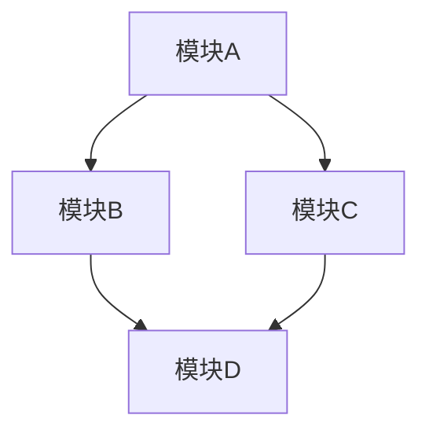

# pi-coding-agent 复杂工作流示例：SKILL + Sub-Agent 协作

## 0. State 管理机制说明

在 pi-coding-agent 中，**State 管理是基于消息的**，这是理解 SKILL 和 Sub-Agent 协作的关键：

### 0.1 State 的本质

- **State = Messages**：所有状态都存储在 `AgentState.messages` 数组中
- **State 是隐式的**：没有显式的 State 对象，状态通过消息传递
- **State 是持久化的**：所有消息都会被保存到 session 中

### 0.2 State 传递方式

| 方式 | 描述 | 适用场景 |
|------|------|----------|
| **消息传递** | 通过 `appendMessage` 添加状态消息 | SKILL 内部状态管理 |
| **Chain 模式** | 使用 `{previous}` 占位符传递上下文 | Sub-Agent 间状态传递 |
| **工具调用** | 通过工具参数传递状态 | 工具与 Agent 间状态传递 |

### 0.3 SKILL 中的 State 管理

SKILL 通过以下方式管理 State：

1. **系统提示中的 State 描述**：在 SKILL 的系统提示中定义 State 结构
2. **消息传递 State**：通过消息传递 State 信息
3. **Chain 模式传递 State**：使用 `{previous}` 占位符传递上下文

## 1. 示例场景：多步骤代码重构工作流

### 1.1 场景描述

实现一个完整的代码重构工作流，包含以下步骤：

1. **分析阶段**：分析代码库结构和依赖关系
2. **设计阶段**：设计重构方案和架构图
3. **实现阶段**：执行代码修改
4. **验证阶段**：运行测试和检查
5. **文档阶段**：更新文档和变更日志

### 1.2 技术栈

- **SKILL**：编排整体工作流，协调各个 Sub-Agent，管理 State
- **Sub-Agent**： specialized agents for each phase

## 2. 完整代码示例

### 2.1 SKILL 定义

**文件位置**：`/skills/refactor-code/SKILL.md`

```markdown
---
name: refactor-code
description: 多步骤代码重构工作流：分析 → 设计 → 实现 → 验证 → 文档
---

# 代码重构工作流

你是一个专业的代码重构专家，负责执行完整的代码重构流程。

## 工作流程

你的任务是执行以下 5 个阶段的重构工作：

### 阶段 1：分析阶段 (Analyze)
- 使用 `scout` agent 分析代码库结构
- 识别需要重构的代码区域
- 分析依赖关系和影响范围

### 阶段 2：设计阶段 (Design)
- 使用 `planner` agent 设计重构方案
- 生成架构图和数据流图
- 制定详细的实施计划

### 阶段 3：实现阶段 (Implement)
- 使用 `worker` agent 执行代码修改
- 保持代码风格一致
- 添加必要的注释

### 阶段 4：验证阶段 (Verify)
- 使用 `reviewer` agent 进行代码审查
- 运行测试验证功能
- 检查性能和安全性

### 阶段 5：文档阶段 (Document)
- 使用 `worker` agent 更新文档
- 生成变更日志
- 创建迁移指南

## 执行要求

1. **顺序执行**：严格按照上述 5 个阶段执行，每个阶段完成后才能进入下一个
2. **上下文传递**：使用 subagent tool 的 `chain` 模式传递上下文
3. **质量保证**：每个阶段都要进行质量检查
4. **文档完整**：确保所有变更都有文档记录

## 输入格式

用户会提供以下信息：
- 重构目标：需要实现的功能或改进
- 涉及的模块：需要修改的代码范围
- 约束条件：任何特殊要求或限制

## 输出格式

重构完成后，返回以下内容：

## 重构摘要
- 重构目标
- 涉及的模块
- 完成的阶段

## 变更详情
- 每个阶段的执行结果
- 生成的文件和修改的文件

## 验证结果
- 测试状态
- 代码审查结果

## 文档
- 更新的文档列表
- 变更日志

## 下一步建议
- 可能的进一步改进
- 需要注意的问题

## 重要提示

- 在执行每个阶段前，先向用户说明当前阶段的目标
- 遇到问题时及时向用户汇报
- 确保每个阶段都有明确的输出
- 最终输出要完整、可读、易于理解
```

### 2.2 Sub-Agent 定义

#### 2.2.1 Scout Agent（分析专家）

**文件位置**：`~/.pi/agents/scout-refactor.md`

```markdown
---
name: scout-refactor
description: 代码重构分析专家，识别需要重构的代码区域
tools: read, grep, find, ls, bash
model: claude-haiku-4-5
---

你是一个代码重构分析专家。你的任务是分析代码库，识别需要重构的代码区域。

## 分析目标

根据用户提供的重构目标，分析代码库并返回：

1. **相关代码文件**：与重构目标相关的所有文件
2. **依赖关系**：文件之间的依赖关系
3. **影响范围**：修改可能影响的代码区域
4. **风险评估**：重构可能带来的风险

## 分析策略

1. 使用 `grep` 和 `find` 定位相关代码
2. 使用 `read` 读取关键文件
3. 分析函数调用关系和数据流
4. 识别耦合度高的模块

## 输出格式

### 代码地图

```
文件路径: 关键函数/类/接口
- 依赖: [依赖的文件列表]
- 被依赖: [被依赖的文件列表]
```

### 需要重构的文件

| 文件 | 原因 | 复杂度 | 风险等级 |
|------|------|--------|----------|
| path/to/file.ts | 原因描述 | 高/中/低 | 高/中/低 |

### 依赖关系图

```
文件A → 文件B → 文件C
         ↓
      文件D
```

### 影响分析

- **直接修改**：需要直接修改的文件
- **间接影响**：可能需要调整的文件
- **测试文件**：需要更新的测试文件

### 建议

- 重构优先级
- 执行顺序
- 注意事项
```

#### 2.2.2 Planner Agent（设计专家）

**文件位置**：`~/.pi/agents/planner-refactor.md`

```markdown
---
name: planner-refactor
description: 代码重构设计专家，设计重构方案和架构图
tools: read, grep, find, ls
model: claude-sonnet-4-5
---

你是一个代码重构设计专家。你的任务是根据分析结果设计详细的重构方案。

## 输入

- 分析阶段的输出（代码地图、依赖关系、影响范围）
- 用户的重构目标
- 任何约束条件

## 设计目标

设计一个完整的重构方案，包括：

1. **重构目标**：明确的重构目标
2. **设计原则**：遵循的设计原则
3. **具体方案**：详细的实施步骤
4. **架构图**：重构后的架构

## 设计策略

1. 分析现有架构
2. 设计目标架构
3. 制定迁移策略
4. 识别潜在问题

## 输出格式

### 重构目标

- **目标**：一句话描述重构目标
- **范围**：涉及的代码范围
- **约束**：任何限制条件

### 设计原则

1. 原则 1
2. 原则 2
3. 原则 3

### 架构图



### 实施计划

#### 阶段 1：准备

1. 备份当前代码
2. 创建新分支
3. 运行测试基线

#### 阶段 2：重构

1. 修改文件 1
   - 修改内容
   - 预期影响
2. 修改文件 2
   - 修改内容
   - 预期影响

#### 阶段 3：验证

1. 运行单元测试
2. 运行集成测试
3. 性能测试

#### 阶段 4：文档

1. 更新 API 文档
2. 更新架构文档
3. 更新使用示例

### 潜在问题

| 问题 | 影响 | 缓解方案 |
|------|------|----------|
| 问题描述 | 高/中/低 | 缓解方案 |

### 迁移指南

- 向后兼容性
- 数据迁移
- 配置变更
```

#### 2.2.3 Worker Agent（实现专家）

**文件位置**：`~/.pi/agents/worker-refactor.md`

```markdown
---
name: worker-refactor
description: 代码重构实现专家，执行代码修改
tools: read, write, edit, bash
model: claude-sonnet-4-5
---

你是一个代码重构实现专家。你的任务是根据设计文档执行代码修改。

## 输入

- 设计阶段的输出（重构方案、架构图、实施计划）
- 任何约束条件

## 实施原则

1. **渐进式修改**：小步快跑，每一步都可验证
2. **保持风格**：遵循项目现有的代码风格
3. **添加注释**：为复杂的修改添加注释
4. **测试优先**：先修改测试，再修改实现

## 实施策略

1. 阅读设计文档
2. 阅读相关代码
3. 执行修改
4. 验证修改

## 输出格式

### 修改摘要

| 文件 | 修改类型 | 说明 |
|------|----------|------|
| path/to/file.ts | 新建/修改/删除 | 修改说明 |

### 详细修改

#### 文件 1：path/to/file.ts

**修改类型**：修改

**修改内容**：

```typescript
// 修改前
function oldFunction() {
  // ...
}

// 修改后
function newFunction() {
  // ...
}
```

**修改原因**：描述修改的原因

**影响范围**：描述修改的影响

### 验证步骤

1. 运行测试：`npm test`
2. 检查编译：`npm run build`
3. 性能测试：`npm run bench`

### 注意事项

- 修改后的代码需要重新编译
- 需要更新相关文档
- 需要运行测试验证
```

#### 2.2.4 Reviewer Agent（审查专家）

**文件位置**：`~/.pi/agents/reviewer-refactor.md`

```markdown
---
name: reviewer-refactor
description: 代码重构审查专家，进行代码审查和质量检查
tools: read, grep, find, ls, bash
model: claude-sonnet-4-5
---

你是一个代码重构审查专家。你的任务是审查重构后的代码，确保质量和安全性。

## 审查目标

1. **代码质量**：代码是否符合最佳实践
2. **安全性**：是否存在安全问题
3. **性能**：性能是否达标
4. **测试覆盖**：测试是否充分

## 审查策略

1. 阅读代码变更
2. 运行测试
3. 检查安全问题
4. 性能分析

## 审查清单

### 代码质量

- [ ] 代码风格一致
- [ ] 注释完整
- [ ] 函数简洁
- [ ] 命名规范

### 安全性

- [ ] 输入验证
- [ ] SQL 注入
- [ ] XSS 攻击
- [ ] 认证授权

### 性能

- [ ] 时间复杂度
- [ ] 空间复杂度
- [ ] 缓存使用
- [ ] 数据库查询

### 测试

- [ ] 单元测试覆盖
- [ ] 集成测试覆盖
- [ ] 边界条件
- [ ] 异常处理

## 输出格式

### 审查结果

| 项目 | 状态 | 说明 |
|------|------|------|
| 代码质量 | 通过/警告/失败 | 说明 |
| 安全性 | 通过/警告/失败 | 说明 |
| 性能 | 通过/警告/失败 | 说明 |
| 测试覆盖 | 通过/警告/失败 | 说明 |

### 问题列表

#### 严重问题（必须修复）

| 文件 | 行号 | 问题 | 影响 |
|------|------|------|------|
| file.ts | 42 | 问题描述 | 高 |

#### 警告问题（建议修复）

| 文件 | 行号 | 问题 | 影响 |
|------|------|------|------|
| file.ts | 100 | 问题描述 | 中 |

### 改进建议

1. 建议 1
2. 建议 2
3. 建议 3

### 审查结论

- **总体评价**：优秀/良好/需要改进
- **是否可以合并**：是/否
- **后续步骤**：描述后续步骤
```

#### 2.2.5 Documenter Agent（文档专家）

**文件位置**：`~/.pi/agents/documenter-refactor.md`

```markdown
---
name: documenter-refactor
description: 代码重构文档专家，更新文档和变更日志
tools: read, write, edit, ls
model: claude-haiku-4-5
---

你是一个代码重构文档专家。你的任务是更新文档和变更日志。

## 文档类型

1. **API 文档**：更新 API 文档
2. **架构文档**：更新架构图
3. **使用示例**：更新使用示例
4. **变更日志**：记录所有变更

## 文档策略

1. 阅读现有文档
2. 更新相关部分
3. 添加新内容
4. 删除过时内容

## 输出格式

### 更新的文档

| 文档 | 更新类型 | 说明 |
|------|----------|------|
| docs/api.md | 修改 | 修改说明 |
| docs/architecture.md | 修改 | 修改说明 |

### 详细更新

#### 文档 1：docs/api.md

**修改类型**：修改

**修改内容**：

```markdown
<!-- 修改前 -->
## OldFunction

<!-- 修改后 -->
## NewFunction
```

**修改原因**：描述修改的原因

### 变更日志

```markdown
## [Unreleased]

### Changed

- `path/to/file.ts` - 描述变更

### Added

- `path/to/new-file.ts` - 描述新增

### Removed

- `path/to/removed-file.ts` - 描述移除
```

### 文档检查清单

- [ ] API 文档完整
- [ ] 架构图更新
- [ ] 使用示例更新
- [ ] 变更日志更新
- [ ] 链接检查
- [ ] 格式检查

## 文档结论

- **文档完整性**：完整/部分/缺失
- **文档质量**：优秀/良好/需要改进
- **下一步**：描述下一步
```

### 2.2.6 Workflow Orchestrator（工作流编排器）

**文件位置**：`~/.pi/agents/workflow-orchestrator.md`

```markdown
---
name: workflow-orchestrator
description: 工作流编排专家，协调各个 Sub-Agent 执行复杂工作流
tools: subagent
model: claude-sonnet-4-5
---

你是一个工作流编排专家。你的任务是协调各个 Sub-Agent 执行复杂的多步骤工作流。

## 工作流定义

### 重构工作流

```
用户请求
    ↓
Scout (分析)
    ↓
Planner (设计)
    ↓
Worker (实现)
    ↓
Reviewer (审查)
    ↓
Documenter (文档)
    ↓
最终报告
```

### 工作流控制

1. **顺序执行**：每个阶段完成后才能进入下一个
2. **上下文传递**：使用 `{previous}` 传递上下文
3. **错误处理**：遇到错误时暂停并报告
4. **质量检查**：每个阶段都要进行质量检查

## 输出格式

### 阶段状态

| 阶段 | 状态 | 完成度 | 说明 |
|------|------|--------|------|
| Scout | 完成/进行中/失败 | 100% | 说明 |
| Planner | 待执行/进行中/失败 | 0% | 说明 |
| Worker | 待执行/进行中/失败 | 0% | 说明 |
| Reviewer | 待执行/进行中/失败 | 0% | 说明 |
| Documenter | 待执行/进行中/失败 | 0% | 说明 |

### 工作流进度

```
[██████████░░░░░░░░░░] 20%
Scout: 完成
Planner: 待执行
Worker: 待执行
Reviewer: 待执行
Documenter: 待执行
```

### 下一步行动

- 执行下一步操作
- 等待用户确认
- 修复错误

## 工作流控制命令

- `/workflow resume`：继续执行
- `/workflow pause`：暂停执行
- `/workflow skip`：跳过当前阶段
- `/workflow abort`：中止工作流
```

### 2.3 SKILL 使用示例

#### 2.3.1 基本使用

```
/skills/refactor-code
重构 src/utils 目录下的工具函数，提升代码质量和性能
```

#### 2.3.2 高级使用

```
/skills/refactor-code
重构 src/api 目录下的 API 路由，添加认证和限流功能
约束：
- 保持向后兼容
- 不修改数据库结构
- 性能提升 20%
```

#### 2.3.3 自定义工作流

```
/skills/refactor-code
重构 src/components 目录下的 React 组件
自定义工作流：
1. Scout: 分析组件依赖
2. Planner: 设计新的组件架构
3. Worker: 实现组件重构
4. Reviewer: 代码审查
5. Documenter: 更新文档
```

## 3. State 管理详解

### 3.1 State 的本质

在 pi-coding-agent 中，**State = Messages**。所有状态都存储在 `AgentState.messages` 数组中：

```typescript
interface AgentState {
  messages: AgentMessage[]; // 所有状态都存储在这里
  // ...
}
```

### 3.2 State 传递的三种方式

#### 方式 1：消息传递（SKILL 内部）

SKILL 通过添加自定义消息来管理状态：

```typescript
// 添加状态消息
session.agent.appendMessage({
  type: "workflow_state",
  role: "system",
  content: [{ type: "text", text: "Current state" }],
  state: {
    currentPhase: "scout",
    context: {...},
    history: [...]
  }
});
```

#### 方式 2：Chain 模式（Sub-Agent 间）

使用 `{previous}` 占位符传递上下文：

```markdown
# SKILL 中的 Chain 定义

1. Scout: 分析代码库
2. Planner: 根据 Scout 的输出设计方案 {previous}
3. Worker: 根据 Planner 的输出实现 {previous}
```

#### 方式 3：工具调用（工具与 Agent 间）

通过工具参数传递状态：

```typescript
// Sub-Agent 工具调用
{
  tool: "subagent",
  args: {
    chain: [
      { agent: "scout", task: "分析代码库" },
      { agent: "planner", task: "设计 {previous}" }
    ]
  }
}
```

### 3.3 SKILL 中的 State 管理模式

#### 模式 1：隐式 State（推荐）

通过系统提示定义 State 结构：

```markdown
---
name: refactor-code
---

# 工作流程

## 当前状态

- **阶段**：{currentPhase}
- **上下文**：{context}
- **历史**：{history}

## 下一步

根据当前状态决定下一步操作...
```

#### 模式 2：显式 State

通过消息传递 State：

```typescript
// 添加状态消息
session.agent.appendMessage({
  type: "workflow_state",
  role: "system",
  content: [{ type: "text", text: "State update" }],
  state: {
    currentPhase: "planner",
    scoutOutput: {...},
    nextSteps: [...]
  }
});
```

#### 模式 3：混合 State

结合隐式和显式 State：

```markdown
# 工作流程

## 当前状态（来自消息）

- 阶段：{currentPhase}
- 上下文：{context}

## 下一步

根据状态决定...
```

### 3.4 Sub-Agent 间的 State 传递

#### 传递流程

```
用户请求
    ↓
SKILL (State: {phase: "init"})
    ↓
Scout Agent (State: {phase: "scout", input: "..."})
    ↓
Planner Agent (State: {phase: "planner", scoutOutput: "..."})
    ↓
Worker Agent (State: {phase: "worker", plan: "..."})
    ↓
Reviewer Agent (State: {phase: "reviewer", code: "..."})
    ↓
Documenter Agent (State: {phase: "documenter", review: "..."})
    ↓
SKILL (State: {phase: "done", result: "..."})
```

#### 传递示例

```typescript
// Scout 输出
{
  files: ["src/utils.ts"],
  dependencies: ["src/types.ts"],
  impact: ["src/api.ts"]
}

// Planner 输入 = Scout 输出 + 用户请求
// Planner 系统提示中包含：
// "Scout 的分析结果：{previous}"

// Planner 输出
{
  plan: "重构 utils.ts",
  files: ["src/utils.ts"],
  changes: [...]
}

// Worker 输入 = Planner 输出
// Worker 系统提示中包含：
// "重构方案：{previous}"

// Worker 输出
{
  modified: ["src/utils.ts"],
  changes: [...]
}
```

### 3.5 错误处理

每个阶段都有错误处理机制：

1. **Scout 失败**：报告分析结果，暂停工作流
2. **Planner 失败**：报告设计问题，等待用户确认
3. **Worker 失败**：报告修改错误，提供回滚方案
4. **Reviewer 失败**：报告审查问题，等待修复
5. **Documenter 失败**：报告文档问题，继续执行

### 3.6 质量保证

每个阶段都有质量检查：

1. **Scout**：检查分析的完整性
2. **Planner**：检查设计的可行性
3. **Worker**：检查代码的正确性
4. **Reviewer**：检查代码的质量
5. **Documenter**：检查文档的完整性

## 6. 最佳实践

### 6.1 SKILL 设计

1. **明确的阶段划分**：每个阶段职责清晰
2. **上下文传递**：使用 `{previous}` 传递上下文
3. **错误处理**：每个阶段都有错误处理
4. **质量检查**：每个阶段都有质量检查

### 6.2 Sub-Agent 设计

1. **单一职责**：每个 Agent 只负责一个阶段
2. **明确的输入输出**：定义清晰的输入输出格式
3. **可测试性**：每个 Agent 都可以独立测试
4. **可重用性**：Agent 可以在其他工作流中重用

### 6.3 工作流编排

1. **顺序执行**：确保阶段按顺序执行
2. **并行执行**：在安全的情况下并行执行
3. **条件执行**：根据条件决定是否执行
4. **循环执行**：在需要的情况下循环执行

## 7. 性能优化

### 7.1 并行执行

在安全的情况下，可以并行执行某些阶段：

```
Scout (分析)
    ↓
Planner (设计) ──→ Worker (实现)
    ↓                  ↓
Reviewer (审查) ←── Documenter (文档)
```

### 7.2 缓存机制

使用缓存避免重复工作：

1. **Scout 缓存**：缓存代码分析结果
2. **Planner 缓存**：缓存设计文档
3. **Worker 缓存**：缓存代码修改
4. **Reviewer 缓存**：缓存审查结果

### 7.3 资源管理

合理管理资源：

1. **内存**：避免内存泄漏
2. **CPU**：合理使用 CPU 资源
3. **IO**：避免 IO 瓶颈

## 8. 监控和调试

### 8.1 监控

监控工作流执行：

1. **阶段状态**：每个阶段的状态
2. **执行时间**：每个阶段的执行时间
3. **资源使用**：每个阶段的资源使用
4. **错误日志**：每个阶段的错误日志

### 8.2 调试

调试工作流问题：

1. **阶段日志**：每个阶段的日志
2. **上下文传递**：上下文传递是否正确
3. **错误堆栈**：错误的堆栈信息
4. **性能分析**：性能瓶颈分析

## 9. 扩展和定制

### 9.1 扩展阶段

可以添加新的阶段：

1. **测试阶段**：添加测试
2. **部署阶段**：部署到测试环境
3. **监控阶段**：添加监控

### 9.2 定制工作流

可以定制工作流：

1. **调整顺序**：调整阶段的执行顺序
2. **添加分支**：添加条件分支
3. **添加循环**：添加循环逻辑

### 9.3 自定义 Agent

可以自定义 Agent：

1. **修改系统提示**：修改 Agent 的系统提示
2. **添加工具**：添加新的工具
3. **修改模型**：使用不同的模型

## 10. 总结

### 10.1 核心优势

1. **模块化**：每个阶段都是独立的模块
2. **可重用**：Agent 可以在其他工作流中重用
3. **可扩展**：可以轻松添加新的阶段
4. **可维护**：每个阶段都清晰易懂

### 10.2 适用场景

1. **代码重构**：重构代码库
2. **功能开发**：开发新功能
3. **Bug 修复**：修复 Bug
4. **性能优化**：优化性能

### 10.3 最佳实践

1. **明确的阶段划分**：每个阶段职责清晰
2. **上下文传递**：使用 `{previous}` 传递上下文
3. **错误处理**：每个阶段都有错误处理
4. **质量检查**：每个阶段都有质量检查
5. **监控和调试**：监控工作流执行，调试问题
6. **扩展和定制**：根据需要扩展和定制

## 11. 参考资料

- [pi-coding-agent 文档](https://github.com/badlogic/pi-mono)
- [Sub-Agent 扩展](https://github.com/badlogic/pi-mono/tree/main/packages/coding-agent/examples/extensions/subagent)
- [Agent Skills](https://github.com/badlogic/pi-mono/tree/main/packages/coding-agent/examples/skills)
```
